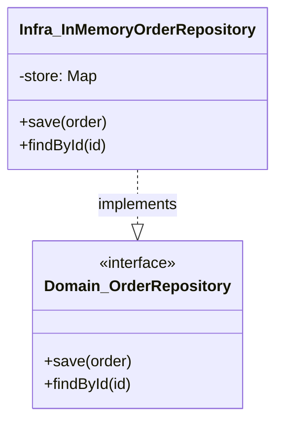

# 第07章：部：ユースケース（Application）を作る（第61〜70章）🎬🧑‍🍳


## 0) 今日のゴール🎯✨

* ✅ **domain / app / infra / test** の4つに分けて、役割を固定する
* ✅ **importの向き（依存の流れ）**を最初に決めて、逆流を防ぐ
* ✅ ESLintで「ルール違反import」を機械的に止める🚫
* ✅ テストの置き場も決めて、後半がラクになる🧪💕

（2026-02-07時点の前提として、TypeScriptは **5.9.3** が最新安定版だよ〜📌）([GitHub][1])
Node.jsは v24 が **Active LTS** に入ってるよ〜（開発の“安定軸”としておすすめ）([Node.js][2])

---

## 1) まず結論：4層の役割はこう分けるよ📚✨


### ✅ domain（ドメイン層）💎

**ルールの本体**が住む場所🏠

* Value Object / Entity / Aggregate
* 不変条件（絶対守るルール🔒）
* domain service（必要なときだけ）
* Repository “interface”（永続化の口だけ）

📌 **禁止**：DB・HTTP・フレームワーク・外部ライブラリ都合を入れること🙅‍♀️

---

### ✅ app（アプリケーション層）🎬

**ユースケースの手順**をまとめる場所📋

* 例：PlaceOrder / PayOrder / FulfillOrder
* DTO（入出力の箱📦）
* トランザクションの境界感（あとでDB入れても崩れにくい）

📌 **禁止**：ビジネスルールの本体を置くこと（それはdomainの仕事）🙅‍♀️

---

### ✅ infra（インフラ層）🛠️

**外の世界との接続**（DB、API、ファイル、メール…）

* Repositoryの実装（InMemory / DB版 / API版）
* 外部クライアント（HTTPなど）
* DI（依存注入）や“組み立て”の場所（composition root）🧩

📌 **domainはinfraを絶対に知らない**（ここが最重要）🚫🔥

---

### ✅ test（テスト）🧪

**安心して変更できる状態**を作る場所✨

* domainのテスト（最優先💎）
* appのテスト（ユースケースの流れ🎬）
* 必要ならintegration（infra込み）も後で追加

（2026-02-07時点だと、Vitestは v4 系が中心で進んでるよ〜）([Vitest][3])

---

## 2) いちばん大事：importの向き（依存の流れ）🔁➡️


DDDの“崩壊”って、だいたいこれが原因😂⚠️
**ルール**はこう👇

```text
domain  ←  app  ←  infra
  ↑         ↑        ↑
  └────── test は全部見てOK（目的によりけり）
```

### ✅ 超重要ルール3つ🔒

1. **domain は誰にも依存しない**（純粋にする）
2. **app は domain だけに依存してOK**
3. **infra は domain/app に依存してOK**（外側だから）

---

## 3) フォルダ構成の“おすすめ完成形”📁✨（カフェ注文例）


最小で強い形にするよ〜☺️☕

```text
my-ddd-cafe/
  src/
    domain/
      order/
        Order.ts
        OrderId.ts
        OrderStatus.ts
        OrderLine.ts
      shared/
        errors/
          DomainError.ts
      repositories/
        OrderRepository.ts   ← interface（口だけ）
    app/
      order/
        PlaceOrder.ts
        PayOrder.ts
        dto/
          PlaceOrderCommand.ts
          OrderView.ts
    infra/
      repositories/
        InMemoryOrderRepository.ts
      main.ts                ← 組み立て（composition root）
  test/
    domain/
      Order.test.ts
    app/
      PlaceOrder.test.ts
```

### ここでのポイント💡

* **domain内に “repositories interface” を置く**のがDDD定番✨

  * domainが「保存してほしい😤」って要求を出す
  * infraが「了解〜実装するね🫡」って叶える
* `infra/main.ts` は “配線” だけやる🧩（domain/appは触らせない）

---

## 4) “何をどこに置く？”早見表🧭✨

* 「このルール守ってね！」 → **domain** 🔒
* 「この順番で進めてね！」 → **app** 🎬
* 「DBに保存するよ！」 → **infra** 🛠️
* 「壊れてない？」 → **test** 🧪

迷ったらこう聞いてみて👇

> それって「業務ルール」？それとも「手順」？それとも「接続」？🤔

---

## 5) 最小のサンプル（“置き方”を体で覚える）🧠✨

### 5.1 domain：Repository interface（口だけ）📮

```ts
// src/domain/repositories/OrderRepository.ts
import { Order } from "../order/Order";
import { OrderId } from "../order/OrderId";

export interface OrderRepository {
  save(order: Order): Promise<void>;
  findById(id: OrderId): Promise<Order | null>;
}
```

### 5.2 infra：Repository 実装（InMemory）🧰


```ts
// src/infra/repositories/InMemoryOrderRepository.ts
import { OrderRepository } from "../../domain/repositories/OrderRepository";
import { Order } from "../../domain/order/Order";
import { OrderId } from "../../domain/order/OrderId";

export class InMemoryOrderRepository implements OrderRepository {
  private readonly store = new Map<string, Order>();

  async save(order: Order): Promise<void> {
    this.store.set(order.id.value, order);
  }

  async findById(id: OrderId): Promise<Order | null> {
    return this.store.get(id.value) ?? null;
  }
}
```

✅ ここが気持ちいいところ：
domainは **Mapの存在すら知らない** 😌✨



---

### 5.3 app：ユースケース（手順）🎬

```ts
// src/app/order/PlaceOrder.ts
import { OrderRepository } from "../../domain/repositories/OrderRepository";
import { Order } from "../../domain/order/Order";
import { OrderId } from "../../domain/order/OrderId";

export type PlaceOrderCommand = {
  orderId: string;
  // 本当は items とか customer とか増やすよ🍰
};

export class PlaceOrder {
  constructor(private readonly orderRepo: OrderRepository) {}

  async execute(cmd: PlaceOrderCommand): Promise<void> {
    const order = Order.create(new OrderId(cmd.orderId));
    await this.orderRepo.save(order);
  }
}
```

✅ appは「どう作るか（手順）」だけ。
「作っていい条件」や「状態ルール」は domain に寄せるのがDDD🧡

---

## 6) “崩れない仕組み”を入れる：ESLintで境界を守る🚧🚫


2026のESLintは **flat config** が標準路線だよ〜（v9で大きく前進）([ESLint][4])
TypeScript向けは `typescript-eslint` のQuickstartが分かりやすい✨([TypeScript ESLint][5])

### 6.1 eslint.config.mjs（最小 + 境界ガード）🧯

```js
// eslint.config.mjs
// @ts-check
import eslint from "@eslint/js";
import { defineConfig } from "eslint/config";
import tseslint from "typescript-eslint";

export default defineConfig(
  eslint.configs.recommended,
  tseslint.configs.recommended,

  // ✅ ここから「境界を守る」追加ルール
  {
    files: ["src/**/*.ts"],
    rules: {
      // domain から infra/app へ行く import を禁止🚫
      "no-restricted-imports": [
        "error",
        {
          patterns: [
            {
              group: ["../infra/*", "../../infra/*", "../../../infra/*"],
              message: "domain から infra への依存は禁止だよ🔒",
            },
            {
              group: ["../app/*", "../../app/*", "../../../app/*"],
              message: "domain から app への依存は禁止だよ🔒",
            },
          ],
        },
      ],
    },
  }
);
```

💡ここは“最小の守り”だから、あとで慣れたら

* もっと強い境界チェック（パスエイリアス前提のルール）
* 依存グラフ可視化
  みたいに育てられるよ🌱✨

---

## 7) テスト方針：まずは domain をガチガチに固める🧪💎

Vitest 4系は移行ガイドも整ってて、2026でも安心枠だよ〜([Vitest][3])

### 7.1 domainテスト例（いちばん価値が高い）💎

```ts
// test/domain/Order.test.ts
import { describe, it, expect } from "vitest";
import { Order } from "../../src/domain/order/Order";
import { OrderId } from "../../src/domain/order/OrderId";

describe("Order", () => {
  it("create できる", () => {
    const order = Order.create(new OrderId("order-001"));
    expect(order.id.value).toBe("order-001");
  });
});
```

✅ domainテストが増えるほど「変更が怖くない」が手に入るよ〜🥹✨

---

## 8) よくある事故パターン（先に潰す😇⚠️）

### ❌ domainに “DBっぽい型” が入ってくる

* `PrismaOrderModel` とか `Row` とか
  → **domainが汚れて死ぬ**（DDDの効果が消える）😵‍💫

### ❌ appでルールを判定し始める

* `if (order.status === ...)` がappに増殖
  → いつの間にか **domainが空っぽ** になる😂

### ❌ infraのクラスをdomainがnewする

* `new SqlOrderRepository()` をdomainでやる
  → 依存逆流で **“戻れない構造”** に💥

---

## 9) AIの使いどころ（第7章向け）🤖💞

### ✅ AIに投げると強い依頼（おすすめテンプレ）📝

1. **フォルダ案の比較**

* 「domain/app/infra/testで、カフェ注文のフォルダ案を3つ出して。メリデメも。」

2. **import逆流チェック**

* 「このtreeで、domain→infra依存が起きそうな場所を指摘して。防止策も。」

3. **命名の壁打ち**

* 「OrderLineはVO？Entity？理由を3つずつ。」

### ⚠️ 注意（ここだけ人間が握る💪）

* “境界” と “依存の向き” は、AIに決めさせない（提案はOK）
* いったん決めたら、**機械（ESLint）で守る**のが勝ち🏆✨

---

## 10) 章末ミニチェック（5問）✅🌸

1. domainが依存していいのは誰？（答え：＿＿＿）
2. Repositoryのinterfaceはどこに置く？（答え：＿＿＿）
3. appに置くのは「ルール」？それとも「手順」？
4. infraのmain.ts（組み立て）は何をする？
5. “import逆流”を防ぐ一番ラクな方法は？（答え：＿＿＿）

---

## 今日のまとめ🎒✨

* **4層に分ける＝未来の自分を助ける魔法🪄**
* DDDの勝敗は「クラスの美しさ」より **依存の向き** で決まる🔥
* まずは **小さく作って、機械で守る（ESLint）** が最短ルート🚀

---

次の章（第8章）は、この構造の上で「責務・境界・依存」を**コードの痛みで体験**していくよ🎯😆
この章の構成で、今のプロジェクトに合わせた **具体的なツリー（あなたの好み寄り）**にも寄せられるけど、まずはこの“鉄板”で行こっか？🌸✨

[1]: https://github.com/microsoft/typescript/releases "Releases · microsoft/TypeScript · GitHub"
[2]: https://nodejs.org/en/about/previous-releases "Node.js — Node.js Releases"
[3]: https://vitest.dev/blog/vitest-4?utm_source=chatgpt.com "Vitest 4.0 is out!"
[4]: https://eslint.org/blog/2024/04/eslint-v9.0.0-released/ "ESLint v9.0.0 released - ESLint - Pluggable JavaScript Linter"
[5]: https://typescript-eslint.io/getting-started/ "Getting Started | typescript-eslint"
