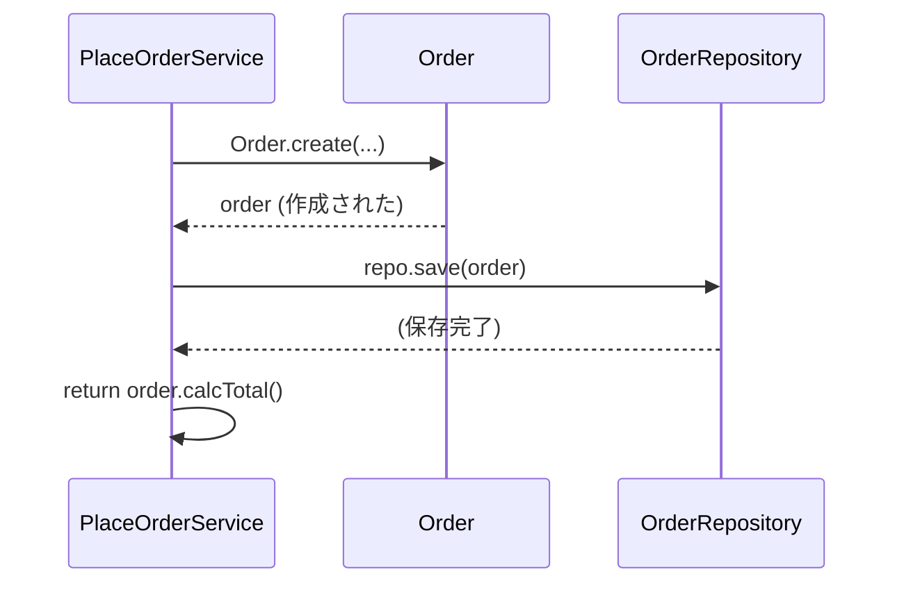

# 第08章：部：Repository / Factory / Domain Service（第71〜80章）🧰🏭🧙‍♀️


この章はDDDに入る前の“空気づくり”だよ〜！🌸
DDDの用語（VOとかEntityとか）より先に、**コードを崩れにくくする3点セット**を体に入れます💪

* ✅ 責務（せきむ）：その子の「担当の仕事」
* ✅ 境界（きょうかい）：ここから先は「別チーム」
* ✅ 依存（いぞん）：誰が誰に「頼ってるか」

---

## 8-1. まず結論：設計って「混ざるのを防ぐ技」🧹✨

設計が苦しくなる原因の多くはコレ👇

* 1つの関数が **なんでもやる**（責務が混ざる）😵‍💫
* 便利のために **境界をまたいで直参照**（境界が溶ける）🫠
* 内側（大事なルール）が外側（DBやUI）に **引っ張られる**（依存が逆流）🌊

DDDは“ルールを守る設計”だから、まずは **混ざらない構造**が必要なんだよね💡

---

## 8-2. 悪い例（あるある）😂⚠️：1つの関数が全部やってる


「注文する」って処理、ついこうなりがち👇

```ts
// ❌ 悪い例：PlaceOrderが全部やってる（責務ごちゃ混ぜ）
export async function placeOrder(reqBody: any) {
  // 入力チェック（UIっぽい）
  if (!reqBody.customerId) throw new Error("customerId is required");
  if (!Array.isArray(reqBody.items) || reqBody.items.length === 0) {
    throw new Error("items is required");
  }

  // 価格計算（ドメインっぽい）
  let total = 0;
  for (const item of reqBody.items) {
    if (item.price < 0) throw new Error("price must be >= 0");
    total += item.price * item.qty;
  }
  if (total > 5000) {
    total = Math.floor(total * 0.9); // 10%割引（ルールっぽい）
  }

  // 永続化（インフラっぽい）
  await db.insert("orders", {
    customerId: reqBody.customerId,
    items: JSON.stringify(reqBody.items),
    total,
    status: "Draft",
    createdAt: Date.now(),
  });

  // 表示向け整形（境界の外）
  return { ok: true, total: `${total} yen` };
}
```

### このコードの問題点（超わかりやすく言うと）🫣

* ここには **4人分の仕事**が混ざってるの

  * 入力チェック係🧾
  * ルール係（割引や制約）📏
  * DB係🗄️
  * 表示係🖼️
* そして「割引ルール」を変えたいだけでも、DBや表示に触れちゃって事故る💥

---

## 8-3. 責務：1つのものに「担当の仕事」を持たせよう🎒✨


### ✅ 責務の見つけ方（超実用）🔍

次の質問を自分にするだけでOK！

* この関数、**動詞が3個以上**ない？（validate / calc / save / format …）🌀
* 「価格計算だけ変えたいのに」**他も直す必要**がある？😇
* テスト書くとき、**DBが必要**になってない？（それ混ざってるサイン）🧪

### ✅ 目標

* ルール（ドメイン）は **ドメインに閉じ込める**🔒
* DBは **DB係に任せる**🗄️
* つなぐ手順は **アプリ層の仕事**🎬

---

## 8-4. 境界：domain / app / infra を「国境」だと思う🌍🚧


イメージはこれ👇

* UI（入力・表示）
  ↓
* app（手順：取得→操作→保存）
  ↓
* domain（ルール：絶対守ること）💎
  ↓
* infra（DB・外部API）

### ✅ 境界ルール（この章の最重要）📌

* **domainはinfraを知らない**（DB知らない）🚫
* **domainはUIを知らない**（表示知らない）🚫
* appは「つなぎ役」なので、domainとinfra両方を呼んでOK🎬

---

## 8-5. 依存：内側が外側に“引っ張られない”ようにする🏰➡️🧱


ここ、めっちゃ大事！✨

* ドメインの“ルール”は一番守りたい
* なのにドメインがDBに依存すると

  * DB都合でルールが歪む😵‍💫
  * テストも遅くなる🐢
  * 将来の変更で壊れる💥

### ✅ 解決：インターフェースを「内側」に置く（依存逆転）🔁

* domainに `OrderRepository`（約束）を置く
* infraがそれを実装する

これで、**依存の向きが綺麗**になるよ✨

---

## 8-6. 改善版：責務・境界・依存を分けた最小セット🌸

### ① domain：ルール担当（Orderの“守り”）🛡️

```ts
// domain/order.ts
export type OrderItem = { menuItemId: string; qty: number; unitPrice: number };

export class Order {
  private constructor(
    public readonly id: string,
    public readonly customerId: string,
    private readonly items: OrderItem[],
  ) {}

  static create(params: { id: string; customerId: string; items: OrderItem[] }) {
    if (!params.customerId) throw new Error("customerId is required");
    if (params.items.length === 0) throw new Error("items must not be empty");

    for (const it of params.items) {
      if (it.qty <= 0) throw new Error("qty must be >= 1");
      if (it.unitPrice < 0) throw new Error("unitPrice must be >= 0");
    }

    return new Order(params.id, params.customerId, [...params.items]);
  }

  calcTotal(): number {
    const raw = this.items.reduce((sum, it) => sum + it.unitPrice * it.qty, 0);
    // 例：5000超えたら10%オフ（ルールはここ！）
    return raw > 5000 ? Math.floor(raw * 0.9) : raw;
  }
}
```

### ② domain：保存の“約束”だけ置く📚

```ts
// domain/orderRepository.ts
import { Order } from "./order";

export interface OrderRepository {
  save(order: Order): Promise<void>;
}
```

### ③ app：手順担当（ユースケースの流れ）🎬

```ts
// app/placeOrder.ts
import { Order } from "../domain/order";
import { OrderRepository } from "../domain/orderRepository";

export class PlaceOrderService {
  constructor(private readonly repo: OrderRepository) {}

  async execute(input: {
    orderId: string;
    customerId: string;
    items: { menuItemId: string; qty: number; unitPrice: number }[];
  }) {
    const order = Order.create({
      id: input.orderId,
      customerId: input.customerId,
      items: input.items,
    });

    await this.repo.save(order);

    return { total: order.calcTotal() }; // 返すのは“結果”だけ
  }
}
```

### ④ infra：DB担当（今はInMemoryでもOK）🗄️

```ts
// infra/inMemoryOrderRepository.ts
import { OrderRepository } from "../domain/orderRepository";
import { Order } from "../domain/order";

export class InMemoryOrderRepository implements OrderRepository {
  private store = new Map<string, Order>();

  async save(order: Order): Promise<void> {
    this.store.set(order.id, order);
  }
}
```

> ね？✨
> ルールを変えるならdomainだけ、保存方法を変えるならinfraだけ触ればOKになる🎉



---

## 8-7. テスト：境界が分かれると“秒速でテスト”できる🧪⚡


Vitestは「Viteネイティブで軽いテストランナー」って位置づけで、最近のJS/TSではよく使われるよ〜！🧡（Vitest 4.0のアナウンスも出てる）([vitest.dev][1])

```ts
// test/order.test.ts
import { describe, it, expect } from "vitest";
import { Order } from "../domain/order";

describe("Order", () => {
  it("itemsが空ならエラー", () => {
    expect(() =>
      Order.create({ id: "o1", customerId: "c1", items: [] }),
    ).toThrow();
  });

  it("5000超えたら10%オフ", () => {
    const order = Order.create({
      id: "o1",
      customerId: "c1",
      items: [{ menuItemId: "m1", qty: 1, unitPrice: 6000 }],
    });
    expect(order.calcTotal()).toBe(5400);
  });
});
```

---

## 8-8. ここでやってみよう！ミニ演習3連発🎮✨

### 演習①：責務の棚卸し🧺

さっきの悪い例を見て、コメントでいいから👇を書いてみてね！

* この関数がやってる仕事を **動詞で列挙**（例：validate / calc / save / format）
* その動詞を **担当ごとにグルーピング**（ルール係・DB係…）

### 演習②：境界線を引く✍️🚧

次の4つを、それぞれ「どこに置くべき？」って判断してみて！

* 「itemsが空ならNG」
* 「注文の合計を計算」
* 「注文を保存」
* 「画面に表示する文字列（yenを付ける）」

（答え：上から domain / domain / infra / UI寄り だよ〜✨）

### 演習③：依存逆転してみる🔁

* `OrderRepository` を **domain側に置く**
* `InMemoryOrderRepository` を **infra側で実装**
* appは **interfaceだけ**を見る

これができたら、DDDの“体幹”かなり強い💪🔥

---

## 8-9. AI（Copilot/Codex）活用テンプレ🤖🪄

AIは便利だけど、油断すると境界を破ってくることがあるの😂
だから「聞き方」をテンプレ化しよ〜！

### ✅ 責務チェック用プロンプト

* 「この関数の責務を箇条書きにして、混ざってるなら分割案を出して」
* 「“ルール”と“手順”と“I/O”を分類して、移動先（domain/app/infra）を提案して」

### ✅ 境界を守るリファクタ用プロンプト

* 「domainはinfraを参照しない前提で、分割後のimport関係も含めて提案して」
* 「domain側にinterfaceを置く形で、Repositoryの依存逆転をやって」

### ✅ AIの出力を採用する前のチェック✅

* domainが `db` や `fetch` を呼んでない？🚫
* domainが `Date.now()` 直呼びしてない？（時間は後半でClock注入するよ⏰）🚫
* appに“割引ルール”が増えてない？🚫

---

## 8-10. 2026年2月時点の“最新よもやま”📌✨（超短め）

* TypeScriptの最新は **5.9系**（npmのlatestも5.9.3、公式も5.9表記）([npm][2])
* TypeScript 5.9では `--module node20` のように、Nodeの挙動に合わせた安定オプションの話も出てるよ🧩([typescriptlang.org][3])
* TypeScriptは今後 **6.0→7.0**（ネイティブ移行の節目）みたいなロードマップが語られてる📣([Microsoft for Developers][4])

---

## まとめ🌸🎯

この章で得た最強3点セットはこれ！

* ✅ 責務：1つの役割に集中させる
* ✅ 境界：混ざらない国境を作る
* ✅ 依存：内側（ルール）を外側（DB/UI）から守る

次の章から「仕様を短く書く」「Given/When/Then」みたいに、設計の材料（言葉）を揃えていくよ〜📝✨

[1]: https://vitest.dev/?utm_source=chatgpt.com "Vitest | Next Generation testing framework"
[2]: https://www.npmjs.com/package/typescript?utm_source=chatgpt.com "typescript"
[3]: https://www.typescriptlang.org/docs/handbook/release-notes/typescript-5-9.html?utm_source=chatgpt.com "Documentation - TypeScript 5.9"
[4]: https://devblogs.microsoft.com/typescript/progress-on-typescript-7-december-2025/?utm_source=chatgpt.com "Progress on TypeScript 7 - December 2025"
