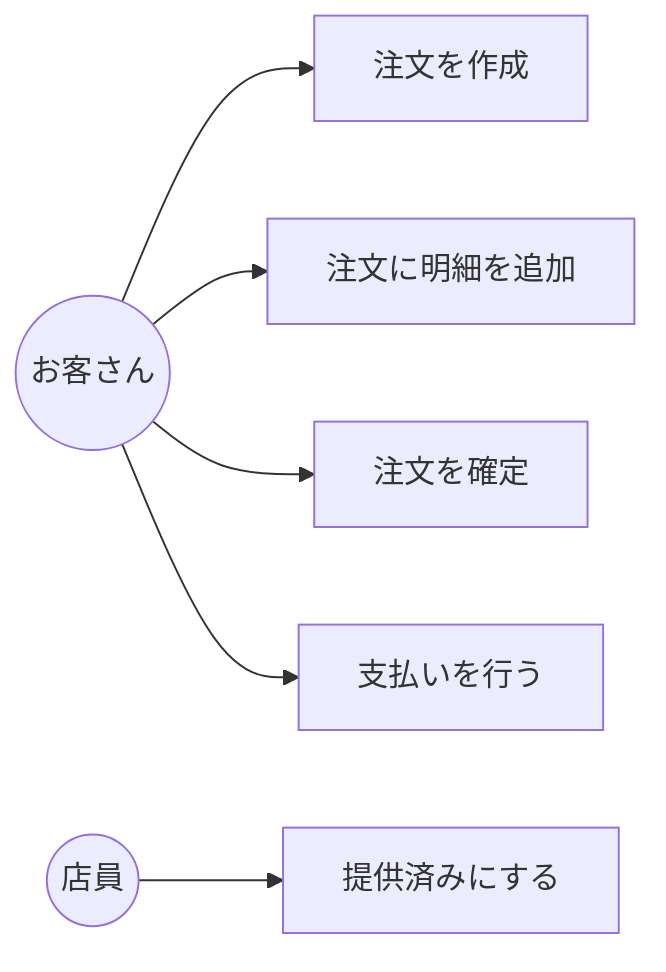

# 第09章：部：Specification / Policy / 時間 / エラー（第81〜90章）🧠📏🧯


## まず「今日の最新」だけチラ見👀🧡

* いま **npm での TypeScript 最新版は 5.9.3** です（2026-02-07時点の確認）。([npm][1])
* そして **TypeScript 6.0 は 2026-02-10 に Beta、2026-03-17 に Final 予定**（公式の進行表）。([GitHub][2])
* さらに **TypeScript 6.0 は「JS実装の最後のリリース」になる予定**、という流れで、今後も移行の話が増えそうです。([Microsoft for Developers][3])

> とはいえこの章は「仕様の書き方」なので、TSの新機能よりも **言葉を揃える** のが主役だよ〜📘✨

---

## 1) ユースケースを“短く”書くと何が嬉しいの？😊🎯


DDDって、「コード」より前に **“言葉”を揃える** のが超だいじ🗣️✨
ユースケースを短く書けると、こういう良さがあるよ👇

* 迷子にならない🧭：「今なに作ってたっけ？」が減る
* 実装がブレない🧱：何を満たせばOKかが先に決まる
* 設計がキレイになる🧼：責務の境界が見えやすい
* AIが使いやすい🤖：短文だと、AIが余計な解釈しにくい

---

## 2) “短いユースケース”ってどのくらい短い？📏✨

この章で扱うのは **Use Case Brief（短いユースケース）** のノリだよ📝
要点だけをサッと揃えるやつ！
「短いユースケースは、ざっくり成功シナリオ（＋必要なら失敗も）を短くまとめる」みたいな考え方が紹介されてるよ。([modernanalyst.com][4])

---

## 3) 書き方の型：これだけ覚えればOK✍️🌸


### ✅ 基本テンプレ（1〜3行）

**「誰が / 何をする / どうなる」** を入れる！

* **誰が**：利用者・店員・システム など（= 主役）
* **何をする**：ドメインの動詞（確定する、支払う、取り消す…）
* **どうなる**：結果（状態が変わる／記録される／通知される…）

#### テンプレ例（そのままコピペOK）

* **「（誰が）…すると、（結果）…になる」**
* **「（誰が）…を…して、（結果）…を得る」**
* **「（トリガー）が起きたら、（システム）が…し、（結果）…になる」**

---

## 4) 例題（カフェ注文）で “短文ユースケース” を作ってみる☕🧾✨


ここでは「ドメイン言葉」に寄せて、**画面/DB/API を出さない** のがコツだよ😺👍

### ユースケース例（短い！）

* **注文を作成する**：お客さんが商品と数量を選び、下書き注文が作成される🧾✨
* **注文に明細を追加する**：お客さんが商品を追加し、注文合計が更新される➕💴
* **注文を確定する**：お客さんが注文を確定し、以後は明細を変更できなくなる✅🔒
* **支払いを行う**：お客さんが支払いを行い、注文が支払い済みになる💳✅
* **注文をキャンセルする**：お客さんが注文をキャンセルし、提供対象から外れる🛑
* **注文を提供済みにする**：店員が提供を完了し、注文が提供済みになる☕📦
* **注文を確認する**：お客さんが注文の状態と合計を確認できる🔎✨
* **レシートを発行する**：支払い完了後にレシートが発行される🧾🎉

> ポイント：全部「動詞＋対象」で始まってるよね！🏷️
> UIっぽい「ボタンを押す」「画面を開く」はナシ🙅‍♀️



---

## 5) 良い例 / 悪い例（超あるある）😂⚠️


### ❌ 悪い例（長い・実装混じり）

> 注文画面で商品を選んで追加ボタンを押すとDBにINSERTされ、APIが成功を返したら画面が遷移して…

**ダメな理由**

* 画面・DB・APIが入ってて、**設計の材料になりにくい**😵‍💫
* UIが変わっただけで仕様が変わった気になる（地獄）🫠

### ✅ 良い例（短い・ドメイン中心）

> お客さんが商品を追加し、注文の合計が更新される。

**良いところ**

* “やりたいこと”が一撃で伝わる🎯
* どんなUIでも実装できる（耐久性ある）🏋️‍♀️

---

## 6) 1分で書ける手順：ユースケース短文化のコツ⏱️🌸

### ステップA：まず「動詞＋対象」を決める🏷️

* ✅ 確定する / 支払う / キャンセルする / 提供する
* ✅ 注文 / 明細 / 支払い / レシート

（ここがブレると、全部ブレる！😆）

### ステップB：主語（誰）を固定する👤

* お客さん？店員？システム？
  → **そのユースケースの主役は誰？** を1人決める

### ステップC：結果を「状態」っぽく書く🚦

* 「〜できるようになる」より
  **「〜になる」** が強い✨

  * 例：`注文が確定済みになる`
  * 例：`支払い済みになる`

---

## 7) AIを“編集者”として使うコツ🤖✂️✨


AIは、**ゼロからの仕様作り**よりも、
あなたが書いたものを **短く整える** のが超得意💡

### 使えるプロンプト集（コピペOK）📋✨

#### ① 短くして（1〜3行縛り）

```text
次のユースケース文を、1〜3行に短縮してください。
必ず「誰が / 何を / 結果」を含め、UI・DB・APIの話は削除してください。

【原文】
（ここに貼る）
```

#### ② 曖昧さチェック（DDDに効く！）

```text
次のユースケース文の「曖昧な言葉」を指摘して、
具体化の質問を3つ作ってください（例：いつ？どこまで？例外は？）。

【ユースケース文】
（ここに貼る）
```

#### ③ “ドメイン用語”だけ抽出（ユビキタス言語づくりの種🌱）

```text
次のユースケース文から「名詞」と「動詞」を抽出して、
用語の揺れ（同じ意味で違う言い方）を見つけてください。

【ユースケース文】
（ここに貼る）
```

> コツ：AIの出力はそのまま採用せず、**自分の言葉に寄せて確定**すると強いよ😺🧡

---

## 8) ミニ演習（この章のゴール確認）🎒✅

### 演習1：短文ユースケースを5つ書こう✍️✨

下のどれかを選んで、**1〜3行**で書いてみてね👇

* 注文を確定する
* 支払いを行う
* 注文をキャンセルする
* 注文を提供済みにする
* 注文を確認する
* レシートを発行する

### 演習2：短文から「メソッド名」に落とす🧠➡️💻

例：

* ユースケース：**支払いを行う**
* メソッド名案：`payOrder` / `markAsPaid` / `completePayment`
* 入力：`orderId`、`paymentMethod` など
* 結果：`Paid` 状態になる（＝状態遷移）

> この “短文 → 名前” が自然につながると、設計が一気にラクになるよ〜🎉

---

## 9) 仕上げチェックリスト（提出前の最終確認）✅🧾

* [ ] 1〜3行に収まってる？📝
* [ ] **誰が / 何を / 結果** が入ってる？👤➡️🎯➡️✨
* [ ] UI/DB/HTTP/ライブラリ名が入ってない？🙅‍♀️
* [ ] 動詞＋対象の名前になってる？（例：注文を確定する）🏷️
* [ ] “曖昧語”がない？（だいたい、適切に、いい感じに…）🫠
* [ ] 結果が「状態」っぽく書けてる？🚦

---

## 10) 次の第10章につながるよ〜🔜🧪✨

次章では、ここで書いた短文ユースケースを
**Given/When/Then（受け入れ条件）** に変換して、テスト可能にしていくよ✅🧪
Given-When-Then は受け入れテストを書くためのテンプレとして広く説明されてるやつ！([agilealliance.org][5])

---

必要なら、この章の成果物として **`docs/usecases.md` のひな形**（見出し・書き方・例つき）も作って渡すよ📄✨

[1]: https://www.npmjs.com/package/typescript?utm_source=chatgpt.com "typescript"
[2]: https://github.com/microsoft/TypeScript/issues/63085?utm_source=chatgpt.com "TypeScript 6.0 Iteration Plan · Issue #63085"
[3]: https://devblogs.microsoft.com/typescript/progress-on-typescript-7-december-2025/?utm_source=chatgpt.com "Progress on TypeScript 7 - December 2025"
[4]: https://www.modernanalyst.com/Careers/InterviewQuestions/tabid/128/ID/340/What-are-some-of-the-formats-used-for-writing-use-cases.aspx?utm_source=chatgpt.com "What are some of the formats used for writing use cases?"
[5]: https://agilealliance.org/glossary/given-when-then/?utm_source=chatgpt.com "What is \"Given - When - Then\"?"
