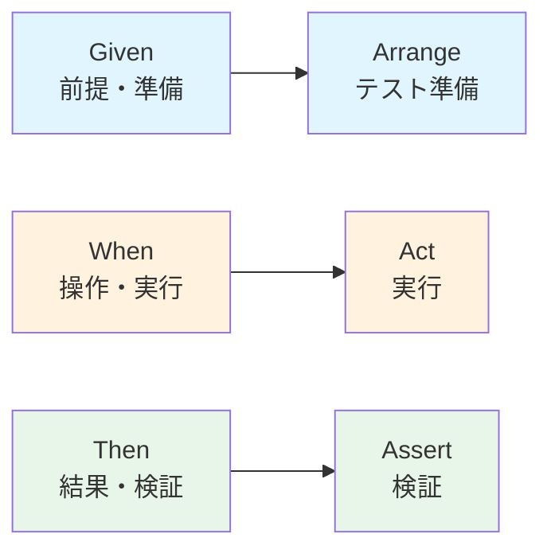

# 第10章：部：Domain Event と連携（第91〜100章）⚡📮🧩


この章はね、「**仕様を“テストできる形”に変換するコツ**」を身につける回だよ〜！🎀
ここができると、あとで実装に入ったときに **「え、テスト書けない…🥺」** が激減する✨

---

## 1) 受け入れ条件ってなに？📝✨

受け入れ条件（Acceptance Criteria）は、ざっくり言うと…

* 「**こうなったらOK！**」の合格ライン✅
* 「**ユーザー視点での期待**」を、あとから検証できる形にしたもの👀
* “作った気がする”じゃなくて「**動作として確認できる**」が大事🎯

そして、その書き方として超よく使われるのが **Given / When / Then**（GWT）だよ〜！💖

---

## 2) Given / When / Then の基本ルール📏💡

GWTは、**行動と結果**がブレないように、文章を3つの役に分ける書き方だよ😊

* **Given（前提）**：状況・初期状態・準備🧩
* **When（操作）**：やったこと（トリガー）🕹️
* **Then（結果）**：見える結果・保証したいこと✅

Gherkin（GWTを書く代表的な書式）でも、Given/When/Then などのキーワードでシナリオを構造化するよ〜。([cucumber.io][1])

---

## 3) 例題：カフェ注文☕🧾（ユースケース：注文確定）

ここでは、たとえばこんな機能を想像してみよっか🍰

* ユーザーが注文を作る（下書き）
* 「注文確定」ボタンで確定できる
* ただし **空っぽの注文は確定できない**🙅‍♀️

---

## 4) GWTで“受け入れ条件”を書く🖊️✨

### ✅ 正常系（最低1つ）

* **Given** 注文が下書き状態で、明細が1つ以上ある
* **When** 注文を確定する
* **Then** 注文の状態が「確定」になる
* **And** 合計金額が明細の合計と一致する

### ⚠️ 異常系（最低1つ）

* **Given** 注文が下書き状態で、明細が0件（空）
* **When** 注文を確定する
* **Then** 「空の注文は確定できない」エラーになる

この “正常 + 異常を最低1個ずつ” が、最初の強い一歩だよ💪💕

---

## 5) よくある失敗あるある😂⚠️（先に潰そ）

### ❌ When が2個3個に増える

* “いつやった？”が曖昧になる
  → **Whenは基本1アクション**にして、分けた方がスッキリ✨

### ❌ Then が「画面に〜が表示される」だけになる

* UIは変わりやすいから壊れやすい💥
  → まずは **ドメイン的な結果（状態・値・ルール）** をThenにするのが安定🧠

### ❌ Given が長編小説になる

* つらい…読めない…🥲
  → “前提は最小限”で、必要な材料だけ🧂

---

## 6) パターンが増えるなら Scenario Outline でまとめる📚✨

たとえば「数量が1〜5ならOK、0はNG」みたいに **例がいっぱい**あるときは
Gherkinの **Scenario Outline + Examples** が便利だよ〜！([cucumber.io][2])

（この章では“考え方”だけでOK！実装は後の章でやると気持ちいい🎶）

---

## 7) GWT → テストに落とす変換ルール🔁🧪

GWTは、そのままテストに変換しやすい✨
ざっくり対応はこう👇

* **Given** → Arrange（準備）
* **When** → Act（実行）
* **Then** → Assert（検証）

この変換ができると、テストを書くのが“作文”じゃなくなるよ🪄



---

## 8) TypeScriptでのミニ例（VitestでGWTっぽく）🧡

Vitestは `expect` や `describe/test` が揃ってて、TSでも書きやすいよ〜。([vitest.dev][3])
（Jestの `describe/expect/test` と似てるので、読みやすさも良い感じ✨）([jestjs.io][4])

### 🍩 “注文確定”をテストするイメージ

```ts
// domain/order.ts（超ミニ例：雰囲気を掴む用だよ🍀）
export type OrderStatus = 'Draft' | 'Confirmed';

export class Order {
  private status: OrderStatus = 'Draft';

  constructor(
    private readonly items: Array<{ menuId: string; qty: number; priceYen: number }>
  ) {}

  confirm() {
    if (this.items.length === 0) {
      throw new Error('空の注文は確定できません');
    }
    this.status = 'Confirmed';
  }

  getStatus() {
    return this.status;
  }

  totalYen() {
    return this.items.reduce((sum, x) => sum + x.qty * x.priceYen, 0);
  }
}
```

```ts
// test/order.confirm.spec.ts
import { describe, test, expect } from 'vitest';
import { Order } from '../domain/order';

describe('注文確定（Confirm Order）', () => {
  test('Given 明細がある / When 確定する / Then 確定状態になり合計が一致する ✅', () => {
    // Given
    const order = new Order([{ menuId: 'latte', qty: 2, priceYen: 500 }]);

    // When
    order.confirm();

    // Then
    expect(order.getStatus()).toBe('Confirmed');
    expect(order.totalYen()).toBe(1000);
  });

  test('Given 明細が空 / When 確定する / Then エラーになる 🧯', () => {
    // Given
    const order = new Order([]);

    // When / Then
    expect(() => order.confirm()).toThrow('空の注文は確定できません');
  });
});
```

ポイントはここだよ👇💖

* テスト名の中に **Given/When/Then をそのまま書いちゃう**と読みやすい📖✨
* “仕様の日本語”と“テスト”が近づくほど、設計が安定する🧠

---

## 9) 「Gherkinで書いてCucumberで動かす」ってどう？🥒✨

もちろんそれもできるよ〜！
Cucumber-JS は npm で入れられる（`@cucumber/cucumber`）って公式に書いてあるよ。([cucumber.io][5])
TypeScriptを使う場合の“transpiling”の話も、Cucumber-JS 側でドキュメントがあるよ。([GitHub][6])

ただし最初は、**いきなり全部をCucumberにしない**のがおすすめ🍀

* まずは「GWTで文章を書ける」
* 次に「GWTっぽいテスト名でVitest/Jestで回せる」
* その後「Gherkin→自動化（Cucumber）」へ拡張✨

この順番が、しんどくなりにくい😌💕

---

## 10) AIの使いどころ（この章の最強ムーブ）🤖💕

AIは **“受け入れ条件の穴探し”** に使うとめちゃ強いよ🕵️‍♀️✨

### 🎯 そのまま使えるプロンプト例

* 「このユースケースをGiven/When/Thenで、正常系2つ・異常系2つにして。専門用語は少なめで🙏」
* 「境界値（最小/最大）と、起きやすい例外ケースを追加して！」
* 「Thenを“UI表示”じゃなくて“状態・値・ルール”中心に直して！」

AIが出した案は、**そのまま採用じゃなくて**
「それって本当に守りたいルール？🔒」って確認するのが大事だよ〜💡

---

## 章末ミニ演習🎓✨（手を動かそ！）

## 演習A：注文キャンセルのGWTを書いてみて🧾❌

条件（例）：

* 下書きならキャンセルOK
* 確定後はキャンセル不可（エラー）

👉 **正常系1つ + 異常系1つ** をGWTで書こう！

## 演習B：Scenario Outline を考えてみて📚

「数量 1〜5 はOK、0はNG」みたいなパターンを
Outline+Examplesで表現してみよ〜（文章だけでOK）✨

---

## 理解チェック（サクッと）✅💗

* Given/When/Then の役割を一言で言える？
* Then が UI 依存になりすぎてない？
* 異常系を最低1つ入れた？
* テストに変換したとき、Arrange/Act/Assert に自然に落ちる？

---

次の章（第11章）からは、「ドメインって何？」をもっとハッキリさせて、言葉（＝設計の材料）を強くしていくよ〜！🗣️📘✨

[1]: https://cucumber.io/docs/gherkin/?utm_source=chatgpt.com "Gherkin"
[2]: https://cucumber.io/docs/gherkin/reference/?utm_source=chatgpt.com "Reference"
[3]: https://vitest.dev/api/expect?utm_source=chatgpt.com "Expect"
[4]: https://jestjs.io/docs/api?utm_source=chatgpt.com "Globals"
[5]: https://cucumber.io/docs/installation/javascript/?utm_source=chatgpt.com "Cucumber-JS"
[6]: https://github.com/cucumber/cucumber-js/blob/main/docs/transpiling.md?utm_source=chatgpt.com "cucumber-js/docs/transpiling.md at main"
