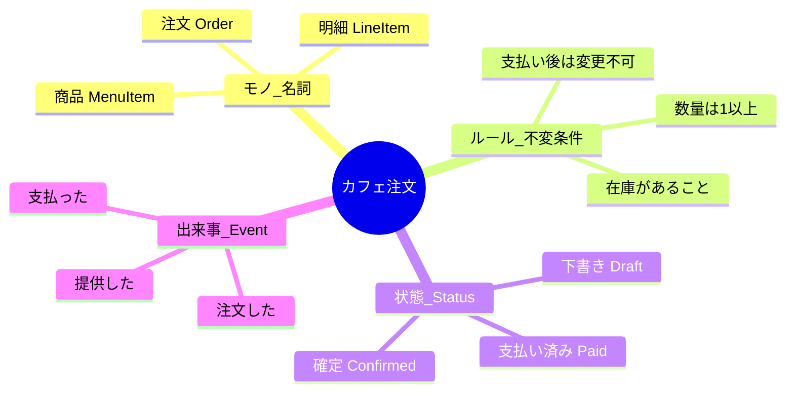

# 第11章：ドメインってなに？（UI/DBより先）🌱


## この章のゴール 🎯✨

* 「ドメイン」って言われたときに、**“業務ルールの世界”**って即答できるようになる🗣️💡
* UIやDBを触る前に、**守るべきルール（不変条件）**を言葉で出せるようになる🔒📝
* そのルールを、TypeScriptで**“散らばらない形”**に置けるようになる📦🧩

---

## 1) ドメインを一言でいうと？💡

**ドメイン＝そのサービスが守るべき「現実のルール」と「言葉」がある世界**だよ🌍✨

たとえばカフェ注文なら☕🧾

* 「支払い後は注文内容を変えられない」
* 「在庫切れの商品は注文できない」
* 「注文確定前は明細を追加できる」
  みたいな、**お店の都合（業務の都合）で決まるルール**がドメインの中心になるの🥰

---

## 2) なんでUI/DBより先なの？🧁➡️🧠

UI（画面）やDB（保存の形）は、あとから変わりがち😵‍💫

* 画面はデザイン刷新する📱✨
* DBはスキーマ変える・NoSQLにする・外部SaaSに移す🗄️🔁
* APIも変わる（GraphQLにする等）🔌

でも、**「業務ルール」は意外と変わりにくい**（変わるときも“理由がある”）んだよね🧠🔒
だからDDDは、先にここを固めるのが強い💪✨

---

## 3) “ドメインっぽいもの”と“ドメインそのもの”の見分け方🔍

次の3つの質問で判断すると分かりやすいよ😊✅

1. **それって業務上のルール？**（画面都合じゃなくて？）🧾
2. **UIが変わっても残る？**（ボタン位置が変わっても同じ？）📱
3. **DBが変わっても残る？**（SQL→別DBでも同じ？）🗄️

YESが多いほど、それはドメイン寄り🌱✨

---

## 4) 置き場所のイメージ（超ざっくり）📦

* **domain**：ルール（不変条件）を守る場所🔒
* **app**：手順（ユースケースの段取り）をやる場所🎬
* **infra**：保存・外部連携（DB/外部API）をやる場所🔧

> ドメインは「中心」なので、なるべく他に引っ張られないのがポイントだよ🧲✨

---

> 言葉を整理すると、こんな感じの地図が見えてくるよ🗺️✨



### ステップA：言葉を出す（まだコード書かない）🗣️📝

まずは「登場人物・モノ・状態・出来事」を出すよ〜！

例：

* モノ：注文(Order)、明細(LineItem)、商品(MenuItem)、合計金額(Total)
* 状態：下書き(Draft)、確定(Confirmed)、支払い済み(Paid)、キャンセル(Canceled)
* 出来事：注文作成、明細追加、確定、支払い、提供、キャンセル

ここ、AIがめっちゃ役に立つ🤖✨（あとでプロンプト例出すね！）

### ステップB：ルール（不変条件）を出す🔒📝

たとえば：

* ✅ 支払い済みの注文は変更できない
* ✅ 明細の数量は1以上
* ✅ 合計金額は各明細の合計
* ✅ キャンセル後は支払いできない
  こういう“絶対守る”を、先に言葉で固定するのがDDDの入り口🌱✨

---

## 6) AIに頼むと強い「言葉→ルール」プロンプト集 🤖🪄

VS CodeのAI拡張に、そのまま投げてOKだよ😊💕

### 重要語抽出（ユビキタス言語の種）🫘

* 「カフェ注文の業務ルールに関係する重要語を20個抽出して、短い定義もつけて。似た語は統一案も出して」

### ルール列挙（不変条件）🔒

* 「カフェ注文で“絶対に破ってはいけないルール（不変条件）”を10個。理由も一言で」

### 状態遷移のたたき台🚦

* 「注文の状態(Draft/Confirmed/Paid/Canceled)の遷移表を作って。許可/禁止も書いて」

### “ドメイン/アプリ/インフラ”仕分けクイズ📦

* 「次の要件を domain/app/infra のどこに置くべきか判定して理由を書いて：…（要件リスト）」

---

## 7) ミニ実装：ドメインはこうやって“ルールを閉じ込める”🔒🧊

ここでは「支払い後は変更できない」を最小で体験するよ😊☕

ポイントはこれ👇

* 外から `status = 'Paid'` みたいに変更させない🚫
* 変更は **意図のあるメソッド** を通す（`confirm()` / `pay()`）🎯
* ルール違反は **ドメインエラー** として止める🧯

```ts
// domain/order.ts
export type OrderStatus = "Draft" | "Confirmed" | "Paid" | "Canceled";

export class DomainError extends Error {
  constructor(message: string) {
    super(message);
    this.name = "DomainError";
  }
}

export type LineItem = Readonly<{
  menuItemId: string;
  name: string;
  unitPriceYen: number;
  quantity: number;
}>;

export class Order {
  private status: OrderStatus = "Draft";
  private items: LineItem[] = [];

  getStatus(): OrderStatus {
    return this.status;
  }

  getItems(): readonly LineItem[] {
    return this.items;
  }

  addItem(item: LineItem): void {
    // ✅ 不変条件：支払い後は変更できない
    if (this.status === "Paid") throw new DomainError("支払い後の注文は変更できません💳🚫");
    if (this.status === "Canceled") throw new DomainError("キャンセル後の注文は変更できません🧾🚫");

    // ✅ 不変条件：数量は1以上
    if (item.quantity < 1) throw new DomainError("数量は1以上にしてね🍰");

    this.items = [...this.items, item];
  }

  confirm(): void {
    if (this.status !== "Draft") throw new DomainError("下書きの注文だけ確定できます📝➡️✅");
    if (this.items.length === 0) throw new DomainError("明細が空の注文は確定できません☕🧾");
    this.status = "Confirmed";
  }

  pay(): void {
    if (this.status !== "Confirmed") throw new DomainError("確定した注文だけ支払いできます✅➡️💳");
    this.status = "Paid";
  }

  cancel(): void {
    if (this.status === "Paid") throw new DomainError("支払い後はキャンセルできません💳🚫");
    this.status = "Canceled";
  }

  totalYen(): number {
    return this.items.reduce((sum, it) => sum + it.unitPriceYen * it.quantity, 0);
  }
}
```

### ここが“DDDっぽい”ポイント🌱✨

* `addItem()` の中に「支払い後は変更できない」がいる🔒
* UIやDBがどうであれ、このルールはここに居座る🧠🏠
* `totalYen()` みたいな計算も、ドメインに置くと散らばりにくい🧮✨

---

## 8) 「UI/DB先に作る」と何が起きがち？😵‍💫⚠️


ありがち事故あるある〜！😂

* 画面側にルールが入る（ReactのonClickの中にif地獄）📱🔥
* API側にも同じルールが入る（二重実装）🔁
* DB制約だけに頼って、エラーが分かりにくい（ユーザーが泣く）😭
* 仕様変更で、3箇所直す羽目になる（地獄）🧟‍♀️

DDDは「ルールを1箇所に集める」ことで、これを避けたいんだよね🧩✨

---

## 9) ちょい最新情報：今のTypeScript/Node/周辺ツール感 🧰✨

* TypeScriptのnpm最新版は **5.9.3**（2026-02時点）だよ🟦✨ ([npm][1])
* Node.jsは **v24がActive LTS**、v25がCurrent（最新版系）として公開されてるよ🟢 ([nodejs.org][2])
* ESLintはv9でFlat Configがデフォルトになって移行が進んでる流れ（公式ブログでも背景説明あり）🧹✨ ([eslint.org][3])
* TypeScriptをESLintで扱う定番ツール（typescript-eslint）も継続的に更新されてるよ🧩 ([npm][4])
* テスト周りだとVitest 4でBrowser Modeが安定化して、UI寄りテストも触りやすくなってきたよ🧪🌐 ([vitest.dev][5])

> この章の主役はドメインだけど、後の章でテストや境界を固めるときに効いてくるよ〜😊🧡

---

## 10) 演習（手を動かすやつ）✍️🎮

### 演習1：ドメインの言葉を10個だけ作る🗣️

カフェ注文で、次を埋めてね👇

* 用語：＿＿＿＿
* 定義（1行）：＿＿＿＿
* 例（1行）：＿＿＿＿

（10個分）

### 演習2：不変条件を5つ書く🔒

* 例：「支払い後は変更できない」
* そのルールが破られたら何が起きる？（一言）😱

### 演習3：置き場所仕分け（domain/app/infra）📦

次の要件を仕分けしてみて〜！

1. 「注文確定ボタンを押したら、注文を確定する」
2. 「注文は支払い後に変更できない」
3. 「注文をDBに保存する」
4. 「ユーザー入力の必須チェック（未入力なら赤文字表示）」
5. 「支払いAPIと通信する」

---

## 11) 理解チェック（ミニクイズ）✅💖

1. ドメインって「画面」や「DBの形」のこと？（YES/NO）
2. 「支払い後は変更できない」は domain/app/infra どれ？
3. ルールが3箇所に散ると何がつらい？（一言）
4. `setStatus("Paid")` を外から許すのはなぜ危険？
5. 「UIが変わっても残る？」は何を見分ける質問？

（答えは自分で書いて、AIに採点させてもOKだよ🤖✅）

---

## 12) まとめ 🌸

* ドメインは **“ルールと言葉の世界”**🌱
* UI/DBより先に **不変条件** を出すと、設計の中心がブレない🔒✨
* TypeScriptでは、**意図あるメソッド** と **ドメインエラー** でルールを守らせるのが第一歩🧊🧯

次の第12章は、この「言葉」をさらに揃えていく **ユビキタス言語** に進むよ🗣️✨

[1]: https://www.npmjs.com/package/typescript?utm_source=chatgpt.com "typescript"
[2]: https://nodejs.org/en/about/previous-releases?utm_source=chatgpt.com "Node.js Releases"
[3]: https://eslint.org/blog/2025/03/flat-config-extends-define-config-global-ignores/?utm_source=chatgpt.com "Evolving flat config with extends"
[4]: https://www.npmjs.com/package/typescript-eslint?utm_source=chatgpt.com "typescript-eslint"
[5]: https://vitest.dev/blog/vitest-4?utm_source=chatgpt.com "Vitest 4.0 is out!"
