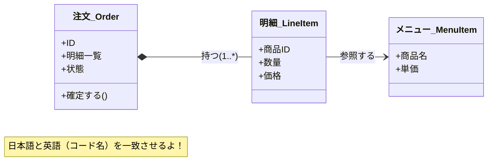

# 第12章：ユビキタス言語：言葉をそろえる🗣️✨


DDDって「むずかしい設計」をする前に、まず **“言葉のズレ” を消す**のが超大事だよ〜！☕️
ズレたまま実装すると、コードもテストも会話も、全部モヤモヤして壊れやすくなるの…🥺💥

この章は、カフェ注文ドメインで「用語辞書（ミニ辞典）」を作って、**会話とコードの距離を縮める**練習をするよ📘✨

---

## 1) ユビキタス言語ってなに？（超ざっくり）🧠💡

**チーム（または自分の頭の中）で、同じ単語を同じ意味で使うためのルール**だよ🫶
つまり…

* 「注文」って言ったら *いつでも同じ状態・同じ概念* を指す🧾
* 「確定」って言ったら *何ができて何ができないか* が決まってる✅🚫
* コードでも同じ言葉（同じ境界）で表現されてる🧑‍💻✨

これができると、DDDが一気にラクになるよ〜！🎉

---

## 2) まず“言葉のズレ”が起きる典型パターン集🌀😵‍💫


カフェ注文でありがちなやつ👇

* 「注文」「オーダー」「伝票」「チケット」…全部同じ？違う？🤔
* 「確定」って “支払い前” なの？ “支払い後” なの？💳❓
* 「キャンセル」って “確定前だけ”？ “提供前ならOK”？🚫☕
* 「メニュー」って “商品マスタ”？ “当日提供可能な一覧”？🍩📋

こういう曖昧さがあると、実装がこんな感じになりがち👇

* if が増える😇
* 例外やエラー文言がブレる😇
* テストが「何を正しいとするか」決められなくなる😇

だから第12章は **言葉の交通整理**をする章だよ🚦✨

---

## 3) ゴール（この章でできるようになること）🎯🌸

この章のゴールはこれ👇

* 用語辞書（短文定義つき）を作れる📘✍️
* “似た言葉”を統一して、**採用しない言葉**も決められる✂️🙅‍♀️
* 辞書をそのまま **コードの命名**・**型**・**状態**に落とせる🧑‍💻✨
* AIに手伝わせつつ、**最終判断は自分で**できる🤖🧠

---

## 4) 実践：用語辞書を作ろう📘🧾✨

### 4-1. 用語辞書のフォーマット（これで統一！）🧩


1語につき、最低これだけ書くのがオススメ👇

* **用語（日本語）**：例）注文
* **英語名（コード名）**：例）Order
* **短文定義（1〜2行）**：例）お客さんが作る購入希望。明細と状態を持つ。
* **含む / 含まない**：例）支払い情報は含まない（Payment側）
* **同義語（使わない言葉）**：例）オーダー（今後は使わない）
* **例（会話例 or 仕様例）**：例）「注文を確定すると…」

> ここで大事なのは「長文にしない」こと！📌
> 辞書は “読むもの” というより “迷った時の判断材料” だよ🧭✨

---

辞書を「図」にすると、関係性が一発で分かるよ！📏✨



ここでは例として10個だけ作るよ（本当は15〜25個あると強い💪✨）

* **注文（Order）**

  * 定義：お客さんが作る購入希望。明細と状態を持つ。
  * 含む：注文ID、明細、合計、状態
  * 含まない：決済の詳細（それは支払い側）
  * 使わない同義語：オーダー、伝票（混乱するなら封印）🙅‍♀️

* **明細（OrderLine / LineItem）**

  * 定義：注文内の1行。商品と数量、価格を持つ。
  * 注意：「OrderLine」と「LineItem」どっちを採用するか決める（後で地獄になるポイント🥺）

* **確定（Confirm）**

  * 定義：注文内容を固定し、以後の変更を禁止する操作。
  * 必ず決める：支払い前？支払いと同時？（ここ曖昧だと事故る💥）

* **支払い（Payment）**

  * 定義：注文に対する支払い行為と結果。
  * ルール例：成功したら「支払い済み」になる

* **提供（Fulfillment）**

  * 定義：商品を用意して渡すこと。
  * 注意：「配送」みたいな別概念と混ぜない📦🚫

* **キャンセル（Cancel）**

  * 定義：注文を無効にする操作。
  * ルール例：提供後は不可、など（ここは第14〜16章にも効く）

* **メニュー商品（MenuItem）**

  * 定義：販売対象の商品。名前・価格などを持つ。
  * 注意：「在庫」や「提供可否」と混ぜるか分けるかは要相談🍩

* **合計（Total / OrderTotal）**

  * 定義：明細から計算された金額。
  * 注意：税や割引が入るなら定義に追記💴

* **状態（OrderStatus）**

  * 定義：注文が今どの段階かを表す分類。
  * 例：Draft / Confirmed / Paid / Fulfilled / Cancelled

* **レシート（Receipt）**

  * 定義：支払い結果を示す記録（表示・印字用）。
  * 注意：Orderと同じにしない（責務が違う）🧾⚠️

---

## 5) “使う言葉 / 使わない言葉” を決める✂️🚫✨


ここ、めちゃ重要！🔥
辞書を作るだけだと、みんな（自分も）普通にブレる😂

### 5-1. ルール：同義語は「禁止ワード」にする🙅‍♀️🧱

例）「注文」を採用したなら…

* ✅ 注文（Order）
* 🚫 オーダー
* 🚫 伝票
* 🚫 チケット

こうやって “迷い” を潰すのが勝ち筋だよ🏆✨

---

## 6) 辞書を「コード」に落とすコツ🧑‍💻🗣️✨


ユビキタス言語の最高のゴールはこれ👇

> **会話で使う言葉が、そのままコードに存在する状態**✨

### 6-1. “状態” は特にブレやすいから型で固定しよう🔒🚦


たとえば OrderStatus を **文字列リテラル union** で固定する：

```ts
export type OrderStatus =
  | "Draft"
  | "Confirmed"
  | "Paid"
  | "Fulfilled"
  | "Cancelled";
```

そして UI 表示などに “日本語ラベル” を持たせる（辞書と一致させる）：

```ts
import type { OrderStatus } from "./OrderStatus";

export const OrderStatusLabel = {
  Draft: "下書き",
  Confirmed: "確定",
  Paid: "支払い済み",
  Fulfilled: "提供済み",
  Cancelled: "キャンセル",
} as const satisfies Record<OrderStatus, string>;
```

ここでポイント👇

* 「確定」「支払い済み」みたいな日本語は、**辞書の定義と同じ意味**にする🧠✨
* コード側が勝手に別の意味を持ち始めたら即赤信号🚨

---

### 6-2. “メソッド名” を会話の言葉に寄せる🕹️🗣️

たとえば「注文を確定する」なら `confirm()` が自然：

```ts
export class Order {
  private status: OrderStatus = "Draft";

  confirm(): void {
    if (this.status !== "Draft") {
      throw new Error("下書きの注文だけ確定できます");
    }
    this.status = "Confirmed";
  }
}
```

* `setStatus("Confirmed")` は禁止気味🚫（第46章でも効くよ）
* “意図のある操作” がそのまま用語になるのがDDDの気持ちよさ✨🥹

---

## 7) AIの使いどころ（ユビキタス言語編）🤖🗣️✨


AIはこの章だと **めちゃ頼れる壁打ち相手**だよ〜！🎾
しかも最近は、GitHub の支援ツール側で「エージェント」的な動きが増えてて、複数ファイルの整理やレビューも任せやすくなってきたよ🧠🧹
（例：OpenAI の Codex や、Anthropic の Claude が GitHub の環境に統合される流れが話題になってるよ）([The Verge][1])

### 7-1. AIに投げると強い質問テンプレ💌✨

#### A) 仕様文から “用語候補” を抽出してもらう🔎

* 「この仕様から重要語を20個抽出して、重複や言い換えもまとめて」

#### B) “曖昧語” を見つけてもらう⚠️

* 「この用語リストで意味がブレそうなものを指摘して、質問リストにして」

#### C) コード命名案を出してもらう🏷️

* 「用語辞書（日本語/定義）を、TSのクラス名・型名・メソッド名に変換して候補を3案」

### 7-2. AIを使う時の注意（ここだけは守って🥺🙏）

* AIが **新しい言葉を勝手に増やす**ことがある → 辞書にない言葉は採用しない（増やすなら辞書を先に更新）📘✍️
* いい感じの英語名でも、**会話で使わないなら**採用しない（会話↔コードがズレる）🌀

---

## 8) 仕上げチェック（この章の“合格ライン”）✅🎓

次のチェックが全部OKなら、この章クリア！🎉

* [ ] 用語辞書に **15語以上**ある📘
* [ ] それぞれ **短文定義（1〜2行）**がある✍️
* [ ] 「使わない言葉（禁止ワード）」が明記されてる🚫
* [ ] `OrderStatus` みたいな **ブレやすい概念が型で固定**されてる🔒
* [ ] メソッド名が “会話の言葉” に寄ってる🗣️🧑‍💻
* [ ] 迷った時に辞書を見れば判断できる🧭✨

---

## 9) ミニ演習（30〜45分）☕️⏱️

### お題🎒

「注文の状態」と「操作」を辞書にして、コードの型とメソッドに反映しよう！

### やること🛠️

1. OrderStatus を Draft/Confirmed/Paid/Fulfilled/Cancelled で定義
2. 各状態の日本語定義を辞書に書く
3. `confirm()` / `pay()` / `fulfill()` / `cancel()` の **許可・禁止**を文章で決める
4. 文章通りにガード節を書いて、禁止ケースは例外にする

### できたら最高🌈

* テストで「禁止操作が禁止されてる」を確認できると完璧🧪✨

---

## 10) 2026時点の“最新メモ”📌🧡

* TypeScript は **5.9系が最新ライン**として案内されていて、npmでも最新版表示は 5.9.3 になってるよ。([npm][2])
* そして TypeScript チームは **TypeScript 6.0 を“橋渡し（bridge）”**として位置づけて、将来の TypeScript 7（ネイティブ化）へ進む方針を説明してるよ。([Microsoft for Developers][3])
* npm まわりはタイポスクワッティング（似た名前の悪意パッケージ）が現実にあるので、インストール時は名前をよく確認してね⚠️（例：TypeScriptに似せた名前の悪性パッケージが報告されてる）([TechRadar][4])

---

## 11) 次章へのつながり🔗✨

第13章は「イベントの列挙（イベントストーミング風）」⚡🗒️
ここで作った用語辞書が、そのまま **イベント名（OrderConfirmed とか）**に効いてくるよ〜！🎉

---

* [The Verge](https://www.theverge.com/news/873665/github-claude-codex-ai-agents?utm_source=chatgpt.com)
* [TechRadar](https://www.techradar.com/pro/security/dangerous-npm-packages-are-targeting-developer-credentials-on-windows-linux-and-mac-heres-what-we-know?utm_source=chatgpt.com)

[1]: https://www.theverge.com/news/873665/github-claude-codex-ai-agents?utm_source=chatgpt.com "GitHub adds Claude and Codex AI coding agents"
[2]: https://www.npmjs.com/package/typescript?activeTab=versions&utm_source=chatgpt.com "typescript"
[3]: https://devblogs.microsoft.com/typescript/progress-on-typescript-7-december-2025/?utm_source=chatgpt.com "Progress on TypeScript 7 - December 2025"
[4]: https://www.techradar.com/pro/security/dangerous-npm-packages-are-targeting-developer-credentials-on-windows-linux-and-mac-heres-what-we-know?utm_source=chatgpt.com "Dangerous npm packages are targeting developer credentials on Windows, Linux and Mac - here's what we know"
