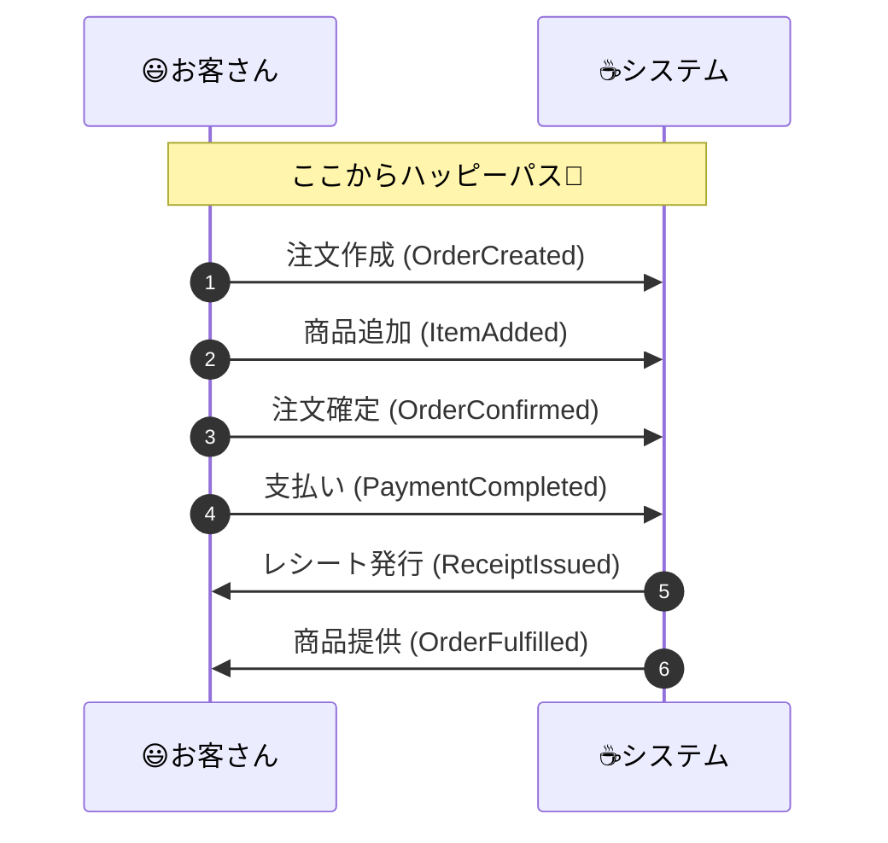

# 第13章：イベントの列挙（イベントストーミング風）⚡🗒️


この章は「何が起きるの？」を**出来事（イベント）**で並べて、ドメインの流れを一気に見える化する回だよ〜！🥳✨
イベントを並べられるようになると、次の第14章「状態と遷移」がめちゃラクになるよ🚦💨

---

## 1) 今日のゴール🎯🌸

この章が終わったら、こうなってればOK✅

* ✅ 「注文まわりで起きる出来事」を**過去形のイベント名**でズラッと列挙できる
* ✅ **通常ルート（ハッピーパス）**と、**例外ルート（キャンセル・在庫切れ等）**を分けて出せる
* ✅ イベントから「状態が変わるポイント」が見えてくる（次章につながる✨）

---

## 2) そもそも “イベント” ってなに？📣

ここで言うイベントは、ざっくりこう👇

* **「起きた事実」**（あとから変えられない）
* **過去形**（〜した／〜された）で言える
* ビジネスの人も納得できる言葉で書く（専門用語より業務用語🫶）

この考え方をみんなで壁に貼って学ぶワークが **EventStorming**（イベントストーミング）だよ。オレンジ付箋でドメインイベントを並べる、超軽量ワークショップとして知られてるやつ！🍊🧡
発案者は **Alberto Brandolini** で、2013年ごろに広まったと言われてるよ。([EventStorming][1])

---

## 3) “イベントストーミング風” では何をするの？🧩✨

本家の全部はやらずに、この章では **イベントの列挙に集中**するよ💪

やることはシンプル👇

1. **時系列の1本線（タイムライン）**を作る
2. そこに「起きた事実」を**イベント**として並べる
3. 例外ルート（失敗・やり直し）も追加する

EventStorming自体が「複雑な業務の理解を揃える」ための協働ワークとして紹介されてるよ。([Qlerify][2])

---

## 4) 手を動かす：カフェ注文ドメインでイベントを並べよう☕🧾

### 4-1) まず “ハッピーパス” だけ（成功ルート）🌈

最初は成功する流れだけでOK！✨
「注文作成 → 確定 → 支払い → 提供」みたいなやつね。

例（イベント名は英語に寄せるとコードにしやすいよ）👇

* OrderCreated（注文が作成された）
* ItemAddedToOrder（商品が注文に追加された）
* OrderConfirmed（注文が確定された）
* PaymentCompleted（支払いが完了した）
* OrderFulfilled（提供が完了した）
* ReceiptIssued（レシートが発行された）

時系列で並べると、こんな「物語」になるね📖✨


ここで大事なのは **粒度（細かさ）** 🧠
「ボタンを押した」みたいなUI操作はイベントじゃなくて、**業務として意味ある事実**を置こうね🙅‍♀️

---

### 4-2) 次に “例外ルート”（失敗ルート）🧯😵‍💫

ハッピーパスができたら、次はここが本番！

* キャンセルは？
* 在庫切れは？
* 支払い失敗は？
* 二重に確定しようとしたら？
* 返金は？

こういうのが抜けてると、実装で「うわぁ…😇」ってなるやつ！

---

## 5) そのまま使える「イベント一覧」サンプル📋⚡（カフェ注文）

「まずはたたき台」が欲しいとき用に置いとくね🫶
（※プロダクトで使うときは、ユビキタス言語に合わせて名前を調整してね）

### ハッピーパス🌸

* OrderCreated
* ItemAddedToOrder
* OrderConfirmed
* PaymentRequested
* PaymentCompleted
* OrderQueuedForPreparation（作成待ちに入った）
* OrderPrepared（準備が完了した）
* OrderFulfilled（提供が完了した）
* ReceiptIssued

### 例外・分岐🌩️

* ItemRemovedFromOrder
* OrderCancelled
* PaymentFailed
* PaymentTimedOut（支払い期限切れ）
* OutOfStockDetected（在庫切れが検知された）
* OrderConfirmationRejected（確定が拒否された）
* RefundRequested
* RefundCompleted

---

## 6) “イベントカード” の書き方テンプレ🗂️✨

イベントは、名前だけだと後でブレやすいから、最低これを書いておくと強いよ💪

* 📣 **イベント名（過去形）**：
* 🧾 **説明（1行）**：
* 🙋‍♀️ **誰が（Actor）**：客？店員？システム？
* ⏰ **いつ**：どの状態のとき起きる？
* 📦 **必要なデータ**：ID、金額、数量…（最小限！）
* 🔁 **次に影響する状態**：Draft→Confirmed みたいな匂い

この「次に影響する状態」が見えてきたら、次章（状態と遷移）で勝ち確だよ🚦🔥

---

## 7) TypeScriptで “イベント名の辞書” を作ってブレ防止🧡

この時点では「実装」じゃなくて、**用語を固定するため**に軽く置くだけでOK🙆‍♀️
（あとでDomain Event章で本格的にやるよ！）

```ts
// イベント名を固定して、命名ブレを防ぐ✨
export const EventNames = {
  OrderCreated: "OrderCreated",
  OrderConfirmed: "OrderConfirmed",
  PaymentCompleted: "PaymentCompleted",
  OrderCancelled: "OrderCancelled",
} as const;

export type EventName = typeof EventNames[keyof typeof EventNames];

// “列挙したイベント” を並べるための最小構造（今はこれで十分）
export type EventDraft = {
  name: EventName;
  note: string;   // 人間向けメモ（あとで消してOK）
};
```

ちなみに、TypeScript自体は 2026年2月時点だと 5.9 系のドキュメントが最新ラインとして更新され続けてるよ。([TypeScript][3])
（さらに先の 6.0/7.0 は「移行の橋」や「ネイティブ化」の文脈で公式が進捗を出してる段階だよ〜）([Microsoft for Developers][4])

---

## 8) よくあるミス集（ここで詰まりがち）😂⚠️

### ❌ ミス1：Command（命令）とEvent（事実）が混ざる

* 「ConfirmOrder（注文を確定せよ）」← 命令（Command）
* 「OrderConfirmed（注文が確定された）」← 事実（Event）✅

👉 この章は **Eventだけ** でOK！

### ❌ ミス2：現在形になる

* 「OrderConfirm」みたいな現在形は避けよ〜
  👉 **“された/した” の過去形**に寄せる✨

### ❌ ミス3：技術イベントになる

* 「API called」「DB saved」みたいなのは一旦ナシ🙅‍♀️
  👉 “業務として何が起きた？” に戻る🧠

### ❌ ミス4：細かすぎて爆発する

* 「ItemViewed」「ButtonClicked」などが増えだしたら黄色信号🚥
  👉 “ルールや状態が変わる” ところに絞ろう！

---

## 9) AI活用（イベントの抜けを見つける）🤖🔍

最近は開発環境側のAIがどんどん“エージェント化”してて、コードだけじゃなく「洗い出し」や「レビュー」も得意になってるよ🧠✨
たとえば GitHub では、複数モデル/エージェントを選んで支援を受けられる方向に進んでる（プレビュー）って報道もあるよ。([The Verge][5])
さらに VS Code 側でも、チャットの “skills” を管理する仕組みが強化されてたりするよ。([Visual Studio Code][6])

### そのまま使えるプロンプト例🪄（コピペOK）

**① イベント候補を増やす**

* 「カフェ注文ドメインで、ハッピーパスのドメインイベントを過去形で20個。支払い・提供・レシートまで。UI操作は禁止。イベント名＋1行説明で。」

**② 抜けがちな例外を狙い撃ち**

* 「在庫切れ、支払い失敗、二重送信、キャンセル、返金を前提に、追加すべきイベントを提案して。過去形で。各イベントが発生する条件も添えて。」

**③ “状態変化があるイベント” だけ抽出**

* 「列挙したイベントから、状態が変わるものだけ抽出して。Before/After の状態名案もつけて。」

---

## 10) ミニ演習（15〜30分）🎓🕒

### 演習A：まず自力で10個✍️

* ハッピーパスだけでイベントを10個
* **全部過去形**で！

### 演習B：例外を5個追加🧯

* キャンセル、在庫切れ、支払い失敗は最低入れる

### 演習C：次章の準備🚦

* 各イベントに「状態が変わる？」を ✅/❌ で印をつける
* ✅のやつだけで、Draft→Confirmed→Paid→Fulfilled みたいな流れが見えたら勝ち🎉

---

## 11) 理解チェック（サクッと）✅💡

* Q1. 「PayOrder」と「PaymentCompleted」どっちがイベント？
* Q2. 「DBに保存された」はイベントとして適切？（なぜ？）
* Q3. イベント名を過去形にするメリットは？
* Q4. “状態が変わるイベント” を3つ挙げてみて！

---

次の第14章では、今日並べたイベントから「状態（ステータス）」を作って、**遷移表**にしていくよ🚦✨
ここまでできたら、もう設計が“地図”みたいに見えてくるはず！🗺️💖

* [The Verge](https://www.theverge.com/news/873665/github-claude-codex-ai-agents?utm_source=chatgpt.com)
* [IT Pro](https://www.itpro.com/technology/artificial-intelligence/openais-codex-app-is-now-available-on-macos-and-its-free-for-some-chatgpt-users-for-a-limited-time?utm_source=chatgpt.com)
* [techradar.com](https://www.techradar.com/pro/github-integrates-claude-and-codex-ai-coding-agents-directly-into-github?utm_source=chatgpt.com)

[1]: https://www.eventstorming.com/book/?utm_source=chatgpt.com "Introducing EventStorming"
[2]: https://www.qlerify.com/post/event-storming-the-complete-guide?utm_source=chatgpt.com "Event Storming – The Complete Guide"
[3]: https://www.typescriptlang.org/docs/handbook/release-notes/typescript-5-9.html?utm_source=chatgpt.com "Documentation - TypeScript 5.9"
[4]: https://devblogs.microsoft.com/typescript/progress-on-typescript-7-december-2025/?utm_source=chatgpt.com "Progress on TypeScript 7 - December 2025"
[5]: https://www.theverge.com/news/873665/github-claude-codex-ai-agents?utm_source=chatgpt.com "GitHub adds Claude and Codex AI coding agents"
[6]: https://code.visualstudio.com/updates/v1_109?utm_source=chatgpt.com "January 2026 Insiders (version 1.109)"
