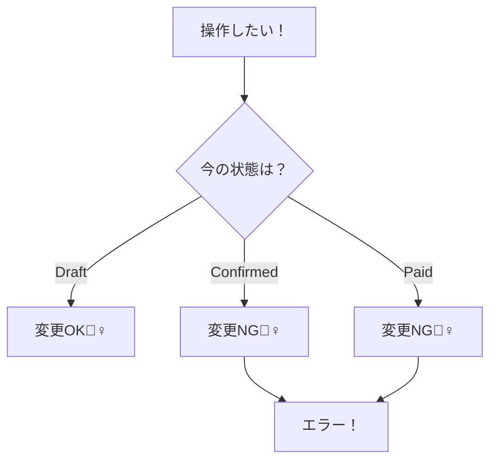
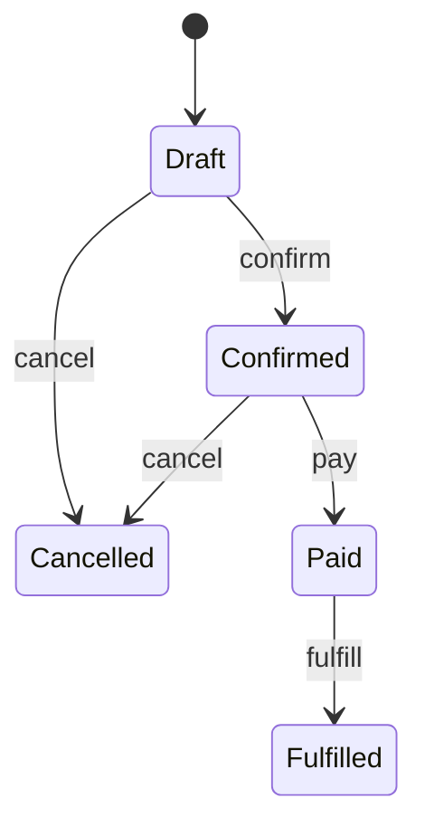

# 第14章：状態と遷移（ステート図の下書き）🚦


今日は「注文はいま何ができる？」を**状態（State）**で整理して、**遷移（Transition）**をルール化していくよ〜！🥰
ここができると、次の章（不変条件🔒）がめっちゃラクになるのです💪💕

---

## 今日のゴール 🎯✨

* ✅ 「注文の状態」をちゃんと名前で言える（Draft/Confirmed/Paid…みたいに）🗣️
* ✅ 「どの操作がOK/NGか」を**遷移表**で説明できる📋
* ✅ そのルールを**TypeScriptのコード**に落として、**テストで守れる**🧪✨

---

## 1) まず超ざっくり：状態ってなに？🧠💡

**状態＝“いまのモード”**だよ🚦
同じ「注文」でも、

* 作成中なら「明細を追加できる」
* 支払い後なら「もう明細を変えちゃダメ」

みたいに、**できることが変わる**よね？😊
それを「状態」で表すと、ルールが整理されてバグが減る✨

---

## 2) 例題（カフェ注文☕）の状態を決めよう 🧩


まずはこの5つでいこう（学習用にシンプル！）🌸

* **Draft**：注文作成中（カゴの中）🛒
* **Confirmed**：注文確定（もう内容は固定）✅
* **Paid**：支払い済み💳
* **Fulfilled**：提供済み☕📦
* **Cancelled**：キャンセル済み🗑️

> ※実務だと「Refunded（返金）」とか「Failed（失敗）」とか増えがちだけど、まずは基本だけでOK〜！🙆‍♀️

---

## 3) “できること”を状態ごとに書き出す ✍️✨

ここが本番！「操作（コマンド）」を並べるよ🧾

* addItem（明細追加）➕
* changeQty（数量変更）🔁
* confirm（確定）✅
* pay（支払い）💳
* fulfill（提供）☕
* cancel（キャンセル）🗑️

そして、状態ごとに「OK/NG」を決める！

### 状態別の直感（まずは文章で）💭


* Draft：追加・変更OK、確定OK、支払いNG、提供NG、キャンセルOK
* Confirmed：追加・変更NG、支払いOK、提供NG、キャンセルOK
* Paid：追加・変更NG、支払いNG（二重払い防止）、提供OK、キャンセルNG
* Fulfilled：もう全部NG（提供後に内容や状態を変えない）
* Cancelled：全部NG（終わった注文をいじらない）

これってつまり、こういう判断ロジックだね！🧠👇



---

## 4) 遷移表（これが最強📋🔥）


「どの状態で、どの操作をしたら、次にどうなるか」を表にするよ✨
ここができると、**コードにもテストにも落としやすい**！

| 現在の状態     | confirm ✅ | pay 💳 | fulfill ☕ | cancel 🗑️ |
| --------- | --------- | ------ | --------- | ---------- |
| Draft     | Confirmed | ❌      | ❌         | Cancelled  |
| Confirmed | ❌         | Paid   | ❌         | Cancelled  |
| Paid      | ❌         | ❌      | Fulfilled | ❌          |
| Fulfilled | ❌         | ❌      | ❌         | ❌          |
| Cancelled | ❌         | ❌      | ❌         | ❌          |

そして「明細操作」も別表で決めると超きれい🧾✨

| 現在の状態     | addItem ➕ / changeQty 🔁 |
| --------- | ------------------------ |
| Draft     | ✅OK                      |
| Confirmed | ❌NG                      |
| Paid      | ❌NG                      |
| Fulfilled | ❌NG                      |
| Cancelled | ❌NG                      |

---

## 5) ステート図（下書き）を描く🖼️🚦


図は「会話の武器」になるよ〜！説明が一瞬で通る✨



> Mermaidが表示されない環境でも、**遷移表があれば勝ち**なので安心してね🥳

---

## 6) TypeScriptに落とす（おすすめの形）🧡

ポイントはこれ👇✨

* 状態は外から直接いじれない（private）🔒
* 状態を変えるのは **ドメインのメソッドだけ**（confirm/pay/…）🚦
* 遷移表を **そのままコード化**すると読みやすい📋

### 6-1) 型とエラーを用意する🧱

```ts
export type OrderStatus =
  | "Draft"
  | "Confirmed"
  | "Paid"
  | "Fulfilled"
  | "Cancelled";

export type OrderCommand =
  | "confirm"
  | "pay"
  | "fulfill"
  | "cancel"
  | "addItem"
  | "changeQty";

export class DomainError extends Error {
  constructor(
    public readonly code: string,
    message: string,
  ) {
    super(message);
    this.name = "DomainError";
  }
}
```

### 6-2) 遷移表を“そのまま”書く📋✨

```ts
const transitionTable: Record<OrderStatus, Partial<Record<OrderCommand, OrderStatus>>> = {
  Draft: {
    confirm: "Confirmed",
    cancel: "Cancelled",
  },
  Confirmed: {
    pay: "Paid",
    cancel: "Cancelled",
  },
  Paid: {
    fulfill: "Fulfilled",
  },
  Fulfilled: {},
  Cancelled: {},
};

const allowedItemOps: Record<OrderStatus, { addItem: boolean; changeQty: boolean }> = {
  Draft: { addItem: true, changeQty: true },
  Confirmed: { addItem: false, changeQty: false },
  Paid: { addItem: false, changeQty: false },
  Fulfilled: { addItem: false, changeQty: false },
  Cancelled: { addItem: false, changeQty: false },
};
```

### 6-3) Orderエンティティ（状態遷移を閉じ込める）🧾🚦


```ts
type LineItem = Readonly<{
  menuItemId: string;
  qty: number;
}>;

export class Order {
  private status: OrderStatus = "Draft";
  private items: LineItem[] = [];

  getStatus(): OrderStatus {
    return this.status;
  }

  getItems(): ReadonlyArray<LineItem> {
    return this.items;
  }

  addItem(menuItemId: string, qty: number): void {
    if (!allowedItemOps[this.status].addItem) {
      throw new DomainError("ORDER_ITEM_OP_NOT_ALLOWED", `いま(${this.status})は明細を追加できません🙅‍♀️`);
    }
    if (qty <= 0) {
      throw new DomainError("QTY_INVALID", "数量は1以上にしてね🧁");
    }
    this.items = [...this.items, { menuItemId, qty }];
  }

  changeQty(index: number, qty: number): void {
    if (!allowedItemOps[this.status].changeQty) {
      throw new DomainError("ORDER_ITEM_OP_NOT_ALLOWED", `いま(${this.status})は数量変更できません🙅‍♀️`);
    }
    if (qty <= 0) {
      throw new DomainError("QTY_INVALID", "数量は1以上にしてね🧁");
    }
    if (index < 0 || index >= this.items.length) {
      throw new DomainError("INDEX_OUT_OF_RANGE", "その明細は存在しないよ🫥");
    }

    const next = [...this.items];
    next[index] = { ...next[index], qty };
    this.items = next;
  }

  confirm(): void {
    this.transition("confirm");
  }

  pay(): void {
    this.transition("pay");
  }

  fulfill(): void {
    this.transition("fulfill");
  }

  cancel(): void {
    this.transition("cancel");
  }

  private transition(cmd: OrderCommand): void {
    const next = transitionTable[this.status][cmd];
    if (!next) {
      throw new DomainError(
        "ORDER_TRANSITION_NOT_ALLOWED",
        `${cmd} はいま(${this.status})ではできません🙅‍♀️🚦`,
      );
    }
    this.status = next;
  }
}
```

---

## 7) テストで“遷移表どおり”を保証する🧪✨


最近のTypeScriptはビルドやエディタ体験の改善も進んでるので、テストを回して設計を守るのがますますやりやすいよ〜💪✨（TypeScript 5.8の最適化など）([TypeScript][1])
テストランナーは、Vitestが今どきの選択肢としてかなり使われてるよ（Vitest 4.0は2025-10-22に告知）([Vitest][2])
Nodeも22系がLTS運用されていて、22.22.0（2026-01-13）のようにセキュリティ更新が続いてる感じ([Node.js][3])

### 7-1) テスト例（遷移OK/NG）🚦🧪

```ts
import { describe, it, expect } from "vitest";
import { Order, DomainError } from "./Order";

describe("Order state transitions", () => {
  it("Draft -> Confirmed", () => {
    const order = new Order();
    order.confirm();
    expect(order.getStatus()).toBe("Confirmed");
  });

  it("Confirmed -> Paid -> Fulfilled", () => {
    const order = new Order();
    order.confirm();
    order.pay();
    order.fulfill();
    expect(order.getStatus()).toBe("Fulfilled");
  });

  it("Paid cannot cancel", () => {
    const order = new Order();
    order.confirm();
    order.pay();

    expect(() => order.cancel()).toThrowError(DomainError);
  });

  it("Draft can add item, but Confirmed cannot", () => {
    const order = new Order();
    order.addItem("coffee", 1);

    order.confirm();
    expect(() => order.addItem("tea", 1)).toThrowError(DomainError);
  });
});
```

---

## 8) AIの使いどころ（この章向け）🤖🫶

AIは「答えを出す」より、**表を作る・抜けを見つける**のが得意だよ✨

### 8-1) 遷移表を作ってもらうプロンプト例📋

* 「注文の状態は Draft/Confirmed/Paid/Fulfilled/Cancelled。操作は confirm/pay/fulfill/cancel。OK/NGの遷移表を作って。NGは理由も一言で。」

### 8-2) 抜けを指摘してもらうプロンプト例🔍

* 「この遷移表に矛盾や抜けがないかレビューして。特に二重払い、提供前の提供、確定前の支払いが混ざってないか見て。」

### 8-3) “仕様の決めどころ”を相談するプロンプト例💬

* 「Confirmedで明細変更を許可する/しないのメリデメを、運用目線で3つずつ出して。」

---

## 9) ミニ演習（やると強くなる🔥）🎓

### 演習A：Confirmedでも明細変更OKにしたい🧁

* 遷移表はそのままでもOK
* でも「明細操作表」を Confirmed: ✅ に変える
* その代わり「いつ固定する？」を決める（例：Paidになったら固定）🔒
* テストも更新！

### 演習B：状態を1個増やす（RefundedとかExpiredとか）➕

* まずは表に追加→図に追加→コードに追加→テストに追加
* “表→コード→テスト”の流れが身につくと最強🏋️‍♀️✨

### 演習C：遷移をテーブル駆動テストにする📋🧪

* 遷移表のデータをそのままループしてテストしてみてね！

---

## 10) 今日のまとめ 🎀✨

* 状態は「いまのモード」🚦
* 遷移表は「仕様の核」📋
* コードは「遷移表をそのまま写す」と読みやすい🧡
* テストで「表どおり」を保証すると、設計が壊れない🧪✨

---

次の第15章は、この遷移の上に「絶対守るルール（不変条件🔒）」をどこに置くかをガッツリやるよ〜！🥳💗

[1]: https://www.typescriptlang.org/docs/handbook/release-notes/typescript-5-8.html?utm_source=chatgpt.com "Documentation - TypeScript 5.8"
[2]: https://vitest.dev/blog/vitest-4?utm_source=chatgpt.com "Vitest 4.0 is out!"
[3]: https://nodejs.org/en/about/previous-releases?utm_source=chatgpt.com "Node.js Releases"
