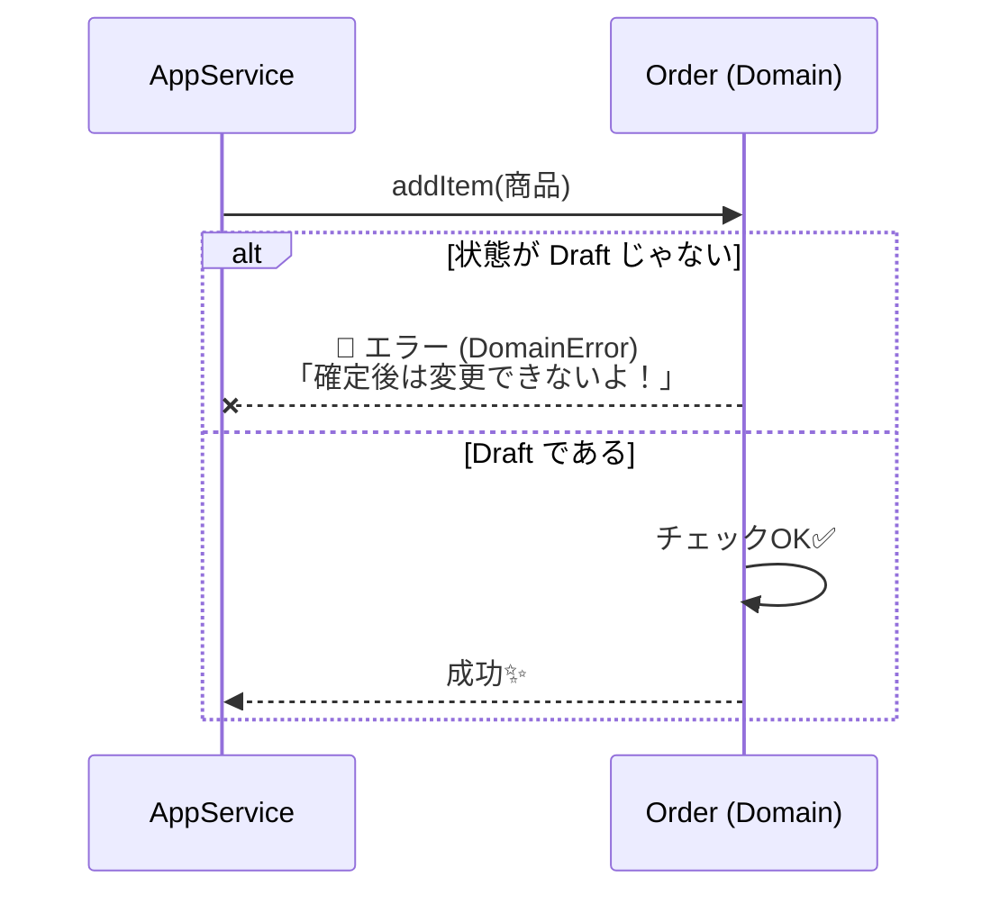

# 第15章：不変条件（絶対守るルール）🔒📏


## 1) 不変条件ってなに？（超かんたん）🧠✨

不変条件（Invariant）っていうのは、

> **そのドメインでは、いつ・どんな操作をしても「絶対に破っちゃダメ」なルール** 🔒

のことだよ〜！

たとえばカフェ注文なら…

* 「支払い後は明細を変更できない」💳🚫
* 「注文確定するなら、明細が1つ以上必要」🧾✅
* 「数量は1以上」☕➕

こういう“壊れたら終わり”のルールが不変条件だね😊

---

## 2) 「入力チェック」と何が違うの？🤔🧾


ここ、超大事！✨

### ✅ 入力チェック（Validation）

* UIで「数字を入れてね」
* フォームで「必須だよ」
  みたいな **入力を助ける** もの🫶

### 🔒 不変条件（Invariant）

* **ドメインモデルが必ず守るべきルール**
* UIやAPIがどれだけ頑張っても、**最後にドメインが守る** 🛡️

つまり…

* UIのチェックは「親切」🌸
* 不変条件は「治安」👮‍♀️🔒

って覚えるとラクだよ〜😆

---

## 3) 例題（カフェ注文☕）の不変条件を “まず列挙” しよう🗒️⚡

第14章で「状態と遷移」を作ったよね🚦
そこから不変条件を作ると、めちゃ自然に出てくるよ✨

### 注文（Order）の不変条件候補🔒


* **数量は1以上の整数** ☕➕
* **単価は0以上の整数（今回は円）** 💴
* **同じメニューが明細に重複しない**（重複するなら加算する方針にする）🧾
* **注文確定（Confirmed）には明細が1つ以上必要** ✅
* **支払い（Paid）は「確定後」だけ** 💳
* **支払い後は明細変更不可** 🚫
* **キャンセルは支払い後は不可** ❌
* **合計金額は「明細の合計」と一致**（ズレたらバグ）🧮

> コツ：**「状態」×「やりたい操作」**で「禁止」を洗い出すと強いよ💪🚦

---

## 4) 不変条件は “どこに置く” のが正解？📍✨

結論からいくね！

### 🔥 最優先：ドメイン（Entity / Aggregate）に置く


* `order.pay()` の中で「確定済み？」をチェックする💳✅
* `order.addItem()` の中で「支払い後じゃない？」をチェックする🧾🚫

👉 **守る本人が守る** のがDDDの気持ちよさ😊🏯

### ⚠️ 置いちゃダメ寄り（ありがち）

* Application Serviceにifを散らす（ルール漏れやすい）💥
* UIだけで守る（API直叩きで死ぬ）💀

UIやアプリ層にもチェックはあっていいけど、**最終防衛ラインはドメイン**ね🛡️✨

---

## 5) TypeScriptで“不変条件を守れる形”を作るコツ🧰🩷

### コツA：setter禁止（っぽくする）🚫


* フィールドを `private` にして、変更はメソッド経由にする
* 変更するときは「メソッド内で必ずガード（チェック）」する

### コツB：配列を外に生で渡さない📦🚫


* `get lines()` で `ReadonlyArray` にして返す
* 可能ならコピーして返す（外からいじれないように）🧊

### コツC：例外（ドメインエラー）を揃える🧯

* 「何がダメだったか」を言語化すると、仕様が固まるよ😊

---

## 6) ミニ実装：Orderが“不変条件の城🏯”になる例（TypeScript）🛡️✨

イメージはこんな感じ！城門で門前払いするよ⚔️



ポイントはこれ👇

* **状態遷移はメソッドでしか起きない** 🚦
* **メソッド冒頭でガード節** 🔒
* **明細は外から直接いじれない** 🧊

```ts
// domain/errors.ts
export class DomainError extends Error {
  constructor(message: string) {
    super(message);
    this.name = "DomainError";
  }
}

export function ensure(condition: unknown, message: string): asserts condition {
  if (!condition) throw new DomainError(message);
}
```

```ts
// domain/order.ts
import { ensure } from "./errors";

export type OrderStatus = "Draft" | "Confirmed" | "Paid" | "Cancelled";

export class OrderLine {
  readonly menuItemId: string;
  readonly name: string;
  readonly unitPriceYen: number;
  readonly quantity: number;

  constructor(args: { menuItemId: string; name: string; unitPriceYen: number; quantity: number }) {
    ensure(args.menuItemId.length > 0, "menuItemIdは必須だよ");
    ensure(args.name.length > 0, "商品名は必須だよ");
    ensure(Number.isInteger(args.unitPriceYen) && args.unitPriceYen >= 0, "単価は0以上の整数(円)だよ");
    ensure(Number.isInteger(args.quantity) && args.quantity >= 1, "数量は1以上の整数だよ");

    this.menuItemId = args.menuItemId;
    this.name = args.name;
    this.unitPriceYen = args.unitPriceYen;
    this.quantity = args.quantity;
  }

  changeQuantity(newQuantity: number): OrderLine {
    return new OrderLine({
      menuItemId: this.menuItemId,
      name: this.name,
      unitPriceYen: this.unitPriceYen,
      quantity: newQuantity,
    });
  }

  addQuantity(delta: number): OrderLine {
    ensure(Number.isInteger(delta) && delta >= 1, "加算量は1以上の整数だよ");
    return this.changeQuantity(this.quantity + delta);
  }

  subtotalYen(): number {
    return this.unitPriceYen * this.quantity;
  }
}

export class Order {
  readonly id: string;

  #status: OrderStatus = "Draft";
  #lines: OrderLine[] = [];

  private constructor(id: string) {
    ensure(id.length > 0, "注文IDは必須だよ");
    this.id = id;
  }

  static create(id: string): Order {
    return new Order(id);
  }

  get status(): OrderStatus {
    return this.#status;
  }

  get lines(): ReadonlyArray<OrderLine> {
    // 外から配列をいじれないようにコピーして返す🧊
    return [...this.#lines];
  }

  totalYen(): number {
    // 合計は「派生値」にして、ズレようがない形にする🧮✨
    return this.#lines.reduce((sum, line) => sum + line.subtotalYen(), 0);
  }

  addLine(line: OrderLine): void {
    ensure(this.#status === "Draft", "明細の追加はDraft（下書き）だけだよ🧾🚫");

    const idx = this.#lines.findIndex((x) => x.menuItemId === line.menuItemId);

    if (idx >= 0) {
      // 同じ商品は重複させず、数量を足す方針🧾➕（不変条件：重複なし）
      const current = this.#lines[idx]!;
      this.#lines[idx] = current.addQuantity(line.quantity);
      return;
    }

    this.#lines.push(line);
  }

  changeLineQuantity(menuItemId: string, newQuantity: number): void {
    ensure(this.#status === "Draft", "数量変更はDraft（下書き）だけだよ✏️🚫");

    const idx = this.#lines.findIndex((x) => x.menuItemId === menuItemId);
    ensure(idx >= 0, "その商品は注文に入ってないよ🫥");

    this.#lines[idx] = this.#lines[idx]!.changeQuantity(newQuantity);
  }

  removeLine(menuItemId: string): void {
    ensure(this.#status === "Draft", "削除はDraft（下書き）だけだよ🧾🚫");
    this.#lines = this.#lines.filter((x) => x.menuItemId !== menuItemId);
  }

  confirm(): void {
    ensure(this.#status === "Draft", "確定できるのはDraftだけだよ✅");
    ensure(this.#lines.length >= 1, "確定するなら明細が1つ以上必要だよ🧾✨");

    this.#status = "Confirmed";
  }

  pay(): void {
    ensure(this.#status === "Confirmed", "支払いできるのはConfirmed（確定済み）だけだよ💳");
    ensure(this.totalYen() >= 0, "合計金額が不正だよ（本来ここは起きない）🧮🧨");

    this.#status = "Paid";
  }

  cancel(): void {
    ensure(this.#status !== "Paid", "支払い後はキャンセルできないよ💳🚫");
    ensure(this.#status !== "Cancelled", "すでにキャンセル済みだよ🙅‍♀️");

    this.#status = "Cancelled";
  }
}
```

### ここが“不変条件の芯”だよ🧠💡


* `addLine / changeLineQuantity / removeLine` に **Draft限定** のガード🔒
* `confirm()` に **明細1件以上** のガード🔒
* `pay()` に **Confirmed限定** のガード🔒
* `totalYen()` を保存しないで **必ず計算**（ズレない）🧮✨

---

## 7) テストで“不変条件が破れない”を確認しよう🧪💖

VitestはTypeScriptで書きやすくて、Jest互換の書き味があるのが嬉しいやつだよ〜🧪✨ ([Vitest][2])

```ts
// test/order.test.ts
import { describe, it, expect } from "vitest";
import { Order, OrderLine } from "../domain/order";
import { DomainError } from "../domain/errors";

describe("Order invariants", () => {
  it("確定には明細が必要", () => {
    const order = Order.create("order-1");
    expect(() => order.confirm()).toThrow(DomainError);
  });

  it("支払い後は明細変更できない", () => {
    const order = Order.create("order-2");
    order.addLine(new OrderLine({ menuItemId: "cafe-latte", name: "カフェラテ", unitPriceYen: 500, quantity: 1 }));
    order.confirm();
    order.pay();

    expect(() => order.addLine(new OrderLine({ menuItemId: "tea", name: "紅茶", unitPriceYen: 400, quantity: 1 })))
      .toThrow(DomainError);
  });

  it("支払いは確定後のみ", () => {
    const order = Order.create("order-3");
    order.addLine(new OrderLine({ menuItemId: "coffee", name: "コーヒー", unitPriceYen: 300, quantity: 1 }));

    expect(() => order.pay()).toThrow(DomainError);
  });
});
```

> この章の気持ち：**“テストは後で”じゃなくて、不変条件だけは先に守る**のが事故りにくいよ🛡️🧪

---

## 8) AI（Copilot/Codex等）に頼むと強いこと🤖🫶

### ✅ 使いどころ①：不変条件の洗い出し🗒️

コピペして投げる用👇

* 「カフェ注文ドメインです。状態はDraft/Confirmed/Paid/Cancelled。操作は addLine / changeLineQuantity / confirm / pay / cancel。**不変条件を10個**、日本語で列挙して。曖昧な点も指摘して。」

👉 **“曖昧さの指摘”**まで頼むのがコツだよ😊🔍

### ✅ 使いどころ②：Given/When/Then の異常系づくり✅🧯

* 「上の不変条件を破るテストケースを **Given/When/Thenで15個**出して。境界値も入れて。」

### ✅ 使いどころ③：コードレビュー（漏れ探し）🕵️‍♀️

* 「このOrder実装で不変条件が漏れてる場所があれば指摘して。特に“外から状態が壊れる経路”を探して。」

---

## 9) ありがち事故集（先に回避〜😂⚠️）

* **アプリ層にifを書きまくる** → ルール漏れ・重複・例外増殖💥
* **配列をそのまま返す** → 外からpushされて治安崩壊😇
* **totalを保存して更新し忘れる** → 合計ズレ事故🧮🧨
* **状態をsetStatusで変えられる** → ルールが無意味🚫🚦

---

## 10) 章末ミニ課題（5〜15分）🎓🩷

### 課題A：不変条件を追加してみよ〜🔒

* 「キャンセル後は何もできない」🙅‍♀️
* 「明細の削除で0件になったら、DraftのままOK？ それとも自動キャンセル？」🤔
  → **方針を決めて**ガードを書こう✨

### 課題B：テストを2本増やしてみよ🧪

* 「数量0は作れない」
* 「支払い後キャンセルできない」

---

## 11) 今日のまとめ（超重要3行）📌✨

* 不変条件＝**絶対に破らないルール**🔒
* 置き場所＝**ドメイン（できれば集約/Entityのメソッド内）**🏯
* 守り方＝**ガード節＋外から壊せない形**🛡️

次の第16章は、この続きで「例外ケース（失敗の道）」を“先に設計する”話に入って、さらに堅くなるよ〜😵‍💫🧯✨

[1]: https://github.com/microsoft/typescript/releases "Releases · microsoft/TypeScript · GitHub"
[2]: https://vitest.dev/?utm_source=chatgpt.com "Vitest | Next Generation testing framework"
