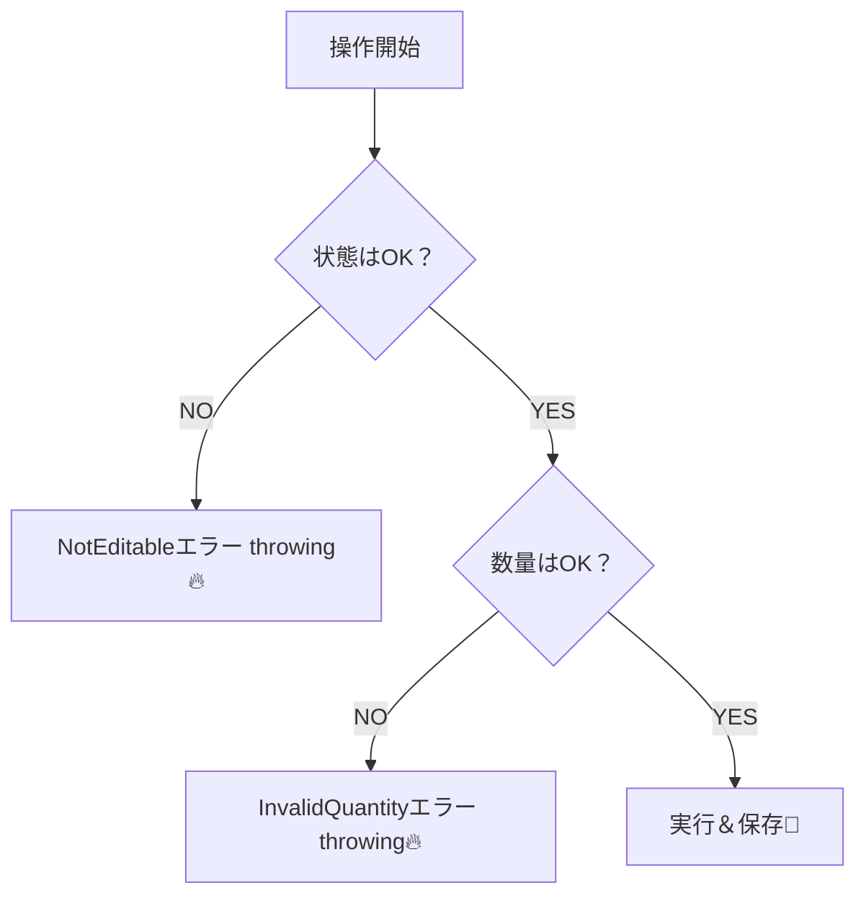

# 第16章：例外ケース（失敗の道）😵‍💫🧯


## この章のゴール🎯✨

* 「失敗パターン」を**仕様として言語化**できる🗣️📝
* 失敗を **ドメインのルール（不変条件・状態遷移）**に落とし込める🔒🚦
* TypeScriptで **“扱いやすいエラー表現”** を作れる（実装とテストまで）🧡🧪

---

## 1) なんで“失敗”を先にやるの？🧠💥

成功ルートだけで作ると、リリース後にこうなる率が高いです👇😇

* 「二重確定できちゃった…」
* 「支払い前に提供できちゃった…」
* 「キャンセル済みなのに明細追加できた…」
* 「エラーの出し方がバラバラでUIが地獄…」

DDDでは、こういう“事故”を **ドメインが自衛**して防ぐのが大事です🛡️✨
（アプリ層は“手順”、ドメイン層は“守るべきルール”担当ね👮‍♀️）

---

## 2) 例題：カフェ注文☕🧾の「失敗ルート」出してみよう🗒️⚡

まずは正常ルートを1行で固定👇

* 注文作成 → 明細追加 → 確定 → 支払い → 提供 ✅

次に「失敗ルート」を“わざと”増やします😈
ここでは、よくあるのをカテゴリ別にまとめるね👇

### A. 入力ミス系（UIでも止めるけど、最後はドメインで止める）🧱🧯

* 数量が0 / マイナス
* 同じ商品を追加しすぎ（上限）
* 存在しないメニューID
* 合計金額が上限超え（上限が仕様にあるなら）

### B. 業務ルール違反（ドメインの主戦場）🔒🚫

* 確定済みの注文に明細追加
* 支払い前に提供
* 支払い後にキャンセル
* 確定を二回呼ぶ（二重確定）
* キャンセル済みを支払う

### C. 状態遷移ミス（いちばん壊れやすいゾーン）🚦💣

* Draft → Paid（飛び級）
* Cancelled → Confirmed（蘇生）
* Fulfilled → Cancelled（提供後キャンセル）

### D. 外部要因（この章では“設計上の置き場”だけ押さえる）🌩️🔌

* 決済がタイムアウト
* 決済が失敗（残高不足など）
* メニュー情報取得が落ちた

> Dは「ドメインの例外」ではなく「システム都合」になりやすいよ（後の章で強くなるところ）🧠✨

---

## 3) 失敗を「仕様（Given/When/Then）」に変換✅🧪

例：**「支払い後は変更不可」** をテストできる形にする👇

* **Given**: 注文が支払い済み
* **When**: 明細を追加しようとする
* **Then**: 失敗する（エラー：`OrderNotEditable`）

この形式にすると、

* 仕様がブレない🧭
* テストが書ける✍️
* “どこで止めるか”が決めやすい📍
  ってメリットが出ます✨

---

## 4) 「どこで止める？」配置ルール📍🧠

ざっくり最強の整理👇

* **UI**：入力補助（必須・桁・形式）🧼
* **アプリ層**：手順・存在確認・変換・トランザクション的まとめ🎬
* **ドメイン層**：不変条件・状態遷移・業務ルールの最終防衛線🏯🛡️
* **インフラ**：DB・外部APIの都合（タイムアウト等）🔌

ポイントはこれ👇
**「ルール違反はドメインが止める」**
（外からどんな順序で呼ばれても、ドメインが“無理です🙅‍♀️”と言える状態が理想）

---

## 5) TypeScriptで“扱いやすいエラー”を作る🧡🧯

2026時点のTypeScriptは 5.9 系が最新安定版として案内されています（npm上のlatest）([npm][1])
近い将来の 6.0 / 7.0 の大きな移行計画も公式が進捗を出しています（性能改善の流れ）([Microsoft for Developers][2])

この章では、TSで実務に強い **2択**を紹介するね👇

### 方式①：ドメインは「例外を投げる」→ アプリ層で捕まえて整形🧯🎁

* ドメイン：不変条件違反を **DomainException** で即停止
* アプリ層：catchして `errorCode` / `userMessage` に変換して返す

DDD界隈でも「ドメイン例外はドメインが投げ、アプリ層で扱う」がよく語られます([Stack Overflow][3])

### 方式②：Result型（成功/失敗を値で返す）📦✅/❌

* `Result<Ok, Err>` を返す
* try/catchが減って、分岐が明示されやすい✨
* 代表的ライブラリ：`neverthrow`（Result / ResultAsync）([GitHub][4])

> 学習としては「①でドメインの守りを体感 → ②で表現を洗練」がおすすめ🧡

---

## 6) 実装例：DomainError（判別可能なユニオン）＋ DomainException 🧩🛡️

#### 6-1. エラー型（ドメイン語彙として固定）🗣️✨

```ts
// domain/errors.ts
export type OrderStatus = "Draft" | "Confirmed" | "Paid" | "Cancelled" | "Fulfilled";

export type DomainError =
  | { type: "InvalidQuantity"; min: number; max: number; actual: number }
  | { type: "MenuItemNotFound"; menuItemId: string }
  | { type: "AlreadyConfirmed" }
  | { type: "NotConfirmable"; status: OrderStatus }
  | { type: "NotPayable"; status: OrderStatus }
  | { type: "NotEditable"; status: OrderStatus }
  | { type: "InvalidTransition"; from: OrderStatus; to: OrderStatus };

export class DomainException extends Error {
  constructor(public readonly err: DomainError) {
    super(err.type);
    this.name = "DomainException";
  }
}
```

このエラーを投げる判断フローはこうなるよ👇



#### 6-2. Orderエンティティで“状態遷移”を守る🚦🔒

```ts
// domain/order.ts
import { DomainException, type DomainError, type OrderStatus } from "./errors";

type LineItem = { menuItemId: string; quantity: number };

export class Order {
  private status: OrderStatus = "Draft";
  private items: LineItem[] = [];

  getStatus(): OrderStatus {
    return this.status;
  }

  addItem(menuItemId: string, quantity: number) {
    if (this.status !== "Draft") {
      throw new DomainException({ type: "NotEditable", status: this.status });
    }
    if (quantity < 1 || quantity > 20) {
      throw new DomainException({ type: "InvalidQuantity", min: 1, max: 20, actual: quantity });
    }
    this.items.push({ menuItemId, quantity });
  }

  confirm() {
    if (this.status === "Confirmed") {
      throw new DomainException({ type: "AlreadyConfirmed" });
    }
    if (this.status !== "Draft") {
      throw new DomainException({ type: "NotConfirmable", status: this.status });
    }
    if (this.items.length === 0) {
      // 例：明細ゼロは確定不可、みたいな仕様があるなら追加できる
      throw new DomainException({ type: "NotConfirmable", status: this.status });
    }
    this.status = "Confirmed";
  }

  pay() {
    if (this.status !== "Confirmed") {
      throw new DomainException({ type: "NotPayable", status: this.status });
    }
    this.status = "Paid";
  }

  fulfill() {
    if (this.status !== "Paid") {
      throw new DomainException({ type: "InvalidTransition", from: this.status, to: "Fulfilled" });
    }
    this.status = "Fulfilled";
  }

  cancel() {
    if (this.status === "Paid" || this.status === "Fulfilled") {
      throw new DomainException({ type: "InvalidTransition", from: this.status, to: "Cancelled" });
    }
    this.status = "Cancelled";
  }
}
```

ここで大事なのは👇✨

* `setStatus("Paid")` みたいなのを許さない🙅‍♀️
* 状態遷移は **メソッドだけ**で行う（= 事故ルートを封鎖）🛡️

---

## 7) アプリ層で「ユーザー向け」に整形する👤🧾

ドメイン例外をそのまま画面に出すと怖いので、ここで翻訳します🪄✨

```ts
// app/error-mapping.ts
import { DomainException, type DomainError } from "../domain/errors";

export type AppError =
  | { kind: "Domain"; error: DomainError; userMessage: string }
  | { kind: "System"; userMessage: string };

export function toAppError(e: unknown): AppError {
  if (e instanceof DomainException) {
    return {
      kind: "Domain",
      error: e.err,
      userMessage: domainMessage(e.err),
    };
  }
  return { kind: "System", userMessage: "ただいま混み合っています。少し待ってからもう一度お願いします🙏" };
}

function domainMessage(err: DomainError): string {
  switch (err.type) {
    case "InvalidQuantity":
      return `数量は ${err.min}〜${err.max} で入力してね🥺`;
    case "NotEditable":
      return `この注文はもう変更できないよ😵（状態: ${err.status}）`;
    case "NotPayable":
      return `まだ支払いできないよ💳（状態: ${err.status}）`;
    case "AlreadyConfirmed":
      return `すでに確定済みだよ✅`;
    default:
      return `操作できない状態だよ😵‍💫`;
  }
}
```

---

## 8) テスト（異常系こそ主役）🧪🔥

2026時点でVitestは 4 系がリリースされていて（4.0アナウンス）([Vitest][5])、4.0.18 のような最新版も追跡できます([脆弱性と設定の情報ガイド][6])
（この章は「異常系テストを量産できる身体」を作るのが目的💪）

```ts
// test/order.exception.test.ts
import { describe, it, expect } from "vitest";
import { Order } from "../src/domain/order";
import { DomainException } from "../src/domain/errors";

describe("Order 例外ケース 😵‍💫", () => {
  it("支払い後は明細を追加できない", () => {
    const order = new Order();
    order.addItem("coffee", 1);
    order.confirm();
    order.pay();

    expect(() => order.addItem("tea", 1)).toThrow(DomainException);
  });

  it("数量0は弾く", () => {
    const order = new Order();
    expect(() => order.addItem("coffee", 0)).toThrow(DomainException);
  });

  it("確定前に支払いできない", () => {
    const order = new Order();
    order.addItem("coffee", 1);
    expect(() => order.pay()).toThrow(DomainException);
  });
});
```

テストのコツはこれ👇💡

* **正常系1本**に対して、**異常系3本**くらい作ると強くなる🔥
* 状態遷移は「できる」だけじゃなく「できない」も全部書く🚦🧪

---

## 9) AIの使いどころ（この章は超相性いい🤖💞）

コピペで使えるプロンプト例だよ👇（そのまま投げてOK）

* 失敗パターン洗い出し🗒️

  * 「カフェ注文ドメインで起こりうる失敗を、入力ミス/業務ルール違反/外部要因 に分類して30個出して。学習用に具体例つきで！」

* Given/When/Then化✅

  * 「次の失敗ケースをGiven/When/Thenにして。Thenにはエラー名も付けて：『支払い後は明細変更不可』」

* テストケース化🧪

  * 「Orderの状態遷移（Draft/Confirmed/Paid/Cancelled/Fulfilled）で、禁止遷移のテストケース名をVitest向けに10個作って」

* “抜け”検出👀

  * 「この状態遷移表で抜けてる失敗ルートを指摘して。特に二重実行（confirm2回、pay2回）観点で！」

---

## 10) ありがち事故あるある😂⚠️（今ここで潰す！）

* **アプリ層に if を書き散らかす**（ドメインが素通り）😇
  → ルールはドメインへ移動🏯
* **エラーが文字列だけ**で、呼び出し側が分岐できない😵
  → `DomainError` を判別可能に（`type`タグ）🧩
* **状態を外から書き換え可能**（public setter）💥
  → 状態はメソッドでしか変えない🚦

---

## 11) ミニ演習（15〜30分）🎓✨

### 演習A：失敗ルートを3つ追加しよう🧯

次を追加して、**Given/When/Then** → **実装** → **テスト**まで💪

1. 「同じ注文を二回確定しようとした」
2. 「キャンセル済み注文に支払いをした」
3. 「提供後にキャンセルをした」

### 演習B：エラーメッセージ二層化👤🛠️

* `userMessage`（やさしい）
* `logMessage`（原因追跡しやすい）
  を分けてみよう✨

---

## この章のまとめ🎀

* 例外ケースは「あとで足すもの」じゃなくて **設計の中心**😵‍💫➡️✨
* 失敗ルートを **Given/When/Then** に落とすと、実装とテストが一気に楽になる🧪
* TypeScriptでは **判別可能ユニオン（DomainError）** が超強い🧡
* ドメインが“最後の砦”になってると、アプリは崩れにくい🏯🛡️

次の章（第17章）は、この失敗パターンの塊が「ここから先、分けたくなる…！」っていう“境界の気配”に繋がっていくよ📦🌿✨

[1]: https://www.npmjs.com/package/typescript?utm_source=chatgpt.com "typescript"
[2]: https://devblogs.microsoft.com/typescript/progress-on-typescript-7-december-2025/?utm_source=chatgpt.com "Progress on TypeScript 7 - December 2025"
[3]: https://stackoverflow.com/questions/51942769/should-my-domain-exceptions-be-thrown-from-application-layer?utm_source=chatgpt.com "Should my Domain Exceptions be thrown from Application ..."
[4]: https://github.com/supermacro/neverthrow?utm_source=chatgpt.com "supermacro/neverthrow: Type-Safe Errors for JS & TypeScript"
[5]: https://vitest.dev/blog/vitest-4?utm_source=chatgpt.com "Vitest 4.0 is out!"
[6]: https://security.snyk.io/package/npm/vitest?utm_source=chatgpt.com "vitest vulnerabilities"
