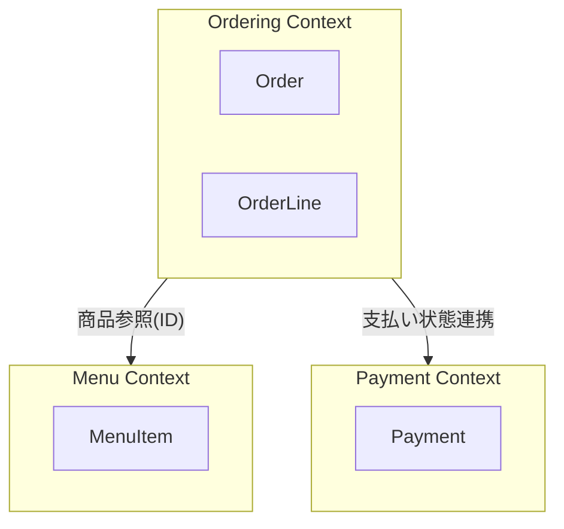

# 第17章：境界の気配：モジュール分けの種📦🌿


この章は「いまは小さいけど、あとで大きくなった時に崩れないように」**分割の“タネ”を見つける練習**だよ〜！😊✨
マイクロサービスとか難しい話はまだ置いといて、まずは **同じ箱に入れておくべきもの／分けた方が幸せなもの**を見分けられるようになろうね💪🍀

---

## この章でできるようになること ✅✨

* 「注文」「支払い」「メニュー」みたいに **自然な塊（モジュール）** を見つけられる 👀📦
* モジュールごとに「言葉」「ルール」「責任」をまとめられる 🗣️🔒
* TypeScriptのフォルダ分割を **“境界が守れる形”** にできる 🧩🧱
* AIに「分割案」を出させつつ、**自分で判断して採用できる** 🤖🧠✨

---

## まず結論：境界ってなに？🌱

**境界（モジュール境界）＝「同じ理由で変わるもの」をまとめる線**だよ✍️✨
逆にいうと、**違う理由で変わるものが同じ場所にいると、だんだん地獄**になる😵‍💫🔥

たとえばカフェ注文でいうと…

* ☕ 注文：明細の追加・合計・状態（下書き→確定→支払い済み…）
* 💳 支払い：支払い手段、支払い結果、二重払い防止
* 📋 メニュー：商品名・価格・販売可否（売り切れ等）

これらは「変更理由」が別々になりやすいのね。だから **分ける芽**がある🌿✨

---

## 2026年2月時点の “最新ツールの空気感” 🧡🧰

* TypeScriptは **5.9系**が現行の流れ（公式の5.9アナウンスあり）📌 ([Microsoft for Developers][1])
* Node.jsは **v24がActive LTS**、v25はCurrent（新しめ追いかけ用）って扱いが分かりやすいよ🍀 ([Node.js][2])
* VS Codeは、ワークスペースの `node_modules` に入ってるTypeScriptを検出して使える＆ `typescript.tsdk` で指定もできるよ🧩 ([Visual Studio Code][3])

（この章の本題は設計だけど、境界を“仕組みで守る”時にこのへんが効いてくるよ〜！✨）

---

## 境界を見つける「3つのレンズ」🔎🔎🔎

境界ってセンスに見えるけど、実はチェック観点があるよ😊


### レンズ①：ルール（不変条件）はどこで守る？🔒

* 「支払い後は明細変更不可」←これは**注文側のルール**っぽい
* 「同じ支払いを二重に処理しない」←これは**支払い側のルール**っぽい

➡️ **ルールが違う場所に住んでるなら、境界の匂い**🌿

### レンズ②：変更理由（誰が何のために変える？）🛠️

* 値上げ：メニュー側が変わる
* 支払い手段追加：支払い側が変わる
* 注文状態追加：注文側が変わる

➡️ **別々に変わるなら、分けると事故が減る**🚑✨

### レンズ③：言葉（同じ単語が別の意味じゃない？）🗣️

「ステータス」って言葉が、

* 注文ステータス（Draft/Confirmed/Paid…）
* 支払いステータス（Authorized/Captured/Failed…）

みたいに分裂してたら要注意⚠️
➡️ **言葉が分裂するところは、境界があることが多い**🌿

---

## ワーク：イベントから“自然な塊”を作る ⚡🗒️➡️📦

第13章で列挙したイベント（注文作成/確定/支払い/提供…）を使って、境界のタネを作ろう😊

### Step 1：イベントを「誰の仕事？」で色分け🎨

例（ざっくり）：

* ☕ 注文：OrderCreated / ItemAdded / OrderConfirmed / OrderCancelled
* 💳 支払い：PaymentRequested / PaymentSucceeded / PaymentFailed
* 📋 メニュー：MenuItemAdded / PriceChanged / SoldOut
* 📦 提供：OrderPrepared / OrderFulfilled

ここでポイント💡
**「提供」は注文の一部に見えるけど、現場だと別チーム運用になりがち**なので、境界候補として残しておくと強いよ〜😊✨

### Step 2：「その情報の正本（オーナー）は誰？」を決める👑


これが超大事！！✨

* 商品名・価格の正本 → 📋メニュー
* 支払いの成功/失敗の正本 → 💳支払い
* 注文の状態・明細の正本 → ☕注文

➡️ **正本を決めるだけで、境界がめちゃ見える**👀✨

### Step 3：各モジュールの「公開API」を1〜3個に絞る🚪

モジュールは“箱”だけ作ってもダメで、**入り口（API）**が必要だよ〜！

例：

* ☕ 注文：`placeOrder` / `addItem` / `confirm`
* 💳 支払い：`requestPayment` / `recordPaymentResult`
* 📋 メニュー：`getMenuItem` / `changePrice`

---

## 分割案を2〜3パターン出して比較しよう（章テーマの本丸）🥊✨

ここ、AIと相性めちゃ良いよ🤖💕

### パターンA：サブドメインっぽく分ける（おすすめ）📦


* `ordering`（注文）
* `payment`（支払い）
* `menu`（メニュー）
* （余力あれば）`fulfillment`（提供）

**👍良いところ**

* 変更理由が分かれやすい＝自然に保守しやすい
* 言葉も分裂しにくい（それぞれの辞書を持てる）

**👀注意**

* 最初はちょい“分けすぎ？”に見えるけど、後で効く✨



### パターンB：フロー（工程）で分ける🚦

* `order-flow`（注文〜確定）
* `payment-flow`（支払い）
* `fulfillment-flow`（提供）

**👍良いところ**

* ユースケースの流れが追いやすい

**👀注意**

* 「メニュー変更」みたいな**フロー外の変更**が迷子になりやすい

### パターンC：集約ごとに分ける（第51章以降に強い）🏯

* `order-aggregate`
* `menu-aggregate`
* `payment-aggregate`

**👍良いところ**

* “変更の単位”と一致してくる

**👀注意**

* まだ集約に慣れてない段階だと、判断が難しめ🌀

---

## TypeScriptで「境界を壊さない」フォルダの切り方 🧱✨

ここから “実装の形” に落とすよ〜！😊

### 目標：モジュールの中身を“勝手に触れない”状態にする🚧

コツはこれ👇

* **各モジュールに `index.ts`（公開口）を作る**
* 外からは **`index.ts` 経由でしか import しない**
* 「奥のファイル」を直import（deep import）しない

#### フォルダ例 📁


```text
src/
  domain/
    ordering/
      index.ts
      Order.ts
      OrderId.ts
      OrderStatus.ts
    payment/
      index.ts
      Payment.ts
      PaymentId.ts
    menu/
      index.ts
      MenuItem.ts
      MenuItemId.ts
  app/
    usecases/
      PlaceOrder.ts
      PayOrder.ts
```

#### `index.ts` のイメージ（注文モジュール）🚪

```ts
// src/domain/ordering/index.ts
export { Order } from "./Order";
export { OrderId } from "./OrderId";
export { OrderStatus } from "./OrderStatus";
```

外からはこう：

```ts
import { Order, OrderId } from "../domain/ordering";
```

---

## “境界が壊れてるサイン”早見表 👀⚠️


* 😵‍💫 `payment` が `ordering/Order.ts` の奥ファイルを直importしてる
* 😵‍💫 「メニュー価格変更」のロジックが `ordering` に混ざってる
* 😵‍💫 ある変更をするのに、毎回3モジュール同時に直す羽目になる
* 😵‍💫 同じ単語（status等）がモジュール間で意味違いになってる

1個でも当てはまったら、「境界の引き直し」候補だよ〜✏️✨

---

## AIの使いどころ（この章の勝ち筋）🤖🏆

AIには「答え」じゃなくて、**比較材料**を出させるのがコツ😊✨

### そのまま使えるプロンプト例 🧠💬

* 「カフェ注文ドメインで、ordering/payment/menu の3モジュール案を作って。各モジュールの責務・正本データ・公開APIを3つまでで」
* 「境界を変えた場合のデメリット（結合が増える点）を具体例で指摘して」
* 「deep import が起きそうな危険ポイントをチェックリスト化して」

### AIの回答を採用する前の“最終質問”🔥

* 「**この分割で、不変条件はどこに閉じ込められる？**」
  これに答えられない分割は、だいたい微妙🥹💦

---

## ミニ演習（手を動かす）🎮✨

### 演習1：境界メモを書いてみよう📝

下の表を埋めてみてね！（短くてOK✨）

| モジュール    | その箱の言葉    | 正本データ   | 守るルール（不変条件） | 公開API（1〜3個）     |
| -------- | --------- | ------- | ----------- | --------------- |
| ordering | 注文、明細、確定… | 注文状態、明細 | 支払い後変更不可…   | place/confirm…  |
| payment  | 支払い、失敗…   | 支払い結果   | 二重処理禁止…     | requestPayment… |
| menu     | 商品、価格…    | 商品情報    | 売り切れ不可…     | getMenuItem…    |

### 演習2：「これはどの箱？」仕分けクイズ📦🧠

* 「合計金額の計算」→どこ？
* 「価格改定の履歴」→どこ？
* 「支払いに失敗したら注文はどうなる？」→どこで決める？

**答えのコツ**：

* 正本データに近い方
* 不変条件を守りたい方
* 変更理由が一致する方

### 演習3：境界を破る import を禁止する（発想だけ体験）🚧

ESLintで `no-restricted-imports` を使うと「奥ファイル直import禁止」ができるよ（仕組みで守る✨）

```js
// .eslintrc.cjs などのイメージ（概念）
module.exports = {
  rules: {
    "no-restricted-imports": [
      "error",
      {
        patterns: [
          "../domain/*/*",  // 直下以外の深いimportを禁止、みたいな発想
        ],
      },
    ],
  },
};
```

（細部はプロジェクト構成で変わるから、ここでは“発想を掴む”だけでOK😊🌸）

---

## 理解チェック（10問）🎓✨

1. 境界は「技術」よりまず何で決める？🧠
2. 正本データ（オーナー）を決めると何が嬉しい？👑
3. 「同じ単語が別の意味」は何のサイン？🗣️
4. deep import が危ない理由は？🧨
5. モジュールの入口を絞るメリットは？🚪
6. ordering と payment を分ける“変更理由”の例を1つ言ってみて🛠️
7. ルール（不変条件）はどこに置くのが基本？🔒
8. AIに分割案を出させる時、必ず聞くべき項目は？🤖
9. 「毎回3モジュール同時変更」は何が起きてる？😵‍💫
10. 次章（第18章）で図にするのは何が目的？🖼️

### こたえ（サクッと）✅

1. 変更理由・ルール（不変条件）
2. 責務と依存が整理され、衝突が減る
3. 境界がある（または境界が曖昧）サイン
4. 境界を素通りして結合が増え、変更に弱くなる
5. 依存が減り、守るべき場所がハッキリする
6. 例：支払い手段追加はpayment、注文状態追加はordering
7. ドメイン（モジュール内）
8. 責務・正本データ・不変条件・公開API
9. 境界がずれてる／関心が混ざってる可能性
10. 言葉→構造（主要オブジェクトと関係）を共有できるようにする

---

## 次（第18章）につながる一言 🧩🖼️

第17章で作った **“箱の切り方”** は、次の第18章で **最小のドメイン図**にするとめっちゃ強くなるよ😊✨
図にすると「境界が自然かどうか」が一発で見えるからね〜！📌💕

---

必要なら、この章の演習1（境界メモ）を、あなたのイベント一覧に合わせて **一緒に埋める版**も作れるよ☺️✨

[1]: https://devblogs.microsoft.com/typescript/announcing-typescript-5-9/?utm_source=chatgpt.com "Announcing TypeScript 5.9"
[2]: https://nodejs.org/en/about/previous-releases?utm_source=chatgpt.com "Node.js Releases"
[3]: https://code.visualstudio.com/docs/typescript/typescript-compiling?utm_source=chatgpt.com "Compiling TypeScript"
