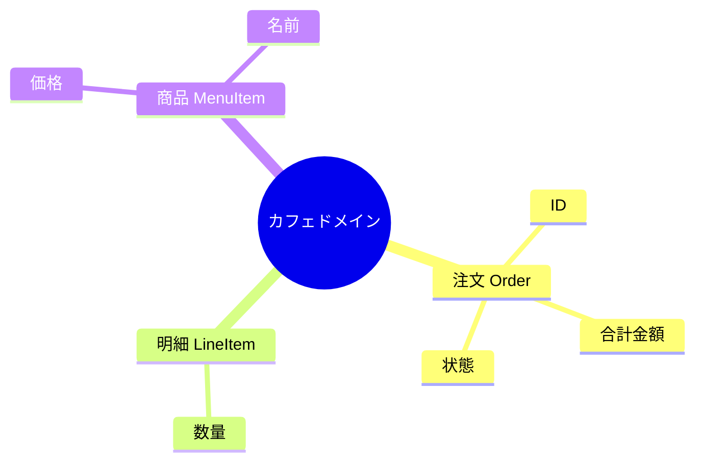
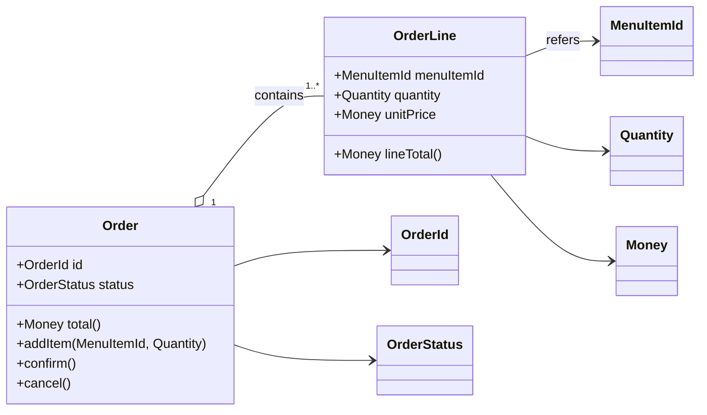

# 第18章：仕様を図にする（最小のドメイン図）🧩🖼️


## この章のゴール🎯

* 仕様（言葉）を、**“箱と線”の図**に変換できるようになる😊
* 図を見せながら、**「なぜこう分けた？」を説明**できるようになる🗣️✨
* 図が「一枚絵で終わらず」、**コードと一緒に更新できる**状態になる🔁📌

---

## 1) “最小のドメイン図”ってなに？🤔🧠

## いったん結論🍀

**最小のドメイン図**は、こんな感じの「最低限だけ描いた図」です👇

* ✅ 主要な概念（名詞）＝箱
* ✅ つながり（関係）＝線
* ✅ 重要なら「多い/少ない（1対多）」や「含む（部品）」も軽く書く
* ✅ 余裕があれば “集約の境界” をふんわり囲う（城壁みたいに🏯）

> ✨ポイント：UMLを完璧に描くのが目的じゃないよ！
> 「仕様の理解を揃える」「設計の相談ができる」ための“会話ツール”だよ😊🗣️

---

## 2) 図にする前の“下ごしらえ”🥕🧾

第12章の「ユビキタス言語（用語辞書）」と第13章の「イベント列挙」を材料にします🍳✨

## 2-1. 用語から“箱候補”を拾う📚🔎

まず「名詞」を拾います（重要語ほど強い）💪✨
例（カフェ注文）☕🧾

* 注文（Order）
* 注文明細（OrderLine / LineItem）
* 商品（MenuItem）
* 金額（Money）
* 数量（Quantity）
* 状態（OrderStatus）
* 支払い（Payment）※今回は最小なら “注文の状態” に吸収してもOK

まず「箱候補」をマインドマップで広げて整理するのもアリだよ🧠



## 2-2. “動詞”は線のラベル候補になる🏷️➡️

例：

* 注文は明細を「含む」
* 明細は商品を「参照する」
* 注文は合計金額を「計算する」

---

## 3) 最小ドメイン図の描き方：5ステップ🧭✨

## ステップ①：主人公（中心の箱）を1つ決める👑

カフェ注文ならだいたい **Order（注文）** が中心になりやすいよ☕🧾

## ステップ②：中心が“持ってるもの”を足す📦

Order が持ってるもの：

* 注文ID（OrderId）
* 状態（OrderStatus）
* 明細一覧（OrderLines）
* 合計（TotalMoney）など

## ステップ③：値っぽいものは VO に寄せる💎

* Money / Quantity / 各種Id は **Value Object候補**（第31章以降で本格化するけど、ここでは“候補扱い”でOK）😊💎
* ここで VO を意識すると、あとで型設計が気持ちよくなる〜🧡

## ステップ④：関係線は「含む」「参照する」を中心に描く🔗

* **含む**：Order は OrderLine を含む（1対多）
* **参照する**：OrderLine は MenuItemId を参照する（商品そのものを抱えすぎない）

## ステップ⑤：集約の境界（城壁）を薄く描く🏯

「一緒に不変条件を守る単位」が城壁の中🏰
最小図では、Order と OrderLine を同じ囲いにしがち（後の章で確定していくよ）😊

---

## 4) 例題：カフェ注文の“最小ドメイン図”🧩☕🧾

ここでは **Mermaid の classDiagram** を使うよ😊
Mermaid のクラス図構文は公式ドキュメントがあるので安心✨ ([Mermaid][1])

> VS Code の Markdown プレビューで Mermaid を描くなら、拡張機能（Mermaid対応）を入れるのが楽だよ〜🧡
> 例：Markdown プレビューに Mermaid を追加する拡張があるよ ([Visual Studio Marketplace][2])

---

## 4-1. “構造”の最小図（箱と線）🧩🖼️



### この図の読み方（口で説明できるようにする🗣️✨）

* **Order が中心**で、外から触る操作（addItem/confirm/cancel）がここに集まるイメージ👑
* **OrderLine は注文の部品**（明細は注文の一部）なので “contains”🧾📦
* 商品は “MenuItem（実体）” を抱えず、まずは **MenuItemId参照**でスッキリ🔗✨
* Money/Quantity/Id は “値” なので、**Value Objectっぽく独立**させてある💎

> これだけでチームに「注文って何を持ってる？」「明細って何？」が説明できるようになるよ😊🎉

---

## 4-2. “集約境界”を足したいとき（超かるく）🏯✨

Mermaidの classDiagram で境界を表現するのは工夫が要るので、**まずは注釈コメント**でOK😊
（本格的には第51章以降でやるやつ！）

```text
🏯 Aggregate（案）
- Order（Root）
  - OrderLine（内部）
- 外部参照は ID が基本：MenuItemId
```

---

## 5) 図を“仕様に効く形”にするコツ5つ🧠✨

## コツ①：DBっぽくしない（テーブル図にしない）🚫🗄️

* ❌ order_table / order_line_table みたいな発想から入る
* ✅ 「業務の言葉（注文/明細/状態）」から入る

## コツ②：DTOやAPI都合を混ぜない🚫📦

* ❌ OrderResponseDto とかを図に入れ始める
* ✅ ドメイン図は “内側のルール” の箱だけにする

## コツ③：線に“動詞”をつけると会話が楽🗣️➡️

* contains / refers / calculates みたいに、**関係が説明文になる**😊

## コツ④：箱の中身（属性・操作）は“最小でOK”✂️

* 最初から全部入れると死ぬ😇
* 「説明に必要な3つ」くらいだけで十分✨

## コツ⑤：図は“固定じゃない”から怖がらない🔁

* 学習中は特に、図が変わるのが正常🙆‍♀️
* 図が変わる＝理解が進んでる証拠🎉

---

## 6) VS Codeで図を回す“実務っぽい”やり方🛠️✨

## パターンA：READMEに Mermaid を置く（最速）📄⚡

* 図がコードと一緒に管理できる（レビューしやすい）👍
* GitHub でも Mermaid 図を Markdown 内に書けるよ（公式） ([GitHub Docs][3])

## パターンB：PlantUML派ならこっち🌿

* PlantUML の VS Code 拡張も定番で、プレビューやエクスポート機能がまとまってるよ🖼️ ([Visual Studio Marketplace][4])

---

## 7) AIの使いどころ：図づくりは“相棒”が強い🤖💞

ここ、AIめっちゃ効くよ😊✨
（ただし “設計の決定権” はこっち！✋）

## 7-1. 良いプロンプト例（そのまま使える）🧾🤖

```text
あなたはDDDの学習コーチです。
次の用語辞書とイベント一覧から、最小のドメイン図（箱と線）を作りたいです。

- 主要概念（名詞）を10個以内に絞って
- 関係は「含む」「参照する」を中心に
- Mermaid classDiagram のコードで出力して
- さらに、図の“説明文”も5行で書いて（なぜその関係？）

題材：カフェ注文
用語：Order, OrderLine, Money, Quantity, MenuItemId, OrderStatus ...
イベント：OrderPlaced, ItemAdded, OrderConfirmed, PaymentCompleted ...
```

## 7-2. AIにチェックさせる観点（強い）✅🔍

* この図、**不変条件が守れそう？**🔒
* “外部都合” が混ざってない？（DTO/DB/API）🚫
* 関係線が **説明できる言葉**になってる？🗣️
* “どれが中心？” が一瞬で分かる？👑

---

## 8) ありがちな失敗あるある😂⚠️（先に潰そ！）

* **箱が多すぎ**（20個超えたら最小じゃない😇）
* **線が多すぎ**（蜘蛛の巣になる🕸️）
* **「User」「Data」「Info」みたいな曖昧語**が主役になる（意味が薄い）
* **UI入力の都合**が混ざる（フォーム項目=ドメイン、になりがち）
* **正しさより綺麗さ**を追い始める（図は会話ツール！）

---

## 9) ミニ演習（15〜30分）✍️⏱️✨

## 演習A：最小図を作る🧩

1. 用語から「箱」を最大10個選ぶ
2. 関係線を最大12本に制限して描く
3. 図の説明を **5行で**書く🗣️✨

## 演習B：図から質問を作る❓

* 「OrderLineは Entity？VO？」
* 「MenuItemは別集約？それとも注文内に入れる？」
* 「支払いはOrderStatusで表現する？Paymentを分ける？」

→ これが次の章以降の伸びしろになるよ😊🌱

---

## 10) （最新情報メモ）TypeScriptの“本日時点”🧡📌

この教材全体の前提として、TypeScriptは現時点で **npm の latest が 5.9.3** になってるよ（最終公開は2025年9月末として表示） ([NPM][5])
また、TypeScript 6.0 は **2026-02-10にBeta、2026-03-17にFinal予定**として公開スケジュールが出ているよ ([GitHub][6])

（第18章自体は“図”が主役だけど、こういう「今どうなってる？」は教材として押さえておくね😊✨）

---

## この章のまとめ🎒✨

* 最小ドメイン図は **「主要な箱＋最低限の線」**でOK😊
* 図は “完成品” じゃなくて **会話して育てる設計道具**🔁
* Mermaidで図をコード管理すると、**更新できる図**になる🧩🖼️
* AIは **箱候補・関係候補・説明文**で超役立つ🤖💞

---

次（第19章）は「何を作らないか（スコープ）」で、**図に描かなかったものを“意図して除外”できる状態**にしていくよ✂️😊✨

[1]: https://mermaid.ai/open-source/syntax/classDiagram.html?utm_source=chatgpt.com "Class diagrams | Mermaid"
[2]: https://marketplace.visualstudio.com/items?itemName=bierner.markdown-mermaid&utm_source=chatgpt.com "Markdown Preview Mermaid Support"
[3]: https://docs.github.com/en/get-started/writing-on-github/working-with-advanced-formatting/creating-diagrams?utm_source=chatgpt.com "Creating Mermaid diagrams"
[4]: https://marketplace.visualstudio.com/items?itemName=jebbs.plantuml&utm_source=chatgpt.com "PlantUML"
[5]: https://www.npmjs.com/package/typescript?activeTab=versions&utm_source=chatgpt.com "typescript"
[6]: https://github.com/microsoft/TypeScript/issues/63085?utm_source=chatgpt.com "TypeScript 6.0 Iteration Plan · Issue #63085"
