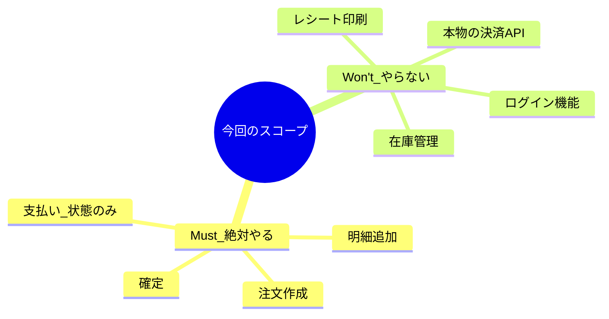

# 第19章：“何を作らないか”を決める（スコープ）✂️


## この章のゴール 🎯✨

* 「作るもの」だけじゃなく **「作らないもの」もハッキリ言える** ようになる🙆‍♀️
* 学習プロジェクトが **途中で巨大化して詰む** のを防ぐ🧯
* “完成体験”まで最短で行ける **MVPスコープ** を切れるようになる🎉

---

## まず結論：スコープは「やらない宣言」が本体 ✋🧡

DDDの学習って、真面目にやるほど「あれも必要では？」「実務ならここも…」って増えがちなのね😵‍💫
でも学習で一番大事なのは **“DDDの核が動く”こと**。

だからスコープはこう考えると強いよ👇

* ✅ **DDDの学習に必要な“筋肉”だけ鍛える**
* 🚫 それ以外は **意図的に捨てる**
* 🔁 余裕が出たら次の周回で足す

---

## スコープには3種類あるよ📌（これが混ざると事故る）

### ① 機能スコープ（Feature）🧩

例：注文作成、支払い、提供、履歴表示…など

### ② 品質スコープ（Quality）🛡️

例：性能、セキュリティ、監査ログ、完全な例外設計…

### ③ 外部スコープ（Integration）🔌

例：決済API、メール送信、在庫連携、認証基盤…

学習プロジェクトは **③が特に危険**⚠️
外部連携って、DDDの勉強というより「周辺の沼」になりやすいからね😂

---

## DDD視点での「良いスコープ」の条件 🧠💡

この章で狙う“良いMVP”は、次を満たすやつ✨

### ✅ 1つの集約（Aggregate）で不変条件を守れる

例題（カフェ注文）なら、まずは **Order集約だけで成立** させる感じ🏯

### ✅ ユースケースが1〜2本、最後まで通る

「途中までできた」より **最初から最後まで動いた** が強い🎉

### ✅ “境界”を守ったまま進められる

domain/app/infra の役割が混ざらないこと（混ざるとDDDが見えなくなる）🌀

---

## 例題：カフェ注文でのMVPスコープ案 ☕🧾（おすすめ）

ここでは「DDDの芯＝ルールを守る」を最短で体験するスコープにするよ💪✨

### ✅ MVPで “やる（Must）” 🟢

* 注文を作る（PlaceOrder）
* 注文明細を追加する（数量・重複などのルールつき）
* 注文を確定する（Confirmedへ遷移）
* 支払い済みにする（Paidへ遷移）※ **決済そのものはダミーでOK**
* 注文詳細を表示する（GetOrder）

### 🟡 余裕があれば “やる（Should）”

* キャンセル（Cancel）＋「いつならキャンセルできる？」のルール
* 期限切れ（例：確定後10分で無効）※Clockは後で強化でもOK

### 🚫 今回 “やらない（Won’t）” 🔴

* 本物の決済API連携（Stripe等）💳❌
* ログイン・会員・権限（認証認可）🔐❌
* 在庫管理・キッチン連携・レシート印刷🧾❌
* クーポン・ポイント・複雑な割引🏷️❌
* 管理画面・注文一覧UI（まずはテスト or 簡易CLIで十分）🖥️❌

> ポイント：**「支払い」は “状態遷移” だけやる**。
> “外部決済の成功/失敗” は **ダミーの戻り値** でOK🙆‍♀️



---

## “やらない”を決めるための7ステップ 🪜✨

### Step 1：この学習で得たい能力を1行で書く📝

例：

* 「Order集約で不変条件を守り、ユースケースを通す」

### Step 2：成功の定義（Definition of Done）を作る✅

* テストが通る
* ユースケースが通る
* domainがinfraを知らない
* “禁止される操作”がテストで落ちる

### Step 3：イベント列挙（第13章）から“核だけ”拾う⚡

全部作ろうとしないで、**一番中心の流れだけ**を残すよ✂️

### Step 4：状態遷移（第14章）を最小にする🚦

Draft → Confirmed → Paid くらいでOK🙆‍♀️

### Step 5：外部連携は「置き換え方」まで決める🔁

* ダミー（Fake）
* スタブ（Stub）
* インメモリ（InMemory）
  このどれで逃げるか決めるだけで、迷子が激減する🧭✨

### Step 6：非スコープ（Non-goals）を文章にする✋

ここが超重要！
**「やらない」って書いてOK**。むしろ書かないと増える😂

### Step 7：増えそうな要求の“置き場所”を用意する📦

* 「後でやる」リスト（Later）
* 「今回の目的に関係ない」リスト（Parking Lot）

---

## すぐ使える：スコープ定義テンプレ（scope.md）🗂️✨

これを `docs/scope.md` に置くだけでめちゃ効くよ👍

```md
## スコープ（MVP）

## 目的（1行）
- 例：Order集約で不変条件を守り、注文〜支払いまでのユースケースを通す

## 今回やること（Must）
- 
- 
- 

## 余裕があればやる（Should）
- 
- 

## 今回やらない（Won't / Non-goals）
- 
- 
- 

## 置き換え方（ダミー方針）
- 決済：常に成功/失敗を切り替えられるダミー関数
- メニュー：固定データ（ハードコード or JSON）
- 永続化：InMemory（Map）でOK

## 完了の定義（Definition of Done）
- ユースケースが1本以上、最初から最後まで通る
- 禁止操作がテストで落ちる
- domainがinfraを参照していない
```

---

## ミニ実装イメージ：ダミー決済ってこういうのでOK💳➡️🧸

「外部連携をやらない」って、こうやって **形だけ用意**すれば十分！

```ts
// app/payment/FakePaymentGateway.ts
export type PaymentResult =
  | { ok: true; paymentId: string }
  | { ok: false; reason: "DECLINED" | "NETWORK" };

export class FakePaymentGateway {
  constructor(private mode: "always-ok" | "always-fail" = "always-ok") {}

  async pay(amount: number): Promise<PaymentResult> {
    if (this.mode === "always-fail") return { ok: false, reason: "DECLINED" };
    return { ok: true, paymentId: crypto.randomUUID() };
  }
}
```

> 重要：ここにドメインルールを入れないこと🙅‍♀️
> これは **“外の都合”** だから、app/infra側でOKだよ。

---

## AIの使いどころ（第19章版）🤖✂️

AIは“決める”より **「増えすぎを止める」** に使うと強いよ🛡️✨

### ✅ プロンプト例：MVPを削る

```text
カフェ注文ドメインで、DDD学習用のMVPスコープを決めたいです。
目的は「Order集約で不変条件を守り、ユースケースを最後まで通す」こと。
以下の候補から Must/Should/Won't に分類して、理由も短く付けてください。
（候補：注文作成、明細追加、確定、支払い、提供、キャンセル、ログイン、在庫、クーポン、決済API連携、メール通知）
```

### ✅ プロンプト例：スコープ漏れを発見する

```text
次の「Non-goals」を読んで、まだ増えそうな要素（スコープクリープの種）を指摘して。
また、増えそうな要求が来た時に断る言い回し例も作って。

Non-goals:
- 決済API連携はやらない
- ログイン/会員はやらない
- 在庫はやらない
```

---

## よくある失敗あるある 😂⚠️（回避ワンポイント付き）

### 失敗1： “実務なら必要” を全部入れる

* ✅ 回避：**学習の目的（1行）** に関係ないものは全部Laterへ📦

### 失敗2：外部連携を先にやって燃える🔥

* ✅ 回避：**状態遷移だけ**先に作る（支払い＝Paidにするだけ）

### 失敗3：UIを作って満足してドメインが薄い

* ✅ 回避：**テストが先**でもOK。ドメインが主役👑

### 失敗4： “いつか必要” で未来対応を盛る

* ✅ 回避：未来対応は **「捨てやすい形」にする**（interfaceだけ置く等）

---

## 本日時点の“最新”メモ（2026-02-07）🧡🆕

スコープに直結する「開発の足回り」だけ、最新状況を軽く押さえとくね👇

* TypeScript の最新は **5.9.3**（npmのlatest）だよ。([NPM][1])

  * 5.9では `import defer` みたいな新機能も入ってる（必要になったらでOK！）([TypeScript][2])
* TypeScript は 6.0 が「7.0（ネイティブ）への橋渡し」扱いになる、という方針が公式ブログで語られてるよ（今すぐ移行必須ではなく、**将来に備えて“無理な独自設定を増やさない”** のが吉）([Microsoft for Developers][3])
* Node.js は **v24 が Active LTS**、v25 は Current（新しめ）という位置づけ。学習でも「安定優先ならLTS」が無難🙆‍♀️([Node.js][4])
* Visual Studio Code は **1.109（2026年1月アップデート）が 2026-02-04 公開**。([Visual Studio Code][5])

---

## この章の提出物（できたら勝ち）🏁🎉

* ✅ `docs/scope.md` が埋まってる
* ✅ Mustのユースケースが **1本でも最後まで通る** 見込みが立ってる
* ✅ Won’t が **言い切れてる**（これが最強💪✨）

---

## 次章チラ見せ 👀🤖

次の第20章は「AIを設計の補助輪にする」だよ🚲✨
この章で作った `scope.md` があると、AIに投げる質問が一気に上手くなるから相性バツグン！

[1]: https://www.npmjs.com/package/typescript?activeTab=versions&utm_source=chatgpt.com "typescript"
[2]: https://www.typescriptlang.org/docs/handbook/release-notes/typescript-5-9.html "TypeScript: Documentation - TypeScript 5.9"
[3]: https://devblogs.microsoft.com/typescript/progress-on-typescript-7-december-2025/?utm_source=chatgpt.com "Progress on TypeScript 7 - December 2025"
[4]: https://nodejs.org/en/about/previous-releases?utm_source=chatgpt.com "Node.js Releases"
[5]: https://code.visualstudio.com/updates "January 2026 (version 1.109)"
