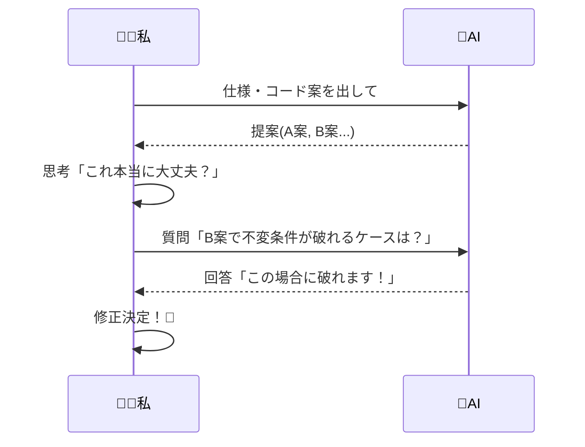

# 第20章：AIの使いどころ（設計の補助輪）🤖🚲

## 🎯 この章のゴール


この章が終わったら、こんな状態になってるのが理想だよ〜！🌸

* AIに投げる“質問の型”を持ってる 📝✨
* AIの出力を「設計の材料」に変換できる（丸呑みしない）🍳
* DDDで大事なポイント（不変条件・境界・依存）をAIレビューに混ぜ込める 🔒🧩
* 失敗パターン（AIに振り回される）を回避できる 🚧😵‍💫

---

## 🆕 2026/02/07 時点：AIコーディング周りの「いま」🌏✨

最近の流れ、ざっくりこうなってるよ👇

* 「エディタのチャット」には、**Agent / Plan / Ask みたいな“役割（エージェント）切替”**が入ってきてるよ（複雑タスクは Agent、まず計画は Plan、質問は Ask みたいに）🤖🧠 ([Visual Studio Code][1])
* エージェントが“道具（ツール）”も呼べる方向に進んでて、**MCP（外部ツール連携）**みたいな拡張も入ってるよ🧰🔗 ([Visual Studio Code][1])
* GitHub側でも、**タスクを渡すとエージェントが変更してPRを作り、レビュー依頼してくる**みたいな形が出てきてるよ（AIが「手を動かす」フェーズが強い）🧑‍💻➡️🤖➡️PR ([GitHub Docs][2])
* コードレビューもAIが賢くなってて、**tool calling**や**ESLint/CodeQL**みたいな“検知”と組み合わせる流れがあるよ🔎🛡️ ([The GitHub Blog][3])
* そして OpenAI も **GPT-5.3-Codex（2026/02/05発表）**みたいに「長めの作業・ツール利用・複雑タスク」寄りを強めてるよ🧠⚙️ ([OpenAI][4])

> つまりね：
> **「AIにコードを書かせる」だけじゃなくて、AIが“計画→実装→レビュー→反復”まで触りにくる時代**って感じ！🌪️✨
> だからこそ、**人間側が“設計のハンドル”を握る型**が超大事になるよ〜🚗💨

---

## 1️⃣ AIを「補助輪」にする3原則 🛟✨


AIをうまく使うコツ、まずこれだけ覚えとけばOK🙆‍♀️💕

## 原則A：AIに渡すのは「答え」じゃなくて「材料」🥕🧅

AIの出力は、だいたいこの3種類に分けると安全！

* ✅ **列挙**：イベント候補、例外ケース、質問リスト
* ✅ **翻訳**：曖昧な仕様 → テストできる文に直す
* ✅ **比較**：案A/Bのメリデメ、依存や責務の違い

逆に、これをAIに任せると事故りやすい⚠️

* ❌ 最終仕様の決定（曖昧なまま決め打ちされる）
* ❌ ルールの正しさ（“それっぽい嘘”が混ざる）
* ❌ 境界（どこまでがドメインか）をAIに丸投げ

---

## 原則B：「制約」を先に渡すと、AIが暴れない🧷😌


設計で一番大事なのって、実は「何をしないか」なんだよね✂️
AIは放っておくと、勝手に盛り始めるから…😂🍰

なので **先に制約**👇

* 例：状態は Draft / Confirmed / Paid / Fulfilled のみ
* 例：支払い後は明細変更禁止（不変条件）
* 例：ドメイン層は外部I/O知らない
* 例：エラーはドメイン例外で表現する

---

## 原則C：「レビュー項目」を固定すると、理解が浅くならない🧠🔒


AIに何度も同じ観点でレビューさせると、学習が速いよ〜📈✨
（“その場しのぎ質問”より強い💪）

後でテンプレ渡すね📝💕

---

## 2️⃣ 使いどころマップ：DDD学習でAIが効く瞬間 ⚡🤖


DDDの流れに沿って、AIが効くところを「いつもの手順」にしちゃおう！

* 🗣️ **言葉づくり**：用語の揺れチェック、定義の短文化
* ⚡ **イベント列挙**：抜けがちな出来事を足してもらう
* 🚦 **状態と遷移**：許可/禁止表を作ってもらう
* 🔒 **不変条件**：曖昧さ（例外条件の欠落）を突いてもらう
* 🧩 **境界の匂い**：モジュール案を2〜3出させて比較
* 🧪 **テスト**：Given/When/Then のケース増殖（特に異常系）
* 🧹 **リファクタ**：責務の混ざり・命名のブレを指摘させる

---

## 3️⃣ コピペで使える！「質問テンプレ」5点セット 📝✨

ここが第20章の核だよ〜！🤖🚲💕

### ✅ テンプレ0：最強の前置き（暴走防止）🧷

まず最初にこれを付けるだけで、だいぶ安定するよ✨

```text
あなたは「設計レビュー担当」です。
次の条件を守って回答してね：
- 仕様を勝手に増やさない（不明点は質問にする）
- まず不変条件を列挙してから提案する
- 境界（ドメイン/アプリ/インフラ）の混線を指摘する
- 出力は「箇条書き＋理由（1行）」で
```

---

### ✅ テンプレ1：仕様を“テストできる文章”にする 🧾✅

```text
次の仕様を Given/When/Then に直して。
その後に「不足している前提条件の質問」を5個出して。

仕様：
（ここに1〜3行で貼る）
```

---

### ✅ テンプレ2：不変条件を抽出する 🔒📏

```text
この仕様（またはユースケース説明）から
「絶対に破ってはいけないルール（不変条件）」を列挙して。
各不変条件に対して：
- 破られたら何が困る？
- どの状態なら適用される？
も1行ずつ書いて。

仕様：
（貼る）
```

---

### ✅ テンプレ3：状態遷移表を作る 🚦

```text
状態を列挙して、遷移の「許可/禁止」を表にして。
禁止遷移は理由も1行で。

状態候補：
（例：Draft / Confirmed / Paid / Fulfilled）

イベント候補：
（例：confirm / pay / fulfill / cancel）
```

---

### ✅ テンプレ4：DDDレビュー（毎回これ）🧩🛡️

```text
次のコード（または設計案）をDDD観点でレビューして。
出力は「指摘 → なぜダメ → 直し方」の順で。

チェック観点：
1) 不変条件が守られてる？
2) 状態変更がメソッドに閉じてる？（setStatus禁止）
3) ドメインが外部I/OやDBに依存してない？
4) 命名がユビキタス言語に揃ってる？
5) 例外ケースが漏れてない？
```

---

## 4️⃣ “理解が浅くならない”AI活用ルール 🤝🧠

ここ、ほんと大事！✨
AIを使うほど伸びる人って「手順」があるよ〜！

## ✅ ルール1：AIに書かせたら、必ず「質問に戻す」🔁


AIの答えを読んだら、最後に自分でこう聞く：

* 「この提案が壊れる反例は？」😈
* 「不変条件を1つ破るとどうなる？」💥
* 「境界が混ざるとどんな保守地獄？」🌀
* 「別案（A/B）で比較すると？」⚖️

**“答え”で終わらせず、必ず“問い”で締める**のがコツ🧠✨



---

## ✅ ルール2：AIが触れる範囲が広いほど、レビューは強くする 👀


最近は「エージェントがPRを作る」みたいな流れもあるから、
**差分レビュー（diff）を見るクセ**が超重要だよ〜！🔍✨ ([GitHub Docs][2])

---

## ✅ ルール3：秘密情報は渡さない（設定も確認）🔐

AIチャットは便利だけど、データの扱いは“設定と契約”に依存するところがあるから、**個人設定・組織設定の方針は必ず確認**してね🧾
たとえば GitHub は「個人サブスクでは、デフォルトでプロンプトやコード断片等を学習に使わない」方針を明記してるよ📌 ([GitHub Docs][5])
（とはいえ、秘密は貼らないのが一番安全！🙅‍♀️🔒）

---

## 5️⃣ 例題でやってみよう：AIと一緒に“設計を固める” ☕🧾🤖

ここからミニ演習だよ〜！🎮✨
題材は「カフェ注文」の中の **支払い（PayOrder）**にしよ💳☕

## Step 1：仕様を1〜3行に圧縮する 🧾✂️

まず人間が短くするのがポイント！（AIに全部説明しない）

例：

* 注文は Confirmed のときだけ支払いできる
* 支払いが成功したら Paid になる
* Paid になったら明細は変更できない

この短文をテンプレ1に投げる👉（Given/When/Then化）🧪✨

---

## Step 2：不変条件を固める 🔒

テンプレ2で不変条件を出してもらうと、だいたいここが見つかるよ👇

* 「支払いは1回だけ」🔁🚫
* 「支払い後は明細変更禁止」🧾🚫
* 「合計金額が0円は禁止」💴🚫（もしルールにするなら！）
* 「存在しない注文は支払えない」👻🚫

ここで人間の仕事は、**“採用/不採用”を決めること**🙆‍♀️✍️
AIが出したのを全部採用すると、設計が太るよ😂🍔

---

## Step 3：状態遷移を表にする 🚦

テンプレ3で表を作らせる→自分で見直す✨
ここで「禁止遷移の理由」が言語化されると、後でコードが守りやすいよ🔒🛡️

---

## Step 4：コード骨格はAIに、ルールは自分に 🦴🧠

AIには「骨格だけ」頼むのが安全だよ！

```text
Order集約に pay() を追加するためのTypeScriptの骨格だけ作って。
ただし：
- 不変条件の中身はTODOコメントにして
- 外部決済APIの呼び出しはしない（アプリ層の責務）
- 状態は enum か union で表現して
```

骨格が出たら、人間は **TODOを不変条件で埋める**🔒✍️
ここが学びポイント！✨

---

## Step 5：テストケースをAIで増やす 🧪💥

Given/When/Then の“異常系”はAIが得意！
たとえば：

* Confirmed じゃないのに pay したら？😈
* すでに Paid なのに pay したら？🔁
* 合計金額と明細が一致しない状態が来たら？🧾💥
* 期限切れがあったら？⏰（仕様に入れるなら）

---

## 6️⃣ 事故りがちなパターン集（回避法つき）😂⚠️

最後に「やりがち」を潰しておくよ〜！

## ⚠️ パターンA：AIが勝手に“仕様を追加”する

✅ 回避：テンプレ0（仕様増やすな）＋「不明点は質問」ルール

## ⚠️ パターンB：AIがそれっぽい嘘を混ぜる

✅ 回避：「反例を3つ出して」＋「禁止遷移の理由を書け」

## ⚠️ パターンC：AIコードが“境界を破る”

✅ 回避：DDDレビュー（テンプレ4）を毎回やる
（ドメインが外部I/O触ってたら即アウト〜🙅‍♀️）

## ⚠️ パターンD：AIに任せすぎて“自分の理解が残らない”

✅ 回避：「TODOは自分で埋める」「最後に自分で説明文を書く」✍️✨
→ **“説明できる＝理解してる”**だよ〜🎤💖

---

## 7️⃣ 小課題（10〜20分）🎓✨

### 課題1：あなた専用の「DDDレビューSkill」を作る🧰

最近はエージェントに“追加知識（Skill）”を教える流れもあるよ📁✨ ([Visual Studio Code][6])
なので、プロジェクトに「DDDレビュー観点」を固定する文章を1枚作ってみて！

（例：不変条件・境界・命名・依存方向・例外の作法 など）

### 課題2：テンプレ4でレビュー→指摘を3つ直す🔧

直したらもう一回レビューさせて、指摘が減るか確認👀✨

### 課題3：状態遷移表を“禁止理由つき”で完成させる🚦

禁止理由が言えたら勝ち！🎉

---

## まとめ 🎀

この章の結論はこれ！💡

* AIは「答え」じゃなくて「設計の補助輪」🚲
* **テンプレ（目的/制約/例/NG/出力形式）**を持つと暴走しない🧷
* DDDで一番大事な **不変条件・境界・依存** をレビュー観点に固定すると、AIを使うほど理解が深くなる🧠✨
* エージェントが強くなるほど、**人間のレビューが価値**になる🔍💖

---

* [The Verge](https://www.theverge.com/news/873665/github-claude-codex-ai-agents?utm_source=chatgpt.com)
* [TechRadar](https://www.techradar.com/pro/github-integrates-claude-and-codex-ai-coding-agents-directly-into-github?utm_source=chatgpt.com)
* [The Verge](https://www.theverge.com/news/669339/github-ai-coding-agent-fix-bugs?utm_source=chatgpt.com)

[1]: https://code.visualstudio.com/docs/copilot/chat/copilot-chat "Get started with chat in VS Code"
[2]: https://docs.github.com/en/copilot/concepts/agents/coding-agent/about-coding-agent "About GitHub Copilot coding agent - GitHub Docs"
[3]: https://github.blog/changelog/2025-10-28-new-public-preview-features-in-copilot-code-review-ai-reviews-that-see-the-full-picture/ "New public preview features in Copilot code review: AI reviews that see the full picture - GitHub Changelog"
[4]: https://openai.com/index/introducing-gpt-5-3-codex/ "Introducing GPT-5.3-Codex | OpenAI"
[5]: https://docs.github.com/copilot/how-tos/manage-your-account/managing-copilot-policies-as-an-individual-subscriber "Managing GitHub Copilot policies as an individual subscriber - GitHub Docs"
[6]: https://code.visualstudio.com/updates/v1_108 "December 2025 (version 1.108)"
