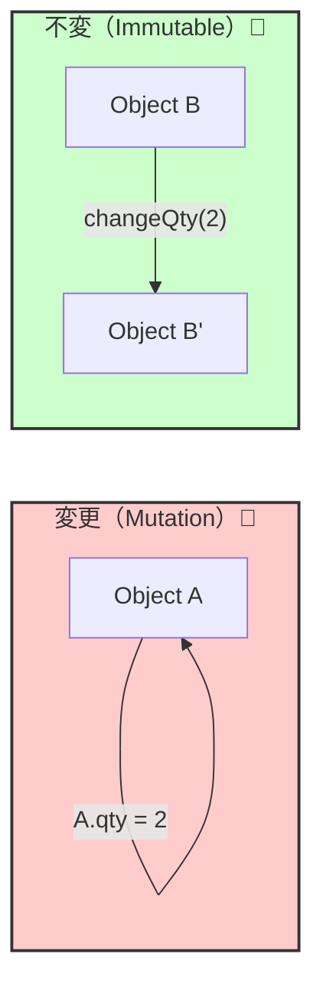

# 第21章：不変（immutable）の基礎：変更より生成🧊

## 0) 2026年の“いま”メモ（超短く）🗓️

* 直近の安定版 TypeScript は **5.9** と案内されています。([TypeScript][1])
* そして **TypeScript 7 の Native Preview**（高速化の流れ）も進行中です。([Microsoft Developer][2])
  👉 ただし、**不変（immutable）を作る基本の道具（readonly / Readonly / as const / satisfies）**はこの流れでも引き続き超重要です💪✨

---

## 1) この章のゴール🎯✨

この章を終えると、こうなります👇

* 「変更（mutation）」がどこで起きるかを**見抜ける**👀
* TypeScriptで“不変っぽく”じゃなく、**ちゃんと不変に寄せる書き方**ができる🧊
* DDDで超大事な **Value Object（VO）** を「不変で作るのが当たり前」になる💎
* **配列・オブジェクトの参照漏れ**（地味にヤバい）を防げる🕳️🚫

---

## 2) まず“変更”ってなに？（ここをズラすと全部ズレる）⚠️

「変更」とは、ざっくり言うと👇

* **同じインスタンス（同じ箱）**の中身を書き換えること📦✍️
* つまり「参照を持ってる別の誰か」にも影響しちゃうこと😇💥

例：やりがち変更（mutation）たち👇

```ts
const items = [{ name: "Latte", qty: 1 }];

// ❌ 配列に追加（push）
items.push({ name: "Mocha", qty: 1 });

// ❌ 要素の中身を書き換え
items[0].qty = 2;
```

これ、どこが怖いかというと…
**“別の場所が同じ items を見てたら” 勝手に変わる**んです😱

---

## 3) 不変（immutable）の基本ルール🧊


不変の基本はめっちゃシンプル👇

> ✅ **変更しない**
> ✅ **変えたいなら新しく作る（生成する）**

図でイメージすると、こう違うよ👇



### 不変にすると何が嬉しいの？🎁

* バグが減る（特に“あとから勝手に変わった系”）🐛🚫
* テストが楽（前提が壊れない）🧪✨
* DDDのVOにピッタリ（VOは “値” なので変えないのが自然）💎

---

## 4) TypeScriptで不変に寄せる“道具箱”🧰✨

### 4.1 `readonly`（まずはこれ）🔒


プロパティを「再代入禁止」にできます。

```ts
class Money {
  public readonly amount: number;

  constructor(amount: number) {
    this.amount = amount;
  }
}

const m = new Money(100);
// m.amount = 200; // ❌ コンパイルで止まる
```

ただし注意⚠️
`readonly` は **TypeScriptの型チェック上の禁止**であって、実行時に凍るわけじゃないです（ランタイム強制ではない）🧊💭

---

### 4.2 `Readonly<T>`（オブジェクト全体をreadonly化）🧊

TypeScript公式の Utility Type です。([TypeScript][3])

```ts
type OrderDraft = {
  id: string;
  items: { name: string; qty: number }[];
};

type ReadonlyOrderDraft = Readonly<OrderDraft>;
```

ただしこれも「浅い（shallow）」ことが多いです⚠️
`items` の中身までは凍らない、みたいな罠が出ます（後で対策するよ）🕳️

---

### 4.3 `ReadonlyArray<T>`（配列を“変更不可”として扱う）📦🚫


「push/spliceできない配列」として扱えます。

```ts
const xs: ReadonlyArray<number> = [1, 2, 3];
// xs.push(4); // ❌
```

---

### 4.4 `as const`（“定数っぽさ”を一気に上げる）🧊✨


`as const` はリテラル型を保ちつつ、オブジェクトや配列のプロパティを readonly に寄せます。([Zenn][4])

```ts
const STATUS = ["Draft", "Confirmed", "Paid"] as const;
// type: readonly ["Draft","Confirmed","Paid"]
type OrderStatus = typeof STATUS[number]; // "Draft" | "Confirmed" | "Paid"
```

DDD的には「状態」「種類」「コード表」みたいなところに超効きます💪🧡

---

### 4.5 `satisfies`（型チェックだけして、推論は潰さない）✅✨


`satisfies` は TypeScript 4.9 で入った機能です。([TypeScript][5])
「型に合ってるかは見たい、でも推論の“具体性”は残したい」時に最高です😍

```ts
type MenuItem = {
  code: string;
  price: number;
};

const MENU = {
  latte: { code: "LATTE", price: 450 },
  mocha: { code: "MOCHA", price: 500 },
} satisfies Record<string, MenuItem>;
```

**`as const` + `satisfies`** は「不変っぽい定義」を作る鉄板コンボです🧊✨

---

## 5) DDDで“不変”が刺さるポイント🎯💎

### 5.1 Value Object（VO）は“不変がデフォ”💎


VOは「値そのもの」なので、変更じゃなくて“新しい値”を作るのが自然です。

例：`Money.add()` はこう👇

```ts
class Money {
  private constructor(public readonly amount: number) {}

  static create(amount: number): Money {
    if (!Number.isInteger(amount)) throw new Error("amount must be integer");
    if (amount < 0) throw new Error("amount must be >= 0");
    return new Money(amount);
  }

  add(other: Money): Money {
    return Money.create(this.amount + other.amount); // ✅ 新規生成
  }
}
```

---

### 5.2 「配列の参照漏れ」が集約を壊す😵‍💫


集約の中に `items: LineItem[]` があって、それを **外にそのまま返す**と…

* 外側が `push()` できちゃう
* 集約の不変条件が破られる
* しかも気づきにくい（最悪）😇💥

対策はこの章の後半でガッツリやります🛡️✨

---

## 6) 例題（カフェ注文）で“不変の型”を作ってみる☕🧾

ここからは「変更より生成」を体で覚えるパートです💪😺

### 6.1 まずVO：Quantity（数量）📏

```ts
class Quantity {
  private constructor(public readonly value: number) {}

  static create(value: number): Quantity {
    if (!Number.isInteger(value)) throw new Error("qty must be integer");
    if (value <= 0) throw new Error("qty must be > 0");
    return new Quantity(value);
  }

  add(other: Quantity): Quantity {
    return Quantity.create(this.value + other.value); // ✅ 新規生成
  }
}
```

### 6.2 VO：OrderLine（明細）🧾💎

「明細」はVO寄り（今回は同一性より“値”で扱う）にしてみます✨

```ts
class OrderLine {
  private constructor(
    public readonly menuCode: string,
    public readonly qty: Quantity,
    public readonly unitPrice: Money,
  ) {}

  static create(menuCode: string, qty: Quantity, unitPrice: Money): OrderLine {
    if (!menuCode.trim()) throw new Error("menuCode required");
    return new OrderLine(menuCode, qty, unitPrice);
  }

  subtotal(): Money {
    return Money.create(this.qty.value * this.unitPrice.amount);
  }

  changeQty(newQty: Quantity): OrderLine {
    return OrderLine.create(this.menuCode, newQty, this.unitPrice); // ✅ 新規生成
  }
}
```

---

## 7) “集約っぽいOrder”を、不変スタイルで作る🏯🧊

DDDでは集約は「手続きの途中で内部状態を更新する」設計も多いけど、学習ではまず👇が超わかりやすいです✨

> ✅ メソッドを呼ぶと **新しい Order が返ってくる**
> ✅ 古い Order は変わらない（壊れない）

### 7.1 Order（Draft）を作る

```ts
type OrderStatus = "Draft" | "Confirmed" | "Paid";

class Order {
  private constructor(
    public readonly id: string,
    public readonly status: OrderStatus,
    private readonly lines: ReadonlyArray<OrderLine>,
  ) {}

  static create(id: string): Order {
    if (!id.trim()) throw new Error("id required");
    return new Order(id, "Draft", []);
  }

  // ✅ 外へは “読み取り専用” で返す（参照漏れ防止）
  getLines(): ReadonlyArray<OrderLine> {
    return this.lines;
  }

  total(): Money {
    return this.lines.reduce(
      (acc, line) => acc.add(line.subtotal()),
      Money.create(0),
    );
  }

  addLine(line: OrderLine): Order {
    if (this.status !== "Draft") throw new Error("cannot edit after confirmed");
    // ✅ 新しい配列を作る（pushしない）
    return new Order(this.id, this.status, [...this.lines, line]);
  }

  confirm(): Order {
    if (this.status !== "Draft") throw new Error("already confirmed");
    if (this.lines.length === 0) throw new Error("empty order");
    return new Order(this.id, "Confirmed", this.lines);
  }

  pay(): Order {
    if (this.status !== "Confirmed") throw new Error("must be confirmed");
    return new Order(this.id, "Paid", this.lines);
  }
}
```

ポイントはここ😍👇

* `lines` は `ReadonlyArray`
* `addLine` で `push` じゃなく **`[...this.lines, line]`**
* 状態が変わっても **新しいOrderを返す**

---

## 8) テストで「古いインスタンスが変わってない」を確認🧪✨

テストフレームワークは Vitest がモダン寄りで伸びていて、Vitest 4 のアップデートも出ています。([Vitest][6])
（ここでは“書き方の型”が目的なので、テストの形だけ掴めればOKだよ〜😺）

```ts
import { test, expect } from "vitest";

test("addLine returns new Order and does not mutate old one", () => {
  const order1 = Order.create("order-1");
  const line = OrderLine.create(
    "LATTE",
    Quantity.create(1),
    Money.create(450),
  );

  const order2 = order1.addLine(line);

  expect(order1.getLines().length).toBe(0); // ✅ 古い方は変わらない
  expect(order2.getLines().length).toBe(1); // ✅ 新しい方だけ増える
});
```

---

## 9) よくあるハマりどころ（ここで事故る人が多い）😂⚠️

### 9.1 `readonly` を付けたのに“中身が変わる”

```ts
type X = { readonly items: { n: number }[] };

const x: X = { items: [{ n: 1 }] };
// x.items = [];     // ❌ これは止まる
x.items[0].n = 99;   // 😇 これは止まらない（浅いreadonly）
```

✅ 対策の考え方

* 「外に出す時は `ReadonlyArray`」
* 「中身も不変にしたいなら、要素型もVOにする」💎
* 「DeepReadonly は“必要な境界だけ”で使う」🧊

---

### 9.2 `Object.freeze()` すればOK？（半分OK、半分罠）🧊

`Object.freeze()` は基本 **浅い**ので、ネストした中身は普通に変わります⚠️
（学習では「型 + 設計（参照漏れ防止）」を主戦力にするのが安定です💪）

---

### 9.3 “DTOにドメイン配列をそのまま渡す”😵‍💫

UI/外部に渡した瞬間、参照が漏れやすいです。
✅ 「DTOはDTO用の形に詰め直す」＝境界を守る第一歩📦✨

---

## 10) AIの使いどころ（不変はAIと相性いい）🤖💞

### 10.1 “変更点ハンター”にする👀

こんな依頼が効きます👇

* 「このファイルで mutation してる場所を全部列挙して。push/splice/代入/破壊的メソッドも含めて」
* 「全部、非破壊（immutable）に直す案を3パターン出して」

### 10.2 “参照漏れレビュー”にする🕵️‍♀️

* 「Aggregateの内部コレクションが外へ漏れてないかレビューして」
* 「getter/setterの設計が不変条件を壊さないか見て」

### 10.3 “テスト観点ジェネレータ”にする🧪

* 「このOrderの不変条件をGiven/When/Thenでテスト観点にして。異常系も忘れずに」

---

## 11) 演習（手を動かすと一気に身につくよ）✍️🎓

### 演習A：mutable → immutable 変換🧊

次のコードを「不変スタイル」に直してね👇

```ts
type Cart = { items: { code: string; qty: number }[] };

function addItem(cart: Cart, code: string) {
  cart.items.push({ code, qty: 1 });
}
```

✅ 目標：`addItem(cart)` が **新しいcart** を返す

---

### 演習B：Moneyに `subtract` を追加💴

* `0未満` を禁止（不変条件）🔒
* 成功時は新しい Money を返す🧊

---

### 演習C：Orderの「外部に返す形」をDTOにする📦

* `Order` を受け取って
* `{ id, status, totalAmount, lines: [...] }` を返す
* ドメインオブジェクトをそのまま露出させない✨

---

## 12) まとめ🧡✨

* 不変は「変更しない」じゃなくて **“変えたいなら生成”** 🧊
* TypeScriptでは `readonly` / `Readonly<T>` / `ReadonlyArray` / `as const` / `satisfies` が武器💪

  * `Readonly<T>` は公式Utility Typeだよ([TypeScript][3])
  * `satisfies` は “型チェックだけして推論は残す” ができるよ([TypeScript][5])
* DDDでは特に **VOは不変が自然**、集約は **参照漏れを絶対に防ぐ** のが超大事🏯🛡️

---

## 次章チラ見せ👀✨

次は **「プリミティブ地獄から脱出」**（IDや金額を専用型で守る）に進みます🧱➡️💎
不変ができてると、ここが一気にラクになりますよ〜😺💕

[1]: https://www.typescriptlang.org/download/?utm_source=chatgpt.com "How to set up TypeScript"
[2]: https://developer.microsoft.com/blog/typescript-7-native-preview-in-visual-studio-2026?utm_source=chatgpt.com "TypeScript 7 native preview in Visual Studio 2026"
[3]: https://www.typescriptlang.org/docs/handbook/utility-types.html?utm_source=chatgpt.com "Documentation - Utility Types"
[4]: https://zenn.dev/tonkotsuboy_com/articles/typescript-as-const-satisfies?utm_source=chatgpt.com "TypeScript 4.9のas const satisfiesが便利。型チェックと ..."
[5]: https://www.typescriptlang.org/docs/handbook/release-notes/typescript-4-9.html?utm_source=chatgpt.com "Documentation - TypeScript 4.9"
[6]: https://vitest.dev/blog/vitest-4?utm_source=chatgpt.com "Vitest 4.0 is out!"
