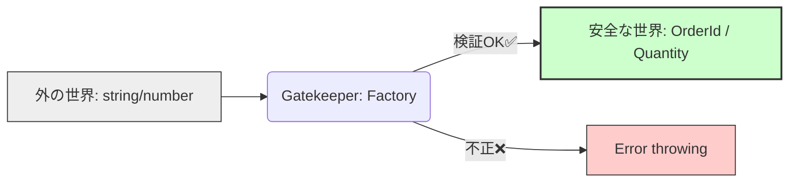

# 第22章：型で守る：プリミティブ地獄から脱出🧱

## 0. 今日のゴール🎯✨

この章が終わったら、こんな状態になれるよ〜💪🥰

* 「`string` が多すぎて怖い…😵‍💫」を卒業できる
* `OrderId` と `MenuItemId` を **間違って渡す事故**を **コンパイルで止められる**🛑
* `Money` や `Quantity` みたいな「意味のある値」を **型として残せる**💎
* **“型はコメントじゃない”**＝守ってくれるルールになる🛡️✨

---

## 1. プリミティブ地獄ってなに？🫠

DDDっぽい現場あるあるなんだけど……

* IDも `string`
* 金額も `number`
* 個数も `number`
* 状態も `string`

みたいに、**全部がプリミティブ**だと、意味がコードから消えるの🥲💨

## よく起きる事故😇（コンパイル通っちゃう）

* `orderId` を渡すべき所に `menuItemId` を渡した
* `yen` のはずが `point` を足した
* 個数 `quantity` のはずが金額 `price` を入れた
* 「IDは空文字禁止」のはずが、`""` が通る

こういうの、**テストで気づければマシ**で、最悪は本番で発覚💣😭

---

## 2. まずは“事故るコード”を見よう☕🧾💥

たとえば、こんな関数があるとするね👇

```ts
function addItem(orderId: string, menuItemId: string, quantity: number) {
  // ...
}
```

これ、呼び出し側がこうやっても……

```ts
const orderId = "ORD-001";
const menuItemId = "MENU-777";

addItem(menuItemId, orderId, 999); // 😇入れ替わってるのに通る
```

**TypeScript は止められない**の🥹（だって全部 `string/number` だから）

---

## 3. 脱出の方針はこれ！🛟✨（3段階で強くする）

## レベル1：ただの type alias（弱い）🥺

```ts
type OrderId = string;
type MenuItemId = string;
```

これ、**意味としては良い**んだけど、TypeScript的には同じ `string` 扱いなので、**入れ替え事故は止まらない**😢

---

## レベル2：Branded Type（おすすめ！）💎✨

TypeScriptは基本「構造的型付け」だから、**同じ形（string）なら同じ型**に見えちゃうのね。
そこで「ブランド（タグ）」を付けて、擬似的に「名前的型付け」っぽくするよ🪪✨ ([Zenn][2])

### ✅ まずは “Brand” の型を作る

```ts
type Brand<T, BrandName extends string> = T & { readonly __brand: BrandName };
```

### ✅ 具体的なドメイン型を作る

```ts
type OrderId = Brand<string, "OrderId">;
type MenuItemId = Brand<string, "MenuItemId">;

type Yen = Brand<number, "Yen">;
type Quantity = Brand<number, "Quantity">;
```

これで `OrderId` と `MenuItemId` は **別物**になるよ🛡️✨

---

## 4. でも注意！型は実行時に消える👻

ここ超大事〜！！⚠️

TypeScriptの型は **コンパイル後に消える**から、
実行時に `""` とか `-100` とかを防ぐには、**生成時のチェック（Factory）**が必要だよ🔒✨

---

## 5. “as OrderId” をばらまかないで！🙅‍♀️

ブランド型って、雑にこうすると一瞬で終わるんだけど……

```ts
const orderId = "ORD-001" as OrderId; // 😇はい危険
```

これだと「チェックなしで変換できちゃう」から、意味がなくなるの🥲

👉 **変換は必ず1箇所（Factory）に閉じ込める**のが鉄則だよ🏰✨



---

## 6. 実装してみよう：IDのFactory🆔✨

## 6.1 OrderId / MenuItemId を安全に作る

```ts
type Brand<T, BrandName extends string> = T & { readonly __brand: BrandName };

type OrderId = Brand<string, "OrderId">;
type MenuItemId = Brand<string, "MenuItemId">;

class DomainError extends Error {
  constructor(message: string) {
    super(message);
    this.name = "DomainError";
  }
}

const OrderId = {
  from(raw: string): OrderId {
    if (!/^ORD-\d{3,}$/.test(raw)) {
      throw new DomainError("注文IDの形式が不正だよ🥲 (例: ORD-001)");
    }
    return raw as OrderId; // ✅ ここだけで使う
  },
};

const MenuItemId = {
  from(raw: string): MenuItemId {
    if (!/^MENU-\d{3,}$/.test(raw)) {
      throw new DomainError("商品IDの形式が不正だよ🥲 (例: MENU-777)");
    }
    return raw as MenuItemId; // ✅ ここだけ
  },
};
```

## 6.2 事故がコンパイルで止まるのを体験しよ🛑✨

```ts
function addItem(orderId: OrderId, menuItemId: MenuItemId, quantity: number) {
  // ...
}

const orderId = OrderId.from("ORD-001");
const menuItemId = MenuItemId.from("MENU-777");

addItem(orderId, menuItemId, 1); // ✅ OK
addItem(menuItemId, orderId, 1); // ❌ コンパイルエラーになる🎉
```

この「**間違えたら赤線が出る**」が、プリミティブ脱出の快感だよ〜🥳💕

---

## 7. 金額・数量も“意味のあるnumber”にしよ💴📏✨

## 7.1 Yen（円）VOの入口（ブランド版）

```ts
type Yen = Brand<number, "Yen">;

const Yen = {
  from(raw: number): Yen {
    if (!Number.isInteger(raw)) throw new DomainError("金額は整数にしてね🙏");
    if (raw < 0) throw new DomainError("金額はマイナス不可だよ🙅‍♀️");
    return raw as Yen;
  },
  add(a: Yen, b: Yen): Yen {
    return (a + b) as Yen;
  },
};
```

## 7.2 Quantity（個数）

```ts
type Quantity = Brand<number, "Quantity">;

const Quantity = {
  from(raw: number): Quantity {
    if (!Number.isInteger(raw)) throw new DomainError("数量は整数だよ🙏");
    if (raw <= 0) throw new DomainError("数量は1以上だよ🙂");
    if (raw > 99) throw new DomainError("数量が多すぎるよ😵‍💫（最大99）");
    return raw as Quantity;
  },
};
```

---

## 8. “境界”ではプリミティブで受けて、ドメインで変換🧱🚪✨

ここがDDDっぽいキレイな流れだよ〜🥰

* 外から来る入力（UI/API/DB）＝プリミティブ
* ドメインに入る瞬間に **Factoryで変換＆検証**
* ドメイン内部は **ブランド型だけで会話**

## 例：入力DTO → ドメイン変換

```ts
type AddItemInputDto = {
  orderId: string;
  menuItemId: string;
  quantity: number;
};

function addItemUseCase(input: AddItemInputDto) {
  const orderId = OrderId.from(input.orderId);
  const menuItemId = MenuItemId.from(input.menuItemId);
  const quantity = Quantity.from(input.quantity);

  // ここから先は “安全な世界”🌈
  // addItem(orderId, menuItemId, quantity)
}
```

---

## 9. satisfies で「設定ミス」を早めに炙り出す🧯✨

この章のテーマ（型で守る）と相性いい小技！
`satisfies` は「型に合ってるかだけチェックして、推論はそのまま残す」やつだよ🧠✨ ([TypeScript][3])

```ts
type PriceTable = Record<string, number>;

const priceTable = {
  "MENU-777": 480,
  "MENU-123": 350,
  // "MEN-999": 999, // 👈 typoがあると気づきやすい
} satisfies PriceTable;
```

---

## 10. ミニ演習🎓💕（カフェ注文ドメイン）

## 演習A（基本）☕

次の4つをブランド型＋Factoryで作ってみてね👇

* `CustomerId`
* `OrderId`
* `MenuItemId`
* `Quantity`

✅ ゴール：引数を間違えるとコンパイルで止まること🎉

## 演習B（ちょい実務）💴

`Yen` を導入して、
`subtotal = price * quantity` を「型安全」にしてみてね✨
（`number` の掛け算結果を `Yen` に戻す場所をどこに置く？がポイント👀）

---

## 11. AIの使い方（この章向けテンプレ）🤖🪄

AIはめちゃ便利だけど、**“型の抜け道”も一緒に作りがち**だから、お願いの仕方を固定しよ〜🧷✨

## プロンプト例①（ブランド型の設計案）

* 「`OrderId/MenuItemId/Yen/Quantity` を branded types で設計して。**as キャストをFactory以外で使わない方針**で、Factoryの責務も説明して」

## プロンプト例②（事故例の生成）

* 「プリミティブ地獄で起きるバグ例を10個、カフェ注文ドメインで作って。**コンパイルでは防げない例**にして」

## プロンプト例③（レビュー観点）

* 「このコードで、**ブランド型が形だけ**になってる箇所（Factory外のas、無検証生成、境界の漏れ）を指摘して」

---

## 12. まとめ🎀✨

* プリミティブ乱用は、**意味が消えて事故が増える**😵‍💫
* Type aliasだけだと弱い🥺 → **Branded Typeが効く**💎
* 型は実行時に消える👻 → **Factoryで検証して閉じ込める**🔒
* 境界（DTO）でプリミティブ受け → ドメインで変換が気持ちいい🌈
* `satisfies` で設定系のミスも早めに止められる🧯✨ ([TypeScript][3])

---

次の第23章は「失敗をどう流す？（例外 vs Result型）⚖️」だから、
今日作った `DomainError` や Factory の失敗をどう扱うかがそのまま繋がるよ〜🔁💖

[1]: https://github.com/microsoft/typescript/releases "Releases · microsoft/TypeScript · GitHub"
[2]: https://zenn.dev/farstep/articles/typescript-branded-types?utm_source=chatgpt.com "TypeScript の型安全性を高める Branded Types"
[3]: https://www.typescriptlang.org/docs/handbook/release-notes/typescript-4-9.html?utm_source=chatgpt.com "Documentation - TypeScript 4.9"
