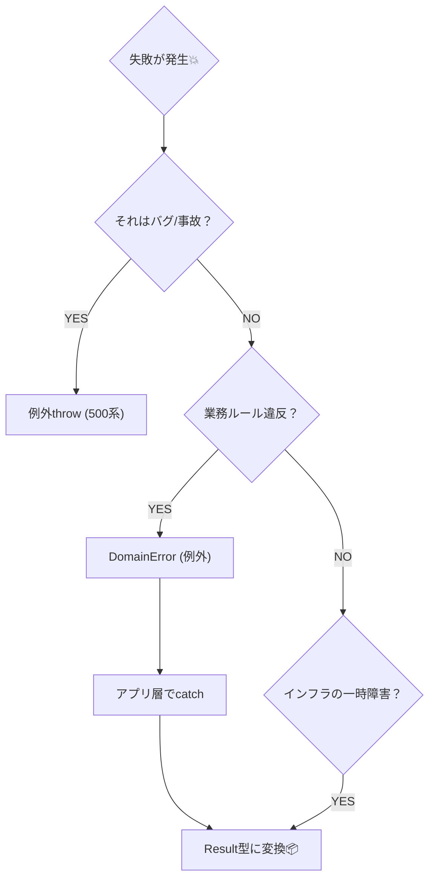

# 第23章：エラーの表現：例外 vs Result型⚖️

この章は「失敗（エラー）を、設計として綺麗に流す」練習だよ〜！😆
DDDって “ルールを守る” のが強みだから、失敗の扱いがフワッとしてると一気に崩れるの🥺💥

---

## 今日のゴール🎯🌸

* ✅ 「想定内の失敗」と「想定外の事故」を分けられるようになる🧠✨
* ✅ **例外（throw）** と **Result型（戻り値）** を、役割で使い分けられる⚖️
* ✅ 「ドメイン → アプリ層 → UI/API」へ、失敗が迷子にならない流れを作れる🛣️

---

## まず結論：この章のおすすめ方針（超大事）📌✨

ロードマップに書いてある方向性を、**初心者でも運用しやすい形**に固定するね！😊

* 🏯 **ドメイン層（Entity/VO/Aggregate）**
  → **不変条件違反は例外（DomainError）で止める**（「その操作はダメ！」を強制）🚫🔥
* 🎬 **アプリ層（UseCase / Application Service）**
  → **Result型で失敗を“型として”返す**（UI/APIへ安全に渡す）📦✅
* 🔌 **インフラ層（DB/HTTPなど）**
  → 例外は起きる前提。アプリ層で拾って **Resultに変換** or **cause付きで包む**🎁🧵

TypeScriptは「投げられる例外の型」をコンパイルで縛れないから、**境界（アプリ層）でResultに整形**すると事故が激減するよ🧡
（TypeScriptに組み込みのResult型が無いので、自前かライブラリが必要、という整理もされてるよ。）([2025.tskaigi.org][1])

---

## 例外とResult型のざっくり比較⚖️📝

| 観点     | 例外（throw）🧨         | Result型（戻り値）📦           |
| ------ | ------------------- | ------------------------ |
| 目的     | “その場で強制停止”          | “失敗も値として運ぶ”              |
| 書きやすさ  | ✅最短（throwで脱出）       | △少しボイラープレート              |
| 型安全    | ❌ throwは型に乗らない      | ✅ `Result<T, E>` で失敗型を固定 |
| 向いてる場所 | ドメインの不変条件、プログラミングミス | アプリ層境界、UI/APIに返す失敗       |
| 事故りやすさ | catch漏れ・握りつぶし😇     | 分岐漏れが減る（型で気づく）✨          |

---

## “失敗”を2種類に分けるのがコツ✂️🧠

### ① 想定内の失敗（Expected）😌

* 入力が不正（数量が0、金額がマイナス）
* 状態が不正（支払い後に明細変更しようとした）
* 見つからない（注文IDが存在しない）

→ **設計として起きていい失敗**。UIに丁寧に返したい💡
👉 アプリ層で **Result** にして返すのが相性◎

### ② 想定外の事故（Unexpected）😱

* DB接続が落ちた
* バグ（null参照、想定しない分岐）
* ライブラリの例外

→ “運用や修正が必要な事故”
👉 ログ/監視向けに情報を残し、UIには一般的なメッセージにする🛠️

---

## 最新JS/TSの「cause」で、原因チェーンを残す🧵🧯✨

最近のJavaScript/Node.jsでは、エラーに「原因（cause）」をぶら下げて **“根っこ原因”を追える**よ！🔍
たとえば「DBエラーを握りつぶさず、上位の意味に包む」みたいな時に強い💪
（`error.cause` の説明はNode公式にもあるよ。）([nodejs.org][2])

---

## 実装①：ドメイン例外（DomainError）を作ろう🏯🔥

「ドメインはルールを守る場所」だから、破ろうとしたら止める！🚫✨

```ts
// domain/errors/DomainError.ts
export abstract class DomainError extends Error {
  abstract readonly code: string;

  constructor(message: string, options?: { cause?: unknown }) {
    super(message);
    this.name = new.target.name;

    // cause を残したいとき（環境によっては ErrorOptions が使える）
    // (ここは最低限の書き方にしておくよ)
    if (options?.cause !== undefined) {
      (this as any).cause = options.cause;
    }
  }
}

// 例：不変条件違反
export class InvariantViolationError extends DomainError {
  readonly code = "INVARIANT_VIOLATION";
}
```

### ✅ ドメイン側で投げる例（Order集約の雰囲気）☕🧾

```ts
// domain/order/Order.ts
import { InvariantViolationError } from "../errors/DomainError";

type OrderStatus = "Draft" | "Confirmed" | "Paid" | "Fulfilled" | "Cancelled";

export class Order {
  private status: OrderStatus = "Draft";

  confirm() {
    if (this.status !== "Draft") {
      throw new InvariantViolationError("下書き状態の注文だけ確定できます");
    }
    this.status = "Confirmed";
  }

  pay() {
    if (this.status !== "Confirmed") {
      throw new InvariantViolationError("確定済みの注文だけ支払いできます");
    }
    this.status = "Paid";
  }
}
```

ここでポイント💡

* ドメインは「正しく使われる前提」で、**守るべきルールを強制**する
* “失敗を返す”より “失敗できないようにする” に寄せるイメージだよ🏯🛡️

---

## 実装②：アプリ層でResult型を返す📦✅

### 1) まずは「最小Result型」自前でOK🙆‍♀️✨

```ts
// app/shared/Result.ts
export type Result<T, E> = Ok<T> | Err<E>;

export type Ok<T> = { ok: true; value: T };
export type Err<E> = { ok: false; error: E };

export const ok = <T>(value: T): Ok<T> => ({ ok: true, value });
export const err = <E>(error: E): Err<E> => ({ ok: false, error });

export const match = <T, E, R>(
  r: Result<T, E>,
  onOk: (v: T) => R,
  onErr: (e: E) => R
): R => (r.ok ? onOk(r.value) : onErr(r.error));
```

### 2) “UIに返すエラー型”をアプリ層で定義する👤📮

**UI向け**は「表示できる形」にしたいから、ドメイン例外をそのまま返さないのがコツ😉✨

```ts
// app/placeOrder/PlaceOrderError.ts
export type PlaceOrderError =
  | { type: "Validation"; message: string; field?: string }
  | { type: "Domain"; code: string; message: string }
  | { type: "Infra"; message: string; retryable: boolean };
```

### 3) UseCaseで「例外→Result」変換する🎬🔁

```ts
// app/placeOrder/PlaceOrderUseCase.ts
import { Result, ok, err } from "../shared/Result";
import { Order } from "../../domain/order/Order";
import { DomainError } from "../../domain/errors/DomainError";
import { PlaceOrderError } from "./PlaceOrderError";

export class PlaceOrderUseCase {
  execute(): Result<"OK", PlaceOrderError> {
    try {
      const order = new Order();
      order.confirm(); // ドメイン例外が起きうる
      // 保存など（ここでは省略）
      return ok("OK");
    } catch (e: unknown) {
      // ドメインの失敗は UI向けに整形して返す
      if (e instanceof DomainError) {
        return err({ type: "Domain", code: e.code, message: e.message });
      }

      // それ以外は想定外（インフラ/バグ）の可能性
      return err({
        type: "Infra",
        message: "ただいま混み合っています。時間をおいて再試行してください🙏",
        retryable: true,
      });
    }
  }
}
```

---

## catchの変数をunknownにする設定は、事故防止の神🧯✨

`catch (e)` の `e` を `unknown` 扱いにすると、**雑に `e.message` しなくなる**ので強い！💪
TSConfigには `useUnknownInCatchVariables` があるよ。([TypeScript][3])

---

## ライブラリを使うなら？（最新状況込み）📚✨

自前でも全然OKだけど、実務だとライブラリもよく使うよ〜😊

### ✅ neverthrow（Result/ResultAsync が揃ってて人気）🎁

* `Result`（同期）と `ResultAsync`（非同期）を提供してるよ。([GitHub][4])
* npmでは **8.2.0** が “Latest” として案内されてる（2025-02-21公開）よ。([npm][5])

> このロードマップではまず自前Resultで感覚を掴んで、必要なら neverthrow に移行、がやりやすいよ🫶

### 🧠 Effect（本格派：エラー専用チャンネルが強い）

「失敗を型で追跡して回復する」思想がめちゃ強い✨（でも学習コストは上がる）
Effectの “Expected Errors” の考え方は参考になるよ。([effect.website][6])

---

## 「例外 vs Result」迷ったときの判断フロー🧭✨

1. **その失敗は、仕様として起きていい？**

   * YES → Resultで返す候補😊
   * NO（バグ・事故）→ 例外で落としてログへ😱
2. **その層はどこ？**

   * ドメイン（不変条件）→ 例外で止める🏯
   * アプリ層（UI/APIに返す）→ Resultで整形📦
3. **呼び出し元が回復できる？**

   * 回復できる → Result
   * 回復できない → 例外 + 監視/ログ

図にするとこんな判断ツリーだね🌳



---

## テストの書き方（Resultはテストしやすいよ）🧪✨

```ts
import { PlaceOrderUseCase } from "./PlaceOrderUseCase";

test("成功したら ok を返す", () => {
  const uc = new PlaceOrderUseCase();
  const r = uc.execute();

  expect(r.ok).toBe(true);
  if (r.ok) {
    expect(r.value).toBe("OK");
  }
});

test("失敗したら err を返す（型で分岐できる）", () => {
  const uc = new PlaceOrderUseCase();
  const r = uc.execute();

  // 例として “失敗系もありうる” 書き方だけ示すね
  if (!r.ok) {
    expect(r.error.type).toBeDefined();
  }
});
```

---

## よくある事故パターン集😂⚠️（ここ超大事！）

* 😇 **例外とResultを同じ関数で混ぜる**（呼ぶ側が地獄）
  → “境界”で変換する、と決めるのが勝ち✨
* 🫥 **catchして握りつぶす**（ログも無い、UIも曖昧）
  → “想定外”は最低限ログへ（detailsは開発者向け）
* 🧨 **throw string / throw {…}**
  → `Error` / `DomainError` に寄せる（causeも残せる）
* 🌀 **全部 ValidationError にする**
  → Domain / Infra / Validation の “種類” を分けて整理🧹

---

## AI活用（Copilot/Codex）で効くプロンプト例🤖💡

そのまま貼ってOKだよ〜✨

* 🧾「このユースケースの失敗パターンを *Expected/Unexpected* に分類して、Resultのエラー型（Union）案を作って」
* 🛡️「ドメインの不変条件として投げるべき例外（DomainError）候補を、Orderの操作ごとに列挙して」
* 🧪「このResult型関数のテストケースを、境界値・異常系中心で10個出して」
* 🔁「例外→Result変換のマッピング表を作って（Domain/Infra/Validation）」

---

## ミニ演習🎓☕✨

1. `Order.pay()` に「Cancelledなら支払い不可」ルールを追加して、DomainErrorを投げてみよう🚫
2. UseCase側でそれを `PlaceOrderError` に変換して返そう📦
3. テストで「CancelledだとDomainエラーになる」を1本書こう🧪

---

## まとめ🎀✨

* 🏯 ドメイン：**不変条件は例外で強制**（ルールの砦！）
* 🎬 アプリ層：**Result型で失敗を型にする**（UI/APIへ安全に渡す）
* 🧵 “cause” を意識すると、運用で「原因追跡」がラクになるよ🔍([nodejs.org][2])
* 📦 Resultは自前でもOK、必要なら neverthrow などへスムーズに移行できるよ✨([GitHub][4])

---

次の第24章は「バリデーションの置き場」だよね📍✨
今日作った “Domain/Validation/Infra” の分け方が、そのまま効いてくるから超つながるよ〜！😊💞

[1]: https://2025.tskaigi.org/talks/majimaccho_?utm_source=chatgpt.com "Result型、自前で書くか、ライブラリ使うか - TSKaigi 2025"
[2]: https://nodejs.org/api/errors.html?utm_source=chatgpt.com "Errors | Node.js v25.6.0 Documentation"
[3]: https://www.typescriptlang.org/tsconfig/ "TypeScript: TSConfig Reference - Docs on every TSConfig option"
[4]: https://github.com/supermacro/neverthrow/blob/master/README.md?utm_source=chatgpt.com "neverthrow/README.md at master"
[5]: https://www.npmjs.com/package/neverthrow?activeTab=dependencies&utm_source=chatgpt.com "neverthrow"
[6]: https://effect.website/docs/error-management/expected-errors/?utm_source=chatgpt.com "Expected Errors"
