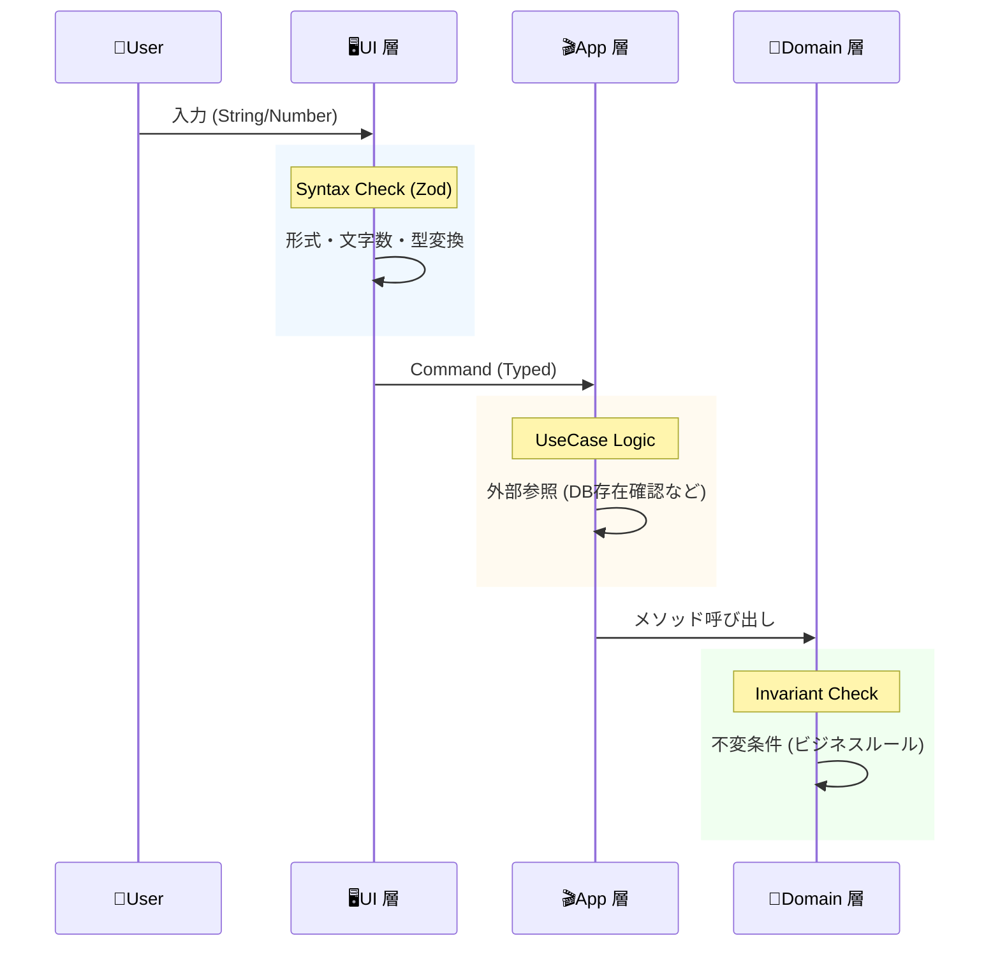

# 第24章：バリデーションの置き場（UI/アプリ/ドメイン）📍

この章で「バリデーション迷子」から卒業します🎓✨
どこに何のチェックを書けばいいかが分かると、**二重実装・抜け漏れ・ルール散らばり**が激減します💪🌸

---

## 0. 最近の前提（さらっと）🆕🧾

* **TypeScript（npm）の最新版**は **5.9.3**（2025-09-30公開）です（2026-02-07時点）。([npm][1])
* 近い将来、TypeScriptはネイティブ化に向けて大きく進んでいて、互換性や移行を意識した流れがあります（Project Corsa / TypeScript 7進捗）。([Microsoft for Developers][2])

この章の内容（どこにルールを置くか）は、TypeScriptのバージョンが進んでもずっと効きます👍✨

---

## 1. まず結論：バリデーションは「3種類」に分けるのがコツ🥣🧩

バリデーションって一言で言うけど、実は **混ぜると事故る3タイプ**があります😵‍💫⚠️

### A. 入力の形チェック（Syntax / Parse）🧾🔍

* 例：必須、文字数、数字に変換できる？、メール形式、日付形式…
* ポイント：**人間が入力する世界のゆらぎ**を吸収する🌪️

### B. ドメイン不変条件（Invariant）🔒💎

* 例：数量は1以上、金額は0以上、支払い後は明細変更不可…
* ポイント：**業務ルールの核**。ここがDDDの心臓🫀✨

### C. ユースケース条件（Use case rule / 外部確認）🎬🧠

* 例：商品IDが存在するか（DB/外部）、クーポンが有効か（外部）、同時注文制限…
* ポイント：**手順や外部との整合**。ドメイン単体では判断できないことが多い📡

---

## 2. 置き場の基本ルール（超大事）📍✨

**置き場＝責務の境界**です🧱🧠
ざっくり、こう覚えてOK👇

* **UI**：入力を「読める形」にする（親切にする）😊🖊️
* **アプリ層（Application）**：ユースケースを成立させる（手順＋外部確認）🎬🔁
* **ドメイン**：絶対守るルールを守る（破れない）🔒🏯

図にするとこんな感じ👇

図にするとこんな感じ👇



---

## 3. 置き場を決める「判定フローチャート」🧭✨

迷ったら、この順でYES/NOしてね😆✅

1. **そのデータは“外”から来た？（フォーム/URL/JSON）**
   → YES：まずUI（またはController）で **Parse/形チェック** 🔍
   → NO：次へ

2. **そのルールは“業務として絶対”？（破れたら成立しない）**
   → YES：**ドメイン**（VO/Entity/Aggregateの中）🔒
   → NO：次へ

3. **外部確認が必要？（DB/他集約/外部API/現在時刻など）**
   → YES：**アプリ層**（ユースケース）🎬
   → NO：次へ

4. **UI都合の親切？（入力補助・表示都合）**
   → YES：UI（例：全角→半角、トリム、ガイド）😊
   → NO：アプリ層寄り（方針としてまとめる）🧠

---

## 4. 例題（カフェ注文）で「どこで何をチェック？」☕🧾✅

### 今回のPlaceOrder（注文作成）で起きがちなチェック

たとえば入力がこう来る👇

* customerName: string（空かも）
* items: [{ menuItemId: string, quantity: numberっぽい何か }]
* note?: string（長すぎるかも）

---

## 5. 実装方針（初心者におすすめ）🌸🧠

この章では、こうします👇

* UI：**スキーマでParse + 形チェック**（例：ZodやValibot）

  * Zodはv4系が安定していて、npmの最新版は4.3.6（2026-01-22時点）です。([npm][3])
  * Valibotも軽量・型安全を売りにしているスキーマライブラリです。([Valibot][4])
* ドメイン：**VO/Entityの生成・操作時に不変条件を守る**🔒
* アプリ層：**外部確認（存在チェック等）＋ユースケースの手順**🎬

（ちなみにZod v4は大きめリリースで改善が入っています。([Zod][5])）

---

## 6. コードで体験しよう（最小DDD）🏗️✨

### 6-1. Result型（失敗を型で返す）📦✅

```ts
export type Result<T, E> =
  | { ok: true; value: T }
  | { ok: false; error: E };

export const ok = <T>(value: T): Result<T, never> => ({ ok: true, value });
export const err = <E>(error: E): Result<never, E> => ({ ok: false, error });
```

---

### 6-2. ドメイン：Value Objectで不変条件を守る💎🔒

#### Quantity（数量は1〜99だけ）

```ts
import { Result, ok, err } from "../shared/Result";

export type QuantityError =
  | { type: "QuantityTooSmall"; min: number }
  | { type: "QuantityTooLarge"; max: number };

export class Quantity {
  private constructor(public readonly value: number) {}

  static create(n: number): Result<Quantity, QuantityError> {
    if (!Number.isInteger(n)) return err({ type: "QuantityTooSmall", min: 1 }); // 簡略
    if (n < 1) return err({ type: "QuantityTooSmall", min: 1 });
    if (n > 99) return err({ type: "QuantityTooLarge", max: 99 });
    return ok(new Quantity(n));
  }
}
```

✅ここ重要：**「数量ルール」はUIにもアプリ層にも置かない**
UIは親切にしてOKだけど、**最後の砦はドメイン**です🏯✨

---

### 6-3. ドメイン：Entity（Order）で「成立条件」を守る☕🧾🔒

```ts
import { Result, ok, err } from "../shared/Result";
import { Quantity } from "../value/Quantity";

type OrderStatus = "Draft" | "Confirmed" | "Paid" | "Cancelled";

export type OrderError =
  | { type: "EmptyOrderNotAllowed" }
  | { type: "CannotConfirmInStatus"; status: OrderStatus };

type LineItem = {
  readonly menuItemId: string;
  readonly quantity: Quantity;
};

export class Order {
  private status: OrderStatus = "Draft";
  private readonly items: LineItem[] = [];

  addItem(menuItemId: string, quantity: Quantity): void {
    // ここは「仕様」に応じて重複を許す/まとめるなどが変わるよ✨
    this.items.push({ menuItemId, quantity });
  }

  confirm(): Result<void, OrderError> {
    if (this.status !== "Draft") {
      return err({ type: "CannotConfirmInStatus", status: this.status });
    }
    if (this.items.length === 0) {
      return err({ type: "EmptyOrderNotAllowed" });
    }
    this.status = "Confirmed";
    return ok(undefined);
  }
}
```

---

### 6-4. アプリ層：外部確認（メニュー存在チェック）🎬🔎

「そのmenuItemIdは存在する？」は、ドメイン単体じゃ分からないことが多いです。
なので **アプリ層でRepositoryに聞く**のが自然✅

```ts
import { Result, ok, err } from "../domain/shared/Result";
import { Quantity } from "../domain/value/Quantity";
import { Order } from "../domain/entity/Order";

export type PlaceOrderError =
  | { type: "MenuItemNotFound"; menuItemId: string }
  | { type: "InvalidQuantity" }
  | { type: "DomainRejected"; detail: unknown };

export type PlaceOrderCommand = {
  customerName: string;
  items: Array<{ menuItemId: string; quantity: number }>;
};

export interface MenuRepository {
  exists(menuItemId: string): Promise<boolean>;
}

export class PlaceOrderService {
  constructor(private readonly menuRepo: MenuRepository) {}

  async execute(cmd: PlaceOrderCommand): Promise<Result<Order, PlaceOrderError>> {
    const order = new Order();

    for (const i of cmd.items) {
      const exists = await this.menuRepo.exists(i.menuItemId);
      if (!exists) return err({ type: "MenuItemNotFound", menuItemId: i.menuItemId });

      const q = Quantity.create(i.quantity);
      if (!q.ok) return err({ type: "InvalidQuantity" });

      order.addItem(i.menuItemId, q.value);
    }

    const confirmed = order.confirm();
    if (!confirmed.ok) return err({ type: "DomainRejected", detail: confirmed.error });

    return ok(order);
  }
}
```

🌟ここがポイント：

* **アプリ層は「手順」**（並べ方・外部確認・呼び出し順）
* **ドメインは「拒否できる」**（confirmできなきゃ弾く）

---

### 6-5. UI：Parse/形チェック（Zod例）🧾✨

TypeScriptは「型」だけじゃ実行時に守れないので、**外から来るデータはスキーマで受ける**のが鉄板です🔥

```ts
import * as z from "zod"; // v4系では * as の話題もあるよ🧠

export const placeOrderSchema = z.object({
  customerName: z.string().trim().min(1).max(50),
  items: z.array(
    z.object({
      menuItemId: z.string().trim().min(1),
      quantity: z.number().int().min(1).max(99),
    })
  ).min(1),
});

export type PlaceOrderInput = z.infer<typeof placeOrderSchema>;

export function parsePlaceOrderInput(body: unknown) {
  return placeOrderSchema.safeParse(body);
}
```

Zodの最新版情報やv4系の流れはnpm側でも確認できます。([npm][3])

（Valibot派なら同じ役割をValibotでやってOK👌）([Valibot][4])

---

## 7. 「二重バリデーション」ってダメなの？🤔⚖️

**結論：役割が違えばOK！**🙆‍♀️✨

* UIで `quantity` を min/max する（ユーザーに親切）😊
* でもドメインでも `Quantity.create()` で守る（最後の砦）🔒

同じ“数値範囲”に見えても、意味が違うの💡
UIは「入力補助」、ドメインは「契約」みたいな感じ🎀

---

## 8. よくある事故パターン集（あるある）😂⚠️

### ❌事故1：ドメインにUI都合を入れる

* 「エラーメッセージをそのまま日本語でUI向けに…」とか
  → ドメインは“意味”、UIは“見せ方”だよ〜💦

### ❌事故2：アプリ層に不変条件を書き散らかす

* `if (status === "Paid") throw ...` がServiceに増殖😱
  → ドメインが弱くなるとDDDのメリット消えます🫠

### ❌事故3：UIだけでチェックして満足する

* APIから同じユースケース呼ばれたら即死💥
  → **最後は必ずドメインで守る**🏯

---

## 9. テストの置き場も同じ発想だよ🧪✨

* **ドメインのテスト**：不変条件のテスト（最重要）🔒🧪
* **アプリ層のテスト**：外部確認＋手順のテスト🎬🧪
* **UIのテスト**：Parseできる/エラー整形できる😊🧪

### ドメインテスト例（Quantity）

```ts
import { Quantity } from "./Quantity";

test("Quantity.create: 0 は失敗", () => {
  const r = Quantity.create(0);
  expect(r.ok).toBe(false);
});

test("Quantity.create: 1 は成功", () => {
  const r = Quantity.create(1);
  expect(r.ok).toBe(true);
  if (r.ok) expect(r.value.value).toBe(1);
});
```

---

## 10. AIの使いどころ（この章は相性よすぎ）🤖💗

ここはAIに頼ると超はかどるよ〜！✨

### ✅プロンプト例（コピペOK）

* 「PlaceOrderで、UI/app/domainに分けるべきバリデーションを列挙して。理由も1行で」
* 「このOrder設計、ドメインに置くべき不変条件が漏れてないかレビューして」
* 「Quantity/Money系VOでよくあるバグと、そのテストケースを10個出して」
* 「Zod（またはValibot）で“入力の形”だけを検証して、ドメインルールは入れない例にして」

※もしレビューを頼むなら、**“目的・制約・絶対NG（例：ドメインにUI都合を入れない）”**を先に書くと精度UPです📈✨

（GitHubのCopilotや、OpenAI系の支援ツールがある前提だと、この章は特に伸びます💪🤖）

---

## 11. 仕上げ：判定クイズ（サクッと）🎯💡

次のチェック、どこに置く？（UI / アプリ / ドメイン）👇

1. `customerName` が空文字 → ❓
2. `quantity` は1〜99 → ❓
3. `menuItemId` がDBに存在する → ❓
4. 支払い後は明細変更不可 → ❓
5. 入力の`quantity`が `"3"` みたいに文字列で来る → ❓

答え（こっそり）👇

* 1. UI（＋ドメインでも必要ならルール化）😊
* 2. ドメイン（VO）🔒（UIは補助でOK）
* 3. アプリ🎬
* 4. ドメイン（Entity/Aggregate）🏯
* 5. UI（Parse）🧾

---

## 12. 宿題（手を動かすやつ）📝✨

1. `Quantity` に「最大99」の理由コメントを書いて、テスト追加🧪
2. `Order.addItem()` に「同じmenuItemIdなら数量を合算」ルールを入れてみる☕
3. そのルール、**UI/app/domainのどこに置くべきか**を1行で説明してみる💬✨

---

必要なら次の第25章（AAAテスト）に合わせて、今回の `PlaceOrderService` を **AAAの型でテストしやすい形**に整えるところまで一緒にやろうね🧪🎀（Microsoft系のTypeScriptチームの今後の流れが変わっても、こういう「責務の境界」スキルはずっと強いです💪✨）

[1]: https://www.npmjs.com/package/typescript?utm_source=chatgpt.com "typescript"
[2]: https://devblogs.microsoft.com/typescript/progress-on-typescript-7-december-2025/?utm_source=chatgpt.com "Progress on TypeScript 7 - December 2025"
[3]: https://www.npmjs.com/package/zod?utm_source=chatgpt.com "Zod"
[4]: https://valibot.dev/?utm_source=chatgpt.com "Valibot: The modular and type safe schema library"
[5]: https://zod.dev/v4?utm_source=chatgpt.com "Release notes"
