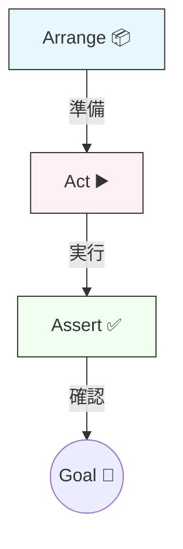

# 第25章：テストの入口：AAA（Arrange/Act/Assert）🧪

この章はね、**「テストって何を書けばいいの？」の恐怖を消す**ための回だよ〜！😆💖
DDDは後半になるほど「ルールを守るコード」が増えるから、テストがあると安心感が段違いになるの🛡️✨

---

## この章でできるようになること 🎯🧡

* AAA（Arrange/Act/Assert）で**読みやすいテスト**が書ける🧪
* 「正常系・異常系・境界値」の**最低ライン**が分かる📏
* 後の章（VO/Entity/Aggregate）で困らない**ドメインっぽいテスト観点**を先に仕込める🏯✨

---

## 1) AAAってなに？（超ざっくり）🧠💡


AAAは、テストを **3つの段** に分けて書く型だよ〜！🧁✨

* **Arrange**：準備する（入力、前提、必要な値）📦
* **Act**：実行する（対象の関数/メソッドを呼ぶ）▶️
* **Assert**：確認する（期待通りか）✅

これ、読みやすさが爆上がりするのが本体！📚✨
そして **Given/When/Then とほぼ同じ発想**だよ〜（Arrange=Given / Act=When / Assert=Then）🪄


([Semaphore][1])

---

## 2) 今どきのテスト実行環境：Vitestでいくよ〜🧪⚡

今回は **Vitest** を使うよ〜！
Vitestは “Vite powered” の次世代テストフレームワークで、公式も「次世代」って言ってるやつ🧡
([Vitest][2])

しかも、今の最新は **vitest 4.0.18**（2026-01-22時点のnpm情報）だよ〜📦✨
([npm][3])

> ※Vitestは **Vite >= 6 / Node >= 20** が必要、って公式に書いてあるよ🧩
> ([Vitest][2])

### インストール（最小）📦


まずはこれだけでOK〜！

```bash
npm i -D vitest
```

### scripts を用意（よく使うやつ）🏃‍♀️💨

```json
{
  "scripts": {
    "test": "vitest",
    "test:run": "vitest run"
  }
}
```

* `npm run test`：開発中向け（ウォッチ寄り）👀✨
* `npm run test:run`：1回だけ全部実行（CIっぽい）🏁
  （`vitest run` が単発実行なのは公式CLIにもあるよ〜）
  ([Vitest][4])

---

## 3) まず1本！AAAで「読み物みたいなテスト」を書く📖🧪


ここでは “DDDっぽさ” を出すために、**ドメインのルールっぽい純粋関数**をテストするよ〜☕✨
（UIとかDBとか触らない、**ルールだけ**を狙うのがコツ！🎯）

### 実装（例：注文合計を計算する）🧾💴

```ts
// src/domain/order/calcTotalYen.ts
export type LineItem = Readonly<{
  priceYen: number
  qty: number
}>

export function calcTotalYen(items: readonly LineItem[]): number {
  if (items.length === 0) return 0

  return items.reduce((sum, item) => {
    if (!Number.isInteger(item.priceYen) || item.priceYen < 0) {
      throw new Error('priceYen must be a non-negative integer')
    }
    if (!Number.isInteger(item.qty) || item.qty <= 0) {
      throw new Error('qty must be a positive integer')
    }
    return sum + item.priceYen * item.qty
  }, 0)
}
```

### テスト（AAAで書く）🧪✨

```ts
// test/calcTotalYen.test.ts
import { describe, it, expect } from 'vitest'
import { calcTotalYen } from '../src/domain/order/calcTotalYen'

describe('calcTotalYen', () => {
  it('returns the sum of priceYen * qty', () => {
    // Arrange 📦
    const items = [
      { priceYen: 450, qty: 2 }, // 900
      { priceYen: 300, qty: 1 }, // 300
    ]

    // Act ▶️
    const total = calcTotalYen(items)

    // Assert ✅
    expect(total).toBe(1200)
  })
})
```

✅ **ポイント**

* Arrangeは「入力の準備」だけ（計算しない！）🙅‍♀️
* Actは「1行」くらいが理想（長いと読みにくい）✨
* Assertは「最終的に何が正しい？」を言うだけ✅

---

## 4) 境界値（こわいやつ）を1個入れよう📏🧊


DDDは「ルール」で死ぬので、境界値は超だいじ！🥶💥
最小でいいから **空** とか **0/1** とか入れよ〜！

```ts
import { describe, it, expect } from 'vitest'
import { calcTotalYen } from '../src/domain/order/calcTotalYen'

describe('calcTotalYen', () => {
  it('returns 0 when items is empty', () => {
    // Arrange
    const items: any[] = []

    // Act
    const total = calcTotalYen(items)

    // Assert
    expect(total).toBe(0)
  })
})
```

---

## 5) 異常系：落ち方も「仕様」だよ🧯🧪


DDDでは「ダメな入力はダメ」って明確にしたいの！🔒
だから **例外になるなら例外になる** をテストしよう〜！

```ts
import { describe, it, expect } from 'vitest'
import { calcTotalYen } from '../src/domain/order/calcTotalYen'

describe('calcTotalYen', () => {
  it('throws when qty is 0', () => {
    // Arrange
    const items = [{ priceYen: 100, qty: 0 }]

    // Act + Assert（例外はこの形が読みやすい）✅
    expect(() => calcTotalYen(items)).toThrowError(/qty/)
  })
})
```

✅ 例外のテストは **ActとAssertがセット** になりやすい（定番）🍀

---

## 6) AAAが崩れる“あるある”😂⚠️（ここ超重要）


### 😵‍💫 Arrangeで計算し始める

「テスト側でロジック書く」と、どっちがバグか分からなくなるよ〜！

* ❌ テスト内で合計を計算して期待値を作る
* ✅ 期待値は「仕様としての数字」をベタ書きする（今回の1200みたいに）

### 😵‍💫 Actが長すぎる（準備と実行が混ざる）

* ❌ Actでオブジェクト生成・DBアクセス・変換をゴチャっと
* ✅ Arrangeに戻す / 小さい関数に分割する

### 😵‍💫 Assertが多すぎる（何が壊れたか分かんない）

* ✅ 「このテストで守りたいことは1つ」に寄せる
  （Assertが2〜3個でもOKだけど、同じ意味の塊だけね🫶）

---

## 7) まとめて増やす：パラメタライズ（it.each）🧪🧷


「同じ形でデータだけ違う」テストは `it.each` が気持ちいい〜！😆✨

```ts
import { describe, it, expect } from 'vitest'
import { calcTotalYen } from '../src/domain/order/calcTotalYen'

describe('calcTotalYen - invalid inputs', () => {
  it.each([
    { priceYen: -1, qty: 1, label: 'negative price' },
    { priceYen: 100, qty: -1, label: 'negative qty' },
    { priceYen: 100, qty: 0, label: 'zero qty' },
  ])('throws for $label', ({ priceYen, qty }) => {
    // Arrange
    const items = [{ priceYen, qty }]

    // Act + Assert
    expect(() => calcTotalYen(items)).toThrowError()
  })
})
```

---

## 8) カバレッジ（おまけ）：見たい人だけ👀📊

Vitestは **v8 / istanbul** のカバレッジに対応してて、どっちも「任意（optional）」だよ〜！
デフォルトは v8。しかも足りない場合はサポートパッケージを入れるよう案内してくれるって公式にあるよ✨
([Vitest][5])

### v8カバレッジを入れる（手動で入れるなら）📦

```bash
npm i -D @vitest/coverage-v8
```

([Vitest][5])

### 実行例（CLIで有効化）🏃‍♀️💨

`coverage.enabled` を明示するのが今どきの書き方だよ〜（UI連携にも必要）✨
([Vitest][5])

```bash
npx vitest run --coverage.enabled --coverage.reporter=html
```

---

## 9) Vitest UI（おまけ）：目で見たい人向け👀🧁

UIは任意で、`@vitest/ui` を入れて `--ui` で起動できるよ〜！かわいい🫶
([Vitest][6])

```bash
npm i -D @vitest/ui
npx vitest --ui
```

---

## 10) 🤖 AIに頼むならここ！（ズルじゃなくて補助輪ね🚲✨）

AIは「答え」じゃなくて **観点の増殖器**として使うのが強いよ〜！🔥

### 使えるプロンプト例 🪄

* 「この関数の仕様から、境界値テストを5個ください。AAA形式で」
* 「異常系（入力不正）のパターンを網羅的に列挙して。優先度もつけて」
* 「it.each にできる形にデータセット化して」
* 「テスト名を読みやすく改善して（英語/日本語どちらでも）」

✅ ただし注意：**AIが作る期待値は間違うことがある**から、期待値は自分で仕様として確定してね🧠🔒

---

## 11) 演習（ここで手を動かす！）✍️🔥

### 演習A：先にテストを書いてから実装を変える（ミニTDD）🟥🟩✨

1. 「明細が100件を超えたら例外」ルールを追加したい
2. **テストを先に追加**（最初は落ちてOK）
3. 実装を直して通す

### 演習B：丸めルールを入れる💴🧊

* 例えば「合計は1円単位（整数）であること」
  （すでに整数だけど、将来の税計算で小数が出た想定で、`Math.round` する等）

---

## 12) この章の「合格ライン」✅🎓

* [ ] テストが **AAAの3段** で読める📖
* [ ] 正常系が1つ、境界値が1つ、異常系が1つある🧪
* [ ] テスト名を見たら「仕様」が分かる🏷️✨
* [ ] テスト側にロジックを書きすぎてない（Arrangeがスッキリ）🧼

---

## 次章につながるよ〜！🔜💖

第26章は「命名と意図」🏷️
テスト名とコードの命名が揃うと、DDDの“言葉の力”がいきなり出るから超楽しくなるよ〜！😆✨

[1]: https://semaphore.io/blog/aaa-pattern-test-automation?utm_source=chatgpt.com "The Arrange, Act, and Assert (AAA) Pattern in Unit Test ..."
[2]: https://vitest.dev/guide/?utm_source=chatgpt.com "Getting Started | Guide"
[3]: https://www.npmjs.com/package/vitest?utm_source=chatgpt.com "vitest"
[4]: https://vitest.dev/guide/cli?utm_source=chatgpt.com "Command Line Interface | Guide"
[5]: https://vitest.dev/guide/coverage.html?utm_source=chatgpt.com "Coverage | Guide"
[6]: https://vitest.dev/guide/ui.html?utm_source=chatgpt.com "Vitest UI | Guide"
