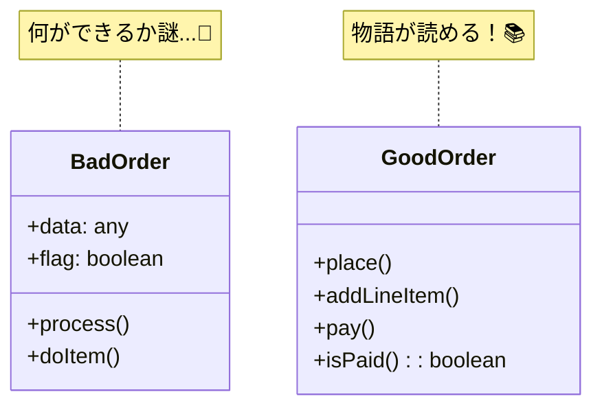

# 第26章：命名と意図（読みやすさの最短ルート）🏷️

## 🎯 この章のゴール

* コードを開いた瞬間に「何の話か」が分かる名前を付けられる🧠✨
* DDDらしく、**ドメインの言葉（ユビキタス言語）**がそのまま型・クラス・メソッド名になる🗣️➡️💻
* 「命名のブレ」を **Lintで自動取り締まり**できる🚓🧹（後半の章ほど効いてくる！）

---

## 🌸 まず結論：命名は“設計そのもの”だよ

DDDって「良いクラス作る」より前に、
**“良い言葉を揃える”→“そのままコード名にする”**が超つよいの🥰🫶

名前が弱いと…

* 仕様を読むたびに脳内変換が必要😵‍💫
* 似た概念が増えて「同じ意味の名前が3つ」みたいな事故💥
* ルールの置き場所も迷子になりやすい🌀

---

## 🧩 命名が伝えるべき「4点セット」🎁

名前を見るだけで、これが伝わると強いよ👇

1. **何のドメイン概念？**（注文？明細？支払い？）
2. **意図はなに？**（追加？確定？キャンセル？）
3. **副作用ある？**（保存する？外部連携する？状態変わる？）
4. **ルールのニュアンス**（禁止/可能、いつ、どこまで）

例：

* `addItem` は「明細を追加する」だけっぽい
* `placeOrder` は「注文を成立させる（手続きの中心）」っぽい
* `payOrder` は「支払いという状態遷移」が見える💳🚦

---

## ☕ 例題（カフェ注文）で “良い命名 / 悪い命名” を体感しよ

### 😇 悪い例（読めない…）

* `doOrder()`（なにするの？作成？確定？保存？）
* `process()`（処理ってなに？😇）
* `data`, `info`, `temp`, `flag`（意味が薄いワード）
* `OrderManager`, `OrderUtil`（責務がぼやけがち）

### 😍 良い例（意図が見える！）

* ユースケース：`placeOrder`, `payOrder`, `fulfillOrder`
* 集約のふるまい：`addLineItem`, `confirm`, `cancel`, `markAsPaid`
* 判定：`canCancel`, `isPaid`, `isFulfillable`
* 時刻：`paidAt`, `expiresAt`, `createdAt`（`at` / `on` / `until`を統一⏰✨）

クラス図で見比べると一目瞭然！👀



---

## 🏷️ 命名ルール（DDD × TypeScript）の “鉄板” まとめ🍀

### 1) クラス/型/VO/Entity の命名

* **Value Object**：名詞でOK（例：`Money`, `Quantity`, `OrderId`）💎
* **Entity / Aggregate Root**：名詞（例：`Order`）🏯
* **Domain Event**：過去形っぽい「起きた事実」（例：`OrderPlaced`, `PaymentCompleted`）📣
* **例外**：ドメイン用語＋理由（例：`OrderAlreadyPaidError`）🧯

### 2) メソッド名（ドメイン層）

* **setterっぽい名前を避ける**（`setStatus` は禁止寄り🚫）
* “やりたいこと”で命名する（`confirm()` / `cancel()` / `addLineItem()`）🕹️
* **状態遷移があるなら、遷移が伝わる名前**にする（`markAsPaid` みたいに）🚦

### 3) Application層（ユースケース）の命名

* **動詞＋目的語**が基本：`PlaceOrder`, `PayOrder`, `GetOrder`
* Queryは `get/find/list/search` を使い分ける（後で統一するの大事！）🔎

  * `get`: 「必ずある前提」っぽい
  * `find`: 「無いかも」っぽい
  * `list`: 複数返す
  * `search`: 条件探索（重め）

---

## ✨ “迷う単語”は辞書化しよう（ユビキタス言語の味方）📘🗣️

DDDで命名がブレる原因トップはこれ👇
**「同じ意味を、別の単語で書く」問題**😵‍💫

たとえば「確定」って言っても…

* `confirm` / `finalize` / `submit` / `complete` …どれ？💦

なのでこの章では、**チーム辞書（ミニ）**を作るのをおすすめするよ🫶✨

例（カフェ注文）：

* `place`: 注文を作成して成立させる（Draft→Active）
* `confirm`: 注文内容を固定する（変更不可へ）
* `pay`: 支払い状態にする
* `fulfill`: 提供完了にする（お渡し）

ここを揃えるだけで、コードがスラスラ読めるようになる📖💨

---

## 🧪 ハンズオン①：命名のリファクタ（Before → After）🔧✨

### Before（意図が薄い）

```ts
class Order {
  doItem(x: any) {
    // ...
  }

  process() {
    // ...
  }
}
```

### After（DDDっぽく“言葉で読める”）

```ts
class Order {
  addLineItem(menuItemId: MenuItemId, quantity: Quantity) {
    // 明細を追加する（ルールはここで守る）
  }

  confirm() {
    // 注文を確定する（状態遷移）
  }
}
```

✅ ポイント

* `doItem` → `addLineItem`（何をするか明確）
* `any` をやめて “ドメインの型” を出す（命名の強さが倍になる）💎
* `process` を禁止ワードにしてOK（だいたい悪さする😂）

---

## 🧪 ハンズオン②：命名の“粒度”を合わせる（統一感が命）🎯

次のどっちが読みやすい？👀

### ❌ 粒度がバラバラ

* `addItem`
* `confirmOrder`
* `doPayment`
* `finish`

### ✅ 粒度が揃ってる

* `addLineItem`
* `confirm`
* `pay`
* `fulfill`

DDDは **「言葉の世界観」**がそろうと一気に強くなるよ🌍✨

---

## 🤖 AIの使いどころ：命名は“案出し”に超向いてる🧠💡

AIにやってもらうのは **「決定」じゃなく「候補出し」**が最強だよ〜🥳

### ✅ 命名候補を出させるプロンプト（テンプレ）

* 目的：何をするメソッド/クラスか
* 文脈：ドメイン（カフェ注文）
* 辞書：使いたい用語（place/confirm/pay/fulfill など）
* 禁止：process/doThing/manager/util など
* 出力：候補10個＋ニュアンス説明

例：

```text
カフェ注文ドメインです。
「支払い済みの注文を提供完了にする」操作のメソッド名を10個提案して。
ユビキタス言語は pay / fulfill を優先。
禁止ワード: process, do, manager, util。
それぞれのニュアンスも一言で。
```

---

## 🚓 命名ブレを “仕組みで止める”：ESLintで命名規約を強制しよう✨

TypeScriptプロジェクトでは、`@typescript-eslint/naming-convention` で **識別子の命名を細かく縛れる**よ🧷✨([TypeScript ESLint][2])

あと最近はESLintの設定が **flat config（`eslint.config.js` 形式）中心**になってるので、この形で書くのが今っぽい🧼✨([ESLint][3])

### 例：最低限の「命名だけ」縛る設定（イメージ）

```js
// eslint.config.mjs
import tseslint from "typescript-eslint";

export default [
  ...tseslint.configs.recommended,
  {
    rules: {
      "@typescript-eslint/naming-convention": [
        "error",
        // 変数・関数は camelCase
        { selector: "variableLike", format: ["camelCase"] },

        // 型・クラス・interface は PascalCase
        { selector: "typeLike", format: ["PascalCase"] },

        // boolean は is/has/can で始める（読みやすさUP）
        { selector: "variable", types: ["boolean"], format: ["camelCase"], prefix: ["is", "has", "can"] },
      ],
    },
  },
];
```

💡これを入れると、命名が雑になった瞬間に怒られるので
「未来の自分」への優しさが爆上がりするよ🥹🫶

> 補足：ESLintのflat configは、公式ドキュメントでも中心として説明されてるよ📘([ESLint][3])

---

## ✅ 理解チェック（5問）🌸

1. `processOrder()` がダメな理由を2つ言える？😇
2. `setStatus(Paid)` を避けたい理由は？🚫🚦
3. `pay()` と `markAsPaid()` のニュアンスの違いは？💳
4. `getOrder` と `findOrder` はどう使い分ける？🔎
5. “命名の辞書化” が効くのはどんな時？📘✨

---

## 🎀 ミニ課題（提出物はテキストでOK）📝💕

1. カフェ注文ドメインで「迷う単語」を5個あげて、辞書（短文定義）を作ってみて☕📘
2. その辞書に沿って、以下の名前を改善してみて👇

* `doOrder()`
* `processPayment()`
* `data`
* `flag`
* `OrderManager`

---

## まとめ 🎉

* 命名は「読みやすさ」じゃなくて **設計の中心**🏷️✨
* DDDは **ユビキタス言語を、そのまま名前にする**のが強い🗣️💎
* 迷う単語は辞書化📘、ブレはLintで止める🚓🧹
* AIは “候補出し” に使うと最高🤖💡

---

次の第27章（モジュール境界とimportの向き🔁）に行く前に、もしよければこの章のミニ課題の回答を投げて〜！🥰✨ こっちで「DDDっぽい名前になってるか」レビューするね🫶

[1]: https://github.com/microsoft/typescript/releases "Releases · microsoft/TypeScript · GitHub"
[2]: https://typescript-eslint.io/rules/naming-convention?utm_source=chatgpt.com "naming-convention"
[3]: https://eslint.org/docs/latest/use/configure/configuration-files?utm_source=chatgpt.com "Configuration Files - ESLint - Pluggable JavaScript Linter"
