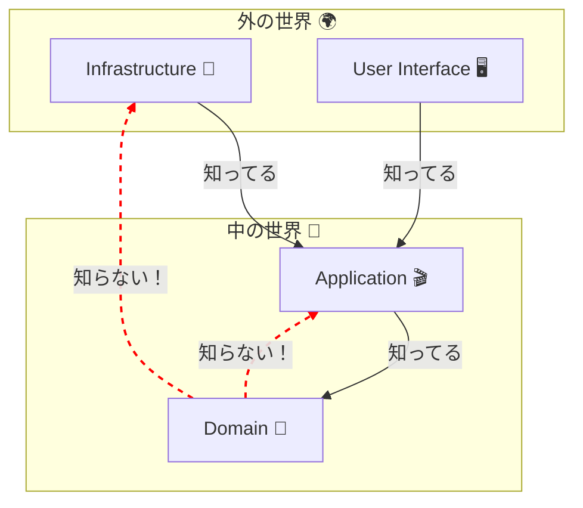

# 第27章：モジュール境界とimportの向き🔁

## この章のゴール🎯✨

* 「どこまでが同じ世界（= モジュール境界）か」を説明できる🗣️
* importの向きを **鉄の掟**として守れる（破った瞬間に検知できる）🚨
* domain/app/infra の“依存逆流”を止められる🛑
* 「あとで増築しても崩れない骨組み」を作れる🏗️💕

---

## 0. 今日の合言葉（超たいせつ）🧡


**「内側は外側を知らない」**
つまり…

* ✅ app は domain を使っていい
* ✅ infra は domain を使っていい
* ❌ domain が infra を import しちゃダメ
* ❌ domain が app を import しちゃダメ

これだけで、未来の自分が救われる率めちゃ上がるよ…🥹✨

---

## 1. なんで“importの向き”がそんなに大事なの？😵‍💫➡️😇


DDDでいちばん守りたいのは **ドメイン**（業務ルールの中心）だよね🧠💎
でも、もし domain が infra を知っちゃうと…

* ドメインが「DBの都合」「フレームワークの都合」に汚染される🧪💥
* テストが重くなる（DBなしで動かない）🐘
* 将来の差し替え（DB変更、API変更）が地獄😇🔥

だから **境界**と **依存方向**は、DDDの“防波堤”なの🌊🧱



---

## 2. 境界ってなに？（この章ではこう定義するよ）📦✨


ここでいう境界はざっくりこれ👇

* **domain**：ルールの王国👑（純粋・不変条件・モデル）
* **app**：手順の係🎬（ユースケースの流れ）
* **infra**：外部と話す係📡（DB、外部API、ファイル、時間など）
* **test**：検証の係🧪

この4つが混ざると事故りやすいから、まず分ける！✂️✨

---

## 3. “見た目で守る”第一段階：フォルダの境界を作る📁🧡


まずは骨組み（例）👇

```text
src/
  domain/
    order/
      Order.ts
      OrderId.ts
      OrderRepository.ts   // ← interfaceはここ
      index.ts             // ← public API
  app/
    place-order/
      PlaceOrder.ts
  infra/
    order/
      InMemoryOrderRepository.ts  // ← 実装はここ
  test/
```

### ポイント💡

* domain の中に **interface（抽象）** を置く
* infra に **実装（具象）** を置く
  → これが「依存逆転（DIP）」の基本形だよ〜🌀✨

---

## 4. “コードで守る”第二段階：importの向きを実装で固定する🔒


### 4-1. domain側：Repositoryは interface だけにする📘

```ts
// src/domain/order/OrderRepository.ts
import type { OrderId } from "./OrderId";
import type { Order } from "./Order";

export interface OrderRepository {
  findById(id: OrderId): Promise<Order | null>;
  save(order: Order): Promise<void>;
}
```

### 4-2. infra側：interface を実装する🛠️

```ts
// src/infra/order/InMemoryOrderRepository.ts
import type { OrderRepository } from "../../domain/order/OrderRepository";
import type { OrderId } from "../../domain/order/OrderId";
import type { Order } from "../../domain/order/Order";

export class InMemoryOrderRepository implements OrderRepository {
  private store = new Map<string, Order>();

  async findById(id: OrderId): Promise<Order | null> {
    return this.store.get(id.value) ?? null;
  }

  async save(order: Order): Promise<void> {
    this.store.set(order.id.value, order);
  }
}
```

### 4-3. app側：Repositoryを“注入”して使う🎬

```ts
// src/app/place-order/PlaceOrder.ts
import type { OrderRepository } from "../../domain/order/OrderRepository";
// （Order作成など、domainのモデルも使う想定）

export class PlaceOrder {
  constructor(private readonly orderRepo: OrderRepository) {}

  async execute(/* input DTO */): Promise<void> {
    // 1) domainのルールでOrderを作る
    // 2) orderRepo.save(...) で保存
  }
}
```

✅ これで **app → domain**
✅ **infra → domain**
❌ **domain → infra** が自然に起きにくくなるよ〜✨

---

## 5. “仕組みで守る”第三段階：違反importを自動で検知する🚨🧠


「気をつける」だけだと、絶対いつか破れる😇
だから **仕組み**で止めよう〜🛑✨

### A案：ESLintの `no-restricted-imports` でガード（手軽）🧯

ESLintには import を禁止できる仕組みがあるよ([ESLint][2])

例：domain配下では infra/app を import 禁止（イメージ）

```js
// eslint.config.js（例：Flat Config想定の雰囲気）
export default [
  {
    files: ["src/domain/**/*.ts"],
    rules: {
      "no-restricted-imports": [
        "error",
        {
          patterns: [
            { group: ["../app/*", "../../app/*", "**/src/app/*"], message: "domain → app は禁止だよ🚫" },
            { group: ["../infra/*", "../../infra/*", "**/src/infra/*"], message: "domain → infra は禁止だよ🚫" }
          ]
        }
      ]
    }
  }
];
```

> 実プロジェクトだと相対パスが揺れるので、次のB案（zones）か、パスエイリアス併用がより安定だよ〜🧡

---

### B案：`eslint-plugin-boundaries` で“層ルール”をはっきり書く（おすすめ）🧱✨

`eslint-plugin-boundaries` は、フォルダを「要素」として扱って境界違反を検知できる系だよ([GitLab][3])

* domain は app/infra に依存しない
* app は domain だけOK
* infra は domain/app を見てもOK（運用ルール次第）

っていう “設計ルール” をコード化しやすい👍✨

---

### C案：dependency-cruiserで“依存ルール＋循環”を一網打尽（CI向き）🕸️

dependency-cruiser は「依存の検証」「循環検出」「可視化」もできる系だよ([GitHub][4])

* 「domain → infra を禁止」みたいなルールを宣言できる
* “いつの間にか循環してた😵‍💫” を見つけやすい

（チームやCIに乗せるとめっちゃ強い💪✨）

---

## 6. TypeScript（2026）で “import事故” を減らすコツ🧡🧯

### 6-1. `moduleResolution` は環境に合わせる🌍

TypeScriptの `moduleResolution` には `bundler` や `nodenext` などの選択肢があるよ([TypeScript][5])

* フロント（Vite等のバンドラ中心）→ `bundler` が使われがち
* NodeのESM寄り運用 → `nodenext`

どっちに寄せるかで解決挙動が変わるから、ここは“プロジェクトの実行環境”に合わせるのが正解だよ🧡

---

### 6-2. `verbatimModuleSyntax` と `import type` を味方にする🧡

`verbatimModuleSyntax` は「型だけのimport」をより安全に扱うための方向性で重要になってるよ([TypeScript][6])

さらにNode側でも、TypeScriptの“型消し（type stripping）”の文脈で **`verbatimModuleSyntax: true`** や **`import type`** が強く関わる話が出てる（型だけを値import扱いしちゃうと実行時エラーになり得る）([nodejs.org][7])

「境界」って結局、**“実行時に必要な依存”** を最小化するのが大事だから、型importの扱いは地味に効くよ〜🧠✨

---

## 7. よくある“境界崩壊”パターン集😂⚠️


### ❌ 1) domainがinfraのクラスをnewしちゃう

* 「domainでDB保存しよ！」みたいなノリでやりがち
  → その瞬間、domainは純粋じゃなくなる😇

### ❌ 2) DTOやORM型がdomainに入ってくる

* “たまたま便利”で使うと、後で爆発💣

### ❌ 3) index.ts（barrel）で循環import

* barrelは便利だけど、雑に集めると循環しやすい🌀
  → 「公開APIだけexport」くらいの慎重さが◎✨

### ❌ 4) app層がルールを持ち始める

* 「ここでチェックしとくか」が積もると、domainが空っぽに😇

---

## 8. ハンズオン（この章のメイン）🏃‍♀️💨

### 演習1：わざと違反importして、検知させる🚨

1. domainのファイルから infra の何かを import してみる（わざと）
2. ESLint / boundaries / dependency-cruiser のどれかで怒らせる
3. 直す
   → **「仕組みで守れる」感覚**が身につくよ🎉

### 演習2：新モジュールを増築する🏗️✨

* `menu`（メニュー）モジュールを追加して、同じルールで区切る
* 「domain/menu」「app/get-menu」「infra/menu」みたいに作る
  → 増やしても崩れないのが最高🧡

---

## 9. AI（Copilot / Codex）活用テンプレ🤖🧡

### 依存ルールを“文章→設定”に落とすプロンプト📝

* 「src/domain は src/app と src/infra を import 禁止。src/app は src/domain のみ許可。これを ESLint で検知したい。Flat Configで例を出して」

### 境界レビュー用プロンプト🔍

* 「この差分で domain → infra の依存が混ざってないか見て。混ざってたら、DIPで直す案を3つ出して」

### 循環importの疑いがある時🌀

* 「このimport関係が循環してないか推理して、循環しやすい場所（barrel export等）を指摘して」

---

## 10. 理解チェック（10問）✅💯

1. domain が infra を import しちゃダメな理由は？
2. Repository の interface はどこに置くのが自然？
3. “依存逆流”ってどんな状態？
4. app層の責務は「ルール」？「手順」？
5. infra層に置いていいものを3つ言ってみて
6. DTOはどの層の“都合”が強い？
7. barrel export のメリットとデメリットは？
8. 境界違反を「気をつける」だけで運用すると何が起きる？
9. `moduleResolution` を環境に合わせる理由は？([TypeScript][5])
10. `import type` が効く場面を1つ言ってみて([TypeScript][6])

---

## まとめ🎀✨

この章はね、ひとことで言うと…

**「設計を“未来まで守れる形”に固定する章」**だよ🧡🏰

境界とimportの向きが守れた瞬間から、DDDは**ちゃんと効き始める**✨
次の章（DTOの感覚）にも、ここがそのまま刺さってくるよ〜📦💕

必要なら、いまのフォルダ構成（domain/app/infra/test）に合わせて
「この章の設定をそのままコピペで動く形」に寄せたテンプレも作るよ〜🧁💻

[1]: https://github.com/microsoft/typescript/releases "Releases · microsoft/TypeScript · GitHub"
[2]: https://eslint.org/docs/latest/rules/no-restricted-imports "no-restricted-imports - ESLint - Pluggable JavaScript Linter"
[3]: https://gitlab.au.dk/au715910/lisbethreact/-/blob/main/node_modules/eslint-plugin-import/docs/rules/no-restricted-paths.md "node_modules/eslint-plugin-import/docs/rules/no-restricted-paths.md · main · Andreas Hald Søndergaard Mandøe / Lisbethreact · GitLab"
[4]: https://github.com/import-js/eslint-plugin-import/blob/main/docs/rules/no-restricted-paths.md "eslint-plugin-import/docs/rules/no-restricted-paths.md at main · import-js/eslint-plugin-import · GitHub"
[5]: https://www.typescriptlang.org/tsconfig/ "TypeScript: TSConfig Reference - Docs on every TSConfig option"
[6]: https://www.typescriptlang.org/tsconfig/moduleResolution.html "TypeScript: TSConfig Option: moduleResolution"
[7]: https://nodejs.org/api/typescript.html "Modules: TypeScript | Node.js v25.6.0 Documentation"
