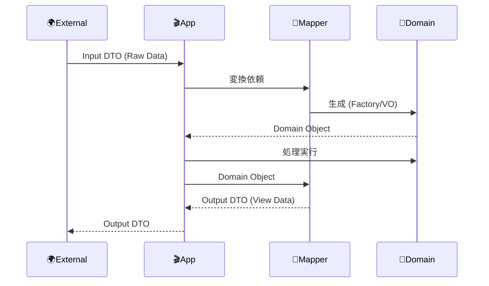

# 第28章：DTOの感覚：外に出す箱📦

## この章でできるようになること🎯

* DTOが「何のために存在するか」を説明できる📣
* **ドメイン型をそのまま返さない理由**が腹落ちする🧠✨
* 入力DTO → ドメイン（VO/Entity）へ変換できる🔁
* ドメイン → 出力DTOへ変換できる🔁
* 「DTOを置く場所」「変換を書く場所」が迷わない🧭

---

## 1) DTOってなに？（一言で）📦


DTO（Data Transfer Object）は **“境界をまたぐとき専用のデータの箱”** だよ〜☺️✨
たとえば **APIのリクエスト/レスポンス**、画面表示用データ、外部サービス連携の入出力…そういう「外の世界」とやり取りするときに使う箱📦

ポイントはこれ👇

* DTOは **ただのデータ**（ふるまい・不変条件は持たない）🧊
* ドメインは **ルールとふるまい**（不変条件を守る本体）🏯🛡️

---

## 2) ドメイン型をそのまま返しちゃダメな理由💥


「え、Orderをそのまま返せば楽じゃない？」ってなるんだけど…事故が起きやすい😵‍💫⚠️

### 代表的な理由（超重要）🔥

* **外に出すと“契約”になる**
  一度APIで返すと、クライアントがそれ前提で作る → ドメイン変更が超しんどい😇
* **シリアライズで壊れる**（JSON化でクラス/メソッド消える問題）
  クラスのふるまいはJSONに乗らない → ただの“形だけの物体”になる🫠
* **情報漏えい**（内部の都合や機密が混ざる）🔐
  例：内部用フラグ、監査情報、計算途中の値…外に出す必要ないよね🙅‍♀️
* **UI都合がドメインを汚す**（表示のための整形をドメインが背負う）🧹
  “表示用の文字列”をドメインが持ち始めると、ルールの本体がブレる
* **境界が崩れる**（第27章の「importの向き」も崩れやすい）🔁💣
  UIがドメインの内部構造に依存 → 変更が波及して大炎上🔥

理想の流れはこうだよ〜🌊



---

## 3) DTO設計のコツ🪄✨（迷ったらこれ）


### ✅ コツ1：DTOは「ユースケース単位」で作る🎬

* `PlaceOrderInputDTO`（注文する入力）
* `OrderViewDTO`（注文を見る出力）
  みたいに **目的に合わせて別々**にするのがコツ☺️

### ✅ コツ2：DTOは“プリミティブ中心”にする🧱

外に出す形は基本これ👇

* string / number / boolean / null / 配列 / オブジェクト（JSONにそのまま乗るもの）

Money VO をそのまま返すんじゃなくて、
`{ amount: number; currency: "JPY" }` みたいな形に変換する感じ💴✨

### ✅ コツ3：入力DTOは「信用しない」😈

外から来るデータは「汚れてる前提」
→ **DTOを検証してから**ドメインへ変換するのが王道🧼✨

---

## 4) “3つの形”を分けると一気にラクになる🧠✨


同じ「注文」でも、実は形が3つあるよ〜👇

* **ドメインモデル**：ルールと不変条件を守る本体🏯
* **DTO**：外に出す/外から受ける箱📦
* **永続化モデル**（DB用）：保存しやすい形💾（これはinfra側の都合）

この3つを同一視すると、だいたい後で泣く😭

---

## 5) 例題：カフェ注文でDTOを作る☕🧾


### 5-1. 入力DTO（注文する）📥

「注文する画面」や「APIのPOST」で受ける想定の形👇

```ts
// app/dto/PlaceOrderInputDTO.ts
export type PlaceOrderInputDTO = {
  customerId: string;
  items: Array<{
    menuItemId: string;
    quantity: number; // まずはnumberで受ける（外から来るので）
  }>;
};
```

### 5-2. 出力DTO（表示する）📤

「注文詳細画面」や「APIのGET」で返す想定の形👇

```ts
// app/dto/OrderViewDTO.ts
export type OrderViewDTO = {
  orderId: string;
  status: "Draft" | "Confirmed" | "Paid" | "Fulfilled" | "Canceled";
  total: { amount: number; currency: "JPY" };
  items: Array<{
    menuItemId: string;
    name: string;
    unitPrice: { amount: number; currency: "JPY" };
    quantity: number;
    lineTotal: { amount: number; currency: "JPY" };
  }>;
};
```

> 🌟 ここで大事：**ドメインのOrderをそのまま返さない**
> UI/APIが欲しい形に整形して返す📦✨

---

## 6) 変換（マッピング）はどこに書く？📍


おすすめはこれ👇

* **DTO ↔ ドメインの変換は “アプリ層”**（UseCase側）に置く
* ドメイン層はDTOを知らない（境界が守れる）🛡️

### 例：入力DTO → ドメインへ変換🧊➡️🏯

（VOに詰め替えて、不変条件に乗せるイメージ✨）

```ts
// app/mappers/placeOrderMapper.ts
import type { PlaceOrderInputDTO } from "../dto/PlaceOrderInputDTO";

// domain側（例）
import { CustomerId } from "../../domain/valueObjects/CustomerId";
import { MenuItemId } from "../../domain/valueObjects/MenuItemId";
import { Quantity } from "../../domain/valueObjects/Quantity";

export function toDomainPlaceOrderCommand(dto: PlaceOrderInputDTO) {
  return {
    customerId: CustomerId.fromString(dto.customerId),
    items: dto.items.map((x) => ({
      menuItemId: MenuItemId.fromString(x.menuItemId),
      quantity: Quantity.fromNumber(x.quantity),
    })),
  };
}
```

### 例：ドメイン → 出力DTOへ変換🏯➡️📦

```ts
// app/mappers/orderViewMapper.ts
import type { OrderViewDTO } from "../dto/OrderViewDTO";
import type { Order } from "../../domain/entities/Order";

export function toOrderViewDTO(order: Order): OrderViewDTO {
  return {
    orderId: order.id.value, // OrderId VOの中身だけ
    status: order.status.value,
    total: {
      amount: order.total.amount,
      currency: order.total.currency,
    },
    items: order.items.map((i) => ({
      menuItemId: i.menuItemId.value,
      name: i.name.value,
      unitPrice: { amount: i.unitPrice.amount, currency: i.unitPrice.currency },
      quantity: i.quantity.value,
      lineTotal: { amount: i.lineTotal.amount, currency: i.lineTotal.currency },
    })),
  };
}
```

> 💡 コツ：変換は **“ただの関数”** でOK！
> 変換クラスにしないといけない訳じゃないよ☺️✨

---

## 7) 入力DTOの検証（2026の定番：スキーマで守る🧪）


外から来るデータは信用しないので、**パース（検証）→ DTO確定 → ドメイン変換**が安全ルート🛡️✨

### 7-1. Zod / Valibot どっち？🤔

* **Zod**：TypeScript向けバリデーションで超定番。Zod 4は安定版として案内されてるよ📌([Zod][1])
  さらに **v4.3.0** では JSON Schema 変換（`z.fromJSONSchema()`）など話題も出てる🧩([GitHub][2])
  ※Zod v4は import の仕方でツリーシェイキングに影響が出る注意も共有されてるよ🌲🪓([Zenn][3])
* **Valibot**：モジュラー＆型安全を強く打ち出してるスキーマライブラリ（軽量志向）🪶([valibot.dev][4])

（どっちでもOKだけど、教材としては“まずZodで体験”が分かりやすいこと多い☺️）

### 7-2. Zodで入力DTOをパースする例🧼

```ts
// app/validation/placeOrderSchema.ts
import * as z from "zod"; // v4でツリーシェイキング意識の例🌲

export const placeOrderSchema = z.object({
  customerId: z.string().min(1),
  items: z.array(
    z.object({
      menuItemId: z.string().min(1),
      quantity: z.number().int().min(1).max(99),
    })
  ).min(1),
});

export type PlaceOrderInputDTO = z.infer<typeof placeOrderSchema>;
```

UseCase側でこう使う👇

```ts
// app/usecases/placeOrder.ts
import { placeOrderSchema } from "../validation/placeOrderSchema";
import { toDomainPlaceOrderCommand } from "../mappers/placeOrderMapper";

export async function placeOrder(raw: unknown) {
  const dto = placeOrderSchema.parse(raw); // ここで“汚れた入力”を止める🛑
  const command = toDomainPlaceOrderCommand(dto);

  // あとはドメイン操作へ…
}
```

---

## 8) よくある事故（DTOまわり）😂⚠️

* DTOに **メソッド** を生やす（DTOが肥大化）🌋
* DTOをドメイン層に置く（境界が壊れる）💣
* 1個の巨大DTOで何でも表す（optional地獄）🫠
* 出力DTOに「内部都合の項目」を混ぜる（漏えい）🔓
* “とりあえず any” で流す（将来の自分が泣く）😭

---

## 9) ミニ演習（手を動かす）✍️✨

### 演習A：DTOを2種類に分けよう📦📦

* `PlaceOrderInputDTO`（入力）
* `OrderViewDTO`（出力）
  を作って、**同じOrderでも形が違う**ことを確認しよう☺️

### 演習B：変換をテストしよう🧪

* 入力DTO → ドメイン変換で

  * quantity=0 が弾かれる（VOで止まる）
* ドメイン → 出力DTO変換で

  * 余計な内部情報が含まれてない
    をチェック✅

### 演習C：表示用DTOの項目を“削る”✂️

UIに不要なもの（例：単価、通貨、内部ステータス詳細など）を削って、
「DTOは必要なものだけ」を体験しよう🌸

---

## 10) AIの使い方テンプレ（この章は相性よすぎ🤖💕）

そのままコピペで使えるやつ置いとくね👇

* 「このユースケース（注文確定）で、**入力DTO/出力DTO**を提案して。外部に出すべきでない項目も指摘して」
* 「DTO→ドメイン変換の**骨格だけ**作って。VO生成は `fromString/fromNumber` を呼ぶ形で」
* 「出力DTOが**将来の変更に強い**ように、項目の粒度を2案出して（詳細/簡易）」
* 「DTOを1つにまとめた場合のデメリデメを列挙して」

> コツ：AIには「目的」「境界」「出さない情報」を必ず言うと精度が上がるよ☺️✨

---

## 11) まとめ（この章の合言葉）📣✨

* DTOは **境界の箱📦**
* ドメインは **本丸🏯**（不変条件とふるまい）
* **外に出す形**と**内側の形**は違っていい（むしろ違うべき）💖
* 変換はアプリ層で、素直に関数でOK🔁
* 入力はスキーマで止めると安心🧼🛡️（Zod/Valibotなど）

---

### 2026ミニ豆知識（最新ネタ）🗞️✨

* TypeScriptは 5.8 で `--module node18` の安定フラグが追加されてるよ📦([TypeScript][5])
* TypeScript 5.9 では `import defer` が入ってきて、モジュール実行タイミングを遅らせる提案に対応してるよ⏳([TypeScript][6])
  （この章の主役ではないけど、“境界”や“モジュール”が大きくなるほど効いてくる話！）

---

次の第29章は、いよいよ「フォルダと空ファイル」を用意して、ここまでの型（DTO/Mapper）を置く場所まで一気に固めていくよ〜📁✨

[1]: https://zod.dev/v4?utm_source=chatgpt.com "Release notes"
[2]: https://github.com/colinhacks/zod/releases?utm_source=chatgpt.com "Releases · colinhacks/zod"
[3]: https://zenn.dev/ishiharu/articles/no-zod-named-import?utm_source=chatgpt.com "Zod v4、インポート方法で300KB→66KBに。あなたのコードは ..."
[4]: https://valibot.dev/?utm_source=chatgpt.com "Valibot: The modular and type safe schema library"
[5]: https://www.typescriptlang.org/docs/handbook/release-notes/typescript-5-8.html?utm_source=chatgpt.com "Documentation - TypeScript 5.8"
[6]: https://www.typescriptlang.org/docs/handbook/release-notes/typescript-5-9.html?utm_source=chatgpt.com "Documentation - TypeScript 5.9"
