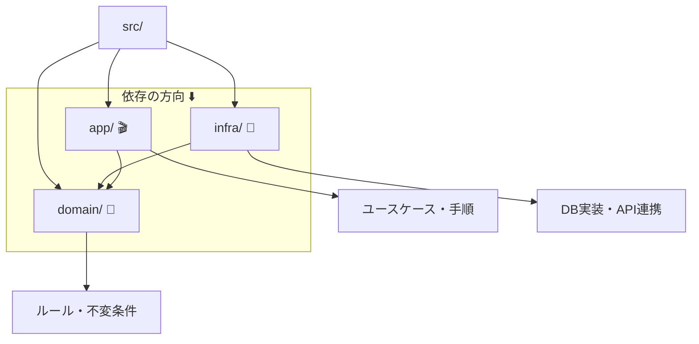

# 第29章：例題の下地：フォルダと空ファイルを用意📁

この章はね、「DDDのコードを書き始める前に、**迷子にならない“地図”を作る回**」だよ〜🗺️💕
フォルダと空ファイルが整ってるだけで、次章以降のスピードがぜんぜん変わる！🚀

---

## 0) この章のゴール🎯💖

✅ `domain / app / infra / test` の骨組みができてる
✅ “どこに何を書く？”が、ファイル名で分かる
✅ `typecheck` と `test` が一発で走る（安心の導線）🧪✨
✅ 次章から「中身を書く」ことだけに集中できる🥳

---

## 1) まず「フォルダの意味」を超ざっくり固定しよ🧠🌸

DDDで混乱しやすいのは「どこに置くの？」問題なのね😵‍💫
ここで“置き場所ルール”を先に決めちゃうよ！

* **domain/** 🏠💎
  ルールの本丸。「こうでなきゃダメ！」が住む場所（不変条件とか）
* **app/** 🎬🧑‍🍳
  ユースケースの手順係。「入力→取得→ドメイン操作→保存」みたいな流れ
* **infra/** 🌍🔌
  外の世界。DB・API・ファイル・ネットワークなど現実担当
* **test/** 🧪🛡️
  仕様の安全ネット。壊れてないか見張る

> この分け方を最初に固定しておくと、後で巨大化しにくいよ〜✨



---

## 2) 2026/02/07時点の“最新ツール事情”メモ📝✨

「最新情報で構成してね！」って条件なので、ここはアップデート版でいくよ〜📌💕

* **Node.js は v24 が Active LTS ライン**（安定寄りで進めやすい）([GitHub][1])
* **TypeScript 6.0 は 2026年2月に Beta、3月に Final の予定**（なので今は“安定版TS”＋必要なら `next` を試すのが安全）([GitHub][2])
* **ESLint は “flat config（eslint.config.js）” が基本路線**（最近の標準）([eslint.org][3])
* **Vitest は v4 が安定ラインとして使われてる**（TSとの相性◎）([void(0)][4])
* ⚠️ 最近サプライチェーン事故があった系の話もあるので、**lockfileをコミット**＆**`npm ci`**運用が安心（後半で効くやつ）([Qiita][5])

---

## 3) ここから実作業！プロジェクト作成📦💨

### 3-1) npmプロジェクト作る（PowerShell）🪟⚡

```powershell
mkdir ddd-cafe
cd ddd-cafe
npm init -y
```

### 3-2) 最小の依存を入れる（型チェック＆テスト）🧪✨

```powershell
npm i -D typescript tsx vitest @types/node
```

> `tsx` は「TSをそのまま実行」できて、学習中にラクだよ〜🧸💕

---

## 4) フォルダと空ファイルを“まとめて作る”📁⚡

この章の主役きた！🎉
PowerShellで一気に作っちゃおう💪✨

```powershell
## フォルダ
mkdir src, test
mkdir src\domain, src\app, src\infra
mkdir src\domain\order, src\domain\shared
mkdir src\app\usecases, src\app\dto
mkdir src\infra\repositories

## 空ファイル（箱だけ先に）
ni tsconfig.json -ItemType File
ni src\domain\order\Order.ts -ItemType File
ni src\domain\order\OrderStatus.ts -ItemType File
ni src\domain\order\OrderId.ts -ItemType File
ni src\domain\shared\DomainError.ts -ItemType File
ni src\app\main.ts -ItemType File
ni src\app\usecases\PlaceOrder.ts -ItemType File
ni src\app\dto\PlaceOrderDto.ts -ItemType File
ni src\infra\repositories\InMemoryOrderRepository.ts -ItemType File
ni test\smoke.test.ts -ItemType File
```

> `ni` は PowerShell の `New-Item` の省略だよ〜✌️✨
> VS Codeのエクスプローラーで手動作成でもOK（でもコマンドの方が速い！🏎️）

---

## 5) 「空ファイル」に“道しるべコメント”だけ入れる🧭💕

空っぽのままだと迷うので、最初は**コメントで役割を書く**のが超おすすめ！📝✨
（中身は次章以降で育てる🌱）

### 5-1) `src/domain/order/OrderStatus.ts` 🚦

```ts
// OrderStatus：注文の状態（状態遷移の中心）🚦
// 例：Draft → Confirmed → Paid → Fulfilled など
// ここは「業務ルール」に関係するので domain に置く💎

export type OrderStatus = "Draft" | "Confirmed" | "Paid" | "Cancelled" | "Fulfilled";
```

### 5-2) `src/domain/order/OrderId.ts` 🪪

```ts
// OrderId：注文の同一性（ID）🪪
// ここはプリミティブ（string）直置き事故を防ぐための“専用型”🧱

export type OrderId = string & { readonly __brand: "OrderId" };
```

### 5-3) `src/domain/shared/DomainError.ts` 🧯

```ts
// DomainError：ドメインの“仕様違反”を表すエラー🧯
// 例：「支払い後は変更できません」みたいなやつ
// UIの文言じゃなく、“ルール”としてのエラーの箱📌

export class DomainError extends Error {
  constructor(message: string) {
    super(message);
    this.name = "DomainError";
  }
}
```

### 5-4) `src/domain/order/Order.ts` ☕🧾

```ts
// Order：注文の中心（Entity/集約ルートの候補）☕🧾
// この章では“箱だけ”作る。中身は次の部で育てる🌱

import { OrderId } from "./OrderId";
import { OrderStatus } from "./OrderStatus";

export type Order = Readonly<{
  id: OrderId;
  status: OrderStatus;
}>;
```

### 5-5) `src/app/main.ts` 🏁

```ts
// main：いったん動作確認できる入口🏁
// 後でAPIやCLIに変わってもOK。今は「動く」ことが大事✨

console.log("DDD Cafe project booted! ☕✨");
```

### 5-6) `test/smoke.test.ts` 🔥

```ts
import { describe, it, expect } from "vitest";

describe("smoke", () => {
  it("runs tests 🧪✨", () => {
    expect(true).toBe(true);
  });
});
```

---

## 6) `tsconfig.json` を置く（最小・安全寄り）🧩✨

```json
{
  "compilerOptions": {
    "target": "ES2023",
    "module": "NodeNext",
    "moduleResolution": "NodeNext",

    "strict": true,
    "noEmit": true,

    "skipLibCheck": true,
    "forceConsistentCasingInFileNames": true
  },
  "include": ["src", "test"]
}
```

> TypeScript 6.0が近いけど、今はまず「安定設定で前に進む」方が学習が途切れないよ〜🧸✨([GitHub][2])

---

## 7) `package.json` に“走る導線”を入れる🏃‍♀️💨

`package.json` の `"scripts"` をこうしてね👇

```json
{
  "scripts": {
    "dev": "tsx src/app/main.ts",
    "typecheck": "tsc -p tsconfig.json",
    "test": "vitest run",
    "test:watch": "vitest"
  }
}
```

動作確認いくよ〜！🎉

```powershell
npm run dev
npm run typecheck
npm run test
```

---

## 8) AI（Copilot/Codex）で一瞬で終わらせるプロンプト例🤖💕

「骨組みだけ」AIにやらせるのがコツだよ〜🪄✨（ロジックは自分！）

### 8-1) フォルダ設計レビュー用🗂️

```text
DDDの学習用に src/domain src/app src/infra test を使います。
それぞれの責務が混ざっていないか、改善案があれば指摘して。
（domainはinfra/appを参照しない前提）
```

### 8-2) 空ファイルのコメント生成📝

```text
以下のファイルそれぞれに「責務コメント（3〜5行）」だけを書いて。
中身の実装はまだ書かないで。
- src/domain/order/Order.ts
- src/app/usecases/PlaceOrder.ts
- src/infra/repositories/InMemoryOrderRepository.ts
```

### 8-3) “次章に備えたTODO”の置き方✅

```text
この構成で次に実装する順番（VO→Entity→Aggregate→Usecase）を想定して、
各ファイルにTODOを1〜2行で入れて。読みやすさ重視で。
```

---

## 9) よくある詰まりポイント（先回り）😵‍💫🛟

* **テストが動かない** → `vitest` が `-D` で入ってるか確認👀
* **TypeScriptのバージョンが急に上がった** → `package-lock.json` をコミットして固定すると安定💎（`npm ci` もおすすめ）([Qiita][5])
* **TS 6.0 beta を試したくなった** → `typescript@next` は実験枠（学習本線は安定版のままが安心）([GitHub][2])

---

## 10) この章の卒業チェック✅🎓✨

✅ `src/domain` `src/app` `src/infra` `test` がある
✅ 空ファイルに「役割コメント」が入ってる
✅ `npm run typecheck` が通る
✅ `npm run test` が通る
✅ 迷ったら「domainに置ける？」って自問できる💡

---

次はこの土台の上に、**“実際のDDDコード”を育てていく**フェーズに入れるよ〜🌱💖
この章が綺麗だと、後ろが全部ラクになる！ほんとに！🥳✨

[1]: https://github.com/nodejs/Release "GitHub - nodejs/Release: Node.js Release Working Group"
[2]: https://github.com/microsoft/TypeScript/issues/63085?utm_source=chatgpt.com "TypeScript 6.0 Iteration Plan · Issue #63085"
[3]: https://eslint.org/blog/2025/03/flat-config-extends-define-config-global-ignores/ "Evolving flat config with extends - ESLint - Pluggable JavaScript Linter"
[4]: https://voidzero.dev/posts/announcing-vitest-4?utm_source=chatgpt.com "Announcing Vitest 4.0"
[5]: https://qiita.com/kskwtnk/items/dac0f70a30613c468693 "ESLint v9.22以降の機能を正しく使う AIと人間のための設定ガイド #JavaScript - Qiita"
