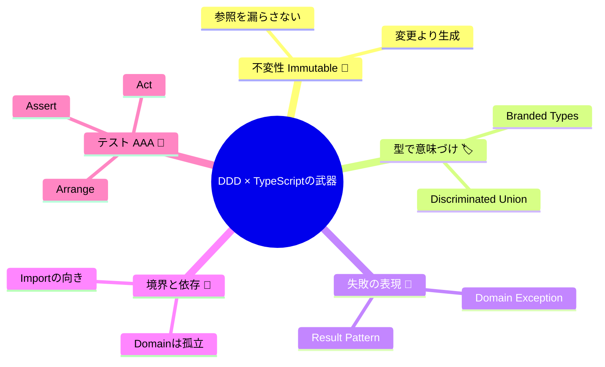

# 第30章：小まとめ：DDDに効くTS要素を復習🧡🔁

この章はね、「次の第31章（Value Object💎）」に入る前に、**ここまでの基礎体力（TSの武器）を“使える形”に固める回**だよ〜！🥳✨
いったん整理すると、戦術DDDって「賢いクラスを作る」じゃなくて、**ルールを壊さないように“設計とコードで守る”**のが本体なのね🛡️

---

## 0) 2026/2/7時点の“最新TSまわり”だけ先にメモ📝✨

* TypeScriptの最新版は **5.9**（公式のダウンロードページでも現行が 5.9 になってるよ）([TypeScript][1])
* いまの流れとしては、**TypeScript 6.0 が「橋渡し（bridge）」**で、そこから先は **TypeScript 7（ネイティブ移植）**へ、という方針が公式ブログで明言されてるよ([Microsoft for Developers][2])
* ネイティブ移植（超高速化）のプレビューも進んでいて、ツール体験が大きく変わる可能性がある、っていうのも公式に出てる🧠⚡([Microsoft Developer][3])
* テストは **Vitest 4.0** が出て以降、モダンTSでかなり定番寄りになってる（公式アナウンスあり）🧪([vitest.dev][4])
* Node.jsは、2026年初め時点で **v24がActive LTS** になってる（公式のリリース一覧）([nodejs.org][5])

> ただしこの章は「機能の新しさ」より、**DDDに効く“使い方の型”**が主役だよ〜☺️🧡

---

## 1) この章のゴール🎯✨

読み終わったら、これができればOK！

* ✅ **不変（immutable）**を“気分”じゃなく、コードの形で守れる🧊
* ✅ **プリミティブ地獄**（string/number乱舞）を卒業できる🧱
* ✅ **失敗（エラー）**を設計として扱える（例外/Resultの整理）🧯
* ✅ **境界**（domain/app/infra + DTO）を崩さず進められる📦
* ✅ **テスト（AAA）**が“書けるし増やせる”状態になる🧪

そして最後に、理解チェック問題で自分の穴が見つかる🔍✨

---

## 2) まず「DDDに効くTS要素」5点セットを1枚にすると📌


戦術DDDの序盤は、だいたいこの5つで勝てるよ💪🧡

1. **不変性🧊**：勝手に状態が変わらない → バグが減る
2. **型で意味を持たせる🏷️**：数字じゃなく「金額」、文字列じゃなく「注文ID」
3. **失敗の表現🧯**：例外かResultか、混ぜない
4. **境界と依存の向き🧱➡️**：domainは内側。外（infra）を知らない
5. **テスト🧪**：ルールを守り続ける保険（AAAで型を固定）

この5つが“筋肉”になると、第31章以降（VO/Entity/Aggregate）が一気にラクになるよ〜！🥹✨



---

## 3) 不変（immutable）🧊：DDDで最初に効く“バグ予防”

### よくある事故💥

「配列を外から渡して、そのまま持ってたら、外でpushされて壊れた…😇」みたいなやつ！

### コツはこれだけ🧊✨


* **外から受け取った配列はコピーする**
* **外へ返す配列もコピーする**
* **状態変更は“新しい値を作る”**

#### 例：配列を守る（コピーする）🛡️

```ts
class Order {
  private readonly _items: ReadonlyArray<{ sku: string; qty: number }>;

  private constructor(items: ReadonlyArray<{ sku: string; qty: number }>) {
    // 外から来た配列をそのまま持たない！
    this._items = [...items];
  }

  static create(items: ReadonlyArray<{ sku: string; qty: number }>) {
    return new Order(items);
  }

  get items(): ReadonlyArray<{ sku: string; qty: number }> {
    // 外へ返すときも守る（必要なら deep copy も検討）
    return [...this._items];
  }

  addItem(sku: string, qty: number): Order {
    // 変更じゃなく生成！
    return new Order([...this._items, { sku, qty }]);
  }
}
```

> “不変”って、`readonly`って書くだけじゃなくて、**参照の漏れを止める**のが本体だよ〜🧠🔒

### 🧸ミニ練習

* `items()` が `return this._items;` になってたら、どう壊れる？説明してみてね🗣️✨

---

## 4) 型で守る🏷️：プリミティブ地獄🧱からの脱出

DDDって「意味のあるモデル」を作るのが強いのね。
TypeScriptだと、まずは **“専用型”**で効果が出るよ💡

### 4-1) branded type（ブランド型）で“IDの取り違え”を殺す🪪💥


```ts
type Brand<T, B extends string> = T & { readonly __brand: B };

type OrderId = Brand<string, "OrderId">;
type MenuItemId = Brand<string, "MenuItemId">;

const OrderId = (v: string) => v as OrderId;
const MenuItemId = (v: string) => v as MenuItemId;

// 取り違えがコンパイルで止まる✨
const oid = OrderId("o_123");
const mid = MenuItemId("m_999");

// 間違い：OrderId が欲しいのに MenuItemId を渡せない
// findOrder(mid);
```

これだけで、地味に多い事故（「IDの種類違い」）が消えるよ🥹✨

### 4-2) union + discriminated union で“状態と分岐”を安全に🚦✨


```ts
type OrderStatus =
  | { kind: "Draft" }
  | { kind: "Confirmed" }
  | { kind: "Paid" }
  | { kind: "Cancelled" };

function assertNever(x: never): never {
  throw new Error("Unexpected: " + JSON.stringify(x));
}

function canAddItem(status: OrderStatus): boolean {
  switch (status.kind) {
    case "Draft":
      return true;
    case "Confirmed":
    case "Paid":
    case "Cancelled":
      return false;
    default:
      return assertNever(status); // 追加された状態を見逃さない🧠
  }
}
```

> DDDの「状態遷移」は、**unionで表す**と相性よすぎるよ〜🚦🧡

---

## 5) エラーの表現🧯：「例外 vs Result」を混ぜない⚖️

第23章でやったやつの“整理版”だよ✨
ポイントは **層ごとに役割を決める**こと。

### 5-1) ドメイン層：ルール違反は“ドメイン例外”にするのが分かりやすい💥

（※ここはチーム方針でResultでもいいけど、**混ぜない**のが大事！）

```ts
class DomainError extends Error {
  constructor(message: string) {
    super(message);
    this.name = "DomainError";
  }
}

class OrderAlreadyPaid extends DomainError {
  constructor() {
    super("支払い済みの注文は変更できません");
    this.name = "OrderAlreadyPaid";
  }
}
```

### 5-2) アプリ層：UI/APIに返すなら Result が相性いい📦✨

```ts
type Ok<T> = { ok: true; value: T };
type Err<E> = { ok: false; error: E };
type Result<T, E> = Ok<T> | Err<E>;

type AppError = {
  code: "NOT_FOUND" | "INVALID_OPERATION";
  userMessage: string;
};

function fail(code: AppError["code"], userMessage: string): Err<AppError> {
  return { ok: false, error: { code, userMessage } };
}
```

### 5-3) “混ぜる地獄”あるある😵‍💫


* ドメインで例外投げる
* アプリ層で一部だけResultにして
* さらにどこかで握りつぶす
  → **呼び出し側が何を信じていいかわからない**😇

✅ 対策：

* 「この層は例外」「この層はResult」みたいに**境界で変換**する✨

---

## 6) バリデーションの置き場📍：1回で効く整理🧠✨


同じルールを3回書くの、つらいよね…🥲
だから置き場はこう考えるとスッキリするよ！

* 🖥️ UI：入力補助（すぐ教える、体験を良くする）
* 🎬 アプリ層：ユースケースとしての前提（存在確認など）
* 🏰 ドメイン層：**不変条件（絶対ルール）** ←ここが最強🔥

例：「数量は1以上」はドメインの不変条件候補📌
例：「未入力なら赤枠」はUIの補助📌

---

## 7) 境界とimportの向き🧱➡️：DDDの“崩壊”を防ぐ超重要ポイント

ここが崩れると、DDDは一気に「雰囲気」になるよ😂⚠️

### 合言葉🗝️✨


* **domain は infra を知らない**
* **app は domain を使う**
* **infra は domain/app を支える（依存は内側へ向く）**

#### ざっくり構造イメージ📦

* `domain/`：VO, Entity, Aggregate, domain service, repository interface
* `app/`：usecase（Application Service）, DTO, エラー変換
* `infra/`：DB/外部API、Repository実装、Loggerなど
* `test/`：テスト

### 🧸ミニ練習

* 「domainからinfraをimportしてる箇所」を1つ探して、**なぜ危険か**説明してみてね🕵️‍♀️💥

---

## 8) DTOの感覚📦：境界で“形を変える”のが大人✨

DDDあるあるで、最初にやりがちなのが
「ドメインの型をそのままAPIレスポンスに返す」やつ😇

でもそれやると…

* ドメイン変更がUI/APIに直撃💥
* 外部に見せたくない情報も混ざる💥
* いつの間にか“表示都合のルール”がドメインに侵入💥

✅ だから、**境界でDTOに詰め替える**📦✨
（第31章以降、VOが増えるほど効いてくるよ💎）

---

## 9) テスト（AAA）🧪：ここまでの設計を“守り続ける”しくみ

### AAAの型（超だいじ）✅

* Arrange：準備
* Act：実行
* Assert：確認

#### 例：VitestでAAA🧪

（Vitestは4.0以降の流れでモダンTSの定番寄りだよ）([vitest.dev][4])

```ts
import { describe, it, expect } from "vitest";

describe("Order", () => {
  it("支払い済みの注文は変更できない", () => {
    // Arrange
    const order = /* 支払い済みのOrderを作る */ null as any;

    // Act
    const act = () => order.addItem("coffee", 1);

    // Assert
    expect(act).toThrowError();
  });
});
```

> テストは「正しいか」を見るだけじゃなくて、
> **“ルールを壊さない契約”**として置く感じだよ🧾🧡

---

## 10) この章の「最終チェックリスト」✅✨（次章へ行く前に）

自分に○×つけてみてね〜☺️🌸

* [ ] 不変って何？を「参照の漏れ」まで含めて説明できる🧊
* [ ] `string`のID地獄を、専用型で止められる🪪
* [ ] unionで状態を表して、網羅チェック（never）を入れられる🚦
* [ ] 例外とResultの役割分担を、層の言葉で説明できる🧯
* [ ] domain/app/infra の依存の向きを説明できる🧱➡️
* [ ] DTOに詰め替える理由を3つ言える📦
* [ ] AAAで最低1本、テストを増やせる🧪

---

## 11) 🤖AI活用（Copilot/Codex向け）この章の“勝ちプロンプト”✨

### 11-1) 不変化レビュー🧊

**プロンプト例：**
「このクラスの状態が外から破壊されないかレビューして。参照の漏れ（配列/オブジェクト）観点で指摘し、修正案を出して」

### 11-2) プリミティブ地獄発見🧱

**プロンプト例：**
「このコードで “string/number が意味を持たずに使われている箇所” を列挙して、専用型（branded type）に置き換える案を出して」

### 11-3) 例外/Resultの混線チェック🧯

**プロンプト例：**
「このユースケースの失敗パターンを整理して。ドメイン例外にするもの、Resultで返すもの、ログに残すものを分類して」

### 11-4) テストケース増殖🧪

**プロンプト例：**
「この仕様（Given/When/Then）からAAAのテストケースを10個作って。正常系/異常系/境界値をバランス良く」

---

## 12) 理解チェック10問📝✨（答えつき）

### Q1 🧊

不変（immutable）で一番怖いのは「値の変更」より何？
**A：** 参照が外に漏れて、外側から中身を書き換えられること（配列/オブジェクト）💥

### Q2 🧱

プリミティブ地獄の典型例を1つ言って、何が怖いか説明してね。
**A：** `string`でIDを全部扱う → 種類違いのIDを渡しても気づけず、実行時に事故る💥

### Q3 🪪

branded typeが嬉しい理由を一言で。
**A：** “同じ型に見えるもの（string等）”の取り違えをコンパイルで止められる✨

### Q4 🚦

discriminated union の嬉しいところは？
**A：** 状態ごとの分岐が安全になり、状態追加時に網羅漏れを検知できる（neverチェック）✨

### Q5 🧯

「例外」と「Result」を混ぜると何が起きやすい？
**A：** 呼び出し側がエラー処理方針を決められず、握りつぶしや二重処理が起きる😵‍💫

### Q6 📍

「数量は1以上」はどこに置くのが筋が良い？（UI/アプリ/ドメイン）
**A：** ドメイン（不変条件）🔒

### Q7 🧱➡️

domainがinfraをimportしちゃダメな理由を一言で。
**A：** ドメインが外部都合に汚染され、差し替え・テスト・保守が一気に弱くなる💥

### Q8 📦

DTOに詰め替える理由を2つ言ってみて。
**A：** ドメイン変更の影響を外に漏らさない／外部に不要な情報を出さない（表示都合が侵入しない）✨

### Q9 🧪

AAAのA（Arrange/Act/Assert）を日本語で言うと？
**A：** 準備／実行／確認✅

### Q10 🎒

次の第31章（VO）に入る前に、あなたのコードで最優先で見直すならどれ？（1つ選んで理由も）
**A例：** 不変性：配列の参照漏れがあると、VO以前に土台が崩れるから🧊

---

## 13) 次章へのつなぎ🌸➡️💎

ここまでの武器が固まったら、いよいよ第31章！
**Value Object（VO）**はね、今日復習した

* 不変🧊
* 型で意味🏷️
* バリデーションの置き場📍
* テスト🧪

が全部“まとまって効く”から、めちゃ気持ちよく進めるよ〜🥹💎✨

次は「金額Money」「数量Quantity」みたいなVOを作って、**仕様の半分を型と生成時チェックで守る**体験をしよっか☺️🌸

[1]: https://www.typescriptlang.org/download/?utm_source=chatgpt.com "How to set up TypeScript"
[2]: https://devblogs.microsoft.com/typescript/progress-on-typescript-7-december-2025/?utm_source=chatgpt.com "Progress on TypeScript 7 - December 2025"
[3]: https://developer.microsoft.com/blog/typescript-7-native-preview-in-visual-studio-2026?utm_source=chatgpt.com "TypeScript 7 native preview in Visual Studio 2026"
[4]: https://vitest.dev/blog/vitest-4?utm_source=chatgpt.com "Vitest 4.0 is out!"
[5]: https://nodejs.org/en/about/previous-releases?utm_source=chatgpt.com "Node.js Releases"
