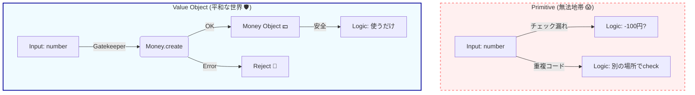

# 第31章：Value Object入門：値そのものが主役💎

## 0. この章のゴール🎯✨

この章が終わると…

* 「**VOって何？**」を**一言で説明**できる🗣️💎
* “ただの `number` / `string`” を卒業して、**意味のある型**を作れる🧱➡️💎
* **バリデーション（ルール）を散らさず**、1か所に閉じ込められる🔒
* 「この値、等しいってどう判断する？」が**迷わなくなる**⚖️✨

---

## 1. まずは超ざっくり：VOってなに？💎🌸


**Value Object（値オブジェクト）**は、

> ✅ **“値そのもの” に意味とルールを持たせたもの**

です💎✨

たとえばカフェで…

* `price: number`（え、これは円？税込？小数OK？🤔）
* `quantity: number`（杯？個？0はOK？🤔）
* `email: string`（空白あり？大文字混ざり？🤔）

みたいな「雑な値」だと、**ルールがあちこちに散らばって事故る**んだよね…😵‍💫💥

VOにするとこうなる👇

* `Money`（円で、負数NGで、計算できる💴✨）
* `Quantity`（最小1、最大99、単位つき📏✨）
* `Email`（正規化して比較できる✉️✨）

図で表すと、安心感が全然違うよ〜！🏰✨



---

## 2. VOが効く理由：バグが“発生しにくい形”になる🛡️✨


VOが強いのは、主にこの3点だよ💪💎

### ✅ (1) ルールを「生成時」に閉じ込められる🔒

「不正な値を**作れない**」ようにするのがVOの基本✨
（後から `if` で守るんじゃなく、**最初から入れない**）

### ✅ (2) どこでも同じ意味になる（文脈が消えない）🧭

`number` は文脈が消えるけど、`Money` は消えない💴
読むだけで「何の数字か」分かるの、めちゃ強い👏

### ✅ (3) “等しさ” がブレない⚖️

VOの「同じ」は、**中身の値が同じ**かどうか。
（IDで比べるのはEntity側の話になるよ🪪 → 41章でやるやつ！）

---

## 3. 例：プリミティブ地獄ってこんな感じ😇🧨

### 😵‍💫 よくある事故


* 金額なのに `-100` が入った
* `10`（税込）と `10`（税抜）が同じ扱いになった
* `quantity = 0` で注文が確定できた
* メールの比較で `A@B.com` と `a@b.com` が別扱いになった

「え、そんなの気をつければ…」って思うじゃん？
でも人間は忘れるし、コードは増えるし、締切は迫るのです…🫠💦

VOはここを**仕組みで止める**感じだよ🛑✨

---

## 4. まず作る「VOの型」：最小テンプレ（超大事）🧩


VOは毎回似た形になるから、まずは**土台**を作ろう💎

ポイントは👇

* `constructor` を `private` にして **勝手に new できない**ようにする🚫
* `static create()` で **検証してから生成**する✅
* フィールドは `readonly` で **不変**にする🧊
* `equals()` で **値で比較**できるようにする⚖️

```ts
// domain/shared/Result.ts（依存ライブラリなしの最小Result）
export type Result<T, E> =
  | { ok: true; value: T }
  | { ok: false; error: E };

export const Ok = <T>(value: T): Result<T, never> => ({ ok: true, value });
export const Err = <E>(error: E): Result<never, E> => ({ ok: false, error });
```

```ts
// domain/shared/ValueObject.ts
export abstract class ValueObject<TProps> {
  protected constructor(protected readonly props: TProps) {}

  equals(other: ValueObject<TProps>): boolean {
    // まずは超シンプルにJSON比較（入門用）✨
    // ※後で洗練できるよ（32章で強化しよう🧊）
    return JSON.stringify(this.props) === JSON.stringify(other.props);
  }
}
```

> 💡 入門では「まず動く形」が大事！
> 32章で「VOの鉄則（不変・等価性・自己完結）」をガッツリ固めるよ🧊✨

---

## 5. カフェ例題でVO候補を見つけよう☕🔍

VO候補は、だいたいこの匂いがするよ👃✨

### ✅ VO候補チェックリスト（超便利）📝💎


* その `string/number` に **ルール**がある（形式・範囲・単位）
* その値は **同じ値なら同じ意味**（IDじゃない）
* その値は **正規化したい**（空白除去、小文字化など）
* その値の操作が増えそう（足す、引く、比較する…）

### ☕ カフェ注文だと…

* `Money`（金額）💴
* `Quantity`（数量）📏
* `Email`（メール）✉️
* `OrderNote`（備考：長さ制限とか）📝
* `CouponCode`（クーポンコード）🏷️
* `TaxRate`（税率）📌

※ `OrderId` は「値」っぽいけど、**Entityの同一性**と絡むので、ここでは“予告編”くらいでOK🪪✨（本格的には41章以降！）

---

## 6. ミニVOを3つ作ってみる💎💪（入門版）

### 6-1) MoneyLite：とりあえず「負数NG・整数」💴

（本格版は33章でやるよ！ここは導入✨）

```ts
import { ValueObject } from "../shared/ValueObject";
import { Result, Ok, Err } from "../shared/Result";

type MoneyError = "negative" | "not-integer";

export class MoneyLite extends ValueObject<{ yen: number }> {
  private constructor(yen: number) {
    super({ yen });
  }

  static create(yen: number): Result<MoneyLite, MoneyError> {
    if (!Number.isInteger(yen)) return Err("not-integer");
    if (yen < 0) return Err("negative");
    return Ok(new MoneyLite(yen));
  }

  get yen(): number {
    return this.props.yen;
  }

  add(other: MoneyLite): MoneyLite {
    // 不変なので「新しいインスタンス」を返す🧊
    return new MoneyLite(this.yen + other.yen);
  }
}
```

### 6-2) QuantityLite：最小1・最大99📏

```ts
import { ValueObject } from "../shared/ValueObject";
import { Result, Ok, Err } from "../shared/Result";

type QuantityError = "too-small" | "too-large" | "not-integer";

export class QuantityLite extends ValueObject<{ value: number }> {
  private constructor(value: number) {
    super({ value });
  }

  static create(value: number): Result<QuantityLite, QuantityError> {
    if (!Number.isInteger(value)) return Err("not-integer");
    if (value < 1) return Err("too-small");
    if (value > 99) return Err("too-large");
    return Ok(new QuantityLite(value));
  }

  get value(): number {
    return this.props.value;
  }
}
```

### 6-3) EmailLite：正規化して比較できる✉️

```ts
import { ValueObject } from "../shared/ValueObject";
import { Result, Ok, Err } from "../shared/Result";

type EmailError = "invalid-format";

export class EmailLite extends ValueObject<{ normalized: string }> {
  private constructor(normalized: string) {
    super({ normalized });
  }

  static create(raw: string): Result<EmailLite, EmailError> {
    const normalized = raw.trim().toLowerCase();

    // 入門用の超ラフ判定（本格化は35章で！）
    if (!normalized.includes("@")) return Err("invalid-format");

    return Ok(new EmailLite(normalized));
  }

  get value(): string {
    return this.props.normalized;
  }
}
```

---

## 7. VOを使うとユースケースが気持ちよくなる🎬✨


たとえば「注文の明細を追加する」ときに…

* 入力で `quantity: number` を受け取って
* あちこちで `if (quantity <= 0)` が増える…

よりも👇

* 最初に `QuantityLite.create()` して
* 成功した **QuantityLite** だけをドメインに渡す

これだけで、**ドメイン側の “余計な防御コード” が減る**よ🛡️✨
（結果として読みやすくなるし、仕様漏れも減る🎉）

---

## 8. テストもラクになる🧪💎

VOは「小さく」「閉じてる」から、テストが超書きやすいよ✨
最近の流れだと **Vitest** が軽快で人気（Vitest 4系が出てる）🧪⚡ ([Vitest][2])

```ts
import { describe, it, expect } from "vitest";
import { QuantityLite } from "./QuantityLite";

describe("QuantityLite", () => {
  it("1〜99は作れる", () => {
    const r = QuantityLite.create(3);
    expect(r.ok).toBe(true);
    if (r.ok) expect(r.value.value).toBe(3);
  });

  it("0は作れない", () => {
    const r = QuantityLite.create(0);
    expect(r.ok).toBe(false);
    if (!r.ok) expect(r.error).toBe("too-small");
  });
});
```

---

## 9. AIの使いどころ（この章の勝ちパターン）🤖💎

AIは「答えを出させる」より、**候補出し・漏れ探し・言語化**が強いよ✨

### ✅ VO候補の洗い出し用プロンプト

* 「カフェ注文ドメインで、`string/number` のままだと事故る値を10個挙げて。各候補に“事故例”も1つ付けて」

### ✅ ルール言語化プロンプト

* 「Quantityのルールを、初心者にも分かる日本語で3行にして。NG例も2つ」

### ✅ テスト漏れ検出プロンプト

* 「MoneyLite/QuantityLite/EmailLite のテスト観点の抜けを指摘して。境界値中心で」

---

## 10. よくある失敗（この章で先に潰す）😂⚠️

### ❌ 失敗1：VOなのにsetterがある

→ それ、ただのクラス化で、VOの強み（不変）が消える🧊💥

### ❌ 失敗2：VOがDBやAPIの都合を知ってる

→ VOは「ドメインのルールの箱」📦
I/O都合は境界（DTOなど）に寄せる（28章でやった感覚ね）📦✨

### ❌ 失敗3：VOが巨大化して何でも屋になる

→ これは38章でめっちゃ丁寧に扱うよ⚖️
この章では「小さく、強く」💎✨

---

## 11. まとめ🎀✨

* VOは「**値に意味とルールを持たせる**」道具💎
* `constructor private` ＋ `static create()` で **不正な値を作れなくする**🔒
* `readonly` と “新規生成” で **不変を守る**🧊
* 値で比較（equals）できると **仕様が明確になる**⚖️
* テストが小さく強くなる🧪💎

そして最新のTypeScriptは **5.9.3 が安定版として配布**されていて、将来に向けては **ネイティブ実装のプレビュー（TypeScript Native Previews / TypeScript 7系の流れ）**も進んでるよ🚀（ただし教材は安定版前提でOK） ([npm][1])

---

## 12. 次章の予告📣

次は **第32章「VOの鉄則：不変・等価性・自己完結」🧊**！
ここでVOを“本物”に仕上げて、バグ除去装置にしていくよ💎🛡️✨

[1]: https://www.npmjs.com/package/typescript?activeTab=versions&utm_source=chatgpt.com "typescript"
[2]: https://vitest.dev/blog/vitest-4?utm_source=chatgpt.com "Vitest 4.0 is out!"
