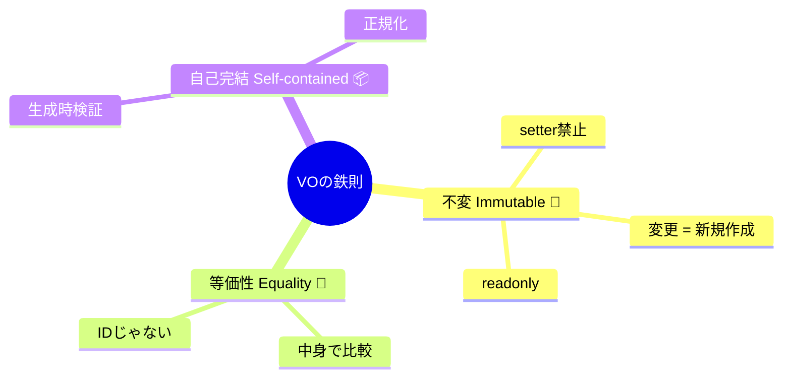

# 第32章：VOの鉄則：不変・等価性・自己完結🧊

## この章のゴール🎯✨

この章が終わると、あなたは…

* 「VOのつもり」じゃなく、**ちゃんとVOなクラス**を作れる💎
* **変更＝新しく作る**が自然にできる🧊
* **equals（等価性）**を迷わず書ける🤝
* VOに「余計な責務」を入れない判断ができる⚖️

ちなみに、現時点のTypeScriptは GitHub Releases 上では **TypeScript 5.9.3 が “Latest”** として表示されています。([GitHub][1])
（Release Notesページも 2026-02-04 更新になってます。）([TypeScript][2])

この章の要点をマインドマップにまとめたよ！🧠⚡



---

## まず結論：VOの鉄則はこの3つ🧊💎


### 鉄則① 不変（Immutable）🧊


**一度作ったら中身を変えない**。変えたいなら **新しいVOを作る**。

* ✅ OK：`note = OrderNote.create("...")`（新規生成）
* ❌ NG：`note.text = "..."`（書き換え）

VOは「安全な値のカプセル」なので、書き換えできると一気に事故ります😵‍💫
DDDの説明でも、VOは **不変**が重要な特徴として繰り返し言われます。([Microsoft Learn][3])

**TypeScriptでのコツ🧡**

* フィールドは `private readonly`
* setter禁止（そもそも書かない）
* さらに堅くしたいなら **`Object.freeze(this)`**（ランタイムでも凍らせる）🧊
  ※深いオブジェクトを凍らせるなら “deep freeze” になるけど、循環参照があると無限ループ注意だよ、ってMDNも言ってます⚠️([developer.mozilla.org][4])

---

### 鉄則② 等価性（Equality）🤝


VOは「同一性（ID）」じゃなくて、**中身の値で同じかどうか**を決めるよ✨
同じ値なら「同じもの」として扱える、っていう感じ。

* ✅ OK：`Money(100 JPY)` と `Money(100 JPY)` は等しい
* ❌ NG：参照（`===`）で同一判定しちゃう

VOは「値が重要で入れ替え可能」なので、**等価性は“値ベース”**が基本です。([vaadin.com][5])

**TypeScriptでのコツ🧡**

* `equals(other)` を用意する
* 比較は「正規化済みの中身」でやる（後述の自己完結とセット）

---

### 鉄則③ 自己完結（Self-contained）🏡✨


VOは **自分のルールを自分で守る**。
つまり…

* 生成時に **バリデーション**する✅
* 生成時に **正規化（normalize）**する✅
* DBやAPIや日時取得みたいな「外部の都合」は持ち込まない❌

VOは “小さなドメインの砦” 🏯💎
ここが崩れると「ルールが散らばって」第24章の悲劇（バリデーション迷子）に逆戻りします🥲

---

## よくある「VOっぽいけどダメ」例😂⚠️

### ❌ 1) setterがある

* いつでも値を書き換えられる → 不変が死ぬ🪦

### ❌ 2) equalsがない（or 参照比較してる）

* `===` 比較しちゃって「同じ値なのに別物」扱いになり混乱😵‍💫

### ❌ 3) 正規化が外に漏れてる

* 呼び出し側が毎回 `trim()` し始める → ルール散乱🌪️

### ❌ 4) 外部依存を持つ

* VOがDB/HTTP/Clockを触る → 役割が重すぎて崩壊💥

---

## ハンズオン：ミニVOを作ろう🎮✨（OrderNote VO）

「注文のメモ（備考）」をVOにしてみます📝
ルールはこんな感じでいきましょ👇

* 前後の空白はトリム（正規化）✨
* 空文字はダメ🙅‍♀️
* 140文字まで（長すぎ禁止）✂️
* 改行はダメ（UIやログが崩れやすい）🚫

---

## 1) Result型（失敗を型で返す）📦

（第23章の “Result型” を軽量に使うミニ実装だよ🧡）

```ts
export type Result<T, E> =
  | { ok: true; value: T }
  | { ok: false; error: E };

export const ok = <T>(value: T): Result<T, never> => ({ ok: true, value });
export const err = <E>(error: E): Result<never, E> => ({ ok: false, error });
```

---

## 2) ドメインエラー（VO生成失敗）🧯

```ts
export class DomainError extends Error {
  constructor(message: string) {
    super(message);
    this.name = "DomainError";
  }
}

export class InvalidOrderNoteError extends DomainError {
  constructor(message: string) {
    super(message);
    this.name = "InvalidOrderNoteError";
  }
}
```

---

## 3) OrderNote VO本体🧊💎


ポイントはここ👇

* constructorは `private`（外から勝手に作らせない）
* `create()` で検証＆正規化
* `private readonly` で不変
* `Object.freeze(this)` で“うっかり変更”も防ぎやすく🧊
* `equals()` は値ベース🤝

```ts
import { Result, ok, err } from "./result";
import { InvalidOrderNoteError } from "./errors";

export class OrderNote {
  private readonly _value: string;

  private constructor(normalized: string) {
    this._value = normalized;
    Object.freeze(this); // ランタイムでも凍結🧊（好みでOK）
  }

  get value(): string {
    return this._value;
  }

  toString(): string {
    return this._value;
  }

  equals(other: OrderNote): boolean {
    return this._value === other._value;
  }

  static create(raw: string): Result<OrderNote, InvalidOrderNoteError> {
    const normalized = raw.trim();

    if (normalized.length === 0) {
      return err(new InvalidOrderNoteError("メモは空にできません🙅‍♀️"));
    }
    if (normalized.length > 140) {
      return err(new InvalidOrderNoteError("メモは140文字までです✂️"));
    }
    if (normalized.includes("\n") || normalized.includes("\r")) {
      return err(new InvalidOrderNoteError("メモに改行は使えません🚫"));
    }

    return ok(new OrderNote(normalized));
  }

  // 「変更」は新しいVOを返す🧊✨
  append(text: string): Result<OrderNote, InvalidOrderNoteError> {
    return OrderNote.create(this._value + text);
  }
}
```

`Object.freeze` は「不変を“気持ち”じゃなく仕組みで守る」寄りの選択肢です🧊（深い構造を凍らせるなら注意点もあるよ、というのがMDNの話でした。）([developer.mozilla.org][4])

---

## 4) テスト（Vitest想定）🧪✨

VOはテストが超ラク！「生成」「失敗」「等価性」だけで強いです💪

```ts
import { describe, it, expect } from "vitest";
import { OrderNote } from "./OrderNote";

describe("OrderNote", () => {
  it("前後の空白をトリムして生成できる✨", () => {
    const r = OrderNote.create("  hello  ");
    expect(r.ok).toBe(true);
    if (r.ok) {
      expect(r.value.value).toBe("hello");
    }
  });

  it("空文字は失敗🙅‍♀️", () => {
    const r = OrderNote.create("   ");
    expect(r.ok).toBe(false);
  });

  it("改行は失敗🚫", () => {
    const r = OrderNote.create("hi\nthere");
    expect(r.ok).toBe(false);
  });

  it("等価性：同じ値なら equals は true🤝", () => {
    const a = OrderNote.create("hi");
    const b = OrderNote.create("hi");
    expect(a.ok && b.ok).toBe(true);

    if (a.ok && b.ok) {
      expect(a.value.equals(b.value)).toBe(true);
    }
  });

  it("変更：append は新しいVOを返す🧊", () => {
    const a = OrderNote.create("hi");
    expect(a.ok).toBe(true);

    if (a.ok) {
      const b = a.value.append("!");
      expect(b.ok).toBe(true);

      if (b.ok) {
        expect(a.value.value).toBe("hi");
        expect(b.value.value).toBe("hi!");
      }
    }
  });
});
```

---

## この章の“判断基準”チェックリスト✅✨


VOを書いたら、これを自分に聞いてみてね👇

* ✅ フィールドは `private readonly` ？
* ✅ setter（値を書き換える口）が存在しない？
* ✅ 生成時に **必ず** バリデーションしてる？
* ✅ 生成時に正規化して、呼び出し側に `trim()` を押し付けてない？
* ✅ `equals()` が “値ベース” になってる？
* ✅ 外部依存（DB/HTTP/Clock）に触ってない？
* ✅ “変更”は「新しいVOを返す」になってる？

---

## AI活用（Copilot / Codex / ChatGPT）🤖✨：おすすめプロンプト集

そのままコピペでOKだよ🧡（※コードは自分の方針に合わせて最終判断ね！）

* 💎 **VOのルール固め**

  * 「OrderNote の不変条件を箇条書きで。入力の揺れ（空白/改行/長文）も含めて🙂」
* 🧊 **正規化提案**

  * 「このVOでやるべき正規化は？ trim以外も候補出して。やりすぎも指摘して⚖️」
* 🤝 **equals設計**

  * 「VOの equals を値ベースで書きたい。将来複合VOになった時の注意点も教えて」
* 🧪 **テスト追加**

  * 「境界値テストを増やしたい。抜けやすいケースを10個ちょうだい🧪」

---

## 小課題（やると定着するやつ）🎓💡

次のどれか1つだけでOK！✨（全部やると強い💪）

1. **CouponCode VO** 🎟️

* ルール：英数字と `-` のみ、最大20文字、全部大文字に正規化、空はNG
* `equals` は正規化後の値で比較

2. **Percent VO** 📊

* 0〜100 のみ、少数は小数第2位まで（丸めは“生成時”に統一！）

3. **MenuItemName VO** ☕

* 先頭/末尾空白削除、連続スペースを1つに、最大50文字

---

## 次章へのつながり🚀💴

この章の鉄則が固まると、次の **Money VO（第33章）** がめちゃ気持ちよく書けます💴✨
（通貨・丸め・0禁止？みたいな“地雷”こそVOの出番！）

必要なら、いまの例題（カフェ注文）に合わせて「OrderNote以外のVO候補」も一緒に洗い出して、学習が加速する形に整えるよ〜☕🌸

[1]: https://github.com/microsoft/typescript/releases "Releases · microsoft/TypeScript · GitHub"
[2]: https://www.typescriptlang.org/docs/handbook/release-notes/typescript-5-9.html "TypeScript: Documentation - TypeScript 5.9"
[3]: https://learn.microsoft.com/en-us/dotnet/architecture/microservices/microservice-ddd-cqrs-patterns/implement-value-objects?utm_source=chatgpt.com "Implementing value objects - .NET"
[4]: https://developer.mozilla.org/en-US/docs/Web/JavaScript/Reference/Global_Objects/Object/freeze?utm_source=chatgpt.com "Object.freeze() - JavaScript - MDN Web Docs"
[5]: https://vaadin.com/blog/ddd-part-2-tactical-domain-driven-design?utm_source=chatgpt.com "DDD Part 2: Tactical Domain-Driven Design"
