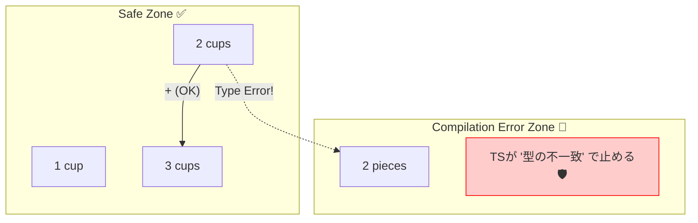

# 第34章：Quantity VO：数量と単位📏

この章はね、「**2**」って数字だけじゃ足りないよね？って話だよ〜😊
たとえば同じ「2」でも…

* ☕ 2杯（ドリンク）
* 🍪 2個（クッキー）
* 🧊 2g（砂糖）

…ぜんぶ意味が違うのに、ただの number で持つと混ざって事故るの🥲💥
だから **Quantity（数量）を Value Object にして、単位ごと閉じ込める**よ〜💎📦

---

## 今日のゴール🎯💖

できるようになること👇

* ✅ Quantity VO を作って「数量＋単位」を一体で扱える
* ✅ **単位が違う数量は足せない**（コンパイルで止める🛑）
* ✅ 数量のルール（最小1、最大、整数限定など）を **生成時に強制**できる
* ✅ テストで「壊れないQuantity」を作れる🧪✨

---

## まず“最新状況”ちょいメモ🗞️👀（安心のため）

* TypeScript の安定版は「5.9」になってるよ（公式ダウンロードページに “currently 5.9” って明記）。([TypeScript][1])
* TypeScript はネイティブ実装（TypeScript 7）へ移行中で、2025年末時点で進捗が公式から出てるよ（高速化が本格的に進んでる流れ）。([Microsoft for Developers][2])
* テストは Vitest 4 が 2025年10月に出てて、移行ガイドも整ってる。([Vitest][3])

この章の内容は、いま安定して使える機能だけで組むね😊

---

## Quantity VO の設計方針（超だいじ）🧠✨

### 1) Quantity は「値＋単位」のセット🧩

* value: 数量（例：2）
* unit: 単位（例：cup / piece）

この2つが分離してると、UIやDTOで unit を落とした瞬間に事故る😇

### 2) “数えられる単位”は整数が基本🔢

* cup（杯）/ piece（個）みたいな **カウント系**は整数が自然
* g / ml みたいな **計量系**は小数が出る（でも float は地雷🧨）

今回はまずカウント系中心で作って、拡張の道も用意するよ〜🚪✨

### 3) 生成時にルールを全部チェック✅

VOの鉄則どおり、**作れた時点で正しい**状態にする💎
（あとから setter で直す、とかはやらない🙅‍♀️）

---

## 実装してみよ〜💻🌸（Quantity VO）

ファイル例：`src/domain/valueObjects/Quantity.ts`

```ts
// Quantity.ts

// まず「単位」を型にするよ〜📏✨
export const COUNT_UNITS = ["cup", "piece"] as const;
export type CountUnit = (typeof COUNT_UNITS)[number];

// 将来、g / ml を増やすならここを拡張していく感じ👶➡️🧑‍💻
export type Unit = CountUnit;

function isFiniteNumber(v: number): boolean {
  return Number.isFinite(v);
}

export class Quantity<U extends Unit = Unit> {
  private constructor(
    public readonly value: number,
    public readonly unit: U,
  ) {
    Object.freeze(this); // うっかり変更防止🧊
  }

  // ✅ 生成は必ずここから（ルールを強制）
  static of<U extends Unit>(value: number, unit: U): Quantity<U> {
    if (!isFiniteNumber(value)) {
      throw new Error("Quantity: value must be a finite number");
    }

    // カウント系は整数が基本🔢
    if (!Number.isInteger(value)) {
      throw new Error("Quantity: count-based value must be an integer");
    }

    // 例：最小1、最大99（例題向けに現実っぽく）
    if (value < 1) {
      throw new Error("Quantity: value must be >= 1");
    }
    if (value > 99) {
      throw new Error("Quantity: value must be <= 99");
    }

    return new Quantity(value, unit);
  }

  // ✅ 等価性：値＋単位が同じなら同じ💎
  equals(other: Quantity<Unit>): boolean {
    return this.value === other.value && this.unit === other.unit;
  }

  // ✅ 同じ単位のときだけ足せる（型で守る✨）
  add(other: Quantity<U>): Quantity<U> {
    return Quantity.of(this.value + other.value, this.unit);
  }

  // ✅ 同じ単位のときだけ引ける（結果が0以下は禁止にする例）
  subtract(other: Quantity<U>): Quantity<U> {
    const next = this.value - other.value;
    return Quantity.of(next, this.unit);
  }

  // 画面表示用（単位の日本語表示はドメイン外でもOKだけど、簡易でここに置く例）
  // 本気なら「表示」はUI層に寄せてもOKだよ😊
  toLabel(): string {
    switch (this.unit) {
      case "cup":
        return `${this.value}杯`;
      case "piece":
        return `${this.value}個`;
      default:
        // Unit を増やした時にここが型エラーで気づけるのが嬉しい✨
        return `${this.value} ${this.unit}`;
    }
  }
}
```

---

## “単位が違うのに足す”を止めたい！🛑💥（型の勝利🏆）

```ts
import { Quantity } from "./Quantity";

const cups = Quantity.of(2, "cup");     // Quantity<"cup">
const pieces = Quantity.of(2, "piece"); // Quantity<"piece">

const ok = cups.add(Quantity.of(1, "cup")); // ✅ OK

// const ng = cups.add(pieces);
//      ^^^^^^ ❌ ここがコンパイルで止まる（単位が違うから）
```

これが **“プリミティブ地獄からの脱出”**の気持ちよさだよ〜😭✨



---

## 例題（カフェ）に入れてみる☕🧾💕

たとえば注文明細（OrderLine）に quantity を入れるとき👇

```ts
import { Quantity } from "../valueObjects/Quantity";

export class OrderLine {
  constructor(
    public readonly menuItemId: string,
    public readonly quantity: Quantity<"cup">, // ☕は杯だけ許可！って縛れる
  ) {
    Object.freeze(this);
  }
}
```

* 「クッキーは piece、ドリンクは cup」みたいに **商品カテゴリで縛る**のもアリだよ🍪☕
* こういう縛りは、あとで仕様が増えても強い💪✨

---

## テストしよ〜🧪✨（Vitest 4）

ファイル例：`src/domain/valueObjects/Quantity.test.ts`

```ts
import { describe, it, expect } from "vitest";
import { Quantity } from "./Quantity";

describe("Quantity", () => {
  it("creates a valid count quantity", () => {
    const q = Quantity.of(2, "cup");
    expect(q.value).toBe(2);
    expect(q.unit).toBe("cup");
  });

  it("rejects non-integers for count units", () => {
    expect(() => Quantity.of(1.5, "cup")).toThrow();
  });

  it("rejects zero or negative values", () => {
    expect(() => Quantity.of(0, "cup")).toThrow();
    expect(() => Quantity.of(-1, "cup")).toThrow();
  });

  it("adds only same unit", () => {
    const a = Quantity.of(2, "cup");
    const b = Quantity.of(3, "cup");
    expect(a.add(b).equals(Quantity.of(5, "cup"))).toBe(true);
  });
});
```

Vitest 4 は 2025年後半からメジャーとして整備が進んでるよ。([Vitest][3])

---

## “型で落とす”テストもやりたい（tscで守る）🧠🛡️

Vitestは実行時テストだけだから、**コンパイルで落ちること**は別でチェックすると安心💖

ファイル例：`src/type-tests/quantity.type-test.ts`

```ts
import { Quantity } from "../domain/valueObjects/Quantity";

const cups = Quantity.of(2, "cup");
const pieces = Quantity.of(2, "piece");

// @ts-expect-error 単位が違うのに足し算は禁止
cups.add(pieces);
```

そして CI か手元でこれ👇

```bash
npx tsc -p tsconfig.json --noEmit
```

“単位が混ざる事故”を **コンパイルで防ぐ仕組み**が完成〜🎉✨

---

## よくある落とし穴（ここで回避😇⚠️）

### 🥲 1) quantity を number に戻しちゃう

DTOやDBに出すとき、うっかり value だけ出して unit を落とす…あるある💥
→ DTOは `{ value, unit }` の形で持つクセをつけよ🧾✨

### 🥲 2) 単位変換を Quantity の中に入れすぎる

「cup→mlもできるよ！」とかやり始めると、VOが太る🍔💦
→ 変換は **別のサービス**（Domain Service/Policy）に逃がすのがキレイ✨

### 🥲 3) 計量（g / ml）を number の小数で雑に扱う

JSの number は浮動小数で地雷がある🧨
→ 計量系は「最小単位（例：mg）で整数保持」や、decimal系を検討するのが安全だよ💡

---

## 表示（単位の整形）どうする？🖥️✨

標準の単位（gram, liter みたいな国際的な単位）なら、Intl の仕様にも “単位識別子” があるよ。([TC39][4])
ただし「杯」「個」みたいなドメイン単位は標準じゃないことも多いから、**自前マッピング**が無難💕

---

## 未来メモ：JS/TSで「単位付き数値」を標準化したい動き🌍📦

* 「値＋単位」を扱う提案として、TC39に Amount の提案があるよ（unit などを持てる構想）。([GitHub][5])
* TypeScript側でも “Units of Measure” 的なアイデア提案はあるけど、現状は言語機能としては入ってない（提案レベル）。([GitHub][6])

だから今は、**DDDのVOで堅牢に作る**のがいちばん現実的だよ〜💎✨

---

## ミニ演習（手を動かすと最強💪🧠）

### 演習1：上限/下限を“単位ごと”に変える🎚️

* cup は 1〜99
* piece は 1〜20
  みたいに、unitで条件を変えてみよ😊

### 演習2：multiply（×）を追加する✖️

* Quantity.of(2,"cup").multiply(3) → 6杯
* 0や負数は拒否🙅‍♀️

### 演習3：OrderLine のルールに入れる🧾🔒

* 「同じメニューは1行にまとめる（数量加算）」
* 「支払い後は数量変更禁止」
  このへん、前の章の不変条件とつなげられるよ〜✨

---

## AIに頼むと強いプロンプト例🤖💬💖

### ✅ ルール洗い出し

「カフェ注文の数量（杯/個）に関して、現実的な不正ケースを20個出して。境界値もお願い」

### ✅ テスト観点

「Quantity VO のテストケースを AAA 形式で列挙して。正常系/異常系/境界値を混ぜて」

### ✅ 設計レビュー

「この Quantity 実装の弱点を DDD（VOの鉄則：不変/等価性/自己完結）観点でレビューして」

---

## 章のまとめ🎀✨

* Quantity は「number」じゃなくて **意味のある値（数量＋単位）**として扱う📏
* **生成時にバリデーション**して “正しいものだけ存在する世界” を作る🔒
* **単位違いの計算を型で止める**のがめちゃ強い🛡️
* 表示や変換は入れすぎ注意！VOはスリムが正義💎

---

次の第35章は「Email VO」だよね✉️✨
Quantityで「入力のゆらぎを吸収する感覚」ができたから、Emailはさらに気持ちよくなるよ〜😊🎉

[1]: https://www.typescriptlang.org/download/?utm_source=chatgpt.com "How to set up TypeScript"
[2]: https://devblogs.microsoft.com/typescript/progress-on-typescript-7-december-2025/?utm_source=chatgpt.com "Progress on TypeScript 7 - December 2025"
[3]: https://vitest.dev/blog/vitest-4?utm_source=chatgpt.com "Vitest 4.0 is out!"
[4]: https://tc39.es/ecma402/?utm_source=chatgpt.com "ECMAScript® 2026 Internationalization API Specification"
[5]: https://github.com/tc39/proposal-amount?utm_source=chatgpt.com "tc39/proposal-amount: Numbers with precision and a unit ..."
[6]: https://github.com/dsherret/Units-of-Measure-Proposal-for-TypeScript/blob/master/README.md?utm_source=chatgpt.com "Units-of-Measure-Proposal-for-TypeScript/README.md at ..."
