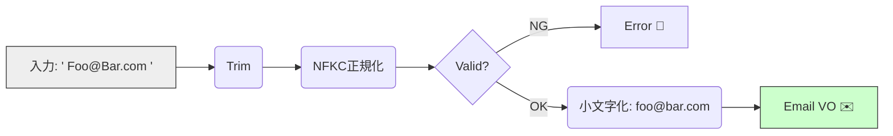

# 第35章：Email VO：形式＋正規化✉️

この章は、「メールアドレスのゆらぎ（大文字・空白・全角）を、**ドメインのルールとして一箇所に閉じ込める**」回だよ〜💎🧊
地味だけど、ここが弱いと **重複ユーザー・ログイン不能・問い合わせ地獄**が起きがち…😇💥

---

## 1) Emailって、なんでそんなに難しいの？😵‍💫📮


### ✅「完全RFC準拠」より「プロダクトとして正しい」を選ぶことが多いよ🍰

メール仕様（RFC）は超広いけど、現実はこう👇

* ブラウザの`<input type="email">`ですら、RFC 5322そのままではなく **“わざと違う仕様”**で動いてる（実務の都合）📌 ([HTML Living Standard][1])
* **正規表現でガチガチに縛るほど事故る**（`+`サブアドレス、長い新gTLD、国際化メールなど）😇 ([JP-CERT/CC][2])
* そして結局「届くかどうか」は **メール送って確認**が一番確実📨（形式チェックだけでは限界） ([JP-CERT/CC][2])

---

## 2) Email VOに “入れる責務” と “入れない責務” 🔥🧊


### ✅ 入れる（VOの責務）💎

* **正規化（ゆらぎ吸収）**：前後空白、全角→半角、ドメイン小文字化 など✨
* **形式チェック（最低限）**：`@`がある、長さ制限、空白混入NG など🧯
* **等価性（同じメールか）**：比較ルールを固定📌

### ❌ 入れない（ここでやると破滅しやすい）😇

* “存在するメールか”の確認（MX参照やSMTPで確認など）→運用地雷⚠️
* Gmailだけ特別扱い（`.`無視や`+`除去）→ **他プロバイダで事故**になりがち

  * ちなみにGmailは「ドット無視」を公式に言ってるけど、**一般化は危険**だよ〜🫠

---

## 3) まず決めるルール（この章のおすすめ方針）🧭✨

ここではプロダクトでよくある「ログイン/連絡先」向けに、こうするよ👇

処理の流れはこうなるね🌊




* **canonical（比較・保存用）**：

  * `trim`
  * `NFKC`で全角ゆらぎ吸収（例：`＠`→`@`）
  * **全体を小文字化**（実務ではこれが多い！）

    * 仕様上はローカル部（`@`の左）は大文字小文字を区別できるけど、そういう運用は推奨されにくい📌 ([IETF][3])
* **display（表示用）**：入力を整えたもの（必要なら元の見た目も保持）🎀

長さ制限も入れるよ👇

* ローカル部は **最大64オクテット**
* ドメインは **最大255オクテット**
* パス全体には制限があるので、実務では「全体254文字まで」みたいに置くことが多い📏 ([RFC エディタ][4])

---

## 4) 実装してみよう（Email VO）💻✨

### 4-1) Result型（最小）📦

```ts
// domain/shared/result.ts
export type Ok<T> = { ok: true; value: T };
export type Err<E> = { ok: false; error: E };
export type Result<T, E> = Ok<T> | Err<E>;

export const ok = <T>(value: T): Ok<T> => ({ ok: true, value });
export const err = <E>(error: E): Err<E> => ({ ok: false, error });
```

VO生成に失敗したとき、例外よりも扱いやすいことが多いよ〜🧸✨

---

### 4-2) EmailError（失敗の種類を固定）🧯

```ts
// domain/email/email-error.ts
export type EmailError =
  | { kind: "empty" }
  | { kind: "contains_whitespace" }
  | { kind: "missing_at" }
  | { kind: "multiple_at" }
  | { kind: "too_long"; max: number; actual: number }
  | { kind: "local_too_long"; max: number; actual: number }
  | { kind: "domain_too_long"; max: number; actual: number }
  | { kind: "invalid_format" }
  | { kind: "non_ascii_not_allowed" };
```

---

### 4-3) Email VO本体 💎✉️


```ts
// domain/email/email.ts
import { Result, ok, err } from "../shared/result";
import { EmailError } from "./email-error";

type EmailCreateOptions = {
  allowUtf8?: boolean;          // 国際化メールを許可するか（この章では基本false推奨）
  maxLength?: number;           // 実務では 254 が多い
};

export class Email {
  private constructor(
    private readonly canonical: string, // 比較・保存用（正規化済み）
    private readonly display: string,   // 表示用（軽い整形）
  ) {}

  static create(input: string, opts: EmailCreateOptions = {}): Result<Email, EmailError> {
    const allowUtf8 = opts.allowUtf8 ?? false;
    const maxLength = opts.maxLength ?? 254;

    const raw = (input ?? "").trim();
    if (raw.length === 0) return err({ kind: "empty" });

    // 全角ゆらぎ吸収（例：＠、全角英数など）
    const normalized = raw.normalize("NFKC");

    // 途中に空白・改行が混ざるのは事故りやすいのでNG（入力ミス検出）
    if (/\s/.test(normalized)) return err({ kind: "contains_whitespace" });

    // @ の数チェック
    const firstAt = normalized.indexOf("@");
    if (firstAt === -1) return err({ kind: "missing_at" });
    if (firstAt !== normalized.lastIndexOf("@")) return err({ kind: "multiple_at" });

    // 長さ（※ここは「文字数」だけど、ASCII運用ならほぼOK）
    if (normalized.length > maxLength) {
      return err({ kind: "too_long", max: maxLength, actual: normalized.length });
    }

    const local = normalized.slice(0, firstAt);
    const domain = normalized.slice(firstAt + 1);

    if (local.length === 0 || domain.length === 0) return err({ kind: "invalid_format" });
    if (local.length > 64) return err({ kind: "local_too_long", max: 64, actual: local.length });
    if (domain.length > 255) return err({ kind: "domain_too_long", max: 255, actual: domain.length });

    // ASCII縛り（実務で一番安定しやすい）
    // 国際化メール（SMTPUTF8）もあるけど、対応してないサーバもまだあるよ〜📮🧨
    if (!allowUtf8) {
      if (!isAscii(local) || !isAscii(domain)) return err({ kind: "non_ascii_not_allowed" });
    }

    // 形式チェック（“よくあるメール”を通す程度に）
    if (!looksLikeReasonableEmail(local, domain, { allowUtf8 })) {
      return err({ kind: "invalid_format" });
    }

    // ★ 比較・保存用 canonical：全体を小文字に（運用上これが楽）
    // ローカル部の大小は仕様上区別可能だけど、そういう運用は避けるべきとされがち📌
    const canonical = (local + "@" + domain).toLowerCase();
    const display = local + "@" + domain.toLowerCase();

    return ok(new Email(canonical, display));
  }

  /** DB保存や一意判定に使う値 */
  value(): string {
    return this.canonical;
  }

  /** UI表示など “見せる用” */
  toDisplayString(): string {
    return this.display;
  }

  equals(other: Email): boolean {
    return this.canonical === other.canonical;
  }
}

function isAscii(s: string): boolean {
  return /^[\x00-\x7F]+$/.test(s);
}

function looksLikeReasonableEmail(
  local: string,
  domain: string,
  opts: { allowUtf8: boolean }
): boolean {
  // local：ドット連続や先頭末尾ドットは弾く（事故りやすい）
  if (local.startsWith(".") || local.endsWith(".")) return false;
  if (local.includes("..")) return false;

  // local：よくある文字だけ許可（+ もOKにするのが現代的✨）
  // ※ガチRFCの全部はやらない（やるほど事故りやすい）
  if (!opts.allowUtf8) {
    if (!/^[a-zA-Z0-9.!#$%&'*+/=?^_`{|}~-]+$/.test(local)) return false;
  } else {
    // UTF-8許可時はここを緩める（ただし運用注意）
    if (/[<>\(\)\[\]\\,;:\s"]/.test(local)) return false;
  }

  // domain：最低1つドット（TLDっぽさ）
  // ただし社内メール等でドット無しがあり得るなら、ここは方針次第で外す🙆‍♀️
  if (!domain.includes(".")) return false;

  // domain：ラベルごとのチェック（LDHルールざっくり）
  const labels = domain.split(".");
  if (labels.some((x) => x.length === 0)) return false;
  if (labels.some((x) => x.length > 63)) return false;
  if (labels.some((x) => x.startsWith("-") || x.endsWith("-"))) return false;
  if (!opts.allowUtf8) {
    if (labels.some((x) => !/^[a-zA-Z0-9-]+$/.test(x))) return false;
  }
  return true;
}
```

---

## 5) テスト（VOはテストしやすい〜🧪💎）


### 5-1) 例：Vitestでテスト✨

```ts
// domain/email/email.test.ts
import { describe, it, expect } from "vitest";
import { Email } from "./email";

describe("Email VO", () => {
  it("正規化：前後空白 + ドメイン小文字化", () => {
    const r = Email.create("  Alice@Example.COM  ");
    expect(r.ok).toBe(true);
    if (!r.ok) return;

    expect(r.value.value()).toBe("alice@example.com");
    expect(r.value.toDisplayString()).toBe("Alice@example.com");
  });

  it("正規化：全角＠を吸収（NFKC）", () => {
    const r = Email.create("test＠Example.com");
    expect(r.ok).toBe(true);
    if (!r.ok) return;

    expect(r.value.value()).toBe("test@example.com");
  });

  it("空はダメ", () => {
    const r = Email.create("   ");
    expect(r.ok).toBe(false);
    if (r.ok) return;
    expect(r.error.kind).toBe("empty");
  });

  it("@が複数はダメ", () => {
    const r = Email.create("a@@example.com");
    expect(r.ok).toBe(false);
    if (r.ok) return;
    expect(r.error.kind).toBe("multiple_at");
  });

  it("空白混入はダメ", () => {
    const r = Email.create("a lice@example.com");
    expect(r.ok).toBe(false);
    if (r.ok) return;
    expect(r.error.kind).toBe("contains_whitespace");
  });

  it("等価性：大文字小文字の差は同じ扱い", () => {
    const a = Email.create("ALICE@EXAMPLE.COM");
    const b = Email.create("alice@example.com");
    expect(a.ok && b.ok).toBe(true);
    if (!a.ok || !b.ok) return;

    expect(a.value.equals(b.value)).toBe(true);
  });
});
```

---

## 6) 「最新の注意点」ちょいまとめ（2026の現場っぽい話）🗞️✨

### 6-1) “入力欄のemailチェック”は完璧じゃないよ🙅‍♀️

ブラウザ側の`type="email"`は、「現実的に便利な範囲」で動く設計だよ📌 ([HTML Living Standard][1])
だから **サーバ側（＝ドメイン側）でも最小の守り**は必須〜🛡️✨

### 6-2) 国際化メール（SMTPUTF8）もあるけど…🗺️📮

国際化（EAI）で **非ASCIIのメールアドレス**も規格上はOK（SMTPUTF8）になってるよ📌 ([RFC エディタ][5])
ただ、全部のメールサーバが同じ温度感で対応してるわけじゃないので、プロダクトとしては「まずASCII」から始めるのが無難になりがち😌🧊

### 6-3) Gmailのドット無視・+サブアドレスは“有名すぎる罠”😇

* Gmailは「ドット無視」を公式に案内してるよ📌
* `+`サブアドレスも普及してる（古い正規表現が弾きがち）📌 ([JP-CERT/CC][2])

だから、**Email VOのローカル部は`+`を通す**のが現代的だよ〜✨

### 6-4) デカい正規表現はReDoSの温床になりやすい😱🧨

「メール正規表現コピペ！」は危ないことがあるよ（ReDoS）⚠️ ([OWASP][6])
VOは **軽いチェック＋確認メール**が相性いい👌✨

---

## 7) ライブラリ版（実務でラクしたい人向け）🧰✨


「自前チェックは学習には最高💯」だけど、実務ではライブラリ採用も多いよ〜。
`validator.js`は `isEmail` のオプションが充実してる📦✨ ([npmjs.com][7])

### 例：validator.jsで判定して、VOは正規化と方針に集中💎

```ts
import validator from "validator";
import { Result, ok, err } from "../shared/result";
import { EmailError } from "./email-error";

export class Email {
  private constructor(private readonly canonical: string) {}

  static create(input: string): Result<Email, EmailError> {
    const raw = (input ?? "").trim().normalize("NFKC");
    if (raw.length === 0) return err({ kind: "empty" });
    if (/\s/.test(raw)) return err({ kind: "contains_whitespace" });

    // UTF-8ローカル部を許可するか等、オプションで制御できる✨
    const okSyntax = validator.isEmail(raw, {
      allow_utf8_local_part: false,
      require_tld: true,
    });

    if (!okSyntax) return err({ kind: "invalid_format" });

    return ok(new Email(raw.toLowerCase()));
  }

  value(): string {
    return this.canonical;
  }
}
```

オプション例（UTF-8ローカル部の許可など）が公式に載ってるよ📌 ([npmjs.com][7])

---

## 8) 演習（ミニ課題）🎮✨

### 演習A：要件でルールを切り替えるスイッチをつけよう🔀

* 社内メールは `example@localhost` みたいにドット無しを許可したい？
  → `domain.includes(".")` のルールを設定化してみよ〜🧠✨

### 演習B：ユーザー登録で「確認メール」を前提にする📨✅

* Email VO：形式と正規化だけ
* 登録ユースケース：確認メール送信 → token確認 → 有効化
  これが一番事故りにくい王道👑✨ ([JP-CERT/CC][2])

### 演習C：Emailを“ID扱い”しない設計にしてみる🪪🚫

最近は（特に大手）メールを変えられる流れが進んでるので、**UserId（別の不変ID）を主役**にするのが安心だよ〜😌✨ ([Googleヘルプ][8])

---

## 9) AIの使いどころ（この章は相性よすぎ🤖💕）


ここはAIが強い〜！テストが一気に強くなるよ🧪✨

### ✅ プロンプト例（そのまま使ってOK）📝

* 「メール入力の“壊れ方”を30個作って。空白/改行/全角/ドット連続/サブアドレス/長いTLDなど混ぜて、期待する判定（OK/NG）も付けて」
* 「Email VOの等価性のテスト観点を10個。重複登録バグを潰す方向で」
* 「NFKC正規化のメリデメを、プロダクト観点で短く」

※最後に必ず「このVOが守る範囲」「守らない範囲」をAIに言わせると、設計がブレにくいよ〜🧠✨（OpenAI系ツールでも壁打ち最高🫶）

---

## まとめ 🎀✨

* Emailは「形式チェック」だけだと不十分。でも、**VOに閉じ込めると最強に安定**する💎🧊
* 正規表現で“完璧”を狙うより、**最低限＋確認メール**が現場で強い📨✅ ([JP-CERT/CC][2])
* `+`サブアドレスや長いTLDを弾かないように気をつける👀✨ ([JP-CERT/CC][2])
* 次の「日時VO」は、さらに地雷が多いよ〜⏰🧨（楽しみ！）

---

* [The Verge](https://www.theverge.com/news/850237/google-change-your-gmail-address?utm_source=chatgpt.com)
* [tomshardware.com](https://www.tomshardware.com/software/google-workspace/google-is-allowing-users-to-change-their-gmail-address-as-per-official-google-support-doc-experimental-gmail-feature-rolling-out-in-india-first-no-official-announcement-yet?utm_source=chatgpt.com)
* [timesofindia.indiatimes.com](https://timesofindia.indiatimes.com/technology/tech-tips/not-happy-with-your-old-gmail-address-a-step-by-step-guide-on-how-to-change-it/articleshow/126192409.cms?utm_source=chatgpt.com)

[1]: https://html.spec.whatwg.org/multipage/input.html "HTML Standard"
[2]: https://jpcertcc.github.io/OWASPdocuments/CheatSheets/Authentication.html?utm_source=chatgpt.com "認証に関するチートシート - OWASP"
[3]: https://www.ietf.org/rfc/rfc5321.txt "www.ietf.org"
[4]: https://www.rfc-editor.org/rfc/rfc5321.html "RFC 5321: Simple Mail Transfer Protocol"
[5]: https://www.rfc-editor.org/rfc/rfc6531.html?utm_source=chatgpt.com "RFC 6531: SMTP Extension for Internationalized Email"
[6]: https://owasp.org/www-community/attacks/Regular_expression_Denial_of_Service_-_ReDoS?utm_source=chatgpt.com "Regular expression Denial of Service - ReDoS"
[7]: https://www.npmjs.com/package/validator?utm_source=chatgpt.com "validator"
[8]: https://support.google.com/accounts/answer/19870?co=GENIE.Platform%3DAndroid&hl=en&utm_source=chatgpt.com "Change your Google Account email - Android"
