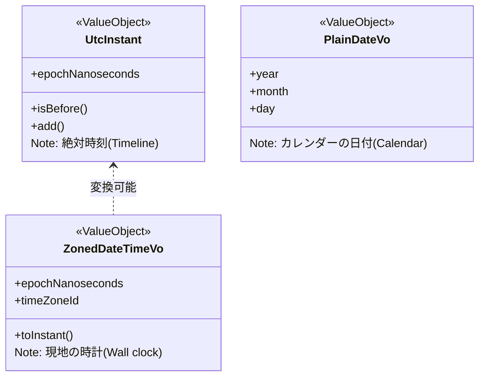

# 第36章：日時のVO：時間は地雷⏰🧨

今回は「時間まわりの事故」を**VOでガチガチに減らす**章だよ〜！🧯✨
“動いてるけど、ある日突然バグる”の代表が時間…😵‍💫 なので、ここで型とVOで守れるようにしよっ💪💎

---

## 0. 2026-02-07時点の“最新事情”メモ🗞️✨

* いま **Temporal（新しい標準日時API）** が本格的に現実になってきてるよ〜！

  * **Chrome 144（2026-01-13）**で「Temporal in ECMA262」がリリースノートに載ってるよ📌 ([Chrome for Developers][1])
  * **Firefox 139** は Temporal をデフォルト有効にして“最初に出したブラウザ”って明言してるよ🦊✨ ([SpiderMonkey][2])
* ただし **MDNでは “Limited availability（まだ全ブラウザの基準になってない）”** 扱い！つまり「環境によってはそのまま使えない」ことがあるよ⚠️ ([MDN Web Docs][3])
* 仕様としては TC39 の提案で、**GitHubのREADME上は Stage 3**。一方で Stage 4 マイルストーンはかなり進んでる…って状態🧩 ([GitHub][4])

だからこの章は結論：**Temporalを前提に設計しつつ、学習プロジェクトは polyfill を噛ませて安定運用**がいちばん安心だよ〜🧸🛡️

---

## 1. なぜ「時間」が地雷なの？💣😇（よくある爆発パターン）


### 💥 地雷①：`Date` の文字列パースがややこしい

たとえば **`YYYY-MM-DD`** みたいな “日付だけ” は、タイムゾーン情報が無いと **UTCとして解釈される**ケースがあるよ（歴史的な仕様の事情…）😵‍💫 ([MDN Web Docs][5])
→ 結果、**表示したら前日/翌日になった**とか起きる💀

### 💥 地雷②：タイムゾーンと夏時間（DST）

* 「同じ 10:00」でも国によって意味が違う
* DSTで **存在しない時刻** / **2回出てくる時刻** が出る
  → 期限判定とか予約時刻とかがズレる😇

### 💥 地雷③：用途に合わない“ひとつの型”で全部やろうとする

* “絶対時刻（ログ/決済）” と “現地の時計（予約/営業時間）” と “日付だけ（有効期限）”
  これ、同じにすると破綻するよ〜🙅‍♀️

---

## 2. この章の結論🎯✨：日時は「用途別VO」に分ける！

Temporal は「用途別の型」を最初から用意してくれてるのが強い💎
（MDNでも Temporal は Date の置き換えとして設計されてるって説明されてるよ）([MDN Web Docs][3])


### ✅ まず覚える3分類（これだけで勝率上がる🥳）

1. **絶対時刻（いつ発生したか）**
   → `Temporal.Instant`（UTCの一点）
   例：支払い完了時刻、イベント発行時刻、監査ログ

2. **タイムゾーン付きの日時（現地の時計）**
   → `Temporal.ZonedDateTime`（Instant＋TimeZone）
   例：受け取り予約「2026-02-10 10:00（Asia/Tokyo）」、営業時間判定

3. **日付だけ**
   → `Temporal.PlainDate`
   例：「有効期限は 2026-02-10 まで」、請求締め日、誕生日

> ここがVO化ポイント💡
> 「ドメインの言葉」で VO を作る（例：`PickupAt`, `PaymentDeadline`, `ExpiryDate`）と、読みやすさが爆上がりするよ📈✨



---

## 3. Temporal を“確実に使える”ようにする（polyfill）🧩🛠️


MDN的にまだ “どこでも当たり前” ではないので、学習プロジェクトは polyfill が安心！([MDN Web Docs][3])

### 📦 polyfill（例：`@js-temporal/polyfill`）

npmの説明で「ESMで import」例が載ってるよ📌 ([npmjs.com][6])

```ts
// src/shared/temporal.ts
import { Temporal } from "@js-temporal/polyfill";
export { Temporal };
```

> ※もう一つ軽量 polyfill もあるよ（fullcalendar側）📦 ([GitHub][7])
> でもこの章は「説明が一番多い @js-temporal/polyfill」でいくね😊

---

## 4. 実装してみよう：日時VOの基本形（Resultで失敗も型に）🧪💎

ここでは「生成時に検証して、以降は安全」スタイルでいくよ〜🔒✨
（VOの鉄則：**作った瞬間に正しい**）

### 4-1) Result型（超ミニ）

```ts
// src/domain/shared/result.ts
export type Result<T> =
  | { ok: true; value: T }
  | { ok: false; error: Error };

export const ok = <T>(value: T): Result<T> => ({ ok: true, value });
export const err = (error: Error): Result<never> => ({ ok: false, error });
```

### 4-2) タイムゾーンID VO（まずここで地雷除去🧯）

Temporalは無効なタイムゾーンだと例外を投げるので、VO生成で吸収するよ🧸

```ts
// src/domain/time/timeZoneId.ts
import { Temporal } from "../../shared/temporal";
import { Result, ok, err } from "../shared/result";

export class TimeZoneId {
  private constructor(private readonly value: string) {}

  static create(value: string): Result<TimeZoneId> {
    try {
      // 無効なら RangeError
      Temporal.TimeZone.from(value);
      return ok(new TimeZoneId(value));
    } catch {
      return err(new Error(`Invalid time zone: ${value}`));
    }
  }

  toString(): string {
    return this.value;
  }
}
```

---

## 5. 主役VO①：絶対時刻 `UtcInstant`（期限・ログ用）⏱️🧊


「いつ発生したか」系は、**Instant一本**でほぼ勝てる🥇
（タイムゾーンに引きずられないのが最高✨）

```ts
// src/domain/time/utcInstant.ts
import { Temporal } from "../../shared/temporal";
import { Result, ok, err } from "../shared/result";

export class UtcInstant {
  private constructor(private readonly value: Temporal.Instant) {}

  static fromISO(iso: string): Result<UtcInstant> {
    try {
      return ok(new UtcInstant(Temporal.Instant.from(iso)));
    } catch {
      return err(new Error(`Invalid instant ISO: ${iso}`));
    }
  }

  static now(): UtcInstant {
    return new UtcInstant(Temporal.Now.instant());
  }

  isBefore(other: UtcInstant): boolean {
    return this.value.epochNanoseconds < other.value.epochNanoseconds;
  }

  addSeconds(seconds: number): UtcInstant {
    return new UtcInstant(this.value.add({ seconds }));
  }

  toISO(): string {
    return this.value.toString(); // 例: 2026-02-07T00:00:00Z
  }

  equals(other: UtcInstant): boolean {
    return this.value.epochNanoseconds === other.value.epochNanoseconds;
  }
}
```

---

## 6. 主役VO②：現地の日時 `ZonedDateTimeVo`（予約・営業時間）🗓️🌏


Temporalの `ZonedDateTime` は「Instant + TimeZone」って位置づけが明確なのが良い💎 ([MDN Web Docs][8])

ここでは「予約時間」に使うVOを作るよ☕📦

```ts
// src/domain/time/zonedDateTimeVo.ts
import { Temporal } from "../../shared/temporal";
import { Result, ok, err } from "../shared/result";
import { TimeZoneId } from "./timeZoneId";
import { UtcInstant } from "./utcInstant";

export class ZonedDateTimeVo {
  private constructor(private readonly value: Temporal.ZonedDateTime) {}

  static fromISO(iso: string): Result<ZonedDateTimeVo> {
    try {
      // 例: 2026-02-10T10:00:00+09:00[Asia/Tokyo]
      return ok(new ZonedDateTimeVo(Temporal.ZonedDateTime.from(iso)));
    } catch {
      return err(new Error(`Invalid zoned date-time ISO: ${iso}`));
    }
  }

  static fromLocal(
    date: string, // "2026-02-10"
    time: string, // "10:00"
    tz: TimeZoneId
  ): Result<ZonedDateTimeVo> {
    try {
      const plain = Temporal.PlainDateTime.from(`${date}T${time}`);
      const zdt = plain.toZonedDateTime(tz.toString());
      return ok(new ZonedDateTimeVo(zdt));
    } catch {
      return err(new Error(`Invalid local date/time: ${date} ${time}`));
    }
  }

  toInstant(): UtcInstant {
    // 期限判定など「比較」は Instant に寄せると事故が減る✨
    return UtcInstant.fromISO(this.value.toInstant().toString()).value;
  }

  toString(): string {
    return this.value.toString();
  }
}
```

> `toInstant()` のところで `.value` を直接使ってるのは「ここでは失敗しない前提」だからだよ〜（気になるなら Result を返す形にしてOK！）😊

---

## 7. ドメイン例題：カフェの「受け取り予約」と「支払い期限」☕⏰


### 🎀 要件（かわいく言うと）

* 受け取り時間 `PickupAt` は **お店のタイムゾーン基準**（現地の時計）
* 支払い期限 `PaymentDeadline` は **絶対時刻**（UTCで比較）
* ルール：

  * 受け取りは「今から30分以降」
  * 支払い期限は「注文確定から15分以内」

※「今」はテストが難しくなるので、この章は **nowを引数で渡す**方式にするよ（Clock注入は後半でガッツリやる🧪）

```ts
// src/domain/order/pickupAt.ts
import { Result, ok, err } from "../shared/result";
import { ZonedDateTimeVo } from "../time/zonedDateTimeVo";
import { UtcInstant } from "../time/utcInstant";

export class PickupAt {
  private constructor(private readonly value: ZonedDateTimeVo) {}

  static create(
    pickup: ZonedDateTimeVo,
    now: UtcInstant
  ): Result<PickupAt> {
    const pickupInstant = pickup.toInstant();

    // 今から30分以上先
    const min = now.addSeconds(30 * 60);
    if (pickupInstant.isBefore(min)) {
      return err(new Error("Pickup time must be at least 30 minutes from now"));
    }

    return ok(new PickupAt(pickup));
  }

  toString(): string {
    return this.value.toString();
  }
}
```

```ts
// src/domain/order/paymentDeadline.ts
import { Result, ok, err } from "../shared/result";
import { UtcInstant } from "../time/utcInstant";

export class PaymentDeadline {
  private constructor(private readonly value: UtcInstant) {}

  static fromConfirmedAt(confirmedAt: UtcInstant): PaymentDeadline {
    // 15分以内
    return new PaymentDeadline(confirmedAt.addSeconds(15 * 60));
  }

  isExpired(now: UtcInstant): boolean {
    return this.value.isBefore(now);
  }

  toISO(): string {
    return this.value.toISO();
  }
}
```

---

## 8. テスト：時間VOはテストしやすい！🧪💖（境界値で守る）


時間系は「1分前」「ちょうど」「1分後」みたいな境界で事故るから、そこを刺すよ🔪✨

```ts
// src/domain/order/pickupAt.test.ts
import { describe, it, expect } from "vitest";
import { TimeZoneId } from "../time/timeZoneId";
import { ZonedDateTimeVo } from "../time/zonedDateTimeVo";
import { UtcInstant } from "../time/utcInstant";
import { PickupAt } from "./pickupAt";

describe("PickupAt", () => {
  it("30分未満はNG", () => {
    const tz = TimeZoneId.create("Asia/Tokyo");
    if (!tz.ok) throw tz.error;

    const now = UtcInstant.fromISO("2026-02-07T00:00:00Z");
    if (!now.ok) throw now.error;

    const pickup = ZonedDateTimeVo.fromISO("2026-02-07T09:20:00+09:00[Asia/Tokyo]");
    if (!pickup.ok) throw pickup.error;

    const res = PickupAt.create(pickup.value, now.value);
    expect(res.ok).toBe(false);
  });

  it("30分ちょうどはOK", () => {
    const tz = TimeZoneId.create("Asia/Tokyo");
    if (!tz.ok) throw tz.error;

    const now = UtcInstant.fromISO("2026-02-07T00:00:00Z");
    if (!now.ok) throw now.error;

    // 00:30Z = 09:30 JST
    const pickup = ZonedDateTimeVo.fromISO("2026-02-07T09:30:00+09:00[Asia/Tokyo]");
    if (!pickup.ok) throw pickup.error;

    const res = PickupAt.create(pickup.value, now.value);
    expect(res.ok).toBe(true);
  });
});
```

---

## 9. アンチパターン集😂⚠️（これやると爆発しがち）

### ❌ ドメインに `Date` を直置き

`Date` はパースや扱いがややこしく、仕様的にも罠があるよ…([MDN Web Docs][5])
→ ドメインは **VOで意味を持たせる**のが正解💎

### ❌ “日時文字列”をそのまま持つ

`"2026-02-10 10:00"` みたいなのは

* タイムゾーン不明
* 比較が面倒
* 将来フォーマット変更で死ぬ
  の三重苦🥹

### ❌ 比較を「ローカルの見た目」でやる

比較は **Instant（絶対時刻）に寄せる**のが安全👍✨
（だから `ZonedDateTimeVo.toInstant()` を用意したよ〜）

---

## 10. AI活用🤖💞：時間バグを“先に潰す”使い方

### 🎯 使えるプロンプト例（コピペOK）

* 「受け取り予約の時間バグのパターンを20個、境界値中心で出して。タイムゾーン/DST/日付跨ぎを混ぜて」
* 「`PickupAt` の仕様から Given/When/Then を10個作って。正常系3、異常系7で」
* 「このVO設計、ドメインに漏れてる“暗黙ルール”を指摘して（例：営業時間、定休日、最終受け取りなど）」

AIは “コードを書く” より、**地雷の洗い出し係**にするとめっちゃ強いよ〜🧠⚡

---

## 11. 章末ミニ演習🎓✨（手を動かすやつ）

### 🧁 演習A：`ExpiryDate`（PlainDate）を作ろう

* ルール：今日より前はNG
* 「30日以内」など上限をつけてもOK

### 🍩 演習B：`BusinessHours`（PlainTime×2）で営業時間チェック

* open: 09:00 / close: 18:00
* `PickupAt` が営業時間内かを判定して、営業時間外ならエラーにする

---

## 12. 今日のまとめ🌸✨

* 時間は地雷！だから **用途別VO** に分ける⏰🧨
* Temporalは「その用途別の型」が最初から用意されてるのが強い💎 ([TC39][9])
* 2026-02-07時点ではブラウザ差がまだあるので **polyfillで統一**が安心🧸🛡️ ([MDN Web Docs][3])
* 比較は Instant に寄せると事故が減る✨

---

次の第37章は「VOの合成」だよね📦💖
この章で作った `TimeZoneId / UtcInstant / ZonedDateTimeVo` を部品にして、**Receipt や Address みたいな複合VO**を気持ちよく作れるようになるよ〜！🎉

[1]: https://developer.chrome.com/release-notes/144?utm_source=chatgpt.com "Chrome 144 | Release notes - Chrome for Developers"
[2]: https://spidermonkey.dev/blog/2025/04/11/shipping-temporal.html?utm_source=chatgpt.com "Shipping Temporal - SpiderMonkey"
[3]: https://developer.mozilla.org/en-US/docs/Web/JavaScript/Reference/Global_Objects/Temporal?utm_source=chatgpt.com "Temporal - JavaScript - MDN Web Docs"
[4]: https://github.com/tc39/proposal-temporal?utm_source=chatgpt.com "tc39/proposal-temporal: Provides standard objects and ..."
[5]: https://developer.mozilla.org/en-US/docs/Web/JavaScript/Reference/Global_Objects/Date?utm_source=chatgpt.com "Date - JavaScript - MDN Web Docs - Mozilla"
[6]: https://www.npmjs.com/package/%40js-temporal/polyfill?utm_source=chatgpt.com "js-temporal/polyfill"
[7]: https://github.com/fullcalendar/temporal-polyfill?utm_source=chatgpt.com "fullcalendar/temporal-polyfill"
[8]: https://developer.mozilla.org/en-US/docs/Web/JavaScript/Reference/Global_Objects/Temporal/ZonedDateTime?utm_source=chatgpt.com "Temporal.ZonedDateTime - JavaScript - MDN Web Docs"
[9]: https://tc39.es/proposal-temporal/?utm_source=chatgpt.com "Temporal"
