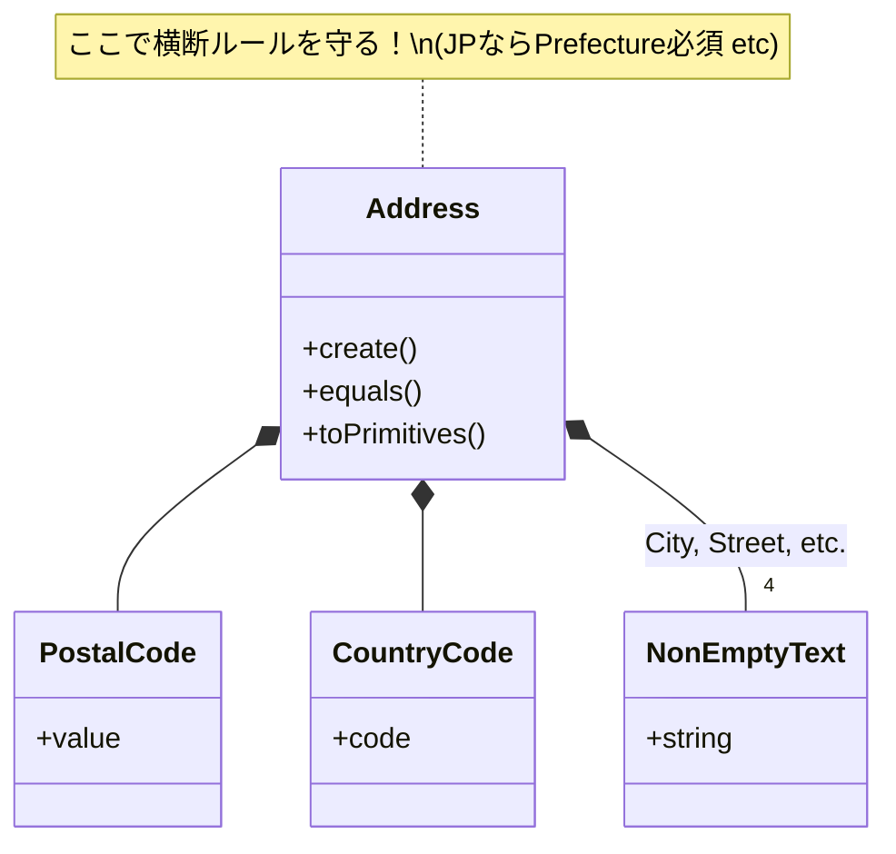

# 第37章：VOの合成：Address/Receiptなど📦

VO（Value Object）って「小さくてキレイな値の箱」だけじゃなくて、**VOの中にVOを入れて“もっと自然なモデル”を作れる**んだよ〜！🥳
この章では、**複合VO（Composite Value Object）**の作り方を、実装＆テストまでいっしょにやるよ🧪💕

> ちなみに2026年2月7日時点だと、Microsoftの発表ベースで **TypeScript 5.9が安定版**で、**TypeScript 6.0は2/10にBeta、3/17にFinal予定**ってスケジュールが公開されてるよ🗓️✨（この章の内容は5.9でも6.0でもだいたいそのままOK）([Microsoft for Developers][1])
> 実行環境の目安としては、Node.js は **v24がActive LTS**、v25がCurrent、って状況だよ〜🔧([Node.js][2])
> テストは Vitest の **Vitest 4.0**が出てるので、例はそれでいくね🧪🚀([Vitest][3])

---

## この章のゴール🎯✨

* ✅ **複合VOって何？**（VOの中にVOを入れる理由）
* ✅ **検証（バリデーション）の責務**を迷わず置ける
* ✅ **不変性（immutable）**を“破られない形”で作れる
* ✅ **equals（等価性）**を自然に実装できる
* ✅ **テストで守る**（生成成功/失敗・等価性・不変性）

---

## まず結論：複合VOの「責務ルール」3つだけ覚えてね📌💡


### ① 部品VOは「自分のローカルルール」を守る🧩

例：PostalCode は「形式」「正規化」など、郵便番号だけの責任。

### ② 複合VOは「組み合わせルール（横断ルール）」を守る🧠

例：Address なら「国がJPなら都道府県必須」みたいに、**複数項目の関係**を守る。

### ③ 複合VOは「ミュータブル参照」を外に漏らさない🚫🧨

配列・Date・オブジェクト参照をそのまま持つと、外から壊されるよ〜😭
→ **コピーする / freezeする / プリミティブ化する** が基本！

---

## 例題①：Address（住所）VOを“VOの合成”で作る🏠📦

### ありがちな事故😇💥

* `postalCode: "1234567"` と `"123-4567"` が別物扱い
* `prefecture` 空なのに通る
* 住所の各パーツがバラバラに検証されて抜け漏れ

そこで、こうする👇


* PostalCode（郵便番号VO）
* NonEmptyText（空文字禁止VO）
* CountryCode（国コード）
* Address（複合VO：上のVOたちをまとめる）

* PostalCode（郵便番号VO）
* NonEmptyText（空文字禁止VO）
* CountryCode（国コード）
* Address（複合VO：上のVOたちをまとめる）



---

## 実装：まずはエラーと小物VOたち🧰✨

```ts
// domain/errors.ts
export class DomainError extends Error {
  constructor(message: string) {
    super(message);
    this.name = "DomainError";
  }
}
```

```ts
// domain/valueObjects/NonEmptyText.ts
import { DomainError } from "../errors";

export class NonEmptyText {
  private constructor(private readonly value: string) {}

  static create(raw: string, label = "text"): NonEmptyText {
    const v = raw.trim();
    if (v.length === 0) throw new DomainError(`${label} must not be empty`);
    return new NonEmptyText(v);
  }

  get asString(): string {
    return this.value;
  }

  equals(other: NonEmptyText): boolean {
    return this.value === other.value;
  }
}
```

```ts
// domain/valueObjects/PostalCode.ts
import { DomainError } from "../errors";

export class PostalCode {
  private constructor(private readonly normalized: string) {}

  static create(raw: string): PostalCode {
    // "1234567" / "123-4567" どっちでもOKにして、正規化は "123-4567" に統一💡
    const digits = raw.replace(/[^0-9]/g, "");
    if (!/^\d{7}$/.test(digits)) throw new DomainError("postalCode must be 7 digits");
    const normalized = `${digits.slice(0, 3)}-${digits.slice(3)}`;
    return new PostalCode(normalized);
  }

  get asString(): string {
    return this.normalized;
  }

  equals(other: PostalCode): boolean {
    return this.normalized === other.normalized;
  }
}
```

```ts
// domain/valueObjects/CountryCode.ts
import { DomainError } from "../errors";

export type Country = "JP" | "US" | "GB" | "FR"; // 例として少しだけ

export class CountryCode {
  private constructor(private readonly value: Country) {}

  static create(raw: string): CountryCode {
    const v = raw.trim().toUpperCase();
    if (v !== "JP" && v !== "US" && v !== "GB" && v !== "FR") {
      throw new DomainError("country must be one of JP/US/GB/FR");
    }
    return new CountryCode(v);
  }

  get asString(): Country {
    return this.value;
  }

  equals(other: CountryCode): boolean {
    return this.value === other.value;
  }
}
```

---

## 実装：複合VO Address（ここが本番！）🏠✨


ポイントはここ👇

* **部品VOを組み合わせる**
* **横断ルールをここで守る**
* **値の取り出し口はプリミティブに落とす（DTOっぽい形）**

```ts
// domain/valueObjects/Address.ts
import { DomainError } from "../errors";
import { CountryCode } from "./CountryCode";
import { NonEmptyText } from "./NonEmptyText";
import { PostalCode } from "./PostalCode";

export class Address {
  private constructor(
    private readonly country: CountryCode,
    private readonly postalCode: PostalCode,
    private readonly prefecture: NonEmptyText | null,
    private readonly city: NonEmptyText,
    private readonly street: NonEmptyText,
    private readonly building: NonEmptyText | null,
  ) {}

  static create(params: {
    country: string;
    postalCode: string;
    prefecture?: string | null;
    city: string;
    street: string;
    building?: string | null;
  }): Address {
    const country = CountryCode.create(params.country);
    const postalCode = PostalCode.create(params.postalCode);
    const city = NonEmptyText.create(params.city, "city");
    const street = NonEmptyText.create(params.street, "street");

    const building = params.building ? NonEmptyText.create(params.building, "building") : null;

    // prefecture は国がJPのとき必須、とか横断ルールをここに置く🧠✨
    const pref =
      params.prefecture && params.prefecture.trim().length > 0
        ? NonEmptyText.create(params.prefecture, "prefecture")
        : null;

    if (country.asString === "JP" && pref === null) {
      throw new DomainError("prefecture is required when country is JP");
    }

    return new Address(country, postalCode, pref, city, street, building);
  }

  equals(other: Address): boolean {
    return (
      this.country.equals(other.country) &&
      this.postalCode.equals(other.postalCode) &&
      (this.prefecture?.equals(other.prefecture ?? null as any) ?? other.prefecture === null) &&
      this.city.equals(other.city) &&
      this.street.equals(other.street) &&
      (this.building?.equals(other.building ?? null as any) ?? other.building === null)
    );
  }

  // 境界に出す形（プリミティブ）を用意すると便利📦✨
  toPrimitives(): {
    country: string;
    postalCode: string;
    prefecture: string | null;
    city: string;
    street: string;
    building: string | null;
  } {
    return {
      country: this.country.asString,
      postalCode: this.postalCode.asString,
      prefecture: this.prefecture?.asString ?? null,
      city: this.city.asString,
      street: this.street.asString,
      building: this.building?.asString ?? null,
    };
  }
}
```

> `equals` の `null` 比較がちょい読みづらいよね😂
> 実務だと「nullable比較ユーティリティ」を作るとスッキリするよ〜（演習でやる！）✨

---

## 例題②：Receipt（レシート）VO：配列を持つ複合VO🧾✨


レシートは「発行した瞬間のスナップショット」扱いにすると VO と相性良いよ📸💕

ただし！！
**配列をそのまま外に返すと壊される**から注意ね🚨🧨

### ReceiptLine（明細）VO


```ts
// domain/valueObjects/ReceiptLine.ts
import { DomainError } from "../errors";
import { NonEmptyText } from "./NonEmptyText";

export class ReceiptLine {
  private constructor(
    private readonly itemName: NonEmptyText,
    private readonly quantity: number,
    private readonly unitPriceYen: number,
  ) {}

  static create(params: { itemName: string; quantity: number; unitPriceYen: number }): ReceiptLine {
    const itemName = NonEmptyText.create(params.itemName, "itemName");
    if (!Number.isInteger(params.quantity) || params.quantity <= 0) {
      throw new DomainError("quantity must be a positive integer");
    }
    if (!Number.isInteger(params.unitPriceYen) || params.unitPriceYen < 0) {
      throw new DomainError("unitPriceYen must be an integer >= 0");
    }
    return new ReceiptLine(itemName, params.quantity, params.unitPriceYen);
  }

  subtotalYen(): number {
    return this.quantity * this.unitPriceYen;
  }

  equals(other: ReceiptLine): boolean {
    return (
      this.itemName.equals(other.itemName) &&
      this.quantity === other.quantity &&
      this.unitPriceYen === other.unitPriceYen
    );
  }

  toPrimitives(): { itemName: string; quantity: number; unitPriceYen: number } {
    return { itemName: this.itemName.asString, quantity: this.quantity, unitPriceYen: this.unitPriceYen };
  }
}
```

### Receipt（複合VO）


```ts
// domain/valueObjects/Receipt.ts
import { DomainError } from "../errors";
import { ReceiptLine } from "./ReceiptLine";

export class Receipt {
  private constructor(
    private readonly receiptNo: string,
    private readonly issuedAtEpochMs: number,
    private readonly lines: ReadonlyArray<ReceiptLine>,
  ) {}

  static create(params: { receiptNo: string; issuedAt: Date; lines: ReceiptLine[] }): Receipt {
    const no = params.receiptNo.trim();
    if (no.length === 0) throw new DomainError("receiptNo must not be empty");

    // Dateはミュータブルなので epoch(ms) に落として保持するのが安全👍
    const issuedAtEpochMs = params.issuedAt.getTime();
    if (!Number.isFinite(issuedAtEpochMs)) throw new DomainError("issuedAt is invalid");

    if (params.lines.length === 0) throw new DomainError("lines must not be empty");

    // 配列はコピーして凍結（浅いfreezeだけど、要素がVOならOKになりやすい）🧊
    const linesCopy = Object.freeze([...params.lines]);

    return new Receipt(no, issuedAtEpochMs, linesCopy);
  }

  totalYen(): number {
    return this.lines.reduce((sum, line) => sum + line.subtotalYen(), 0);
  }

  equals(other: Receipt): boolean {
    if (this.receiptNo !== other.receiptNo) return false;
    if (this.issuedAtEpochMs !== other.issuedAtEpochMs) return false;
    if (this.lines.length !== other.lines.length) return false;
    for (let i = 0; i < this.lines.length; i++) {
      if (!this.lines[i]!.equals(other.lines[i]!)) return false;
    }
    return true;
  }

  toPrimitives(): {
    receiptNo: string;
    issuedAt: string; // ISOで外へ
    lines: { itemName: string; quantity: number; unitPriceYen: number }[];
    totalYen: number;
  } {
    return {
      receiptNo: this.receiptNo,
      issuedAt: new Date(this.issuedAtEpochMs).toISOString(),
      lines: this.lines.map((l) => l.toPrimitives()),
      totalYen: this.totalYen(),
    };
  }
}
```

---

## テスト：Vitestで「複合VOの守り」を固める🧪💪

### Addressのテスト（正規化・横断ルール・equals）

```ts
// test/Address.test.ts
import { describe, it, expect } from "vitest";
import { Address } from "../domain/valueObjects/Address";

describe("Address", () => {
  it("postalCode should be normalized", () => {
    const a = Address.create({
      country: "JP",
      postalCode: "1234567",
      prefecture: "東京都",
      city: "千代田区",
      street: "1-1-1",
    });

    expect(a.toPrimitives().postalCode).toBe("123-4567");
  });

  it("should require prefecture when country is JP", () => {
    expect(() =>
      Address.create({
        country: "JP",
        postalCode: "123-4567",
        city: "千代田区",
        street: "1-1-1",
      }),
    ).toThrow();
  });

  it("equals should be true for same values", () => {
    const a1 = Address.create({
      country: "JP",
      postalCode: "1234567",
      prefecture: "東京都",
      city: "千代田区",
      street: "1-1-1",
      building: "テストビル 10F",
    });

    const a2 = Address.create({
      country: "JP",
      postalCode: "123-4567",
      prefecture: "東京都",
      city: "千代田区",
      street: "1-1-1",
      building: "テストビル 10F",
    });

    expect(a1.equals(a2)).toBe(true);
  });
});
```

### Receiptのテスト（配列の不変性・合計・equals）

```ts
// test/Receipt.test.ts
import { describe, it, expect } from "vitest";
import { Receipt } from "../domain/valueObjects/Receipt";
import { ReceiptLine } from "../domain/valueObjects/ReceiptLine";

describe("Receipt", () => {
  it("total should be sum of lines", () => {
    const lines = [
      ReceiptLine.create({ itemName: "Latte", quantity: 2, unitPriceYen: 480 }),
      ReceiptLine.create({ itemName: "Cookie", quantity: 1, unitPriceYen: 200 }),
    ];

    const r = Receipt.create({
      receiptNo: "R-0001",
      issuedAt: new Date("2026-02-07T00:00:00Z"),
      lines,
    });

    expect(r.totalYen()).toBe(2 * 480 + 200);
  });

  it("should not be affected by external mutation of input array", () => {
    const lines = [ReceiptLine.create({ itemName: "Latte", quantity: 1, unitPriceYen: 480 })];

    const r = Receipt.create({
      receiptNo: "R-0002",
      issuedAt: new Date("2026-02-07T00:00:00Z"),
      lines,
    });

    // 入力配列を後からいじる（悪い人👿）
    lines.push(ReceiptLine.create({ itemName: "Cookie", quantity: 1, unitPriceYen: 200 }));

    // Receiptの中身は変わってほしくない👍
    expect(r.toPrimitives().lines.length).toBe(1);
  });

  it("equals should compare receiptNo, issuedAt, and lines", () => {
    const lines1 = [ReceiptLine.create({ itemName: "Latte", quantity: 1, unitPriceYen: 480 })];
    const lines2 = [ReceiptLine.create({ itemName: "Latte", quantity: 1, unitPriceYen: 480 })];

    const r1 = Receipt.create({ receiptNo: "R-0003", issuedAt: new Date(0), lines: lines1 });
    const r2 = Receipt.create({ receiptNo: "R-0003", issuedAt: new Date(0), lines: lines2 });

    expect(r1.equals(r2)).toBe(true);
  });
});
```

---

## よくある落とし穴トップ5 😵‍💫⚠️（めっちゃ大事）


1. **複合VOが巨大化**（ルール・変換・I/O全部入り）
   → この章の次（第38章）でガッツリやるけど、今は「VOは“値のルール”まで」で止めよ🛑

2. **配列・Date・オブジェクト参照をそのまま持つ**
   → コピー＆freeze、またはプリミティブ化（epochMsなど）✨

3. **横断ルールを部品VOへ押し込む**
   → `PostalCode` が「国によって…」を知り始めたら危険信号🚨
   横断ルールは Address に置こう！

4. **equals が“参照比較”になっちゃう**
   → 配列やネストは中身比較にする（今回のReceiptみたいに）🧠

5. **toPrimitivesが“ドメインを汚す”ほど増える**
   → 便利だけど、出し口は必要最小限でOK。必要になったらDTO側で組み立ててもいいよ📦

---

## AIの使い方（この章向け）🤖✨

そのままコピペで使えるやつ置いとくね💕

* **横断ルールの洗い出し**

  * 「住所(Address)の入力項目を列挙するので、横断的な不変条件（複数項目に跨るルール）を10個提案して。日本向けを優先、理由も添えて。」

* **正規化ルールの提案**

  * 「PostalCode / PhoneNumber / Email の“正規化”方針を、比較（equals）で困らない観点で提案して。」

* **壊されない設計レビュー**

  * 「次のTypeScriptのValue Object実装で“外から壊せる可能性”がある箇所を指摘して。配列、Date、参照返し、mutableな公開APIに注目して。」

* **テストの抜け探し**

  * 「このVOのテストケースで不足してそうな観点（境界値、異常系、等価性、不変性）を箇条書きで追加して。」

---

## ミニ演習（手を動かすやつ）✍️🎮

### 演習A：nullable equals をキレイにする✨

* `equalsNullable(a, b, eq)` みたいな関数を作って、Address の `equals` を読みやすくしてみよ〜🧼

### 演習B：ReceiptLine に「割引」を入れる🏷️

* `discountYen` を追加して

  * 0以上
  * subtotalから引いて負にならない
    ってルールを入れてみてね！

### 演習C：複合VOの“部品の切り出し”練習🧩

* `Address` から `CityAndStreet` みたいな中間VOを作る（VO in VO in VO）
* どこに横断ルールを置くべきか、説明できたら勝ち🏆✨

---

## まとめ🎀✨（この章で一番大事なこと）

* 複合VOは **「部品VO＋横断ルール」**で作る📦💎
* **ミュータブル参照を漏らさない**のが最重要🚫🧨
* equals とテストで **“仕様の箱”として固める**🧪💪

次の第38章は「VOに入れすぎ問題」⚖️で、今日作った複合VOが太らないコツをやるよ〜！🥳

[1]: https://devblogs.microsoft.com/typescript/announcing-typescript-5-9/?utm_source=chatgpt.com "Announcing TypeScript 5.9"
[2]: https://nodejs.org/en/about/previous-releases?utm_source=chatgpt.com "Node.js Releases"
[3]: https://vitest.dev/blog/vitest-4?utm_source=chatgpt.com "Vitest 4.0 is out!"
