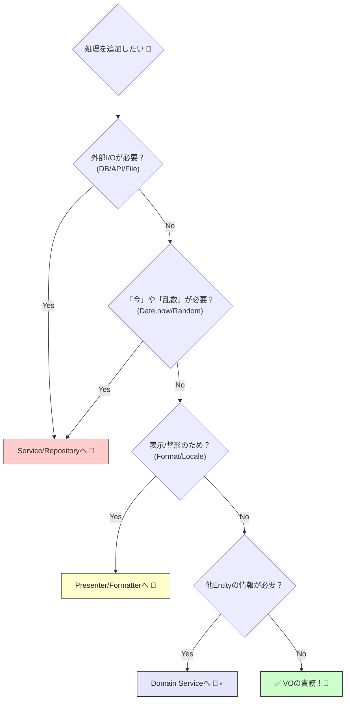

# 第38章：“VOに入れすぎ”問題（境界線）⚖️

今日は「Value Object（VO）が太ってしまう問題」を、**判断基準がブレない形**で身につけようね〜！😊✨
VOって強いんだけど、便利すぎて **“何でも入れちゃう箱”** になりやすいのが落とし穴なんだ…！🫠🧨

---

## 1) この章のゴール🎯✨

### ✅ できるようになること

* 「これはVOの責務？それとも別の場所？」を **迷わず判定**できる🥳
* VOが巨大化する“兆候（におい）”を嗅ぎ分けられる👃⚠️
* 入れすぎた時に、**どこへ逃がすか**（移動先）が分かる🚚📦

---

## 2) まず結論：VOは“ピュアで小さな宝石箱”💎🧊

VOの役割はすごくシンプル👇

### VOが持っていいもの✅

* **意味のある値**（金額・数量・メール・住所など）💡
* **不変条件**（作るときに必ず検証する）🔒
* **正規化**（空白除去・小文字化・単位の統一など）🧽
* **自分の値だけで完結する計算**（加算・比較・丸めなど）🧮✨

### VOが持っちゃダメなもの❌（ここが境界線！）

* **I/O（外部とのやりとり）**：HTTP・DB・ファイル・環境変数🛜🗄️📁
* **現在時刻や乱数に依存**：`Date.now()` / `Math.random()` みたいなやつ⏰🎲
* **表示（UI）都合**：通貨フォーマット、言語、文言、画面用の文字列🎀🖥️
* **保存の責務**：save(), load(), cache() とか🧳
* **他の集約・他Entityの状態に依存する判断**（それはVO単体の話じゃない）🧩⚠️

* **他の集約・他Entityの状態に依存する判断**（それはVO単体の話じゃない）🧩⚠️

判定フローはこんな感じだよ〜👇



---

## 3) “秒速で判断”できるチェック質問5つ⏱️✅

迷ったら、この順番で自分に質問してね🙂📝

1. **この処理、外部に取りに行ってない？（API/DB/ファイル）**
   → YESなら **VOから追放**🚫📤

2. **この処理、“今”に依存してない？（時刻/タイムゾーン/乱数）**
   → YESなら **VOから追放**🚫⏰
   （※「今」は後半で Clock 注入やるやつだよ〜）

3. **この処理、表示のため？（文字列整形、ローカライズ、UI用）**
   → YESなら **表示層/Presenter/Formatter**へ🎨🧾

4. **この処理、他のモノ（他Entity/他集約）がないと判断できない？**
   → YESなら **Domain Service / Policy / Application**へ🧙‍♀️📦

5. **この処理、自分の値だけで完結する？**
   → YESなら **VOでOK**🙆‍♀️💎

---

## 4) “VOが太ってる”ときのニオイ一覧👃⚠️（超重要）

次のどれかが出たら、ほぼ入れすぎサインだよ〜！🚨

* メソッド名が `fetch` / `load` / `save` / `query` / `request` / `post` っぽい🛜
* VOのコンストラクタに `repository` や `client` を渡してる🧱
* `Intl` やロケールを扱って「表示用文字列」を返してる🌏🖥️
* `Date.now()` が出てくる⏰
* `process.env` みたいな環境依存が出てくる⚙️
* VOのテストが「モックだらけ」になってきた🧪🤹‍♀️
* VOのファイルがやたら長い（体感：100〜200行超えて常に増える）📄📈
* VOが「ユースケースの手順」まで知り始めてる（注文→支払い→保存…みたいな）🎬🚫

---

## 5) ハンズオン：Money VOの“入れすぎ”例 🧨💴

### 🙅‍♀️悪い例：VOが全部やってしまう

* 為替レートを取りに行く
* 表示用にフォーマットする
* 永続化する
  → **全部“値”の責務じゃない**よね…！😵‍💫

```ts
// ❌ 太りすぎMoney（やりがち）
class Money {
  constructor(
    private readonly amount: number,
    private readonly currency: string,
  ) {}

  // ❌ 外部I/O（API呼び出し）
  async convertTo(targetCurrency: string): Promise<Money> {
    const rate = await fetch(`https://example.com/rate?from=${this.currency}&to=${targetCurrency}`)
      .then(r => r.json())
      .then(j => j.rate);
    return new Money(Math.round(this.amount * rate), targetCurrency);
  }

  // ❌ 表示都合（ロケール・UI）
  format(locale: string): string {
    return new Intl.NumberFormat(locale, { style: "currency", currency: this.currency })
      .format(this.amount / 100);
  }

  // ❌ 永続化責務
  async save(): Promise<void> {
    // DBへ保存…みたいなことを始める
  }
}
```

---

## 6) ✅良い形：VOは“値のルール”だけを持つ💎🧊

ポイントはこれ👇
**VO：純粋** / **I/Oは外へ** / **表示は外へ** ✨

```ts
// ✅ いいMoney：値＋不変条件＋自分だけで完結する操作
export class Money {
  private constructor(
    private readonly amountInMinor: number, // 例: 円なら1円単位、USDならセント
    private readonly currency: string,
  ) {}

  static create(amountInMinor: number, currency: string): Money {
    if (!Number.isInteger(amountInMinor)) throw new Error("amount must be integer in minor unit");
    if (amountInMinor < 0) throw new Error("money cannot be negative");
    if (currency.length !== 3) throw new Error("currency must be ISO-like 3 letters");
    return new Money(amountInMinor, currency.toUpperCase());
  }

  add(other: Money): Money {
    this.assertSameCurrency(other);
    return Money.create(this.amountInMinor + other.amountInMinor, this.currency);
  }

  isZero(): boolean {
    return this.amountInMinor === 0;
  }

  equals(other: Money): boolean {
    return this.amountInMinor === other.amountInMinor && this.currency === other.currency;
  }

  toMinor(): number {
    return this.amountInMinor;
  }

  getCurrency(): string {
    return this.currency;
  }

  private assertSameCurrency(other: Money) {
    if (this.currency !== other.currency) throw new Error("currency mismatch");
  }
}
```

---

## 7) じゃあ「為替」「表示」「保存」はどこへ？🚚📦

### 🛜 為替（外部レートが必要）

* **Application Service**（ユースケースの手順）
* もしくは **Domain Service**（ドメインの計算だけ、レート取得は抽象化）
  って感じに逃がすのが安全😊✨

```ts
// ✅ 為替レートは「取得する役」へ（抽象）
export interface ExchangeRateProvider {
  getRate(from: string, to: string): Promise<number>;
}

// ✅ 変換は「サービス」でやる（VOは使うだけ）
export class MoneyConverter {
  constructor(private readonly rates: ExchangeRateProvider) {}

  async convert(money: Money, targetCurrency: string): Promise<Money> {
    const rate = await this.rates.getRate(money.getCurrency(), targetCurrency);
    const converted = Math.round(money.toMinor() * rate);
    return Money.create(converted, targetCurrency);
  }
}
```

### 🎀 表示（フォーマット）

* これは **表示層のFormatter** へ（VOは「表示の都合」を知らない）🖥️✨

```ts
export class MoneyFormatter {
  format(money: Money, locale: string): string {
    return new Intl.NumberFormat(locale, {
      style: "currency",
      currency: money.getCurrency(),
    }).format(money.toMinor() / 100);
  }
}
```

### 🗄️ 保存（Repository）

* **Repository（interfaceはdomain側、実装はinfra側）**が王道👑

---

## 8) “境界線”を守ると何が嬉しいの？🎁✨

* VOが小さい → **テストが爆速＆超簡単**🧪💨
* I/Oが外に出る → **差し替えが楽**（API変更やDB変更に強い）🔁🛡️
* 表示が外に出る → **UIが変わってもドメインが揺れない**🎀🏰
* 何より：VOが増えても **破綻しない**（成長に耐える）🌱➡️🌳

---

## 9) ミニ演習✍️☕（カフェ注文ドメイン）

次の機能、どこに置く？を考えてみてね🙂🧠

1. 「金額は0円以上」
   → **VO（Money）** ✅
2. 「注文合計が3000円以上なら送料無料」
   → **Entity/集約 or Domain Service/Policy**（注文のルール）✅
3. 「JPY→USD変換」
   → **アプリ層＋レート取得（I/O）** ✅
4. 「画面に “¥1,200” と表示」
   → **Formatter（表示層）** ✅
5. 「注文が締切時刻を過ぎたらキャンセル不可」
   → VOじゃなくて、**“今”を扱う仕組み（Clock注入）＋ドメイン側ルール** ✅

---

## 10) AI（Copilot/Codex）で爆速レビューするプロンプト集🤖💬✨

### 🧨 入れすぎ検知（まずこれ）

「次のTypeScriptのVOコードをレビューして、
(1) VOに残すべき責務、(2) VOから外へ出すべき責務、(3) 外へ出すなら候補（Application/Domain Service/Formatter/Repository）
に分類して。判断理由は“VOはI/O禁止・表示都合禁止・今依存禁止・自分の値だけで完結”で。」

### 🧪 テスト観点の抽出

「このVOに必要なテストを、(成功/失敗/境界値/等価性) で最小セットにして提案して。テスト名も `it should ...` 形式で。」

### ✂️ 分割リファクタ案

「この太ったVOを“純粋なVO＋周辺サービス”に分割する差分案を出して。ファイル分割案（domain/app/infra/presentation）も。」

---

## 11) 今日のTypeScript事情メモ（設計に効く範囲だけ）🗞️✨

* **TypeScript 5.9** では `import defer` など、モジュール実行タイミングをコントロールする提案のサポートが入ってるよ（副作用の扱いを意識しやすい流れ）📦🧯。([Microsoft for Developers][1])
* **TypeScript 6.0** は「7.0（ネイティブ版）への橋渡し（bridge）」として位置づけられていて、6.1は基本出さない方針…という公式の進捗共有が出てるよ🧭🚧。([Microsoft for Developers][2])
* **TypeScript 7（ネイティブ移植）** はビルドが大幅に速くなる見込み（公式が“フルビルドで約10x近い”比較を載せてる）🚀⚡。([Microsoft for Developers][2])
* ちなみに **Node.js** 側も TypeScript 実行（型を剥がして実行）が進んでいて、Node.js 23.6.0 のリリースノートでは `.ts` をそのまま `node file.ts` で実行できる、と明記されてるよ（制限はあり）🟢🧩。([Node.js][3])
* 型の“推論を保ったまま制約チェック”したいときは `satisfies` が便利（VOの定数マップとかで強い）🧠✨。([TypeScript][4])

---

## 12) まとめ：VOは“値のルールだけ”に集中💎🧊✨

* VOは **小さく・ピュアに**（I/O・表示・保存・今依存はNG）🚫
* 迷ったら **5つの質問**で判定⏱️✅
* 入れすぎたら

  * I/O → Application/infra
  * 表示 → Formatter
  * 複数モノ依存 → Domain Service/Policy
    に逃がす🚚📦

---

次の章（第39章）は、今日作った “小さくて強いVO” を **最小のテストでガチガチに守る**よ〜！🧪💎✨

[1]: https://devblogs.microsoft.com/typescript/announcing-typescript-5-9/ "Announcing TypeScript 5.9 - TypeScript"
[2]: https://devblogs.microsoft.com/typescript/progress-on-typescript-7-december-2025/?utm_source=chatgpt.com "Progress on TypeScript 7 - December 2025"
[3]: https://nodejs.org/en/blog/release/v23.6.0?utm_source=chatgpt.com "Node.js 23.6.0 (Current)"
[4]: https://www.typescriptlang.org/docs/handbook/release-notes/typescript-4-9.html?utm_source=chatgpt.com "Documentation - TypeScript 4.9"
