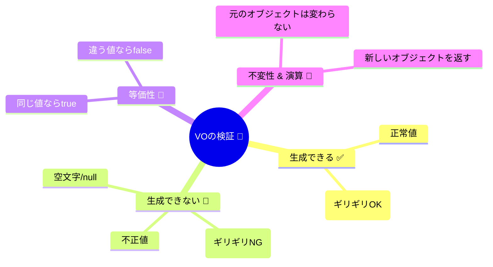

# 第39章：VOのテスト：最小で強く🧪💎


VO（Value Object）って、DDDの中でも **いちばんテストで得する子** なんだよね〜！🥰
なぜなら… **入出力が少ない・副作用がない・ルールがまとまってる** ＝テストが超書きやすいから💪✨

ちなみに本日（2026/02/07）時点だと、TypeScriptは 5.9 系のリリースノートが更新されていて、テスト周りは「ESM寄り＋高速テスト（Vitest）＋型のサポートが厚い」方向がかなり強いよ〜🫶💛 ([TypeScript][1])

---

## この章のゴール🎯💖

VOに対して、次の4種類のテストを **迷わず** 書けるようになる！

1. ✅ 生成できる（正常系）
2. 🚫 生成できない（異常系：境界値含む）
3. 🟰 等価性（同じ値は同じ）
4. 🧊 不変（作ったら変わらない）＋正規化（ゆらぎ吸収）

これだけでVOはめちゃくちゃ堅くなるよ〜！💎🧪✨

---

## まず結論：VOテストの“最小セット”はこれだけでいい🧠✨


VOのテストは、基本このテンプレでOK👇🥳

* **正常系**：`create` が成功する入力を 2〜3個（代表＋境界）
* **異常系**：失敗入力を 3〜5個（代表＋境界）
* **等価性**：同じ値→true / 違う値→false
* **操作があるなら**：`add` とか `multiply` の結果が正しい＋元が変わってない

ポイントは **網羅じゃなくて“仕様の核”に刺す** こと！🎯💘
VOは仕様の塊なので、テストがそのまま「仕様書」になるよ📄✨



---

## 2026/02/07 時点の“おすすめテストランナー”は Vitest 寄り🧡⚡


ここでは **Vitest** 前提で進めるね（理由：速い、Jest互換が多い、TSとの相性が良い）✨
Vitestは「Jest APIとだいたい互換で、置き換えやすい」って公式ガイドでも言ってるよ〜！ ([Vitest][2])
あと、アサーションも Chai + Jest互換expectが組み込みで、体験が良い🫶 ([Vitest][3])

> ※ Node.jsは 2026年2月時点で v24 が Active LTS、v25 が Current だよ（安定運用ならLTS寄りが安心）🟢 ([Node.js][4])

---

## セットアップ（最小）🧰✨

### 1) インストール（VOの単体テスト用）

```bash
npm i -D vitest
```

### 2) `package.json`（最小スクリプト）

```json
{
  "scripts": {
    "test": "vitest",
    "test:watch": "vitest --watch",
    "test:coverage": "vitest --coverage.enabled"
  }
}
```

### 3) `tsconfig.json`（グローバルAPI使うなら）

`describe/it/expect` を importなしで使いたい場合は👇

```json
{
  "compilerOptions": {
    "types": ["vitest/globals"]
  }
}
```

これはVitest公式でも案内されてるやつだよ🧡 ([Vitest][5])

---

## 例題VO：Money（日本円）を作ってテストする💴🧊


### ✅ 方針（この章の仕様）

* 金額は **0以上**
* **整数（円）** のみ（小数はNG）
* 上限は例として **1,000,000円まで**（上限があると境界テストが分かりやすい✨）
* `add` で足し算できる
* `equals` は “値が同じ” を見る（VOの等価性🟰）

---

## 実装：`Money` VO（Result型で返す版）💎

```ts
// src/domain/valueObjects/Money.ts
export type MoneyError =
  | { kind: "negative" }
  | { kind: "not-integer" }
  | { kind: "too-large"; max: number };

export type Result<T, E> =
  | { ok: true; value: T }
  | { ok: false; error: E };

export class Money {
  static readonly MAX_YEN = 1_000_000;

  private constructor(private readonly yen: number) {
    // ここにルールを分散させない（createで全部守る）
  }

  static create(yen: number): Result<Money, MoneyError> {
    if (yen < 0) return { ok: false, error: { kind: "negative" } };
    if (!Number.isInteger(yen)) return { ok: false, error: { kind: "not-integer" } };
    if (yen > Money.MAX_YEN) return { ok: false, error: { kind: "too-large", max: Money.MAX_YEN } };
    return { ok: true, value: new Money(yen) };
  }

  value(): number {
    return this.yen;
  }

  add(other: Money): Result<Money, MoneyError> {
    return Money.create(this.yen + other.yen);
  }

  equals(other: Money): boolean {
    return this.yen === other.yen;
  }

  toString(): string {
    return `¥${this.yen}`;
  }
}
```

---

## テスト：Moneyの“最小で強い”セット🧪💘


```ts
// src/domain/valueObjects/Money.test.ts
import { describe, it, expect } from "vitest";
import { Money } from "./Money";

describe("Money VO", () => {
  it("0円を生成できる ✅", () => {
    const r = Money.create(0);
    expect(r.ok).toBe(true);
    if (r.ok) expect(r.value.value()).toBe(0);
  });

  it("上限ちょうどを生成できる ✅", () => {
    const r = Money.create(Money.MAX_YEN);
    expect(r.ok).toBe(true);
  });

  it("負数は作れない 🚫", () => {
    const r = Money.create(-1);
    expect(r.ok).toBe(false);
    if (!r.ok) expect(r.error.kind).toBe("negative");
  });

  it("小数は作れない 🚫", () => {
    const r = Money.create(1.5);
    expect(r.ok).toBe(false);
    if (!r.ok) expect(r.error.kind).toBe("not-integer");
  });

  it("上限超えは作れない 🚫", () => {
    const r = Money.create(Money.MAX_YEN + 1);
    expect(r.ok).toBe(false);
    if (!r.ok) {
      expect(r.error.kind).toBe("too-large");
      expect(r.error.max).toBe(Money.MAX_YEN);
    }
  });

  it("等価性：同じ値は equals が true 🟰", () => {
    const a = Money.create(100);
    const b = Money.create(100);
    expect(a.ok && b.ok).toBe(true);

    if (a.ok && b.ok) {
      expect(a.value.equals(b.value)).toBe(true);
    }
  });

  it("等価性：違う値は equals が false 🟰", () => {
    const a = Money.create(100);
    const b = Money.create(101);
    expect(a.ok && b.ok).toBe(true);

    if (a.ok && b.ok) {
      expect(a.value.equals(b.value)).toBe(false);
    }
  });

  it("add：足し算の結果が正しい ＋ 元の値は変わらない 🧊", () => {
    const a = Money.create(100);
    const b = Money.create(50);
    expect(a.ok && b.ok).toBe(true);

    if (a.ok && b.ok) {
      const sum = a.value.add(b.value);
      expect(sum.ok).toBe(true);
      if (sum.ok) expect(sum.value.value()).toBe(150);

      // 元が変わってない（不変）🧊
      expect(a.value.value()).toBe(100);
      expect(b.value.value()).toBe(50);
    }
  });

  it("toString：表示が安定する 📝", () => {
    const r = Money.create(123);
    expect(r.ok).toBe(true);
    if (r.ok) expect(r.value.toString()).toBe("¥123");
  });
});
```

これで、VOのテストとしては **かなり強い** よ〜！🥳💎


「失敗ルート」「境界」「等価性」「不変」が揃ってるので、仕様が崩れにくい✨

---

## もう1つだけ：正規化があるVOは “ゆらぎ吸収” をテストしよう✉️✨

Emailみたいに入力がブレるやつは、**正規化が仕様** になりがち！

例：

* `" A@Example.com "` → `"a@example.com"` に揃える（trim + lowercase）
* 正規化後の文字列が保存される

ここはテストでガチガチに固定すると事故が減るよ〜🫶💛

（Emailの実装・テストは次の章でも増やせるけど、39章のコアは「VOテストの型」なので今日はここまででOK👍✨）

---

## カバレッジ（おまけ）📊✨

VOは小さいから、カバレッジも取りやすいよ〜！
Vitestはカバレッジ機能があって、`--coverage.enabled` や設定で有効化できるよ。 ([Vitest][6])

V8カバレッジを使うパッケージも、2026年1月時点で継続的に更新されてる（例：@vitest/coverage-v8）📦✨ ([npm][7])

---

## AI（Copilot / OpenAI Codex）で“テストだけ増やす”のが最強🤖🧪


AIに **実装を丸投げ** じゃなくて、VOは特に「テストケース生成」に使うと気持ちいいよ〜💘

おすすめプロンプト例👇（そのまま貼ってOK）

* 💡 **境界値を増やす**

  * 「Money.createの失敗ケースを、境界値中心に10個提案して。入力値と期待結果（error.kind）もセットで。」

* 💡 **テスト名を整える**

  * 「Vitestのdescribe/itで、読みやすい英語のit文（it should ...）を提案して」

* 💡 **仕様の穴を探す**

  * 「このMoney VOに仕様の抜けがないか、現実の決済っぽい観点で突っ込んで」

AIに出してもらった案は、**採用するのは“仕様として正しいものだけ”** ね🫶✨（ここが設計力！）

---

## よくある失敗あるある😂⚠️（先に潰そ！）

* ❌ **VOのテストが “getterテスト” だらけ**
  → ✅ 生成ルール・境界・等価性・不変に集中！

* ❌ **異常系が「とりあえず1個」だけ**
  → ✅ 境界（0、最大、最大+1、負、型違い）を入れると一気に強くなる！

* ❌ **等価性をテストしてない**
  → ✅ VOの本質なのに抜けがち！🟰💦

---

## ミニ課題（5〜10分）🎓✨

次のVOを1つ作って、今日の“最小セット”テストを書いてみてね🥳

* Quantity（数量）📏：1以上、上限あり、整数のみ
* OrderId（ID）🪪：空NG、フォーマット固定、正規化あり（trimなど）

---

## （おまけ）型のテストもできるよ〜🧠🧪

Vitestには **型テスト** の仕組みもあるよ（`expectTypeOf` とか）✨
「VOの公開APIが意図した型になってるか」を固定できて、ライブラリ寄りの開発で特に強い！ ([Vitest][8])

---

次の章（第40章）は、VOを増やして「仕様の半分が守れる」感覚をガッツリ体験するパートだよ〜🎯💎✨

[1]: https://www.typescriptlang.org/docs/handbook/release-notes/typescript-5-9.html?utm_source=chatgpt.com "Documentation - TypeScript 5.9"
[2]: https://vitest.dev/guide/comparisons.html?utm_source=chatgpt.com "Comparisons with Other Test Runners | Guide"
[3]: https://vitest.dev/guide/features?utm_source=chatgpt.com "Features | Guide"
[4]: https://nodejs.org/en/about/previous-releases?utm_source=chatgpt.com "Node.js Releases"
[5]: https://vitest.dev/config/globals?utm_source=chatgpt.com "globals | Config"
[6]: https://vitest.dev/guide/coverage.html?utm_source=chatgpt.com "Coverage | Guide"
[7]: https://www.npmjs.com/package/%40vitest/coverage-v8?utm_source=chatgpt.com "vitest/coverage-v8"
[8]: https://vitest.dev/guide/testing-types?utm_source=chatgpt.com "Testing Types | Guide"
