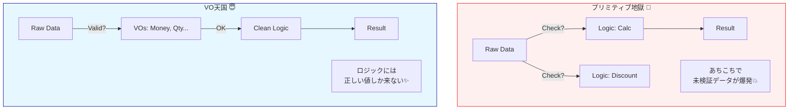

# 第40章：まとめ演習：VOだけで仕様の半分を守る🎯

## 0) ちょい最新トピック（2026-02-07時点）🗞️✨

* TypeScript の最新安定版は 5.9 系（npm の latest も 5.9.x）だよ〜📦✨ ([TypeScript][1])
* 近い将来、TypeScript 6.0 が「橋渡し版」になって、その後にネイティブ移植系（TypeScript 7）へ進む流れが公式に語られてるよ🚀 ([Microsoft for Developers][2])
* テストは Vitest 4 系が現行の大きな流れ（軽くて速い）って感じ🧪⚡ ([Vitest][3])

> この章の狙い：**“VO足すだけで、if文が消えて、バグも消える”** を体験するよ🫶💎

---

## 1) この章でできるようになること🎀✅

* 「どれをVOにすると効くか」を嗅ぎ分けられる👃✨
* **VOを追加 → 仕様が守られる** を実感できる💎🛡️
* テストが「仕様の見張り番」になる感覚がつかめる🧪👀

---

## 2) まずは“プリミティブ地獄”を味わおう😇🧨


例：カフェ注文の合計計算。最初はこうなりがち👇

```ts
// ぜんぶプリミティブ（number/string）で持ってる世界😵‍💫
type OrderDraft = {
  orderId: string;          // ほんとに注文ID？ほかのIDと混ざらない？
  email: string;            // 空文字でもOKになっちゃう…
  items: Array<{
    menuItemId: string;     // これも string…
    price: number;          // 小数？通貨？丸め？地雷💣
    quantity: number;       // 0や-1が入っても止まらない😇
  }>;
  discountRate: number;     // 0.2 なのか 20 なのか…（混乱）
};

export function calcTotal(draft: OrderDraft): number {
  const subTotal = draft.items.reduce((sum, it) => sum + it.price * it.quantity, 0);
  const discounted = subTotal * (1 - draft.discountRate);
  return Math.round(discounted);
}
```

### ここで起きる事故あるある😂⚠️

* quantity が 0 / -1 でも動く😇
* price が 480.5 とか入って丸め地獄😵
* discountRate に 20（20%のつもり）を入れて合計がマイナスに…💸
* email が `"aaa"` でも通る📮💥
* orderId と menuItemId を間違えて渡しても、型が同じ（string）だから気づけない🫠

* orderId と menuItemId を間違えて渡しても、型が同じ（string）だから気づけない🫠



---

## 3) 演習①：VO候補を“バグ視点”で洗い出す🔍💎


次のルール（仕様）を、**「VOで守れそう？」** って観点で仕分けしてみてね🎯

* 数量は 1〜20 の整数🍰
* 金額は「円」で、0以上の整数（小数NG）💴
* 割引率は 0.00〜0.50（最大50%）🏷️
* Emailは正しい形式で、前後空白を無視して保存したい✉️
* OrderId と MenuItemId を混ぜたくない🪪

👉 ここでのコツ：
**「入力のゆらぎ」「境界値」「意味の取り違え」** があるやつはVOにすると超効くよ💎✨

---

## 4) 演習②：VOを足して“守備力”を上げる🛡️💎

### 4-1) まず3つだけ作る（効果がデカい順）🥇🥈🥉

* Money（円・整数・0以上）💴
* Quantity（1〜20）📏
* DiscountRate（0〜0.5）🏷️

#### Money（円）💴


```ts
export class Money {
  private constructor(private readonly yen: number) {}

  static create(yen: number): Money {
    if (!Number.isInteger(yen)) throw new Error("Money must be integer yen.");
    if (yen < 0) throw new Error("Money must be >= 0.");
    return new Money(yen);
  }

  toNumber(): number {
    return this.yen;
  }

  add(other: Money): Money {
    return Money.create(this.yen + other.yen);
  }

  multiplyInt(n: number): Money {
    if (!Number.isInteger(n)) throw new Error("Multiplier must be integer.");
    if (n < 0) throw new Error("Multiplier must be >= 0.");
    return Money.create(this.yen * n);
  }

  // 割引は端数が出るので、丸め方をここに閉じ込める✨
  applyDiscount(rate: DiscountRate): Money {
    const raw = this.yen * (1 - rate.toNumber());
    return Money.create(Math.round(raw));
  }

  equals(other: Money): boolean {
    return this.yen === other.yen;
  }
}
```

#### Quantity（1〜20）📏

```ts
export class Quantity {
  private constructor(private readonly value: number) {}

  static create(value: number): Quantity {
    if (!Number.isInteger(value)) throw new Error("Quantity must be integer.");
    if (value < 1) throw new Error("Quantity must be >= 1.");
    if (value > 20) throw new Error("Quantity must be <= 20.");
    return new Quantity(value);
  }

  toNumber(): number {
    return this.value;
  }

  equals(other: Quantity): boolean {
    return this.value === other.value;
  }
}
```

#### DiscountRate（0〜0.5）🏷️

```ts
export class DiscountRate {
  private constructor(private readonly value: number) {}

  static create(value: number): DiscountRate {
    if (!Number.isFinite(value)) throw new Error("DiscountRate must be a number.");
    if (value < 0) throw new Error("DiscountRate must be >= 0.");
    if (value > 0.5) throw new Error("DiscountRate must be <= 0.5.");
    return new DiscountRate(value);
  }

  toNumber(): number {
    return this.value;
  }

  equals(other: DiscountRate): boolean {
    return this.value === other.value;
  }
}
```

---

### 4-2) さっきの calcTotal を“VO版”に置き換える🔁✨


```ts
type LineItem = {
  price: Money;
  quantity: Quantity;
};

export function calcTotalVO(items: LineItem[], discount: DiscountRate): Money {
  const subTotal = items.reduce(
    (sum, it) => sum.add(it.price.multiplyInt(it.quantity.toNumber())),
    Money.create(0)
  );

  return subTotal.applyDiscount(discount);
}
```

✅ 何が嬉しい？

* price は必ず Money → 小数や負が入れにくい💴
* quantity は必ず Quantity → 0や-1が入れにくい📏
* discount は必ず DiscountRate → 20 とか入らない🏷️
* 「丸め」も Money に閉じ込めた → 設計が安定✨

---

## 5) 演習③：VOのテストで“仕様の見張り番”を置く🧪👀💎


VOは小さいから、テストも小さくて強いよ💪✨
（Vitest 4 系が現行の流れだよ〜🧪⚡ ([Vitest][3])）

### Money のテスト例💴

```ts
import { describe, it, expect } from "vitest";
import { Money } from "./Money";
import { DiscountRate } from "./DiscountRate";

describe("Money", () => {
  it("rejects negative", () => {
    expect(() => Money.create(-1)).toThrow();
  });

  it("rejects decimal", () => {
    expect(() => Money.create(10.5)).toThrow();
  });

  it("adds correctly", () => {
    const a = Money.create(100);
    const b = Money.create(250);
    expect(a.add(b).toNumber()).toBe(350);
  });

  it("applies discount with rounding", () => {
    const total = Money.create(999);
    const rate = DiscountRate.create(0.1);
    expect(total.applyDiscount(rate).toNumber()).toBe(899); // 999 * 0.9 = 899.1 → round
  });
});
```

### Quantity のテスト例📏

```ts
import { describe, it, expect } from "vitest";
import { Quantity } from "./Quantity";

describe("Quantity", () => {
  it("rejects 0", () => {
    expect(() => Quantity.create(0)).toThrow();
  });

  it("rejects 21", () => {
    expect(() => Quantity.create(21)).toThrow();
  });

  it("accepts 1", () => {
    expect(Quantity.create(1).toNumber()).toBe(1);
  });
});
```

---

## 6) 仕上げ演習：VOを“追加するだけ”でif文を消す🧹✨

最後に、さっきの「プリミティブ版 OrderDraft」を **VOで受け取る形** に寄せてみよ〜🎯

### Before（ifが増えて疲れる😵）

* quantityチェック
* priceチェック
* discountチェック
* 合計の丸め
  …があちこちに散っていく💥

### After（VO生成時に“弾ける”✨）


* アプリ層では「作れたなら正しい」状態に近づく✅
* 合計計算が読みやすくなる📖💛

---

## 7) “VOだけで守れた仕様”チェックリスト✅💎

この章が終わったら、これを指差し確認してね👆✨

* [ ] 数量が 1〜20 の整数しか入らない📏
* [ ] 金額が 円・整数・0以上しか入らない💴
* [ ] 割引率が 0〜0.5 の範囲に固定された🏷️
* [ ] 丸め方が Money に閉じ込められた🧊
* [ ] calcTotalVO が “仕様の文章”っぽく読める📖✨
* [ ] VO単体テストが揃ってて安心🧪🫶

---

## 8) AI活用：この章でめちゃ効く使い方🤖🩷

### 8-1) VO候補を出してもらう（壁打ち）🧱

こんな感じで投げると強いよ👇

* 「この仕様（箇条書き）を、VOで守れるものと、Entity/集約で守るべきものに分類して。理由も。」
* 「Money/Quantity/DiscountRate に起きやすいバグと、そのテストケースを境界値中心で10個ずつ出して。」

### 8-2) “VOに入れすぎ問題”を検査してもらう⚖️

* 「このVOの責務は重すぎる？ I/OやDB知識が混ざってない？混ざってたら分離案を。」

### 8-3) テスト名を良い感じにしてもらう🧪🏷️

* 「itの名前を仕様っぽい英語（または日本語）にして、重複を減らして。」

---

## 9) まとめ：VOは“守備力ブースター”💎🛡️✨

VOを足すだけで、

* バグが **実行時** じゃなくて **生成時** に止まる💥→✅
* 仕様がコードの中で迷子になりにくい🗺️
* テストが超ラク（小さくて速い）🧪⚡

次の章（Entity）に行くと、今度は「同一性」が主役になって、**VO＋Entityで守れる範囲が一気に増える**よ〜🪪✨

必要なら、この章の演習を「カフェ注文」全体（PlaceOrderの入力DTO → VO化 → ドメインへ渡す）までつなげた“ミニ完成版”も作れるよ🎉💛

[1]: https://www.typescriptlang.org/download/?utm_source=chatgpt.com "How to set up TypeScript"
[2]: https://devblogs.microsoft.com/typescript/progress-on-typescript-7-december-2025/?utm_source=chatgpt.com "Progress on TypeScript 7 - December 2025"
[3]: https://vitest.dev/blog/vitest-4?utm_source=chatgpt.com "Vitest 4.0 is out!"
