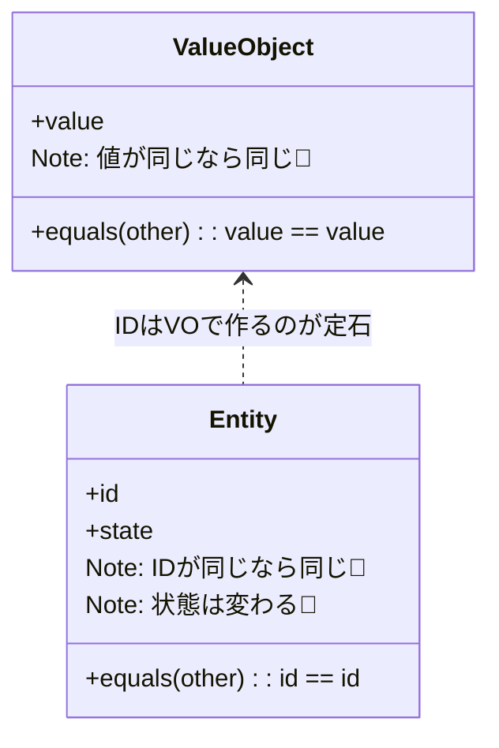

# 第41章：Entity入門：同一性（ID）が主役🪪

同じ注文かどうかは「内容」じゃなくて **注文IDで決まる**🪪



この章は「**VO（値で同じ）**」と「**Entity（IDで同じ）**」を、頭で理解するだけじゃなく **コードとテストで体感**できるようにするよ〜😊🧡

---

## 1) 今日のゴール🎯💡

読み終わったらこうなってる状態がゴールだよ👇✨

* ✅ **VOとEntityの違い**を、説明できる（しかも迷わない）🗣️
* ✅ **Entityは“IDで同一性”が決まる**と腹落ちしてる🪪
* ✅ TypeScriptで **Entityの最小実装**が書ける🧩
* ✅ テストで「IDが同じなら同じEntity」を確認できる🧪

---

## 2) まず結論！VOとEntityの違いはコレ🌸


### Value Object（VO）💎

* ✅ **“値が同じなら同じ”**
* ✅ **不変（immutable）**で、変更したら「別の値」になる🧊
* 例：Money、Email、Quantity…💴✉️📏

### Entity 🪪

* ✅ **“IDが同じなら同じ”**
* ✅ 値（状態）は変わってもいい（むしろ変わる）🔁
* 例：Order（注文）、Customer（顧客）など☕🧾

---

## 3) 例で一発理解☕🧾（カフェ注文）


たとえば「注文」ってさ…👇

* 注文に商品を追加した📌
* 数量を変えた📌
* 支払い済みに進んだ📌

…って変化があるのに、**「同じ注文」って言うよね？**😊
これが **Entity的な発想**だよ✨
同じ注文かどうかは「内容」じゃなくて **注文IDで決まる**🪪

---

## 4) 迷わない！Entity判定の3チェック✅🧠


「これEntity？VO？」って迷ったら、まずこの3つを見てね👇✨

1. **時間をまたいでも“同じもの”って言いたい？** ⏳

   * YES → Entityっぽい🪪
2. **更新される前提？（状態が変わる）** 🔁

   * YES → Entityっぽい🪪
3. **同一性の根拠が“ID”で語れる？** 🆔

   * YES → Entity確定に近い🪪✨

逆に「値が同じなら同じ」「不変で持ちたい」はVO寄り💎

---

## 5) TypeScriptで最小Entityを書こう🧩🪪

ここからは “小さく作って、テストで確認” の流れでいくよ😊🧡
（この章は **最小の形**に絞るね。ID生成や比較ルールの深掘りは次章でもっとやるよ✨）

---

### 5-1) IDはVOとして作る（OrderId）🪪💎


ポイントはこれ👇

* IDはただの`string`にしない（混ざると事故る）😵‍💫
* **equals**を持たせて「比較のルール」を固定🧷

```ts
// src/domain/order/OrderId.ts
export class OrderId {
  private constructor(private readonly value: string) {}

  static from(value: string): OrderId {
    const v = value.trim();
    if (!v) throw new Error("OrderId must not be empty");
    return new OrderId(v);
  }

  // テストやサンプル用（本格的な生成は次章で扱うよ）
  static generate(): OrderId {
    return new OrderId(crypto.randomUUID());
  }

  equals(other: OrderId): boolean {
    return this.value === other.value;
  }

  toString(): string {
    return this.value;
  }
}
```

> ちなみに最新のTypeScriptは 5.9 系（5.9.3 が “Latest” 表示）だよ📌
> 最新追従のときは、公式リリース情報を基準にするのが安全✨ ([GitHub][1])

---

### 5-2) Entityの共通クラス（同一性＝ID）🪪✨

Entityの核はこれだけ👇

* **equalsはIDで判定**する
* 値が全部同じでも、IDが違えば別物🙅‍♀️

```ts
// src/domain/shared/Entity.ts
export abstract class Entity<TId extends { equals(other: TId): boolean }> {
  protected constructor(protected readonly _id: TId) {}

  get id(): TId {
    return this._id;
  }

  equals(other: Entity<TId>): boolean {
    if (other === this) return true;
    return this._id.equals(other._id);
  }
}
```

---

### 5-3) Order Entity（状態は変わってもOK）☕🧾🪪


「注文」は変化するけど、**同じ注文かどうかはIDで決まる**よね😊

```ts
// src/domain/order/Order.ts
import { Entity } from "../shared/Entity";
import { OrderId } from "./OrderId";

export type OrderStatus = "Draft" | "Confirmed";

export class Order extends Entity<OrderId> {
  private _status: OrderStatus;

  private constructor(id: OrderId, status: OrderStatus) {
    super(id);
    this._status = status;
  }

  // 新規作成
  static createNew(): Order {
    return new Order(OrderId.generate(), "Draft");
  }

  // 永続化から復元（DBやAPIから読み込んだ体で）
  static rehydrate(id: OrderId, status: OrderStatus): Order {
    return new Order(id, status);
  }

  get status(): OrderStatus {
    return this._status;
  }

  confirm(): void {
    if (this._status !== "Draft") throw new Error("Only Draft can be confirmed");
    this._status = "Confirmed";
  }
}
```

---

## 6) テストで「IDが同じなら同じ」を証明🧪✨


ここは超だいじ！
**テストで体感すると、Entityが一気に腹落ちする**よ😊🧡

### Vitestでの例（今どきの主流寄り）🧪

Vitestは “Node >= 20” など要件が明記されてるので、導入時は公式ガイドを見てね📌 ([Vitest][2])

```ts
// src/domain/order/Order.identity.test.ts
import { describe, it, expect } from "vitest";
import { Order } from "./Order";
import { OrderId } from "./OrderId";

describe("Order Entity identity", () => {
  it("IDが同じなら、状態が違っても「同じ注文」になる🪪", () => {
    const id = OrderId.from("order-001");

    const a = Order.rehydrate(id, "Draft");
    const b = Order.rehydrate(OrderId.from("order-001"), "Confirmed");

    expect(a.equals(b)).toBe(true);
  });

  it("値（状態）が同じでも、IDが違えば別物🙅‍♀️", () => {
    const a = Order.rehydrate(OrderId.from("order-001"), "Draft");
    const b = Order.rehydrate(OrderId.from("order-002"), "Draft");

    expect(a.equals(b)).toBe(false);
  });

  it("同じインスタンスは当然同じ👌", () => {
    const a = Order.createNew();
    expect(a.equals(a)).toBe(true);
  });
});
```

---

## 7) AIの使いどころ（この章で効くやつ）🤖💞

### 7-1) Entity/VO分類クイズを作らせる🎮✨

AIにこう投げると便利👇

* 「カフェ注文ドメインで、Entity/VO候補を20個出して。理由も1行ずつ」

✅ 出てきた理由を見て、**“同一性がIDか？”**で仕分けしよう🪪

---

### 7-2) equals設計レビューをさせる🧠🔍

* 「Entityのequalsが値比較になってない？落とし穴を指摘して」

✅ “IDで比較する” を崩すとDDDがすぐ崩れるので、ここはAIレビューが刺さる💘

---

### 7-3) テスト観点を増やす🧪📌

* 「Entityの同一性テストで、追加すべきケースを列挙して」

✅ 抜けがちな観点（別クラス比較・null扱い等）を拾えるよ✨

---

## 8) よくある事故パターン集😂⚠️（超重要）

1. **IDをただのstringで扱って混線**😵‍💫

   * `orderId` と `customerId` を間違えてもコンパイルが通る地獄…
2. **equalsを値の一致で作っちゃう**🤯

   * 「注文内容が同じなら同じ注文」になって破綻する
3. **復元時にIDを作り直す**🧨

   * DBから読み込むたびに別注文扱いになる（同一性崩壊）

---

## 9) ミニ演習🎓🌸（10〜20分）

### お題：Customer Entity を作ろう🧍🪪

* `CustomerId`（VO）を作る
* `Customer`（Entity）を作る
* `changeName()`で名前は変わってOK
* テスト：

  * ✅ ID同じなら同一
  * ✅ 名前が違っても同一
  * ✅ ID違えば別物

できたら最高〜！🎉✨

---

## 10) まとめ🎁✨

* Entityは **「IDで同一性が決まる」**🪪
* VOは **「値で同一性が決まる」**💎
* TypeScriptでは

  * IDをVOにして事故を防ぐ🧱
  * EntityのequalsはID比較に固定🧷
  * テストで腹落ち🧪

---

## 理解チェック✅🧠（答えは自分で言えると強い！）

1. 「注文」がEntityな理由は？🪪
2. 「Money」がVOな理由は？💴
3. Entityのequalsが“値比較”だと何が起きる？😱
4. `rehydrate` みたいな復元が必要なのはなぜ？📦

---

次の第42章は、ここで軽く触れた「**ID生成・比較ルール**」を、もっと実務っぽくガッチリ固めていくよ〜🆔✨

[1]: https://github.com/microsoft/typescript/releases "Releases · microsoft/TypeScript · GitHub"
[2]: https://vitest.dev/guide/?utm_source=chatgpt.com "Getting Started | Guide"
