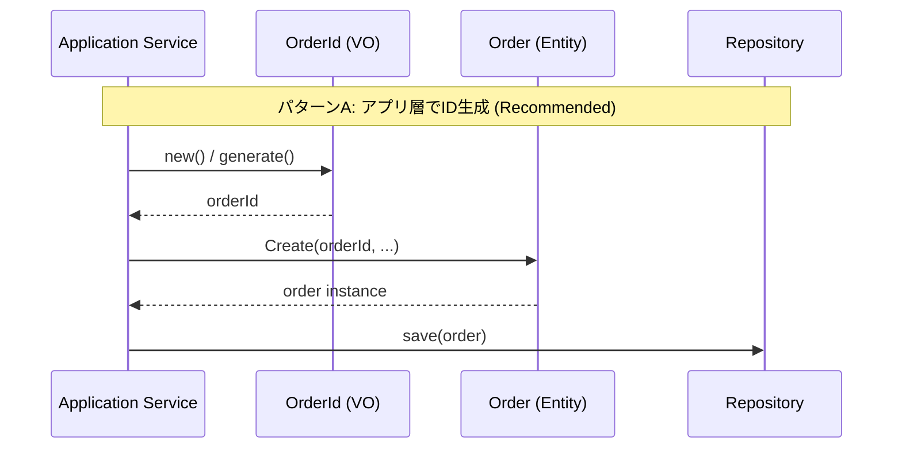

# 第42章：Entityの設計：ID生成と比較ルール🆔




## 今日のゴール🎯

* Entityの「同一性（同じもの判定）」は **IDで決める**って腹落ちする🙆‍♀️
* IDを **VOとして扱う**（混ぜない・勝手に変えない）を実装で体験する💎
* IDを **いつ生成する？誰が生成する？** を迷わなくなる🧠✨

---

## 1) まず結論：Entityの比較は「IDだけ」🪪✅

Entityは「値が同じ」じゃなくて「同じ個体かどうか」が本質だよ〜🧍‍♀️

たとえば注文（Order）で…

* 明細も合計も状態も、**たまたま完全一致**する注文が2件あっても
  → それは“別の注文”だよね？😳☕
* 逆に、状態や明細が変わっても
  → **同じOrderIdなら同じ注文**だよね？🔁

つまり👇
**Entityの同一性 = ID**
**値の一致 = 別の話（VOっぽい話）**

---

## 2) IDは「ただのstring」にしないで、VOにしよう💎🧱

stringで持つと、こういう事故が起きるよ〜😇

* `orderId: string` と `menuItemId: string` を **うっかり入れ替えてもコンパイルが通る** 😱
* どこかで `orderId = crypto.randomUUID()` し直しても、気づきにくい🥲

だから **OrderIdをVO化**しよう💎✨
（VOなので：不変・自己完結・生成時に検証）

---

## 3) 2026年の「ID生成」ベストな選択肢🧰✨（最新リサーチ込み）

いまは「UUID生成のためだけの依存」を減らしやすい流れだよ〜🌿

* ブラウザは `crypto.randomUUID()` で **v4 UUID** を生成できる（多くの環境で広く利用可能）📌([MDN Web Docs][1])
* `Node.js` 側も `node:crypto` に `crypto.randomUUID()` があり、v4 UUIDを生成できる（追加バージョンの記載もあるよ）📌Node.js ([Node.js][2])
* npmの `uuid` パッケージも継続してメンテされてて、最新版は 13.x（RFC9562 UUIDs）になってるよ📦([npm][3])
* さらに「並び替えに強いID」なら **ULID** も定番。仕様として **単調性（monotonicity）** の考え方が整理されてる📚([GitHub][4])

（あと、2026時点の TypeScript は 5.9 のリリースノートが更新されてるよ〜📝([TypeScript][5])
そして Microsoft はTypeScriptのネイティブ移行の話も進めてる、という報道も出てる📣([InfoWorld][6])）

---

## 4) UUIDとULID、どっち使う？🤔🆔

迷ったら、こう決めるとラクだよ〜🍀

## ✅ UUID v4 が向くケース

* とにかく標準で安全にユニークにしたい🔐
* 並び順（時系列ソート）に強い必要は薄い
* 依存を増やしたくない（標準APIで済ませたい）🌿

## ✅ ULID が向くケース

* **作成順に近い並び（ソート）** が欲しい📈
* DBのインデックスの“並びやすさ”を意識したい（ランダムUUIDよりマシになりやすい）📚
* 同一ミリ秒内の生成でも、単調増加（monotonic）で順序性を補強したい🧠
  ※ULIDの単調性の考え方は仕様に書いてあるよ📌([GitHub][4])

---

## 5) 実装してみよ！OrderIdをVOにする💎🧪

## 5-1) UUID v4 の OrderId（おすすめ：分かりやすい✨）

```ts
export class OrderId {
  private constructor(private readonly value: string) {}

  /** 新規発番（生成） */
  static new(): OrderId {
    // Node.js: crypto.randomUUID()
    // Browser: crypto.randomUUID()
    const id = crypto.randomUUID();
    return OrderId.fromString(id);
  }

  /** 永続化から復元（復元） */
  static fromString(raw: string): OrderId {
    // “ざっくり”UUID形式チェック（厳密すぎると運用が辛いので程々に✨）
    const ok = /^[0-9a-f]{8}-[0-9a-f]{4}-[1-5][0-9a-f]{3}-[89ab][0-9a-f]{3}-[0-9a-f]{12}$/i.test(raw);
    if (!ok) throw new Error(`Invalid OrderId: ${raw}`);

    return new OrderId(raw);
  }

  equals(other: OrderId): boolean {
    return this.value === other.value;
  }

  toString(): string {
    return this.value;
  }
}
```

> `crypto.randomUUID()` はブラウザ側でもv4 UUIDを作れるよ📌([MDN Web Docs][1])
> `Node.js` 側でも `crypto.randomUUID([options])` があり、v4 UUID生成だよ📌([Node.js][2])

---

## 5-2) ULID版（作成順に寄せたい時）📈

ULIDは26文字で、先頭にタイムスタンプが入るから並び替えに強いことが多いよ〜✨
同一ミリ秒内の単調性も仕様で説明されてる📌([GitHub][4])

（ULID生成はライブラリを使うのが一般的だよ。ここでは形だけ例ね👇）

```ts
export class OrderId {
  private constructor(private readonly value: string) {}

  static fromString(raw: string): OrderId {
    const ok = /^[0-9A-HJKMNP-TV-Z]{26}$/.test(raw);
    if (!ok) throw new Error(`Invalid OrderId: ${raw}`);
    return new OrderId(raw);
  }

  equals(other: OrderId): boolean {
    return this.value === other.value;
  }

  toString(): string {
    return this.value;
  }
}
```

---

## 6) IDは「いつ生成する？」⏰✨（超大事）

おすすめはこのどっちかに寄せると事故らないよ〜🙆‍♀️

## ✅ パターンA：Entity生成時にIDも作る（初心者に最強）🥇

* `Order.create(...)` で `OrderId.new()` して持たせる
* その時点から同一性が確定する🪪✨

## ✅ パターンB：アプリ層でIDを作って渡す（テストや分離に強い）🧪

* `PlaceOrder` ユースケースで `idGenerator.generate()` して渡す
* ドメインは「IDの形式」だけ知って、生成手段には依存しない🤝

> **DBの採番（auto-increment）に同一性を丸投げ**すると、
> 「保存するまでIDが無い」状態になりやすくて、比較やイベントで詰まりがち😵‍💫
> （やるなら“保存前は仮ID”とか、設計が一段むずかしくなるよ〜）

---

## 7) Entity側の「比較ルール」をコードに固定しよ🧍‍♀️🪪

OrderがOrder同士を比べる時は、こういう感じ👇

```ts
export class Order {
  // id は不変！絶対変えない！🚫
  constructor(
    private readonly id: OrderId,
    // 他の状態はここに（例：status, items…）
  ) {}

  /** Entityの同一性判定はIDだけ */
  sameIdentityAs(other: Order): boolean {
    return this.id.equals(other.id);
  }

  getId(): OrderId {
    return this.id;
  }
}
```

💡ポイント

* `sameIdentityAs` みたいに **名前で意図を固定**すると、読み手が迷子にならないよ〜🧭✨
* `equals` をEntityに生やす場合も「IDのみ」で揺れないようにするのがコツ✅

---

## 8) IDまわりの落とし穴あるある😇⚠️

AIにもレビューさせたい系のやつだよ〜🤖💥

1. **復元時にIDを作り直す**（地獄）
   → DBから読んだOrderが別物になる😱
2. **IDをsetterで変えられる**
   → 同一性が壊れる（Entityとして終わり）🪦
3. **値が同じなら同じ注文扱い**
   → “たまたま一致”でバグる🥲
4. **stringのままIDを扱って混線**
   → OrderIdとMenuItemIdが入れ替わる事故🚑

---

## 9) テストのために「ID生成」を差し替え可能にする🧪✨

テストで `randomUUID()` だと、比較が面倒になりがちだよね🥺
だから、生成を注入できる形にすると最高🙆‍♀️

```ts
export interface IdGenerator {
  newOrderId(): OrderId;
}

export class CryptoOrderIdGenerator implements IdGenerator {
  newOrderId(): OrderId {
    return OrderId.new();
  }
}

export class FixedOrderIdGenerator implements IdGenerator {
  constructor(private readonly fixed: OrderId) {}
  newOrderId(): OrderId {
    return this.fixed;
  }
}
```

これでテストは👇

* `FixedOrderIdGenerator` を渡して「同じIDになる」前提で検証しやすい🎯✨

---

## 10) AI活用コーナー🤖💖（使うとめっちゃ捗るやつ）

## 🧠 設計レビューをAIに投げる質問テンプレ

* 「Entityの同一性判定がIDだけになってるか、チェックして」
* 「復元（rehydrate）と新規作成（create）の流れが混ざってないか見て」
* 「OrderIdをstringに戻さずに境界を守れてるか確認して」

## 🧪 テストを増やす依頼テンプレ

* 「OrderIdの不正入力ケース（空文字、長さ違い、文字種違い）を追加して」
* 「sameIdentityAs のテストで、値が同じでもIDが違うケースを作って」

（コツ：**“何を守りたいか”を最初に書く**と、AIがブレにくいよ〜🧭✨）

---

## 11) ミニ演習🎓✨（15〜30分）

## 演習A：OrderId VOを完成させる💎

* `fromString()` のバリデーションを強化してみよう
* `toString()` をログ用途に使ってOKな形にしよう

## 演習B：Entity比較バグを潰す🪪

* 「値が同じなら同じ注文」みたいなコードを見つけて
  **ID比較に置き換える**🔁

## 演習C：テスト追加🧪

* `sameIdentityAs` が **ID以外を見てない**ことを証明するテストを書く✅

---

## 12) 章のまとめ📦✨

* Entityの“同一性”は **IDだけ**で決める🪪✅
* IDはVOにして、**混ざらない・変わらない**を強制する💎🔒
* 生成タイミングは「作成時」か「アプリ層で注入」に寄せると事故りにくい⏰✨
* 2026年は `crypto.randomUUID()` が強くて、UUID生成の依存を減らしやすい🌿([MDN Web Docs][1])
* 並び順が欲しければULIDも選択肢（単調性の考え方が仕様で整理）📚([GitHub][4])

---

次の第43章は「Entityの不変条件をどこで守る？」だから、
今回の **“IDは絶対に変えない”** がそのまま土台になるよ〜🔒💖

[1]: https://developer.mozilla.org/en-US/docs/Web/API/Crypto/randomUUID "Crypto: randomUUID() method - Web APIs | MDN"
[2]: https://nodejs.org/api/crypto.html "Crypto | Node.js v25.6.0 Documentation"
[3]: https://www.npmjs.com/package/uuid?utm_source=chatgpt.com "uuid"
[4]: https://github.com/ulid/spec "GitHub - ulid/spec: The canonical spec for ulid"
[5]: https://www.typescriptlang.org/docs/handbook/release-notes/typescript-5-9.html "TypeScript: Documentation - TypeScript 5.9"
[6]: https://www.infoworld.com/article/4100582/microsoft-steers-native-port-of-typescript-to-early-2026-release.html?utm_source=chatgpt.com "Microsoft steers native port of TypeScript to early 2026 ..."
