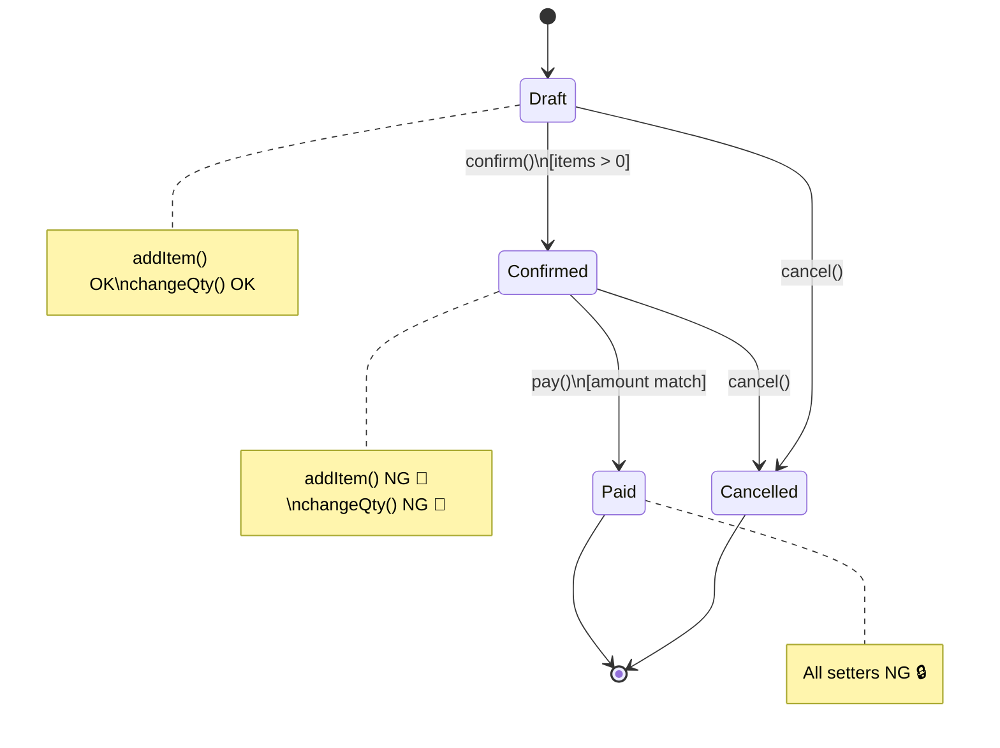

# 第43章：Entityの不変条件：どこで守る？🔒

20. **“複数のEntityにまたがるルール”** →（次の章で出る）**Aggregate Root** 側に寄せる🏯



## この章のゴール🎯

* Entityが**自分のルールを自分で守る**設計にできるようになる🙆‍♀️
* 「setterで自由に書き換え」みたいな事故を防げるようになる🚫
* TypeScriptで、**“破れない作り”**をコードで体感する💪🧡

---

## まず結論🍓

Entityの不変条件（絶対守るルール）は、基本こう守るよ👇

1. **生成時のルール** → `constructor` / `static create()` で守る🏭✨
2. **状態に応じたルール** → Entityの **メソッド内** で守る🛡️
3. **外から直接いじれない** → `private` / `#private` で封鎖する🔐
4. **更新は「意図のあるメソッド」だけ** → `confirm()` / `addItem()` みたいにする🎮
5. **“複数のEntityにまたがるルール”** →（次の章で出る）**Aggregate Root** 側に寄せる🏯

---

## 「不変条件」ってなに？🧠✨

**絶対に破っちゃダメなルール**だよ〜！💡
例：カフェ注文なら☕🧾

* 支払い済みの注文は、明細を変更できない💳🚫
* 明細が0件の注文は、確定できない🧾❌
* 確定前しかキャンセルできない（方針次第）🧯

ポイントはこれ👇
**「守る場所」がバラけると、いつか絶対破られる**😇💥
だから、Entityが自分で守るのが基本なの。

---

## 2026/02時点の“最新寄り”メモ📌🆕

* TypeScriptは 5.9 系が現行の安定版として参照できるよ（公式Release Notes）🟦✨ ([TypeScript][1])
* Node.js には組み込みテストランナーがあって、**Node 20で stable 扱い**になってるよ🧪✨ ([Node.js][2])
* ただし `--watch` は公式API docs上は “Experimental” 表記もあるので、watch前提の説明は控えめが安全🙈 ([Node.js][3])
* テストツールなら Vitest も継続的に更新されてる（4.0.xやbetaが動いてる）⚡ ([GitHub][4])
* Nodeの現行・LTSの状況は定期的に変わるので、運用やCIではLTS中心が無難だよ🧡 ([endoflife.date][5])

---

## ありがちな事故パターン😵‍💫💥

### ❌ ダメ例：setterで自由に書き換え

* どこからでも `order.status = "Paid"` とかできちゃう
* その瞬間、ルールが崩壊する💣

### ✅ いい例：状態変更はメソッドだけ

* `pay()` の中で「支払い可能か？」をチェック
* OKなら状態を進める
* NGなら例外（もしくはResult）で止める🧯

---

## 実装して体感しよ☕🧍🔒（Order Entity例）

ここでは「Entityの不変条件を守る型」を作るよ✨
（VOは前章までの知識で、最低限だけ添えるね💎）

```ts
// domain/errors.ts
export class DomainError extends Error {
  constructor(message: string) {
    super(message);
    this.name = "DomainError";
  }
}
```

```ts
// domain/order/OrderId.ts
import { DomainError } from "../errors";

export class OrderId {
  private constructor(private readonly value: string) {}

  static create(value: string): OrderId {
    if (!value || value.trim().length === 0) {
      throw new DomainError("OrderId は空にできません");
    }
    return new OrderId(value);
  }

  equals(other: OrderId): boolean {
    return this.value === other.value;
  }

  toString(): string {
    return this.value;
  }
}
```

### ✅ Entity本体：不変条件は「中」で守る🛡️

```ts
// domain/order/Order.ts
import { DomainError } from "../errors";
import { OrderId } from "./OrderId";

export type OrderStatus = "Draft" | "Confirmed" | "Paid" | "Cancelled";

export type OrderLine = Readonly<{
  menuItemId: string;
  quantity: number;
  unitPriceYen: number;
}>;

export class Order {
  // ✅ ランタイムでも守りたいなら #private もアリ（TSでもOK）
  #status: OrderStatus;
  #lines: OrderLine[];

  private constructor(
    private readonly id: OrderId,
    status: OrderStatus,
    lines: OrderLine[],
  ) {
    this.#status = status;
    this.#lines = lines;

    // ✅ 生成時点で守るルール（初期整合性）
    this.assertValidLines(lines);
  }

  // ✅ 生成の入口を1つにする（ルールを散らさない）
  static createNew(id: OrderId): Order {
    return new Order(id, "Draft", []);
  }

  getId(): OrderId {
    return this.id;
  }

  getStatus(): OrderStatus {
    return this.#status;
  }

  // ✅ 外に配列を渡すと「外からpush」されるのでコピーして返す
  getLines(): ReadonlyArray<OrderLine> {
    return [...this.#lines];
  }

  // --------------------------
  // ✅ ここから “振る舞い” API
  // --------------------------

  addItem(menuItemId: string, quantity: number, unitPriceYen: number): void {
    this.assertModifiable("明細追加");
    this.assertPositiveInt(quantity, "quantity");
    this.assertPositiveInt(unitPriceYen, "unitPriceYen");

    const line: OrderLine = { menuItemId, quantity, unitPriceYen };
    this.#lines = [...this.#lines, line];
  }

  confirm(): void {
    this.assertModifiable("注文確定");

    if (this.#lines.length === 0) {
      throw new DomainError("明細が0件の注文は確定できません");
    }
    this.#status = "Confirmed";
  }

  pay(): void {
    if (this.#status !== "Confirmed") {
      throw new DomainError("支払いは Confirmed の注文だけ可能です");
    }
    this.#status = "Paid";
  }

  cancel(): void {
    // 例：Draft / Confirmed ならOK、PaidならNG とする
    if (this.#status === "Paid") {
      throw new DomainError("支払い済みの注文はキャンセルできません");
    }
    this.#status = "Cancelled";
  }

  // --------------------------
  // ✅ ガード（不変条件を守る関所）
  // --------------------------

  private assertModifiable(action: string): void {
    if (this.#status === "Paid") {
      throw new DomainError(`${action} は支払い済みの注文ではできません`);
    }
    if (this.#status === "Cancelled") {
      throw new DomainError(`${action} はキャンセル済みの注文ではできません`);
    }
  }

  private assertValidLines(lines: OrderLine[]): void {
    for (const l of lines) {
      this.assertPositiveInt(l.quantity, "quantity");
      this.assertPositiveInt(l.unitPriceYen, "unitPriceYen");
    }
  }

  private assertPositiveInt(value: number, name: string): void {
    if (!Number.isInteger(value) || value <= 0) {
      throw new DomainError(`${name} は正の整数である必要があります`);
    }
  }
}
```

---

## ここが「Entityが自衛できる」ポイント🛡️✨

* `#status` を直接触れない → **状態を勝手に変えられない**🔒
* `confirm()` / `pay()` の中でチェック → **状態遷移の不正をブロック**🚫
* `getLines()` がコピー → **外から配列を書き換えられない**🧊
* `assertModifiable()` みたいなガードで、**ルールを1箇所に寄せる**📍

---

## テストで「破れない」を確認しよ🧪✨（Node組み込みテスト）

Nodeの組み込みテストランナーは Node 20 で stable 扱いになってるよ〜🧪✨ ([Node.js][2])

```ts
// test/Order.test.ts
import test from "node:test";
import assert from "node:assert/strict";

import { OrderId } from "../domain/order/OrderId";
import { Order } from "../domain/order/Order";

test("明細0件では confirm() できない", () => {
  const order = Order.createNew(OrderId.create("order-1"));
  assert.throws(() => order.confirm());
});

test("Paid になったら addItem() できない", () => {
  const order = Order.createNew(OrderId.create("order-2"));
  order.addItem("coffee", 1, 500);
  order.confirm();
  order.pay();

  assert.equal(order.getStatus(), "Paid");
  assert.throws(() => order.addItem("cake", 1, 400));
});

test("pay() は Confirmed のときだけ", () => {
  const order = Order.createNew(OrderId.create("order-3"));
  order.addItem("coffee", 1, 500);

  assert.throws(() => order.pay()); // DraftなのでNG
  order.confirm();
  assert.doesNotThrow(() => order.pay()); // ConfirmedならOK
});
```

> `--watch` は公式ドキュメント上 “Experimental” 表記があるので、watch運用の話は一旦置いてOKだよ🙈 ([Node.js][3])

---

## 「どのルールをEntityに入れる？」判断ミニチャート🗺️✨


✅ Entityに入れてOK

* **そのEntity単体で完結**して守れる
* **状態（status）と一緒に守る**のが自然
* 例：`Paidなら変更不可`、`quantityは正の整数`

⚠️ Entity単体に入れない（次のAggregateでまとめる候補）

* **明細合計と支払い金額の整合**みたいに、複数要素をまとめて守りたい
* **一緒に変更されるべき範囲**が広い
* 例：`Order全体の合計は明細の合計と一致`（OrderがRootになりそう）

🚫 Entityに入れない（アプリ層 or ドメインサービス）

* DBの都合、APIの都合、UI都合
* 外部連携やI/Oが絡む
* 例：`決済APIを呼ぶ`、`在庫テーブルを見る`

---

## AI（Copilot/Codex）を“良い補助輪”にするコツ🤖🚲✨

「コード書いて」より、**ルールを守る設計を固める質問**が強いよ〜！

### 使えるプロンプト例🍓

* 「Orderの状態遷移（Draft/Confirmed/Paid/Cancelled）で、禁止される操作を表にして」
* 「上の禁止表を満たすように、`assertModifiable()` みたいなガード関数案を提案して」
* 「confirm/pay/cancel の異常系テストケースを Given/When/Then で10個出して」
* 「外部に漏れると危険な参照（配列・オブジェクト）を、TypeScriptで安全に返す方法を列挙して」

👉 AIが出したものは、そのまま採用じゃなくて
**「ルールが1箇所に集まってる？」**だけ目でチェックしてね👀🔒

---

## ミニ演習🎓✨（手を動かすやつ！）

### 演習1：ルール追加🧩

「Cancelled の注文は confirm/pay/addItem できない」を強化してみてね🚫

* いまは `assertModifiable()` が止めてくれるけど、メッセージを整えるなど改善もできるよ🧡

### 演習2：仕様変更（ありがち）🌀

「Confirmed になったら明細変更できない」に変えてみよ！

* `assertModifiable()` の条件に `Confirmed` を追加するだけでOK？
* `pay()` はどうなる？🤔
  こういう「仕様変更のしやすさ」がDDDの旨みだよ🍯✨

### 演習3：安全な公開🧊

`getLines()` が本当に安全か確認してね

* 「返した配列をいじっても内部が変わらない」テストを書いてみよう🧪

---

## まとめ🌸

* Entityの不変条件は **Entity自身が守る**のが基本🔒
* 入口は `create()`、更新は **意図のあるメソッド**だけ🎮
* `private / #private` とガード節で、**破れない設計**が作れる🛡️
* テストで「破れない」を固定化すると、未来の自分が助かる🧪✨
* 複数要素にまたがる大きい不変条件は、次の **Aggregate Root** でさらに強く守れる🏯💪

次の第44章では、この設計を土台にして **Order（注文）Entityのたたき台**を作って、モデルの芯を立てていくよ〜☕🧾✨

[1]: https://www.typescriptlang.org/docs/handbook/release-notes/typescript-5-9.html "TypeScript: Documentation - TypeScript 5.9"
[2]: https://nodejs.org/en/blog/announcements/v20-release-announce?utm_source=chatgpt.com "Node.js 20 is now available!"
[3]: https://nodejs.org/api/test.html?utm_source=chatgpt.com "Test runner | Node.js v25.6.0 Documentation"
[4]: https://github.com/vitest-dev/vitest/releases?utm_source=chatgpt.com "Releases · vitest-dev/vitest"
[5]: https://endoflife.date/nodejs?utm_source=chatgpt.com "Node.js"
