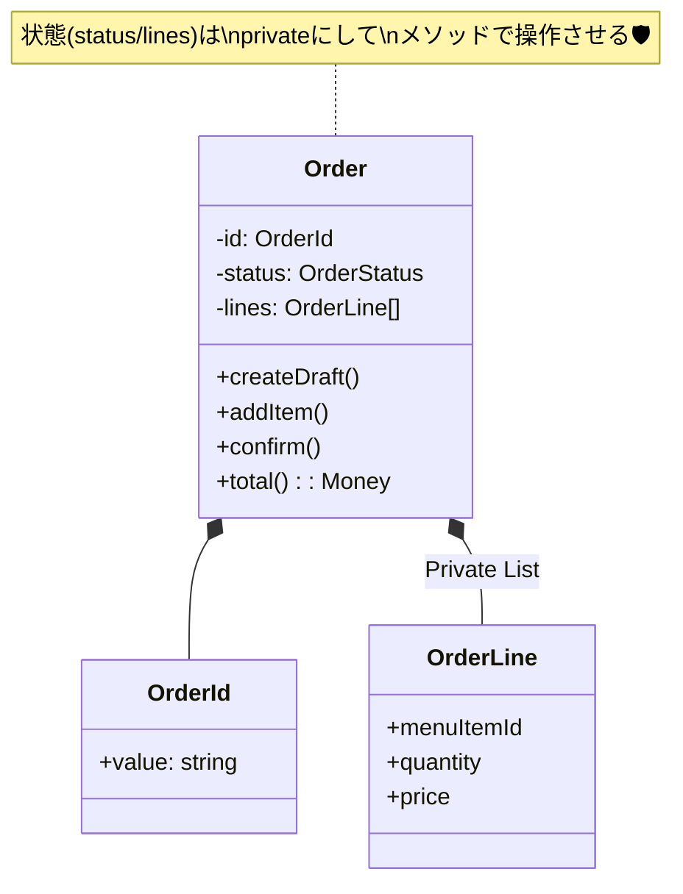

# 第44章：Order（注文）Entityのたたき台☕🧾




この章は「注文って、結局なにを持てば“注文”なの？」を決めて、**Order Entityの骨格（=モデルの芯）**を作る回だよ〜！🥳🧠
次章（第45章）で「振る舞い（メソッド）」を盛っていくために、まずは**“入れるもの/入れないもの”を決めてスッキリさせる**のが目的！🌿✨

---

## 1) 今日のゴール🎯💖

* Order Entityの「**最低限のプロパティ**」を決める🧾
* 外から壊されないように「**カプセル化**」する🛡️
* いったん動く「**たたき台コード**」をTypeScriptで用意する💻✨

ちなみに本日時点だと、TypeScriptの最新版（安定版）は **5.9** だよ〜🧡（公式のダウンロードページが「currently 5.9」って言ってる）([TypeScript][1])
Node.jsは **v24がActive LTS**、v25がCurrentって整理になってるよ([Node.js][2])（学習/個人開発はLTS寄りが安心😊）

---

## 2) Order Entityって何を表すの？🪪🧍‍♀️

Orderは **「同一性（OrderId）で追跡される“注文そのもの”】【状態が変わる】** のがポイントだよ🪪✨
VO（Value Object）みたいに「値が同じなら同じ」じゃなくて、**IDが同じなら同じ注文**って考えるやつ！

---

## 3) まず決める：Orderが持つべき“芯”🧠🧾

カフェ注文だと、たたき台はこのへんが鉄板だよ〜☕✨

### ✅ Orderが持つ（まずはこれ）

* **id**: OrderId（同一性の主役）🪪
* **status**: 注文の状態（draft/confirmed/paid/fulfilled/cancelled）🚦
* **lines**: 明細（OrderLineの配列）🧾🧾
* **createdBy**: 誰が作った注文？（CustomerId/StaffIdなど）👤
* **createdAt**: いつ作成？⏰

### ✅ “合計金額”はどうする？💴

おすすめは **「保存しないで計算する」** だよ〜✨
合計をフィールドで持つと、明細の更新と合計更新のズレで事故りやすい😵‍💫
なので `total()` や `get total` で **その都度計算**が安全寄り🛡️

---

## 4) 逆に、Orderに入れない（超大事）🚫⚠️

DDDが“効く”かどうか、ここが分かれ目！🥺

* ❌ **DB都合の情報を直入れ**（DBの行構造そのもの、JOIN前提の参照など）
* ❌ **画面表示用の整形済み文字列**（「合計: 1,200円」みたいなやつ）
* ❌ **他集約の実体参照**（MenuItemを丸ごと持つ、みたいなのは避けがち）

  * ✅ 代わりに **MenuItemId** と、必要なら「注文時点の価格スナップショット」を持つ、が多い👍

---

## 5) 不変条件メモ（この章では“メモ”でOK）📝🔒

実装は次章以降で盛るとして、今は「守りたいルール」をメモしよ〜✍️✨

* 同じ商品を2行に分けない（したいなら仕様として決める）🧾🧾
* 数量は1以上📏
* 支払い後は明細変更できない💳🚫
* キャンセルは提供後はできない…など🚫☕

👉 このメモが、次章（振る舞い）で**メソッド化されて“守れる設計”になる**よ！🥰

---

## 6) たたき台コード（TypeScript）💻✨

ここからは「外から壊せない」Orderを作るよ〜🛡️
ポイントはこれ👇

* **privateフィールド + getter**（外から直接いじれない）🔒
* **配列は防御的コピー**（外からpushされない）🧯
* **状態は文字列UnionでOK**（軽くて扱いやすい）🎈

---

### 6-1) OrderStatus（状態）🚦

```ts
// domain/order/OrderStatus.ts
export const OrderStatus = {
  Draft: "draft",
  Confirmed: "confirmed",
  Paid: "paid",
  Fulfilled: "fulfilled",
  Cancelled: "cancelled",
} as const;

export type OrderStatus = (typeof OrderStatus)[keyof typeof OrderStatus];
```

---

### 6-2) OrderLine（明細）🧾✨

ここでは「明細はVO寄り」で軽くいくよ〜（第49章で深掘り予定🫶）

```ts
// domain/order/OrderLine.ts
import { Money } from "../valueObjects/Money";
import { Quantity } from "../valueObjects/Quantity";
import { MenuItemId } from "../valueObjects/MenuItemId";

export class OrderLine {
  private constructor(
    readonly menuItemId: MenuItemId,
    readonly quantity: Quantity,
    readonly unitPrice: Money, // 注文時点の価格（スナップショット）にすると強い💪
  ) {}

  static create(args: { menuItemId: MenuItemId; quantity: Quantity; unitPrice: Money }): OrderLine {
    // Quantity/Money側で検証済み、という前提でOK（ここは薄く保つ）✨
    return new OrderLine(args.menuItemId, args.quantity, args.unitPrice);
  }

  subtotal(): Money {
    return this.unitPrice.multiply(this.quantity.value);
  }

  withQuantity(quantity: Quantity): OrderLine {
    return new OrderLine(this.menuItemId, quantity, this.unitPrice);
  }

  // 「同じ商品か？」判定はMenuItemIdでOK（仕様次第）🧠
  isSameItem(other: OrderLine): boolean {
    return this.menuItemId.equals(other.menuItemId);
  }
}
```

---

### 6-3) Order Entity（本体）☕🧾👑

```ts
// domain/order/Order.ts
import { OrderId } from "../valueObjects/OrderId";
import { CustomerId } from "../valueObjects/CustomerId";
import { Money } from "../valueObjects/Money";
import { OrderLine } from "./OrderLine";
import { OrderStatus } from "./OrderStatus";
import type { OrderStatus as TOrderStatus } from "./OrderStatus";

export class Order {
  // ✅ 外から直接いじれないようにprivateに閉じる🔒
  private _status: TOrderStatus;
  private readonly _lines: OrderLine[];

  private constructor(
    private readonly _id: OrderId,
    status: TOrderStatus,
    lines: OrderLine[],
    private readonly _createdBy: CustomerId,
    private readonly _createdAt: Date,
  ) {
    this._status = status;

    // ✅ 防御的コピー：外から渡された配列をそのまま持たない🧯
    this._lines = [...lines];
  }

  // ✅ 新規作成用（最初はDraft）
  static createDraft(args: { id: OrderId; createdBy: CustomerId; createdAt: Date }): Order {
    return new Order(args.id, OrderStatus.Draft, [], args.createdBy, args.createdAt);
  }

  // ✅ 取得系はgetterで公開（読み取り専用）👀✨
  get id(): OrderId {
    return this._id;
  }

  get status(): TOrderStatus {
    return this._status;
  }

  get createdBy(): CustomerId {
    return this._createdBy;
  }

  get createdAt(): Date {
    return this._createdAt;
  }

  // ✅ 外部に配列を返すときも“防御的コピー”🛡️
  lines(): ReadonlyArray<OrderLine> {
    return [...this._lines];
  }

  // ✅ 合計は計算で出す（ズレ事故を防ぐ）💴✨
  total(): Money {
    return this._lines.reduce((acc, line) => acc.add(line.subtotal()), Money.zero());
  }

  // 🚧 ここから下は次章で「振る舞い」に育てる予定✨
  // 例：addLine / changeQuantity / confirm / cancel ... 🕹️
}
```

> TypeScript 5.9だとNodeのモジュール解決に「node20」みたいな安定オプションも用意されてたりして、環境差分の事故が減る方向だよ〜([TypeScript][3])

---

## 7) ちょいテスト（壊されない確認）🧪🛡️

テストランナーは好みでOKだけど、最近の流れだと **Vitest 4.x** が元気（公式が4.0リリース出してる）([Vitest][4])
Jestも **30.0が安定版**として案内されてるよ([jestjs.io][5])

ここでは中身を壊されない確認だけ軽くやろ〜✨

```ts
// domain/order/Order.test.ts（例：Vitest想定）
import { describe, it, expect } from "vitest";
import { Order } from "./Order";
import { OrderId } from "../valueObjects/OrderId";
import { CustomerId } from "../valueObjects/CustomerId";

describe("Order draft", () => {
  it("外からlines配列をいじってもOrder内部が壊れない", () => {
    const order = Order.createDraft({
      id: OrderId.new(),
      createdBy: CustomerId.of("cust-1"),
      createdAt: new Date(),
    });

    const lines = order.lines();
    // @ts-expect-error ReadonlyArrayだからpushできないはず（型の守り）✨
    lines.push("x");

    expect(order.lines().length).toBe(0);
  });
});
```

---

## 8) AIの使いどころ（この章向け）🤖💡✨

AIはこの章だと「仕様の整理」と「抜けチェック」に強いよ〜！🥰

### ✅ 1発で良い壁打ちプロンプト例📝

* 「Orderが持つべき最小プロパティ案を3パターン出して。**その理由**も。カフェ注文ドメイン。状態遷移あり。」
* 「Orderに入れると危険な情報（DB/UI/外部都合）を列挙して、**代替案**を出して」
* 「将来“割引/クーポン/キャンセル規約”が増えたとき、どこが肥大化しそう？早めに切り出せる境界を提案して」

### ✅ Copilotに頼むなら（雑に任せないコツ）🎮

* 「getterと防御的コピーだけ生成して」
* 「**public setter禁止**で」
* 「状態は union 型で」
  みたいに**禁止事項**を先に書くと事故りにくいよ〜🛡️✨

---

## 9) 章末ミニ課題🎓🌸

できたら超強い！💪✨

1. **statusをprivateにしたまま**、`confirm()` と `cancel()` の“ハコだけ”作る（中身はTODOでOK）🚦
2. `total()` を「毎回計算」と「キャッシュ（保存）」で比べて、どっちが事故りやすいかメモ📝
3. 「Orderに **持たせない** 情報」をあなたのプロジェクト視点で5個書く🚫✨

---

次の第45章では、ここで作ったOrderを「データの箱」から卒業させて、**addItem/confirm/cancelみたいな“意図あるメソッド”**で操作できるように育てるよ〜🕹️💖
続けていこっ🥳☕✨

[1]: https://www.typescriptlang.org/download/?utm_source=chatgpt.com "How to set up TypeScript"
[2]: https://nodejs.org/en/about/previous-releases?utm_source=chatgpt.com "Node.js Releases"
[3]: https://www.typescriptlang.org/docs/handbook/release-notes/typescript-5-9.html?utm_source=chatgpt.com "Documentation - TypeScript 5.9"
[4]: https://vitest.dev/blog/vitest-4?utm_source=chatgpt.com "Vitest 4.0 is out!"
[5]: https://jestjs.io/versions?utm_source=chatgpt.com "Jest Versions"
