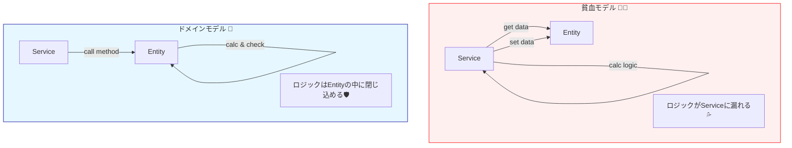

# 第45章：Entityの振る舞い：データよりメソッド🕹️

**「Entityを“ただのデータ入れ”にしないで、“ルールを守って行動できる存在”に育てよう」**です😊🌱



この章はひとことで言うと👇
**「Entityを“ただのデータ入れ”にしないで、“ルールを守って行動できる存在”に育てよう」**です😊🌱

---

## 1) なんで「データよりメソッド」なの？🤔💭

Entityって、ついこうなりがち👇

* プロパティいっぱい（get/set）🧺
* 変更は外側のサービスがゴリゴリやる🛠️
* ルールは if が散らばる🌪️

これ、いわゆる **「貧血モデル（Anemic Domain Model）」**っぽい状態になりやすいです😵‍💫

DDD的には逆で👇
**「ルールは本人（Entity）が守る」**
**「操作は“意図のあるメソッド名”でやる」**
が超大事です💪✨

---

## 2) 目標：こういうコードを目指すよ🎯✨

「ステータスを直接書き換える」と事故りがち👇💥

```ts
// ❌ 外から好き放題できる（危ない）
order.status = "confirmed";
order.lines.push(line); // いつでも追加できちゃう
```

代わりに、**やりたいことをメソッドにする**👇💡

```ts
// ✅ 意図が読める＆ルールを中に閉じ込められる
order.addItem(menuItemId, unitPrice, qty);
order.confirm();
order.cancel(cancelReason);
```

この「メソッド名＝ユビキタス言語」になるのが最高にDDDっぽいです🗣️✨

---

## 3) Entityの“振る舞い設計” 3つの鉄則🧷🧠

### 鉄則A：状態変更は“メソッドだけ”にする🚫🔧

* `setStatus()` や public setter は原則NG🙅‍♀️
* 代わりに `confirm()` / `cancel()` みたいにする👍

### 鉄則B：コレクションを外に“生で渡さない”📦🧤

* `lines: OrderLine[]` をそのまま公開すると外から `push` できちゃう😱
* `ReadonlyArray` で返す、もしくはコピーを返す✨

### 鉄則C：「不変条件（守るべきルール）」は中でガードする🔒

* 例：確定後に明細追加できない
* 例：数量は1以上
* 例：キャンセル理由は必須
  こういうのを **呼び出し側に任せない** のがコツです🛡️✨

---

## 4) 実装してみよう：Order Entityを“行動できる子”に育てる☕🧾💕

ここからは「カフェ注文」の `Order` を、**データ中心→振る舞い中心**へ進化させます🧬✨
（VOは第31〜40章で作ってある想定だけど、最低限ここに同梱して書くね😊）

---

### 4.1 ドメイン例外（失敗はハッキリ言う）🧯💬

```ts
export class DomainError extends Error {
  constructor(message: string) {
    super(message);
    this.name = "DomainError";
  }
}
```

---

### 4.2 最小VOたち（ざっくり版）💎

```ts
export class OrderId {
  private constructor(public readonly value: string) {}
  static from(value: string): OrderId {
    if (!value.trim()) throw new DomainError("OrderId is required.");
    return new OrderId(value);
  }
}

export class MenuItemId {
  private constructor(public readonly value: string) {}
  static from(value: string): MenuItemId {
    if (!value.trim()) throw new DomainError("MenuItemId is required.");
    return new MenuItemId(value);
  }
}

export class Quantity {
  private constructor(public readonly value: number) {}
  static of(value: number): Quantity {
    if (!Number.isInteger(value)) throw new DomainError("Quantity must be integer.");
    if (value < 1) throw new DomainError("Quantity must be >= 1.");
    return new Quantity(value);
  }
  add(other: Quantity): Quantity {
    return Quantity.of(this.value + other.value);
  }
}

export class Money {
  private constructor(public readonly yen: number) {}
  static yen(value: number): Money {
    if (!Number.isInteger(value)) throw new DomainError("Money must be integer (yen).");
    if (value < 0) throw new DomainError("Money must be >= 0.");
    return new Money(value);
  }
  static zero(): Money {
    return Money.yen(0);
  }
  add(other: Money): Money {
    return Money.yen(this.yen + other.yen);
  }
  multiply(qty: Quantity): Money {
    return Money.yen(this.yen * qty.value);
  }
}
```

---

### 4.3 OrderLine（いまはVO寄りでOK）🧾✨

```ts
export class OrderLine {
  private constructor(
    public readonly menuItemId: MenuItemId,
    public readonly unitPrice: Money,
    public readonly quantity: Quantity,
  ) {}

  static create(menuItemId: MenuItemId, unitPrice: Money, quantity: Quantity): OrderLine {
    return new OrderLine(menuItemId, unitPrice, quantity);
  }

  changeQuantity(newQuantity: Quantity): OrderLine {
    return new OrderLine(this.menuItemId, this.unitPrice, newQuantity);
  }

  addQuantity(delta: Quantity): OrderLine {
    return new OrderLine(this.menuItemId, this.unitPrice, this.quantity.add(delta));
  }

  get subtotal(): Money {
    return this.unitPrice.multiply(this.quantity);
  }
}
```

---

### 4.4 いよいよ主役：Order Entity（振る舞い中心）🕹️👑

ポイントは👇

* 外から直接いじれない（private）🔒
* 変更はメソッドだけ🛡️
* メソッド名が意図を語る🗣️✨

```ts
export type OrderStatus = "draft" | "confirmed" | "cancelled";

export class CancelReason {
  private constructor(public readonly value: string) {}
  static from(value: string): CancelReason {
    const v = value.trim();
    if (!v) throw new DomainError("Cancel reason is required.");
    if (v.length > 200) throw new DomainError("Cancel reason is too long.");
    return new CancelReason(v);
  }
}

export class Order {
  private _status: OrderStatus = "draft";
  private _lines: OrderLine[] = [];
  private _cancelReason: CancelReason | null = null;

  private constructor(private readonly _id: OrderId) {}

  static create(id: OrderId): Order {
    return new Order(id);
  }

  get id(): OrderId {
    return this._id;
  }

  get status(): OrderStatus {
    return this._status;
  }

  get lines(): ReadonlyArray<OrderLine> {
    // 直接配列を触られないためのガード🧤
    return this._lines;
  }

  get cancelReason(): CancelReason | null {
    return this._cancelReason;
  }

  get total(): Money {
    return this._lines.reduce((acc, line) => acc.add(line.subtotal), Money.zero());
  }

  // ✅ “やりたいこと”で操作する
  addItem(menuItemId: MenuItemId, unitPrice: Money, quantity: Quantity): void {
    this.ensureEditable("You can add items only in draft.");

    const idx = this._lines.findIndex((l) => l.menuItemId.value === menuItemId.value);

    if (idx >= 0) {
      // 既存があれば数量を合算（ありがち仕様）🧾➕
      const updated = this._lines[idx].addQuantity(quantity);
      this._lines = this._lines.map((l, i) => (i === idx ? updated : l));
      return;
    }

    this._lines = [...this._lines, OrderLine.create(menuItemId, unitPrice, quantity)];
  }

  removeItem(menuItemId: MenuItemId): void {
    this.ensureEditable("You can remove items only in draft.");

    const before = this._lines.length;
    this._lines = this._lines.filter((l) => l.menuItemId.value !== menuItemId.value);

    if (this._lines.length === before) {
      throw new DomainError("Item not found in order.");
    }
  }

  changeItemQuantity(menuItemId: MenuItemId, newQuantity: Quantity): void {
    this.ensureEditable("You can change quantity only in draft.");

    const idx = this._lines.findIndex((l) => l.menuItemId.value === menuItemId.value);
    if (idx < 0) throw new DomainError("Item not found in order.");

    const updated = this._lines[idx].changeQuantity(newQuantity);
    this._lines = this._lines.map((l, i) => (i === idx ? updated : l));
  }

  confirm(): void {
    this.ensureEditable("You can confirm only in draft.");

    if (this._lines.length === 0) {
      throw new DomainError("Cannot confirm an empty order.");
    }

    this._status = "confirmed";
  }

  cancel(reason: CancelReason): void {
    if (this._status === "cancelled") {
      throw new DomainError("Order is already cancelled.");
    }
    // ここは次章(46)で「状態遷移表」に進化させる予定🚦✨
    if (this._status === "confirmed") {
      // 例：確定後キャンセルOKにするかは仕様次第（今はOKにする）
    }

    this._status = "cancelled";
    this._cancelReason = reason;
  }

  private ensureEditable(message: string): void {
    if (this._status !== "draft") throw new DomainError(message);
  }
}
```

---

## 5) “振る舞い中心”にした時の嬉しさ🎁✨

* ✅ **不正操作が入る余地が減る**（外が雑でも中で止められる）🛡️
* ✅ **仕様がコードから読める**（`confirm()` とかめっちゃ強い）📖
* ✅ **テストが気持ちよくなる**（APIじゃなくドメインを叩ける）🧪💕

---

## 6) テスト例（Vitest）🧪✨

Vitestは v4.0 が出ていて、2026でもかなり定番寄りの選択肢です。([Vitest][1])

```ts
import { describe, it, expect } from "vitest";
import {
  Order,
  OrderId,
  MenuItemId,
  Money,
  Quantity,
  CancelReason,
  DomainError,
} from "./order";

describe("Order entity behavior", () => {
  it("adds a new item in draft", () => {
    const order = Order.create(OrderId.from("o-1"));
    order.addItem(MenuItemId.from("latte"), Money.yen(600), Quantity.of(1));

    expect(order.lines.length).toBe(1);
    expect(order.total.yen).toBe(600);
  });

  it("merges quantity when the same item is added", () => {
    const order = Order.create(OrderId.from("o-1"));
    order.addItem(MenuItemId.from("latte"), Money.yen(600), Quantity.of(1));
    order.addItem(MenuItemId.from("latte"), Money.yen(600), Quantity.of(2));

    expect(order.lines.length).toBe(1);
    expect(order.lines[0].quantity.value).toBe(3);
    expect(order.total.yen).toBe(1800);
  });

  it("prevents editing after confirm", () => {
    const order = Order.create(OrderId.from("o-1"));
    order.addItem(MenuItemId.from("latte"), Money.yen(600), Quantity.of(1));
    order.confirm();

    expect(() =>
      order.addItem(MenuItemId.from("tea"), Money.yen(500), Quantity.of(1)),
    ).toThrow(DomainError);
  });

  it("requires cancel reason", () => {
    const order = Order.create(OrderId.from("o-1"));

    expect(() => order.cancel(CancelReason.from("   "))).toThrow(DomainError);
  });
});
```

---

## 7) AIの使いどころ（ズルく賢くいこ🤖💖）

### 7.1 メソッド名を“ユビキタス言語”に寄せたい🗣️✨

AIへの頼み方（コピペでOK）👇

```text
カフェ注文ドメインのOrder Entityに入れるべき「振る舞いメソッド名」を
ユビキタス言語として自然な英語で10個提案して。
条件：
- status を直接setしない
- add/remove/change/confirm/cancel 以外も混ぜる
- メソッド名だけじゃなく「一言の意図」も添えて
```

### 7.2 ガード条件の漏れを検出したい🔍🧠

```text
このOrder Entityの各メソッドについて、
不変条件の漏れ・抜け・危険な公開APIがないかをレビューして。
特に「外から配列を触れる」「確定後の編集」「空注文の確定」あたりを重点で。
```

---

## 8) ミニ演習（10〜20分）🎮⏱️

### 演習A：`removeItem()` を仕様強化してみよ🧾✨

* 「確定後は削除不可」
* 「存在しないIDは DomainError」

（もう入ってるけど、メッセージを自分の言葉に整えてみてね💬💖）

### 演習B：`confirm()` を“より現実”にする☕

* 「合計0円は不可」
* 「同一メニューが重複しない（addで統合される前提）をテストで保証」

---

## 9) 理解チェック（サクッと）✅💕

1. Entityにsetterを生やすと何が起きやすい？😱
2. `addItem()` が“意図のあるメソッド”である理由は？🗣️
3. `ReadonlyArray` を返す目的は？🧤
4. 不変条件はどこで守るのが基本？🔒
5. “外のサービスが全部やる”の何がツラい？🌪️

---

## 10) 2026メモ（本日時点の周辺アップデート）📰✨

* TypeScript は npm の latest として **5.9.3** が案内されています。([npm][2])
  5.9では `import defer` などの改善も入っています。([Microsoft for Developers][3])
* Node.js は **v24 が Active LTS**、**v25 が Current** という整理です。([Node.js][4])
* 型付きLint周りでは `@typescript-eslint/parser` が **v8.54.0（2026-01-26）** として出ています。([npm][5])

---

## 次章（第46章）へのつながり🚦✨

今日は「**振る舞いをメソッドにする**」がテーマだったよね🕹️💕
次はこれをさらに強化して👇
**「状態遷移を完全に閉じ込める（setStatus禁止）」**へ進みます🚫🚦✨

必要なら、この章の `Order` を次章向けに「遷移表（draft→confirmed→…）」まで一緒に育てる形で、コードも続きで作るよ😊🛡️

[1]: https://vitest.dev/blog/vitest-4?utm_source=chatgpt.com "Vitest 4.0 is out!"
[2]: https://www.npmjs.com/package/typescript?activeTab=versions&utm_source=chatgpt.com "typescript"
[3]: https://devblogs.microsoft.com/typescript/announcing-typescript-5-9/?utm_source=chatgpt.com "Announcing TypeScript 5.9"
[4]: https://nodejs.org/en/about/previous-releases?utm_source=chatgpt.com "Node.js Releases"
[5]: https://www.npmjs.com/package/%40typescript-eslint/parser?utm_source=chatgpt.com "typescript-eslint/parser"
