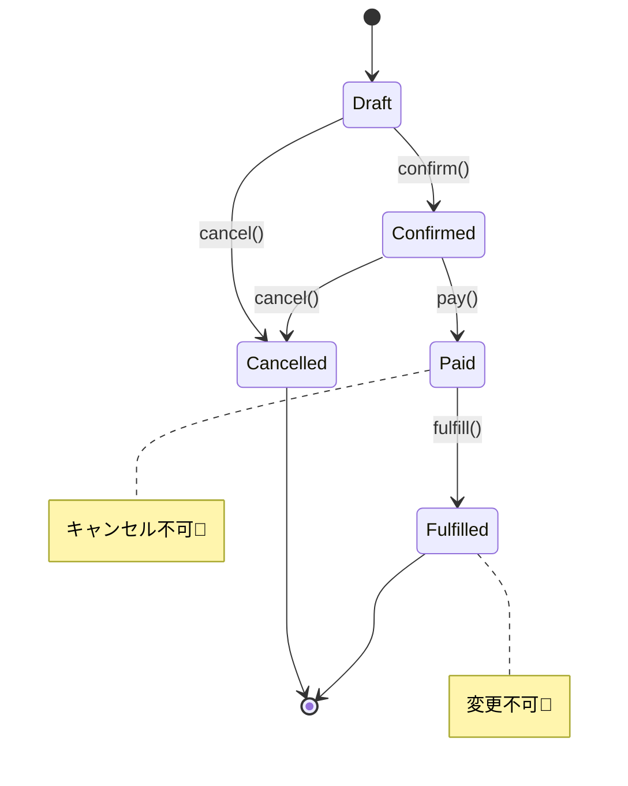

# 第46章：状態遷移を閉じ込める（setStatus禁止）🚫🚦

この“表”があるだけで、設計が一気に強くなるよ💪✨
そしてこの表を **コードに埋め込む**のがこの章の主役！



この章はズバリ… **「状態（Status）を安全に変える仕組み」** を作る回だよ〜！🥳
DDDだと状態って「ただの文字」じゃなくて、**ルールの塊**なんだよね🧠💎
だから、`setStatus()` みたいに“誰でも自由に書き換えられる入口”があると、すぐ事故る💥

---

## 1) まず結論：setStatus がダメな理由🙅‍♀️💥

`setStatus("Paid")` みたいなのがあると…

* ✅ **禁止の状態遷移**ができちゃう（例：Draft → Paid）😇
* ✅ **遷移に必要な処理**が抜ける（例：支払い記録を残さずにPaidへ）🕳️
* ✅ ルールが散って「どこで守ってるの？」になる（バグの温床）🐛🔥
* ✅ 後から状態が増えた瞬間、全部が壊れやすい（変更に弱い）🧨

DDDの気持ちとしてはこう👇
**「状態は“勝手に変えていいもの”じゃなくて、“決められた手順でしか変わらないもの”」** 🛡️✨

---

## 2) 目標：状態を“メソッド”でしか変えられないようにする🎮🔒

理想の操作はこう！👇

* `order.confirm()` ✅（確定できる条件なら確定）
* `order.pay()` ✅（支払いできる条件なら支払い）
* `order.cancel()` ✅（キャンセルできる条件ならキャンセル）
* `order.setStatus(...)` ❌（存在しない）

状態の変更は「set」じゃなくて、**“意図”で表現**するのがポイントだよ🫶✨
（= **データよりメソッド**の続きだね！第45章とつながってる〜😚）

---

## 3) まずは「許可/禁止の遷移表」を作る🧾🚦

例題（注文）なら、こんな感じが気持ちいい👇

* Draft（下書き）
  → Confirmed（確定） / Cancelled（取消）
* Confirmed（確定）
  → Paid（支払い済み） / Cancelled（取消）
* Paid（支払い済み）
  → Fulfilled（提供済み）
* Fulfilled（提供済み）
  → もう動かない
* Cancelled（取消）
  → もう動かない

この“表”があるだけで、設計が一気に強くなるよ💪✨
そしてこの表を **コードに埋め込む**のがこの章の主役！

---

## 4) TypeScriptで「遷移表をコード化」する（2026っぽく堅く）🧡🧱

ここでは TypeScript の型チェックを最大限使うよ〜！
特に **`satisfies`** は「型に合ってるか検査しつつ、推論は崩さない」ので、こういう表に相性よすぎ😳✨ ([TypeScript][1])

あと、現時点の安定版は **TypeScript 5.9 系**の情報が公式に出てるよ〜（リリースノートあり） ([TypeScript][2])
さらに **Visual Studio 2026 では TypeScript Native Preview** みたいな動きもある（型チェックや言語サービスの高速化が話題）って流れ！🚀 ([Microsoft Developer][3])

---

### 4-1) 状態（Status）を union で定義する🧩

```ts
export type OrderStatus =
  | "Draft"
  | "Confirmed"
  | "Paid"
  | "Fulfilled"
  | "Cancelled";
```

---

### 4-2) 「遷移表」を `as const` + `satisfies` で固定する📌✨

```ts
import type { OrderStatus } from "./OrderStatus";

export const ORDER_TRANSITIONS = {
  Draft: ["Confirmed", "Cancelled"],
  Confirmed: ["Paid", "Cancelled"],
  Paid: ["Fulfilled"],
  Fulfilled: [],
  Cancelled: [],
} as const satisfies Record<OrderStatus, readonly OrderStatus[]>;
```

これで何が嬉しいの？🥺✨

* `ORDER_TRANSITIONS` のキーが **漏れると型エラー**になる（状態追加に強い！）🧱
* 配列の中身も **変なStatusを書いたら型エラー**になる🧯
* 実行時だけじゃなく、**コンパイル時に守れる**のが最高💘

---

### 4-3) “遷移できるか”をチェックする関数を作る🔎🚦

```ts
import type { OrderStatus } from "./OrderStatus";
import { ORDER_TRANSITIONS } from "./OrderTransitions";

export class DomainError extends Error {
  constructor(message: string) {
    super(message);
    this.name = "DomainError";
  }
}

export function assertCanTransition(
  from: OrderStatus,
  to: OrderStatus
): void {
  const allowed = ORDER_TRANSITIONS[from];
  const ok = allowed.includes(to);

  if (!ok) {
    throw new DomainError(`状態遷移できません: ${from} -> ${to}`);
  }
}
```

ポイント💡
ここは“汎用の安全装置”として切り出しておくと、Entityが読みやすくなるよ〜😊✨

---

## 5) Entity（Order）側は「意図メソッド」だけを公開する🪪🧍✨

```ts
import type { OrderStatus } from "./OrderStatus";
import { assertCanTransition } from "./TransitionGuard";

export class Order {
  // 外から status を直接書き換えられないように private にする
  private _status: OrderStatus;

  constructor(initialStatus: OrderStatus = "Draft") {
    this._status = initialStatus;
  }

  // 読み取りはOK（表示とか判定用）
  get status(): OrderStatus {
    return this._status;
  }

  // ✅ 意図メソッドだけ公開する
  confirm(): void {
    this.transitionTo("Confirmed");
  }

  pay(): void {
    this.transitionTo("Paid");
  }

  fulfill(): void {
    this.transitionTo("Fulfilled");
  }

  cancel(): void {
    this.transitionTo("Cancelled");
  }

  // 状態変更はここに閉じ込める（共通ガード）
  private transitionTo(next: OrderStatus): void {
    assertCanTransition(this._status, next);
    this._status = next;
  }
}
```

これで **`setStatus()` が無くても**、全部できる！🥳
しかも…

* 遷移ルールは `ORDER_TRANSITIONS` に集約 ✅
* 変更の入口は `transitionTo` に集約 ✅
* 外部のコードは「意図」しか呼べない ✅

つまり、**事故の入り口が消える**🚪❌✨

---

## 6) テストで「遷移の成功/失敗」を固める🧪💖

テストは「状態遷移の表」を守れてるか確認するのが主目的！
ここでは **Vitest** を例にするよ（最近もメジャーアップデートが継続してる流れがある）([Vitest][4])

```ts
import { describe, it, expect } from "vitest";
import { Order } from "./Order";

describe("Order 状態遷移", () => {
  it("Draft -> Confirmed はOK", () => {
    const order = new Order("Draft");
    order.confirm();
    expect(order.status).toBe("Confirmed");
  });

  it("Draft -> Paid はNG（いきなり支払いはできない）", () => {
    const order = new Order("Draft");
    expect(() => order.pay()).toThrowError();
  });

  it("Confirmed -> Paid はOK", () => {
    const order = new Order("Confirmed");
    order.pay();
    expect(order.status).toBe("Paid");
  });

  it("Paid -> Fulfilled はOK", () => {
    const order = new Order("Paid");
    order.fulfill();
    expect(order.status).toBe("Fulfilled");
  });

  it("Cancelled はもう動かない", () => {
    const order = new Order("Cancelled");
    expect(() => order.confirm()).toThrowError();
    expect(() => order.pay()).toThrowError();
    expect(() => order.fulfill()).toThrowError();
    expect(() => order.cancel()).toThrowError();
  });
});
```

テストのコツ💡

* ✅ **OKルート**（許可される遷移）
* ✅ **NGルート**（禁止される遷移）
  この2つがあれば、この章は勝ちです✌️😆✨

---

## 7) よくある失敗パターン（あるある）😂⚠️

### ❌ 失敗1：`status` を public にする

```ts
public status: OrderStatus;
```

→ 外から `order.status = "Paid"` ができちゃう😇
**終了〜〜〜！**💥

### ❌ 失敗2：`setStatus` を残す

```ts
setStatus(next: OrderStatus) { this._status = next; }
```

→ “裏口”があると、未来の自分が必ず使う🤣
**裏口は封鎖！**🚪🧱

### ❌ 失敗3：遷移表がコードのあちこちに散る

* `if (status === "Draft") ...` がいろんな場所に増殖👾
  → 状態追加で地獄になる🫠
  **遷移表は1箇所へ！**📌✨

---

## 8) ここから一歩進めるアイデア（任意）🌱✨

### ✅ 例外メッセージを“人間向け”にする🧁

今は `状態遷移できません` だけど、運用では

* ユーザー向け文言
* 開発者向けログ文言
  を分けたくなるよね（第89章にもつながる〜！）😚✨

### ✅ State Pattern（状態クラス）に進化させる🏗️

状態ごとに `DraftState`, `PaidState`…みたいにクラス分けすると、さらに強い設計にもできるよ💪
（ただし最初は今章の“表＋ガード”で十分！✨）

---

## 9) AI活用コーナー（この章に効く使い方）🤖🪄

### 9-1) 遷移表を壁打ちして漏れを発見する🧠

おすすめプロンプト👇

* 「注文の状態（Draft/Confirmed/Paid/Fulfilled/Cancelled）で、現実の業務としてあり得る遷移と、禁止したい遷移を表にして。禁止理由も一言で。」

### 9-2) テストケースを増やす🧪

* 「上の遷移表から、最低限必要な正常系テストと異常系テストを列挙して。網羅より“壊れやすい順”で優先度もつけて。」

### 9-3) 例外メッセージを整える🧁

* 「DomainError のメッセージを、ユーザー表示用とログ用に分ける案を出して。」

AIは“答えを出す人”じゃなくて、**仕様の抜けを炙り出す相棒**だよ〜🤝✨

---

## 10) ミニ演習（10〜20分）⏳🎀

### 演習A：状態を1つ増やしてみよう➕

`"Refunded"`（返金済み）を追加して、

* Paid → Refunded はOK
* Refunded →（他は全部NG）

にしてみてね！🧾✨

**チェック**✅

* `ORDER_TRANSITIONS` のキー漏れで型エラー出た？（出たら勝ち！）😆
* テストも1〜2本追加できた？🧪

### 演習B：`cancel()` を少し賢くする🧠

たとえば「Fulfilled はキャンセル不可」にしたいなら、
遷移表をいじるだけで済むようにできるよね？😚✨

---

## まとめ（この章で手に入る武器）🎁✨

* `setStatus` を消すと **状態が壊れない**🚫🚦
* 状態変更は「意図メソッド」で表現すると **読みやすい**🎮
* 遷移ルールは “表” に集めると **変更に強い**📌
* TypeScriptの型（`satisfies` など）で **追加変更に強い設計**になる🧱✨ ([TypeScript][1])

---

次の第47章は「EntityとVOの境界（どこまでVO化？）」だね🧩✨
この章で状態が固くなったから、次は「部品の分け方」がめちゃ気持ちよく進むはず〜！🥳💖

[1]: https://www.typescriptlang.org/docs/handbook/release-notes/typescript-4-9.html?utm_source=chatgpt.com "Documentation - TypeScript 4.9"
[2]: https://www.typescriptlang.org/docs/handbook/release-notes/typescript-5-9.html?utm_source=chatgpt.com "Documentation - TypeScript 5.9"
[3]: https://developer.microsoft.com/blog/typescript-7-native-preview-in-visual-studio-2026?utm_source=chatgpt.com "TypeScript 7 native preview in Visual Studio 2026"
[4]: https://vitest.dev/blog/vitest-4?utm_source=chatgpt.com "Vitest 4.0 is out!"
