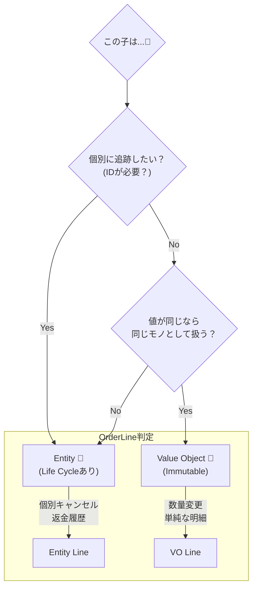

# 第47章：EntityとVOの境界：どこまでVO化？🧩

### ❌ 「VOなのに setter で変更」

* VOは “値” だから、変更したいなら **新規生成**が基本🧊



この章はひとことで言うと――
**「その子に“名前（ID）”が必要か？」を見抜く練習**だよ〜！🪪💡
ここが分かると、DDDのモデリングが一気に自然になる🙂🌸

---

## 0) 2026/02/07 時点の“最新寄り”メモ🗓️🔧

* TypeScript の安定版は **5.9.3**（npmの `typescript` パッケージ）だよ〜🧡 ([npm][1])
* TypeScript 5.9 では `import defer` みたいな新しめ仕様も入ってきてる（必要な人だけ気にすればOK）🧪 ([TypeScript][2])
* テストは最近だと **Vitest 4.0** が2025/10/22に出てて、軽快に回せる系で人気🧪⚡ ([Vitest][3])
* ツール実行の土台（npm周り）は **Node.js** のLTS系を使うのが無難（枝の状況は公式のRelease表が正）📌 ([Node.js][4])

※ここは「章の題材に必要な分だけ」触れてるよ〜🙂

---

## 1) まず大前提：EntityとVOの違い🪪💎


### Entity（エンティティ）🪪

* **同一性（ID）が主役**
* 中身が変わっても「同じもの」と言える
* 例：Order（注文）、User（利用者）など

### Value Object（値オブジェクト）💎

* **値そのものが主役**（中身が同じなら同じ）
* だいたい **不変（immutable）** が基本
* 例：Money、Quantity、Email など

---

## 2) 境界で迷う代表：「LineItem（明細）」問題☕🧾


注文（Order）の中にある「明細（OrderLine / LineItem）」って、めっちゃ迷うの！😵‍💫

* **VOっぽい**：`(商品ID, 数量, 単価)` の“値のかたまり”
* **Entityっぽい**：「この明細だけ後で返金」「明細ごとに状態がある」など“追跡したい対象”

ここをスッキリさせるコツが、次の判断基準だよ👇✨

---

## 3) 判断のコア：その子に「個別のID」が必要？🧠🪪

### ✅ VOでOKになりやすいサイン💎

* その明細を **外から指して操作しない**（常に注文全体の中で完結）
* 明細の変更は「置き換え」で十分（例：数量変更＝新しい明細を作り直す）
* “明細単体の履歴”とか“明細単体の状態”を持たない
* 「同じ商品なら1行にまとめる」みたいな仕様が自然

👉 つまり：**“値”として扱うのが自然**なとき！

### ✅ Entityにしたくなるサイン🪪

* UIや業務が「この明細（この1行）」を **個別に指して** 操作する

  * 例：「明細#123をキャンセル」「明細#123だけ返金」
* 明細が「部分的に配送/提供」「部分的に取消」など **独立したライフサイクル**を持つ
* “並び順”や“商品ID”じゃ同一性が壊れる（例：同じ商品が複数行として存在しうる）

👉 つまり：**“追跡対象”として扱うのが自然**なとき！

---

## 4) やりがち事故⚠️（これだけは避けよ〜！）

### ❌ 配列indexをID代わりにする


* 並び替え・削除・挿入でズレる → **同一性が壊れる**😇

### ❌ 「VOなのに setter で変更」

* VOは “値” だから、変更したいなら **新規生成**が基本🧊

### ❌ Entity/VOの境界が曖昧で、どこでも直接触れる

* いちばん危ないのは、**外側が中身の配列を直接いじれる**パターン😵‍💫
  → ルールが破れる

---

## 5) 実装で体感：VO版 vs Entity版（OrderLine）🧪✨

ここからは「同じ題材を2パターン」で見せるね！
（あなたのプロジェクトに近い方を採用すればOK🙆‍♀️）

---

### A) OrderLine を VO として扱う版 💎（まずはこれがラク）


#### ねらい🎯

* 「明細は注文の中の“値のかたまり”】【＝VO】として扱う
* 変更は **差し替え**で表現

```ts
// 超ざっくり例：本来は Money/Quantity/MenuItemId もVOにすると強いけど
// 第47章は「境界」なので、雰囲気が伝わる最小にしてるよ🙂

type MenuItemId = string;

export class OrderLine {
  private constructor(
    public readonly menuItemId: MenuItemId,
    public readonly quantity: number,
    public readonly unitPrice: number,
  ) {}

  static create(menuItemId: MenuItemId, quantity: number, unitPrice: number): OrderLine {
    if (quantity <= 0) throw new Error("quantity must be >= 1");
    if (unitPrice < 0) throw new Error("unitPrice must be >= 0");
    return new OrderLine(menuItemId, quantity, unitPrice);
  }

  withQuantity(newQuantity: number): OrderLine {
    return OrderLine.create(this.menuItemId, newQuantity, this.unitPrice);
  }

  subtotal(): number {
    return this.quantity * this.unitPrice;
  }

  equals(other: OrderLine): boolean {
    return (
      this.menuItemId === other.menuItemId &&
      this.quantity === other.quantity &&
      this.unitPrice === other.unitPrice
    );
  }
}
```

VO版の Order（Entity）は、こんな感じで「中身を守る」✨

```ts
export class Order {
  private lines: OrderLine[] = [];

  addLine(line: OrderLine): void {
    // 例：同じ商品は1行にまとめる仕様
    const existing = this.lines.find(x => x.menuItemId === line.menuItemId);
    if (!existing) {
      this.lines = [...this.lines, line]; // 外から配列を触れないよう差し替え
      return;
    }

    const merged = OrderLine.create(
      existing.menuItemId,
      existing.quantity + line.quantity,
      existing.unitPrice
    );

    this.lines = this.lines.map(x => (x.menuItemId === line.menuItemId ? merged : x));
  }

  changeQuantity(menuItemId: string, newQuantity: number): void {
    const target = this.lines.find(x => x.menuItemId === menuItemId);
    if (!target) throw new Error("line not found");

    this.lines = this.lines.map(x => (x.menuItemId === menuItemId ? x.withQuantity(newQuantity) : x));
  }

  total(): number {
    return this.lines.reduce((sum, x) => sum + x.subtotal(), 0);
  }

  // 外へはコピーで渡す（内部を守る🛡️）
  getLines(): readonly OrderLine[] {
    return [...this.lines];
  }
}
```

✅ この版が強いケース：

* 「同じ商品は1行に統合」
* 「明細単体を指して操作しない」
* 「注文のルールは注文が守る」

---

### B) OrderLine を “子Entity” として扱う版 🪪（個別追跡が必要なら）


#### ねらい🎯

* 「この明細だけ返金」「この明細だけ取消」みたいに
  **明細を“個別に追跡”する**ためのIDを持たせる

```ts
type OrderLineId = string;
type MenuItemId = string;

export class OrderLineEntity {
  private constructor(
    public readonly id: OrderLineId,
    public readonly menuItemId: MenuItemId,
    private quantity: number,
    public readonly unitPrice: number,
  ) {}

  static create(id: OrderLineId, menuItemId: MenuItemId, quantity: number, unitPrice: number) {
    if (quantity <= 0) throw new Error("quantity must be >= 1");
    if (unitPrice < 0) throw new Error("unitPrice must be >= 0");
    return new OrderLineEntity(id, menuItemId, quantity, unitPrice);
  }

  changeQuantity(newQuantity: number) {
    if (newQuantity <= 0) throw new Error("quantity must be >= 1");
    this.quantity = newQuantity;
  }

  getQuantity(): number {
    return this.quantity;
  }

  subtotal(): number {
    return this.quantity * this.unitPrice;
  }
}
```

Order 側は「IDで指定して更新」が自然になるよ🪪✨

```ts
export class Order {
  private lines: OrderLineEntity[] = [];

  addLine(line: OrderLineEntity) {
    this.lines = [...this.lines, line];
  }

  changeLineQuantity(lineId: string, newQuantity: number) {
    const target = this.lines.find(x => x.id === lineId);
    if (!target) throw new Error("line not found");
    target.changeQuantity(newQuantity);
  }

  total(): number {
    return this.lines.reduce((sum, x) => sum + x.subtotal(), 0);
  }

  getLines(): readonly OrderLineEntity[] {
    return [...this.lines];
  }
}
```

✅ この版が強いケース：

* 「明細単体のキャンセル/返金/提供状態」がある
* 「同じ商品でも複数行を許す（理由がある）」
* UIが明細IDを持って更新する（行の並び替えがあっても安全）

---

## 6) テスト観点：境界が決まると、テストも決まる🧪✨

テストはフレームワーク何でも良いけど、最近は軽く回る **Jest** / Vitest 系がよく使われるよ〜🧪⚡（Vitest 4.0は公式でアナウンス済） ([Vitest][3])

### VO版での“強いテスト”💎

* `OrderLine.create()` のバリデーション
* `withQuantity()` が **新しいインスタンス**を返す（元が壊れない）
* `equals()` が値で比較できる
* Order の `addLine()` が統合ルールを守る（同一商品は1行に）

### Entity版での“強いテスト”🪪

* `changeLineQuantity(lineId, ...)` が **IDで対象を特定**できる
* lineIdが存在しない場合の失敗
* 明細単体の状態（将来：cancelled/fulfilled など）を守れる

---

## 7) ミニ演習（おすすめ）🎓💪

次の仕様、VO/Entityどっちにする？理由も1行で！📝✨

1. 「同じ商品は必ず1行に統合。数量変更は商品ID指定で行う」
2. 「同じ商品でも“氷あり/なし”で別行になる。あとで明細単位で返金することがある」
3. 「明細は注文の中でしか意味がない。明細番号での操作はしない」

---

## 8) AIの使い方（この章と相性めちゃ良い）🤖💬

### 使えるお願いテンプレ🧠✨

* 「この仕様の“追跡対象”はどれ？ IDが必要なものを指摘して」
* 「OrderLineをVOにした場合のメソッド案と、不変条件の置き場を提案して」
* 「VO版→Entity版に将来変えるときの移行手順（壊れやすい点）を列挙して」

### 注意点⚠️（超大事）

AIは気軽に「全部Entity」「全部VO」って言いがち😂
だから最終判断はこの章の合言葉で！👇
**「その子に“名前（ID）”が必要？」🪪**

（AI支援は、例えば GitHub のCopilot や OpenAI 系の支援でも同じ考え方でOKだよ〜🙂✨）

---

## 9) まとめ（この章のゴール）🎯🌸

* Entity/VOの境界は「データ構造」じゃなくて **“同一性（ID）”**で決める🪪
* LineItemは **VOで始めるとラク**、でも「個別追跡」が出たら **子Entity化**を検討🧩
* いちばん避けたいのは「配列indexをID扱い」⚠️
* 境界が決まると、テストも設計もスッキリする🧪✨

---

次の章（第48章）で、今作ったEntity（Order）を「状態と振る舞い中心」でテストして、**壊れない安心感**を作っていこ〜！🧪🛡️😊

[1]: https://www.npmjs.com/package/typescript?utm_source=chatgpt.com "typescript"
[2]: https://www.typescriptlang.org/docs/handbook/release-notes/typescript-5-9.html?utm_source=chatgpt.com "Documentation - TypeScript 5.9"
[3]: https://vitest.dev/blog/vitest-4?utm_source=chatgpt.com "Vitest 4.0 is out!"
[4]: https://nodejs.org/en/about/previous-releases?utm_source=chatgpt.com "Node.js Releases"
