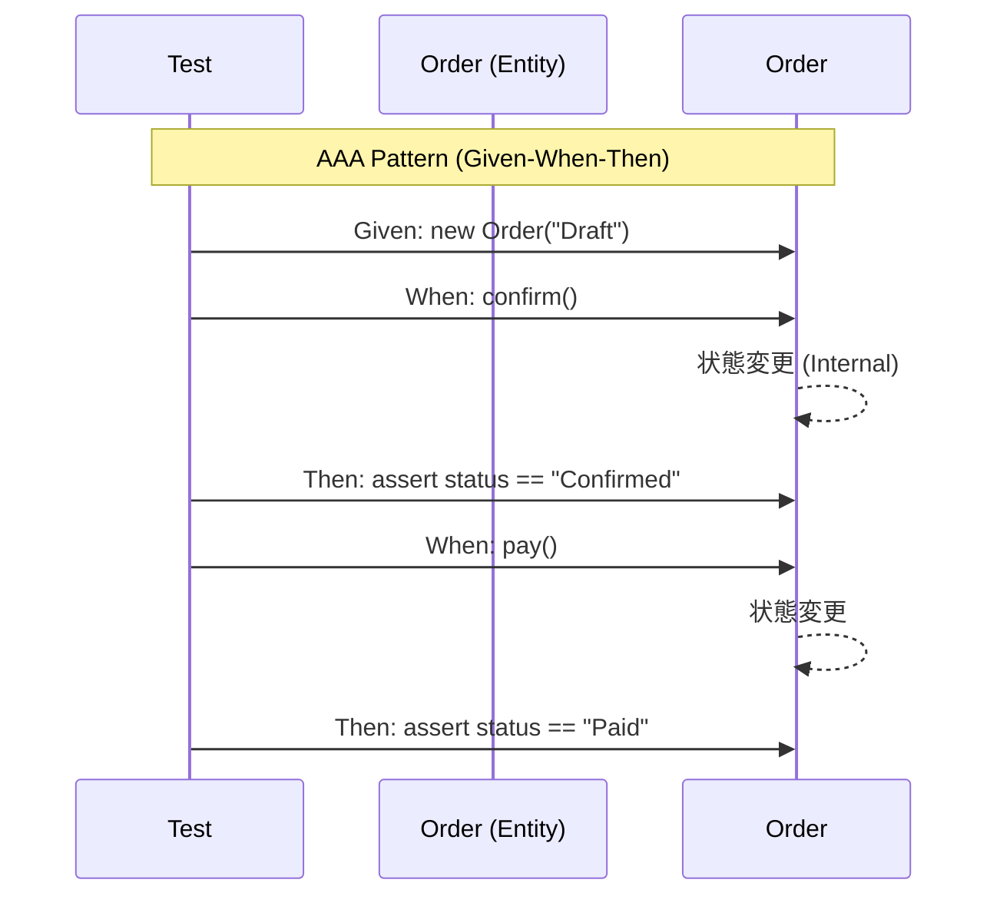

# 第48章：Entityのテスト：状態と振る舞い🧪🧍

1. **状態（State）**

   * 例：Draft → Confirmed → Paid みたいな流れ



この章は「**Entityのルール（状態遷移・振る舞い）をテストで守る**」回だよ〜！💪💖
VOは「値の正しさ」中心だったけど、Entityは **“状態” と “操作（メソッド）”** が主役になるよ🕹️🎀

---

## 0) 2026/02/07 時点の “周辺ツール” ざっくりメモ📝✨

* TypeScript の安定版は **5.9.3** が最新（npm上のLatest）だよ📌 ([npm][1])
* Vitest は **4.x** が現行（例：4.0.18 がLatestとして表示）🧪⚡ ([npm][2])
* Jest は **30.x** が現行（例：30.2.0 がLatestとして表示）🧪📦 ([npm][2])
* Node.js は **v24 が Active LTS**（安定運用向き）になってるよ🟢 ([nodejs.org][3])

この章のサンプルは **Vitest** で書くね（速い＆TSと相性よし）⚡🧡
（Jest派でも考え方はそのまま移植できるよ〜！）

---

## 1) Entityテストで「守るべきもの」って何？🛡️✨


Entityのテストは、ざっくりこの3つを守るのが目的だよ🎯💕

1. **状態（State）**

   * 例：Draft → Confirmed → Paid みたいな流れ
2. **振る舞い（Behavior）**

   * 例：`confirm()` したら “確定になる”、ただし条件が必要…など
3. **不変条件（Invariant）**

   * 例：支払い済みの注文はキャンセル不可、などの「絶対ルール」🔒

💡 ポイント：
Entityテストは「プロパティが正しい」より、**“操作したらどうなる？”** を主語にするのがコツだよ🧠✨

---

## 2) まずはルールを “テスト言語” に翻訳しよう🗣️🧾

第48章の勝ち筋はこれ👇

* 仕様（言葉） → **状態遷移表** → **テストケース** → 実装
  この順でいくと、迷子になりにくいよ🧭💕

たとえば注文（Order）なら、状態はこう置くと分かりやすい👇

* `Draft`（下書き）
* `Confirmed`（確定）
* `Paid`（支払い済み）
* `Cancelled`（キャンセル）

### 例：状態遷移のイメージ🚦✨

* Draft → Confirmed ✅（ただし明細があること）
* Confirmed → Paid ✅
* Draft/Confirmed → Cancelled ✅
* Paid → Cancelled ❌（禁止！）

この “✅/❌” を **そのままテストにする** のが最高にラクだよ🥳🧪

---

## 3) テストの型：AAA + Given/When/Then が最強🧪🎀


Entityテストは、型を固定すると爆速で書けるよ⚡

* **Arrange**（準備）＝ Given
* **Act**（実行）＝ When
* **Assert**（確認）＝ Then

たとえば👇

* Given：Draftの注文があり、明細が1つある
* When：`confirm()` する
* Then：状態が Confirmed になる

---

## 4) サンプル実装（最小構成）📦✨

> ここは「テストの題材」なので、あえて小さめにしてるよ🫶
> VO（Money/Quantity）は最小だけ用意して、Entityのテストに集中しよ〜！

### DomainError（ドメイン例外）🧯

```ts
// domain/errors/DomainError.ts
export class DomainError extends Error {
  constructor(
    public readonly code: string,
    message: string,
  ) {
    super(message);
    this.name = "DomainError";
  }
}
```

### Money / Quantity（超ミニ版VO）💴📏

```ts
// domain/valueObjects/Money.ts
import { DomainError } from "../errors/DomainError";

export class Money {
  private constructor(private readonly yenAmount: number) {
    if (!Number.isInteger(yenAmount) || yenAmount < 0) {
      throw new DomainError("money.invalid", "金額は0以上の整数だよ💴");
    }
  }

  static yen(amount: number): Money {
    return new Money(amount);
  }

  add(other: Money): Money {
    return new Money(this.yenAmount + other.yenAmount);
  }

  multiply(n: number): Money {
    return new Money(this.yenAmount * n);
  }

  get value(): number {
    return this.yenAmount;
  }

  equals(other: Money): boolean {
    return this.yenAmount === other.yenAmount;
  }
}
```

```ts
// domain/valueObjects/Quantity.ts
import { DomainError } from "../errors/DomainError";

export class Quantity {
  private constructor(private readonly amount: number) {
    if (!Number.isInteger(amount) || amount <= 0) {
      throw new DomainError("quantity.invalid", "数量は1以上の整数だよ📏");
    }
  }

  static of(amount: number): Quantity {
    return new Quantity(amount);
  }

  get value(): number {
    return this.amount;
  }
}
```

### Order Entity（状態＋振る舞い）☕🧾

```ts
// domain/order/Order.ts
import { DomainError } from "../errors/DomainError";
import { Money } from "../valueObjects/Money";
import { Quantity } from "../valueObjects/Quantity";

export type OrderStatus = "Draft" | "Confirmed" | "Paid" | "Cancelled";

type OrderLine = Readonly<{
  menuItemId: string;
  unitPrice: Money;
  quantity: Quantity;
}>;

export class Order {
  private _status: OrderStatus = "Draft";
  private lines: OrderLine[] = [];

  constructor(public readonly id: string) {}

  get status(): OrderStatus {
    return this._status;
  }

  addLine(menuItemId: string, unitPrice: Money, quantity: Quantity): void {
    if (this._status !== "Draft") {
      throw new DomainError("order.addLine.notDraft", "下書きのときだけ明細を追加できるよ📝");
    }
    this.lines.push({ menuItemId, unitPrice, quantity });
  }

  confirm(): void {
    if (this._status !== "Draft") {
      throw new DomainError("order.confirm.notDraft", "下書きじゃないと確定できないよ🚫");
    }
    if (this.lines.length === 0) {
      throw new DomainError("order.confirm.noLines", "明細がない注文は確定できないよ🧾");
    }
    this._status = "Confirmed";
  }

  pay(): void {
    if (this._status !== "Confirmed") {
      throw new DomainError("order.pay.notConfirmed", "確定済みの注文だけ支払えるよ💳");
    }
    this._status = "Paid";
  }

  cancel(reason: string): void {
    if (reason.trim().length === 0) {
      throw new DomainError("order.cancel.noReason", "キャンセル理由は空にできないよ😢");
    }
    if (this._status === "Paid") {
      throw new DomainError("order.cancel.paid", "支払い済みはキャンセルできないよ🚫💦");
    }
    if (this._status === "Cancelled") {
      throw new DomainError("order.cancel.already", "もうキャンセル済みだよ🙂");
    }
    this._status = "Cancelled";
  }

  total(): Money {
    return this.lines.reduce(
      (sum, l) => sum.add(l.unitPrice.multiply(l.quantity.value)),
      Money.yen(0),
    );
  }
}
```

---

## 5) Entityテストを書こう！🧪✨（Vitest例）

### 5-1) テストの土台：fixture（Given）を作る🧁

```ts
// domain/order/Order.test.ts
import { describe, it, expect } from "vitest";
import { Order } from "./Order";
import { Money } from "../valueObjects/Money";
import { Quantity } from "../valueObjects/Quantity";
import { DomainError } from "../errors/DomainError";

const givenDraftOrderWithOneLine = () => {
  const order = new Order("order-1");
  order.addLine("latte", Money.yen(500), Quantity.of(1));
  return order;
};

describe("Order Entity", () => {
  it("Draftの注文は明細を追加できる🧾✨", () => {
    const order = new Order("order-1");

    order.addLine("latte", Money.yen(500), Quantity.of(2));

    expect(order.status).toBe("Draft");
    expect(order.total().value).toBe(1000);
  });
});
```

🧡 ここで大事なのは **“準備の作りやすさ”**！
Entityテストは **Givenが9割** って思ってOKだよ🫶

---

### 5-2) 成功する状態遷移（✅のテスト）🚦


```ts
describe("状態遷移（成功）✅", () => {
  it("Draft → Confirmed：明細があれば確定できる🎉", () => {
    const order = givenDraftOrderWithOneLine();

    order.confirm();

    expect(order.status).toBe("Confirmed");
  });

  it("Confirmed → Paid：支払いできる💳✨", () => {
    const order = givenDraftOrderWithOneLine();
    order.confirm();

    order.pay();

    expect(order.status).toBe("Paid");
  });

  it("Draft → Cancelled：理由があればキャンセルできる😢", () => {
    const order = givenDraftOrderWithOneLine();

    order.cancel("気が変わった");

    expect(order.status).toBe("Cancelled");
  });
});
```

---

### 5-3) 禁止される状態遷移（❌のテスト）🚫

#### まずは単発で書く（わかりやすい）💕

```ts
describe("状態遷移（失敗）❌", () => {
  it("Draftのまま pay() はできない🚫", () => {
    const order = givenDraftOrderWithOneLine();

    expect(() => order.pay()).toThrowError(DomainError);
    expect(() => order.pay()).toThrowError("確定済みの注文だけ支払えるよ");
  });

  it("Paid は cancel() できない🚫💦", () => {
    const order = givenDraftOrderWithOneLine();
    order.confirm();
    order.pay();

    expect(() => order.cancel("やっぱり…")).toThrowError(DomainError);
  });
});
```

#### 次に “表形式（テーブル駆動）” にすると爆速⚡✨

```ts
describe("禁止遷移をまとめてチェック🧪📋", () => {
  it.each([
    { start: "Draft" as const, action: "pay" as const, code: "order.pay.notConfirmed" },
    { start: "Paid" as const, action: "cancel" as const, code: "order.cancel.paid" },
  ])("start=$start で $action は禁止🚫", ({ start, action, code }) => {
    const order = givenDraftOrderWithOneLine();

    // start状態へ持っていく（Given）
    if (start === "Paid") {
      order.confirm();
      order.pay();
    }

    // When + Then
    const call =
      action === "pay"
        ? () => order.pay()
        : () => order.cancel("やっぱり…");

    try {
      call();
      throw new Error("ここに来たらテスト失敗（例外が出るはず）");
    } catch (e) {
      expect(e).toBeInstanceOf(DomainError);
      expect((e as DomainError).code).toBe(code);
    }
  });
});
```

💡 こうすると「状態が増えても」行を足すだけで守れるよ〜！🧸✨

---

### 5-4) “不変条件” テスト（ルールの芯）🔒


```ts
describe("不変条件🔒", () => {
  it("明細がない注文は confirm() できない🧾🚫", () => {
    const order = new Order("order-2");

    expect(() => order.confirm()).toThrowError(DomainError);
  });

  it("キャンセル理由が空だと cancel() できない😢🚫", () => {
    const order = givenDraftOrderWithOneLine();

    expect(() => order.cancel("   ")).toThrowError(DomainError);
  });
});
```

ここがいちばん重要💖
**不変条件のテストが薄いと、Entityはすぐ “仕様漏れ” しちゃう** よ〜🥲

---

## 6) Entityテストを “壊れにくく” するコツ💎✨

### ✅ コツ1：テストは “フィールド” より “操作” を主語にする🕹️

* NG：`order.status = "Paid"` みたいに無理やり状態を作る
* OK：`confirm()` → `pay()` で状態を作る
  → **現実の使い方と同じ** だから、テストが仕様書になる📘✨

### ✅ コツ2：例外は「型＋code」で見ると強い🧯

メッセージは変わりやすいけど、`code` は仕様として安定しやすいよ📌

### ✅ コツ3：Givenは “ビルダー化” すると伸びる🧁


注文が複雑になったら

* `OrderBuilder().withLine(...).confirmed().build()`
  みたいにするとテストが読みやすくなるよ〜🥰

---

## 7) AIの使い方（この章はめっちゃ相性いい🤖💕）

### 7-1) “状態遷移表” をAIに作らせる🗺️

使えるプロンプト例👇

* 「Orderの状態（Draft/Confirmed/Paid/Cancelled）と、各メソッド（addLine/confirm/pay/cancel）について、許可/禁止の表を作って。禁止理由も一言で。」

👉 出てきた表を **そのまま `it.each` の配列** にするのが気持ちいいよ〜⚡🧪

### 7-2) “抜けがちな異常系” を洗い出す👀

* 「このEntity設計で起きやすい仕様漏れ・異常系を10個出して。優先度順で。」

👉 その10個のうち、上位3つだけでもテストに入れると事故率が下がる🛡️✨

---

## 8) よくあるミス集（ここ踏むとつらい😵‍💫）

* ❌ **Entityのprivateな内部構造をテストし始める**
  → リファクタで全部崩れる…😇
* ❌ **“禁止” のテストが少ない**
  → 状態機械が壊れてバグ祭り🎆
* ❌ **Givenが毎回だるくて、テストを書かなくなる**
  → fixture/Builderに投資しよ🧁💕

---

## 9) ミニ演習（手を動かすと定着するよ🎓✨）

### 演習A：ルール追加＋テスト先行🧪

ルールを1個足してみて👇

* 「Confirmed になったら `addLine()` 禁止」←いま既にそうだけど、**テストで保証**してみよ！

### 演習B：状態遷移を “表” で全部テスト📋

* 状態×操作の表を作って、`it.each` で網羅してみよ〜！
  （最初は “禁止だけ” でもOK👌）

---

## まとめ🎀✨

この章のコアはこれだけ！💖

* Entityは **状態＋振る舞い** が主役🧍🕹️
* **状態遷移表 → テスト** が最短ルート🚦🧪
* “禁止（❌）” と “不変条件（🔒）” を厚めに守ると強い🛡️✨
* Givenが重くなったら **Builder/fixture** で解決🧁💕

---

次の第49章（OrderLineの扱い）に進む前に、もし今の `OrderLine` を **VO寄り** にしたいなら、テスト観点（追加/削除/数量変更のルール）も一緒に整理していけるよ🧾💎✨

[1]: https://www.npmjs.com/package/typescript?utm_source=chatgpt.com "typescript"
[2]: https://www.npmjs.com/package/jest?utm_source=chatgpt.com "jest - npm"
[3]: https://nodejs.org/en/about/previous-releases?utm_source=chatgpt.com "Node.js Releases"
