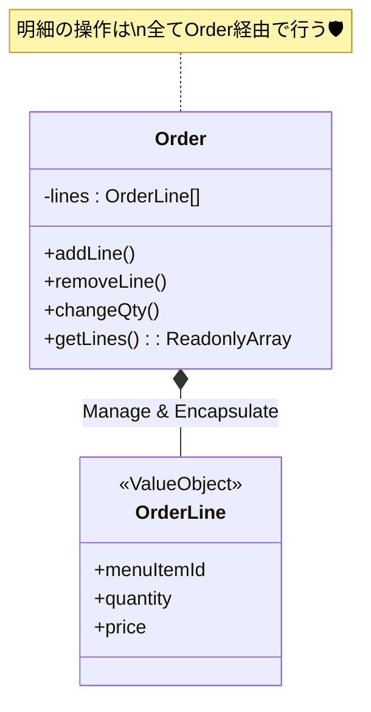

# 第49章：小演習：OrderLineの扱い（VO寄りで設計）🧾

ポイントはこれ👇
**“明細配列を公開しない”** ＆ **“変更はOrderのメソッドだけ”** 🛡️✨



この章は「**注文の明細（OrderLine）**」を **VO（Value Object）寄り** に作って、`Order`（親のEntity）が **明細の追加・削除・数量変更ルール** をキュッと握る練習だよ〜😊🧡
次の「Aggregate」に入る前の、めちゃ大事な助走🏃‍♀️💨

---

## 1) 今日のゴール🎯🌸

* `OrderLine` を **不変（immutable）** な“値”として扱えるようにする🧊✨
* `Order` が **明細操作の入口** になり、勝手に改変されないようにする🚪🔒
* 「重複追加」「数量変更」「削除」の仕様を、**if地獄にせず** きれいに保つ🧠🪄
* テストで「ルール守れてる？」を自信持って言えるようにする🧪💪

---

## 2) OrderLineを“VO寄り”にするって、どういうこと？🧩💡

### ✅ VO寄りの気持ち

* `OrderLine` は「同一性（ID）」より **中身（値）** が大事
* 更新は「中身を書き換える」じゃなくて **新しいOrderLineを作って差し替え**（生成）🧊✨
* `Order` の外に **配列の参照を渡さない**（外からpushとかさせない）🙅‍♀️

### 🍰 こういうときVO寄りが相性いい

* 明細は「商品 + 数量」が基本で、**明細単体を追跡する必要が薄い**
* 「同じ商品を追加したら数量を足す」みたいなルールがある
* 「明細を変更できるのは注文がDraftの間だけ」みたいな制約が強い

### 🧨 Entityにしたくなるのはこんなとき

* 明細ごとに「返品」「部分提供」「明細コメント履歴」など **明細固有のライフサイクル** がある
* 同じ商品でも「カスタム（氷少なめ等）」が多く、**個別追跡が必要**
  → この章はまず “VO寄り” でいくよ😊✨

---

## 3) この章で使う「仕様（ルール）」を決めよう📜✅

ここは演習だから、先に **ルールを固定** しちゃうよ〜！🧁
（あとで拡張できる形にするのがポイント✨）

### ルールA：明細のキー（重複の判定）🔑

* 明細は `menuItemId` で一意（同じ商品は1行にまとめる）🍩
* 同じ商品を追加したら **数量を足す**（行は増えない）➕🧾

### ルールB：数量の範囲📏

* 数量は `1..99`（例）
* `0` は禁止（0にしたいなら削除で表現）🚫

### ルールC：操作できる状態🚦

* `Order` が `Draft` のときだけ

  * 明細の追加✅
  * 明細の削除✅
  * 数量変更✅
* `Confirmed` / `Paid` になったら明細いじれない🙅‍♀️

### ルールD：存在しない明細を消す/変えると…？😵‍💫

* ここは方針が分かれるけど、学習として分かりやすく

  * **例外（DomainError）で止める** にしよう🧯
    （静かに無視すると、バグが潜りやすいの🥺）

---

## 4) 設計の形（ざっくり設計図）🗺️✨

* `OrderLine`：VO寄り（不変）

  * `menuItemId`（VO）
  * `quantity`（VO）
  * `unitPrice`（VO：Money）
* `Order`：Entity（状態 + 明細の管理者）

  * `addLine(menuItemId, qty, unitPrice)`
  * `changeLineQuantity(menuItemId, qty)`
  * `removeLine(menuItemId)`

ポイントはこれ👇
**“明細配列を公開しない”** ＆ **“変更はOrderのメソッドだけ”** 🛡️✨

---

## 5) 実装してみよう（TypeScript）🧑‍💻🧡

> ここでは分かりやすさ優先で、最小のVOだけ置くよ〜😊
> （前章までのVOがあるなら、読み替えてOK✨）

### 5-1. ドメインエラー🧯

```ts
// domain/errors/DomainError.ts
export class DomainError extends Error {
  readonly name = "DomainError";
}
```

---

### 5-2. VOたち（MenuItemId / Quantity / Money）💎

```ts
// domain/valueObjects/MenuItemId.ts
import { DomainError } from "../errors/DomainError";

export class MenuItemId {
  private constructor(readonly value: string) {}

  static of(value: string): MenuItemId {
    const v = value.trim();
    if (!v) throw new DomainError("menuItemId must not be empty");
    return new MenuItemId(v);
  }

  equals(other: MenuItemId): boolean {
    return this.value === other.value;
  }
}
```

```ts
// domain/valueObjects/Quantity.ts
import { DomainError } from "../errors/DomainError";

export class Quantity {
  private constructor(readonly value: number) {}

  static of(value: number): Quantity {
    if (!Number.isInteger(value)) throw new DomainError("quantity must be integer");
    if (value < 1) throw new DomainError("quantity must be >= 1");
    if (value > 99) throw new DomainError("quantity must be <= 99");
    return new Quantity(value);
  }

  add(other: Quantity): Quantity {
    return Quantity.of(this.value + other.value);
  }
}
```

```ts
// domain/valueObjects/Money.ts
import { DomainError } from "../errors/DomainError";

export class Money {
  private constructor(readonly yen: number) {}

  static yen(value: number): Money {
    if (!Number.isInteger(value)) throw new DomainError("money must be integer (yen)");
    if (value < 0) throw new DomainError("money must be >= 0");
    return new Money(value);
  }

  multiply(qty: number): Money {
    return Money.yen(this.yen * qty);
  }
}
```

---

### 5-3. OrderLine（VO寄り）🧾✨

```ts
// domain/valueObjects/OrderLine.ts
import { MenuItemId } from "./MenuItemId";
import { Quantity } from "./Quantity";
import { Money } from "./Money";

export class OrderLine {
  private constructor(
    readonly menuItemId: MenuItemId,
    readonly quantity: Quantity,
    readonly unitPrice: Money,
  ) {}

  static create(params: {
    menuItemId: MenuItemId;
    quantity: Quantity;
    unitPrice: Money;
  }): OrderLine {
    return new OrderLine(params.menuItemId, params.quantity, params.unitPrice);
  }

  withQuantity(quantity: Quantity): OrderLine {
    return new OrderLine(this.menuItemId, quantity, this.unitPrice);
  }

  addQuantity(delta: Quantity): OrderLine {
    return new OrderLine(this.menuItemId, this.quantity.add(delta), this.unitPrice);
  }

  lineTotal(): Money {
    return this.unitPrice.multiply(this.quantity.value);
  }

  sameKey(other: OrderLine): boolean {
    // “同じ明細”の判定（この章では menuItemId のみ）
    return this.menuItemId.equals(other.menuItemId);
  }
}
```

> 🌷拡張メモ：
> 「サイズ」「トッピング」みたいなカスタムが増えたら、`sameKey` を `menuItemId + options` にしていけばOKだよ✨

---

### 5-4. Order（Entity）に“明細操作のルール”を閉じ込める🏠🔒

```ts
// domain/entities/Order.ts
import { DomainError } from "../errors/DomainError";
import { MenuItemId } from "../valueObjects/MenuItemId";
import { Quantity } from "../valueObjects/Quantity";
import { Money } from "../valueObjects/Money";
import { OrderLine } from "../valueObjects/OrderLine";

type OrderStatus = "Draft" | "Confirmed" | "Paid" | "Cancelled";

export class Order {
  private status: OrderStatus = "Draft";
  private lines: OrderLine[] = [];

  // 外へはコピーで返す（参照を渡さない）
  getLines(): ReadonlyArray<OrderLine> {
    return [...this.lines];
  }

  confirm(): void {
    this.ensureDraft();
    if (this.lines.length === 0) throw new DomainError("cannot confirm empty order");
    this.status = "Confirmed";
  }

  markPaid(): void {
    if (this.status !== "Confirmed") throw new DomainError("order must be Confirmed to pay");
    this.status = "Paid";
  }

  addLine(params: { menuItemId: MenuItemId; quantity: Quantity; unitPrice: Money }): void {
    this.ensureDraft();

    const incoming = OrderLine.create(params);

    const idx = this.lines.findIndex((l) => l.menuItemId.equals(incoming.menuItemId));
    if (idx === -1) {
      this.lines = [...this.lines, incoming];
      return;
    }

    // ルール：同じ商品は数量を足して1行にまとめる
    const merged = this.lines[idx].addQuantity(incoming.quantity);

    // unitPriceが違う場合どうする？（ここは仕様で決める！）
    // 学習用に「違ったらエラー」で固めるよ🧯
    if (this.lines[idx].unitPrice.yen !== incoming.unitPrice.yen) {
      throw new DomainError("unitPrice mismatch for the same menuItemId");
    }

    this.lines = this.lines.map((l, i) => (i === idx ? merged : l));
  }

  changeLineQuantity(menuItemId: MenuItemId, quantity: Quantity): void {
    this.ensureDraft();

    const idx = this.lines.findIndex((l) => l.menuItemId.equals(menuItemId));
    if (idx === -1) throw new DomainError("order line not found");

    this.lines = this.lines.map((l, i) => (i === idx ? l.withQuantity(quantity) : l));
  }

  removeLine(menuItemId: MenuItemId): void {
    this.ensureDraft();

    const before = this.lines.length;
    this.lines = this.lines.filter((l) => !l.menuItemId.equals(menuItemId));
    if (this.lines.length === before) throw new DomainError("order line not found");
  }

  totalPrice(): Money {
    const total = this.lines.reduce((sum, l) => sum + l.lineTotal().yen, 0);
    return Money.yen(total);
  }

  private ensureDraft(): void {
    if (this.status !== "Draft") throw new DomainError("order is not editable");
  }
}
```

ここ、めちゃ大事ポイントだよ👇😤✨

* `lines` は **private**
* 外に出すときは **コピー**（`getLines()`）
* 変更は `Order` のメソッドだけ
* `ensureDraft()` で “編集できる状態” を毎回ガード🚦

---

## 6) テストを書こう（VO寄りのうれしさ体験）🧪💕

テストは「仕様そのもの」になってくれるよ〜！📜✨
（ここでは雰囲気が伝わればOK！）

```ts
// test/OrderLine.spec.ts
import { describe, it, expect } from "vitest";
import { Order } from "../domain/entities/Order";
import { MenuItemId } from "../domain/valueObjects/MenuItemId";
import { Quantity } from "../domain/valueObjects/Quantity";
import { Money } from "../domain/valueObjects/Money";

describe("Order line operations (VO-ish)", () => {
  it("adds a new line when not existing", () => {
    const order = new Order();
    order.addLine({
      menuItemId: MenuItemId.of("coffee"),
      quantity: Quantity.of(2),
      unitPrice: Money.yen(500),
    });

    expect(order.getLines().length).toBe(1);
    expect(order.totalPrice().yen).toBe(1000);
  });

  it("merges quantities when adding the same menuItemId", () => {
    const order = new Order();

    order.addLine({ menuItemId: MenuItemId.of("coffee"), quantity: Quantity.of(1), unitPrice: Money.yen(500) });
    order.addLine({ menuItemId: MenuItemId.of("coffee"), quantity: Quantity.of(2), unitPrice: Money.yen(500) });

    expect(order.getLines().length).toBe(1);
    expect(order.getLines()[0].quantity.value).toBe(3);
    expect(order.totalPrice().yen).toBe(1500);
  });

  it("does not allow editing after confirm", () => {
    const order = new Order();
    order.addLine({ menuItemId: MenuItemId.of("coffee"), quantity: Quantity.of(1), unitPrice: Money.yen(500) });

    order.confirm();

    expect(() =>
      order.addLine({ menuItemId: MenuItemId.of("tea"), quantity: Quantity.of(1), unitPrice: Money.yen(400) })
    ).toThrow();
  });

  it("throws when removing a non-existing line", () => {
    const order = new Order();
    expect(() => order.removeLine(MenuItemId.of("missing"))).toThrow();
  });
});
```

---

## 7) AIに手伝ってもらうコツ🤖🪄（でも主導権はあなた✨）

### ✅ 便利プロンプト例（コピペOK）🧁

* 「OrderLineをVO寄りにしたい。重複追加、unitPrice違い、数量境界、状態制約の**テストケース**を20個出して」
* 「このOrderの`addLine`、分岐が増えそう。**読みやすく保つリファクタ案**を3つ」
* 「“同じ商品”のキーを`menuItemId + options`に拡張したい。**設計案と落とし穴**を教えて」

### ⚠️ AIに丸投げしないチェック😵‍💫

* そのロジック、**仕様（ルールA〜D）**と一致してる？
* 例外メッセージ、**デバッグしやすい？**
* 配列を外に返して、どこかで `push` できちゃってない？😨

---

## 8) ありがち落とし穴（ここで踏むと後がつらい😂🧨）

* `getLines()` で `this.lines` をそのまま返しちゃう
  → 外で破壊されて、`Order` のガードが無意味になる🙅‍♀️
* `OrderLine.quantity.value = ...` みたいな破壊的変更
  → いつ変わったか追えなくなる＆バグが増える😵‍💫
* 「明細を配列indexで特定」
  → 並びが変わったら別物扱いになりがち😇
* unitPriceが違うのに黙って上書き
  → “いつの価格？”問題で事故る💥（仕様で決めてね！）

---

## 9) ミニ課題（できたら強い💪✨）🎒🌟

### 課題1：options対応🍯🧊

* `OrderLineKey` を導入して

  * `menuItemId`
  * `size`（S/M/L）
  * `ice`（normal/less）
    を含めた “同一明細判定” にしてみよう😊

### 課題2：数量0を「削除扱い」にする派🧾➡️🗑️

* `changeLineQuantity(..., Quantity.of(0))` を許す代わりに

  * 0なら削除
    にしたい人もいるよね。
    この設計にした場合のメリデメを箇条書きにしてみよ〜📝✨

### 課題3：例外メッセージを整理🧯💬

* `DomainError("order is not editable")` を

  * どの状態だったのか
  * 何をしようとしたのか
    が分かる形に改善してみてね😊

---

## 10) 2026-02-07 時点のTypeScriptまわりメモ🧡🧰

* `typescript` パッケージの最新安定版は **5.9.3**（npmの情報）だよ📦✨ ([npm][1])
* **TypeScript 6.0** は、公開されている計画だと **2026-02-10 にBeta、2026-03-17 にFinal予定**（変更あり得るけど、公式Issueに日付が出てる）📅🧡 ([GitHub][2])
* 5.9では `tsc --init` が **スッキリした最小形に刷新**されて、プロジェクト開始がラクになったよ🪄 ([typescriptlang.org][3])
* 5.9の `import defer` は「副作用の実行タイミングを遅らせる」方向の提案に沿った機能で、依存の読み込み制御に関係してくる（ただし使いどころは慎重にね）🧯📦 ([typescriptlang.org][3])

---

## まとめ🎀✨

この章でできたことはこれ👇😊

* `OrderLine` を **VO寄り（不変）** にして
* `Order` が **明細操作の唯一の入口** になって
* 仕様（重複、数量、状態制約）を **コードで守れる** ようになった🎉🧾✨

次の章（Aggregate）に行くと、ここで作った「明細を安全に扱う作法」がそのまま武器になるよ〜🏯🛡️💕

必要なら、この章のコードを「カフェ注文ドメイン」に合わせて

* ドリンクのサイズ/トッピング
* 価格改定（いつの価格？）
* 注文確定後の変更要求（どう扱う？）
  みたいな“実務っぽい地雷”も足して、演習を濃くできるよ😈🧡

[1]: https://www.npmjs.com/package/typescript?activeTab=versions&utm_source=chatgpt.com "typescript"
[2]: https://github.com/microsoft/TypeScript/issues/63085 "TypeScript 6.0 Iteration Plan · Issue #63085 · microsoft/TypeScript · GitHub"
[3]: https://www.typescriptlang.org/docs/handbook/release-notes/typescript-5-9.html "TypeScript: Documentation - TypeScript 5.9"
