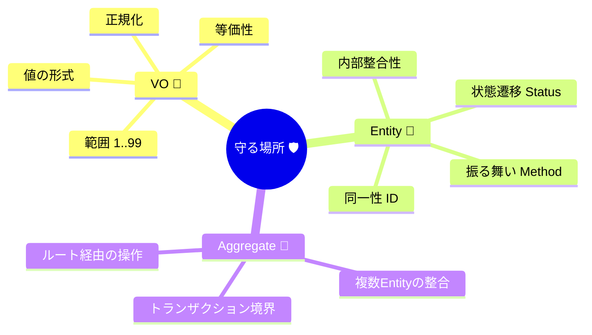

# 第50章：ここまで総整理：VO＋Entityで守る範囲🎯✨

DDDで言う「ルール（不変条件）」って、ぜんぶ同じじゃないの🥺
混ざると事故るから、まず分類しよっ✨



やった〜！ここまでで、戦術DDDの二本柱 **Value Object（VO）💎** と **Entity（エンティティ）🪪** を作ってきたよね☺️
この章は「**どのルールを、どこで守れている？**」をぜんぶ棚卸しして、次の **Aggregate（集約）🏯** にスムーズに進むための“整理回”だよ〜！🌸

---

## 0. 2026時点のTypeScriptまわり、超ざっくり最新メモ🧡🧠

* TypeScript の安定版は **5.9.3** が “Latest” になってるよ（npm / GitHubリリース上）。([npm][1])
* TypeScript 5.9 では、たとえば **`import defer`** みたいなモジュール周りの新構文サポートが入ってるよ。([TypeScript][2])
* TypeScript は **6.0（橋渡し版）→ 7.0（ネイティブ移行）** という大きな流れが公式に説明されてるよ（6.0は旧コードベース最後、7.0はネイティブ移行）。([Microsoft for Developers][3])
* Node.js は **v24 が Active LTS**、**v25 が Current** という整理で公開されてるよ。([Node.js][4])

> この章のコード例は「VO/Entityの設計の考え方」が主役だから、TSの細かい新機能より **“守るべきルールを閉じ込める”** にフォーカスするね😊💪

---

## 1. 今日のゴール✅✨

この章のゴールはこれだけ！🎉

1. **ルール（不変条件）を全部並べる** 🗒️
2. それぞれを **VOで守る？ Entityで守る？** を判断する ⚖️
3. 「守るべき範囲」がズレてないか **レビュー表で点検** 👀
4. 次の集約でやること（“一緒に守る単位”）が見える 🏯

---

## 2. まず前提：ルールには種類があるよ🧩

DDDで言う「ルール（不変条件）」って、ぜんぶ同じじゃないの🥺
混ざると事故るから、まず分類しよっ✨

### 2.1 ルールのタイプ4つ🍀

**A. 値そのもののルール（1つの値で完結）** 💎
例：金額はマイナス禁止、メールは正規化、数量は1以上…

**B. 1つのモノの中の整合性（複数プロパティの関係）** 🪪
例：注文の合計は明細の合計と一致、支払い済みなら変更禁止…

**C. 手続き・流れのルール（状態遷移）** 🚦
例：Draft→Confirmed→Paid の順でしか進めない、Cancel後は何もできない…

**D. 複数のモノにまたがるルール（境界の外まで関係）** 🌍
例：会員ランク割引、在庫、キャンペーン、他集約との整合性…

---

## 3. VOで守る範囲💎🧊（ここが“強い”）

VOは一言でいうと、**「値の安全装置」** だよ✨
“値に意味を持たせて”、生成時にガードして、ずっと不変にする💪

### 3.1 VOが担当するもの（◎やるべき）🧡

* **バリデーション**：範囲、形式、禁止値（0不可、空不可など）✅
* **正規化**：大文字小文字、トリム、丸め、通貨の統一など🧼
* **等価性**：同じ値なら同じ、と比較できる⚖️
* **表現の変換**：`toString()`、`toJSON()` 的な“安全な外出し”📤（やりすぎ注意）

### 3.2 VOがやらないもの（✖やっちゃダメ）🚫

* DB保存やAPI呼び出し（I/O）🧯
* 時間で変わる状態管理（それはEntity/集約の仕事）⏳
* 「誰それの注文」みたいな同一性（Identity）🪪

---

## 4. Entityで守る範囲🪪🧍（“同一性”と“振る舞い”）

Entityは **「同じ人（同じ注文）として追跡できる存在」** だよね✨
だから、Entityが強いのはここ👇

### 4.1 Entityが担当するもの（◎やるべき）🎮

* **同一性（ID）で比較する** 🆔
* **状態（status）を持ち、遷移を制御する** 🚦
* **振る舞い（メソッド）で操作させる**（データ直いじり禁止）🚫
* **Entity内部の整合性**（複数プロパティの関係）を守る🔒

### 4.2 Entityが弱いところ（集約に持ち越し）🏯

* “複数Entityの同時整合性” を本気で守る（トランザクションの話が来る）🧾
* 外部との整合性（在庫・キャンペーンなど）🌍

---

## 5. 「このルール、VO？Entity？」秒速判定チャート⚡🧠

迷ったら、この順で考えるとほぼ勝てるよ😊✨

1. **同一性が必要？**（追跡したい“同じモノ”がある？）

   * YES 👉 Entity🪪
   * NO 👉 次へ

2. **値だけで完結してる？**（その値単体で正しい/正しくないが決まる？）

   * YES 👉 VO💎
   * NO 👉 次へ

3. **複数の値の関係や状態遷移がある？**

   * YES 👉 Entity（or 次章からのAggregate）🚦🏯
   * NO 👉 VO寄り（設計を見直すチャンス）✨

---

## 6. “守る範囲マップ”を作ろう🗺️✨（この章の主役）

ここが第50章のキモだよ〜！🎯
**ルールを並べて、置き場所を決める**！

### 6.1 例題（カフェ注文☕🧾）のルール棚卸し

#### VOで守る（値の安全）💎

* Money：0以上、通貨固定、丸め方（必要なら）💴
* Quantity：1以上、上限（例：99）📏
* Email：正規化＋形式✉️
* OrderId：形式・生成規則（“IDはただのstringじゃない”）🆔

#### Entityで守る（注文という存在の安全）🪪

* Order：

  * 明細の追加/削除/数量変更の可否（状態で変わる）🚦
  * 合計金額は明細合計と一致する（常に整合）🧮
  * 支払いは1回だけ、支払い後は変更不可💳🔒

---

## 7. 第50章の“設計レビュー観点テンプレ”👀📝（超大事！）

このテンプレは次章以降もずっと使えるよ〜！🎉
AIレビューにもそのまま貼れる形にしてあるよ🤖✨

### 7.1 VOレビュー観点（10項目）💎✅

1. **不変**になってる？（外から値を書き換え不可）🧊
2. **生成口が1つ**？（`new`直呼びを封じる、`create()`等）🚪
3. **バリデーションが生成時**に完結してる？🔒
4. **正規化がVOの責務**になってる？🧼
5. **プリミティブを外に漏らしすぎてない**？（戻り値で台無し）🥺
6. **等価性（equals）** が“値”比較になってる？⚖️
7. **エラーメッセージが仕様っぽい**？（何がダメか分かる）🧯
8. **I/Oが混ざってない**？（DB/HTTP/Date.now直呼び等）🚫
9. **名前がユビキタス言語**になってる？🗣️
10. **テストが最小で強い**？（成功/失敗/境界/等価性）🧪

### 7.2 Entityレビュー観点（12項目）🪪✅

1. **比較はID**？（値一致と同一性を混ぜない）🆔
2. **public setter禁止**になってる？🚫
3. 操作は **意図あるメソッド**？（`setStatus` とか消えてる？）🎮
4. **状態遷移がメソッド内に閉じてる**？🚦
5. **不変条件チェックが先**？（ガード節）🔒
6. **配列やオブジェクトを外に生で返してない**？（外から改ざん）🧨
7. **合計などの派生値がズレない**設計？🧮
8. **例外/Result方針がブレてない**？（どこで何を返す？）⚖️
9. **VOをちゃんと使ってる**？（string/number直持ちに戻ってない）🧱
10. **テストが遷移中心**になってる？（成功/失敗）🧪
11. **責務が太りすぎてない**？（Entityが全部やりだす）⚠️
12. “境界の外” を触ってない？（支払いAPIとかDBとか）🚫🌍

---

## 8. ミニ実装例：VOとEntityで“守る範囲”を固定する🧊🪪

### 8.1 VO（例：Quantity）💎

```ts
// domain/value-objects/Quantity.ts
export class Quantity {
  private constructor(private readonly value: number) {}

  static create(value: number): Quantity {
    if (!Number.isInteger(value)) throw new Error("Quantity must be an integer.");
    if (value < 1) throw new Error("Quantity must be at least 1.");
    if (value > 99) throw new Error("Quantity must be at most 99.");
    return new Quantity(value);
  }

  toNumber(): number {
    return this.value;
  }

  equals(other: Quantity): boolean {
    return this.value === other.value;
  }
}
```

ポイントはこれだよ〜☺️✨

* `constructor` を隠して **生成時にしか作れない**
* 生成時に **ルールを全部チェック**
* できたら **ずっと不変**

---

### 8.2 Entity（例：Order の振る舞い）🪪

```ts
// domain/entities/Order.ts
import { Quantity } from "../value-objects/Quantity";

type OrderStatus = "Draft" | "Confirmed" | "Paid" | "Canceled";

type OrderLine = Readonly<{
  menuItemId: string; // 本当は MenuItemId VO にしたい（次の整理ポイント✨）
  quantity: Quantity;
}>;

export class Order {
  private status: OrderStatus = "Draft";
  private lines: OrderLine[] = [];

  constructor(private readonly id: string) {} // 本当は OrderId VO にしたい✨

  getId(): string {
    return this.id;
  }

  getStatus(): OrderStatus {
    return this.status;
  }

  getLines(): ReadonlyArray<OrderLine> {
    // 外から配列を壊されないように“読み取り専用”で返すよ🛡️
    return this.lines;
  }

  addLine(menuItemId: string, quantity: Quantity): void {
    this.assertEditable();

    const exists = this.lines.some(l => l.menuItemId === menuItemId);
    if (exists) throw new Error("Same menu item is already in the order.");

    this.lines = [...this.lines, { menuItemId, quantity }];
  }

  changeQuantity(menuItemId: string, quantity: Quantity): void {
    this.assertEditable();

    const index = this.lines.findIndex(l => l.menuItemId === menuItemId);
    if (index < 0) throw new Error("Order line not found.");

    const next = [...this.lines];
    next[index] = { ...next[index], quantity };
    this.lines = next;
  }

  confirm(): void {
    if (this.status !== "Draft") throw new Error("Only Draft order can be confirmed.");
    if (this.lines.length === 0) throw new Error("Cannot confirm an empty order.");
    this.status = "Confirmed";
  }

  pay(): void {
    if (this.status !== "Confirmed") throw new Error("Only Confirmed order can be paid.");
    this.status = "Paid";
  }

  cancel(): void {
    if (this.status === "Paid") throw new Error("Paid order cannot be canceled.");
    if (this.status === "Canceled") return;
    this.status = "Canceled";
  }

  private assertEditable(): void {
    if (this.status !== "Draft") throw new Error("Order is not editable in this status.");
  }
}
```

この例で伝えたいのはこれ👇✨

* `setStatus` みたいな雑な穴を塞いで、**メソッドでしか変更できない**🚫
* 「いつ編集OK？」は `assertEditable()` に閉じ込める🔒
* 配列は外から触られないようにする🛡️

---

## 9. テストの最小セット（“守る範囲”が壊れてないか）🧪💖

### 9.1 VOテスト（境界値がすべて）💎

* Quantity：`1` OK、`0` NG、`99` OK、`100` NG
* equals：同値はtrue、別値はfalse

### 9.2 Entityテスト（遷移と禁止の確認）🪪

* Draftで add/change OK
* Confirmedで add/change NG
* Confirmは空明細NG
* payはConfirmedだけOK
* cancelはPaidでNG

> テストは「仕様の翻訳」だよ😊🧡
> **VOは境界値**、**Entityは状態遷移と禁止**。ここだけは外さない〜！🎯

---

## 10. AIでやると強い“総点検”プロンプト🤖✨

コピペで使えるように書くね〜☺️💕

* **ルール棚卸し**
  「このドメイン（カフェ注文）の不変条件を20個、具体例つきで列挙して。VO/Entity/Aggregate/UseCaseのどこで守るべきかも分類して」

* **VOレビュー**
  「以下のVOが “不変・等価性・生成時バリデーション・I/O分離” を満たしてるか、チェックリストでレビューして。改善案もコードで」

* **Entityレビュー（穴探し）**
  「以下のEntityで ‘外から状態を壊せる抜け道’ を探して。配列の漏れ、setter、状態遷移、ガード節の不足を重点的に」

* **テスト抜けチェック**
  「このEntityの状態遷移テストで抜けやすいケース（順序違い、二重実行、境界）を追加で10個提案して」

---

## 11. よくある“DDDっぽいだけ”事故集😂⚠️（この章で潰す！）

* **VOなのにsetterがある** → ただのクラスです🥺
* **Entityの配列をそのまま返す** → 外から書き換えられて終わり🧨
* **状態を外からsetできる** → ルール無視が簡単にできちゃう🚫
* **string/numberに戻る** → プリミティブ地獄が再発🧱
* **ルールがアプリ層に散らばる** → どこが正しいか分からなくなる🌀

---

## 12. まとめ：第50章の結論🎯✨

* **VOは「値の安全装置」💎**：形式・範囲・正規化・等価性
* **Entityは「存在の安全装置」🪪**：同一性・状態・振る舞い・遷移
* でも **“複数のものを一緒に守る単位”** までは、次の **Aggregate（集約）🏯** の仕事！

---

## 次章へのつなぎ🏯🛡️（ちょい予告）

次（第51章）からは、いよいよ **「変更の単位＝集約」** を作るよ✨
今日やった棚卸しができてると、

* 「このルールは Order と OrderLine を **一緒に守らないとダメだね**」
* 「じゃあ外部から触れる入口は **Orderだけ（Aggregate Root）** だね」

って、自然に決まるようになるよ〜！🎉💖

---

必要なら、この章の内容をそのまま **チェックシート（コピペ用）** に整形して、毎章の最後に貼れるテンプレにもしてあげるよ☺️📝✨

[1]: https://www.npmjs.com/package/typescript?activeTab=versions&utm_source=chatgpt.com "typescript"
[2]: https://www.typescriptlang.org/docs/handbook/release-notes/typescript-5-9.html?utm_source=chatgpt.com "Documentation - TypeScript 5.9"
[3]: https://devblogs.microsoft.com/typescript/progress-on-typescript-7-december-2025/?utm_source=chatgpt.com "Progress on TypeScript 7 - December 2025"
[4]: https://nodejs.org/en/about/previous-releases?utm_source=chatgpt.com "Node.js Releases"
