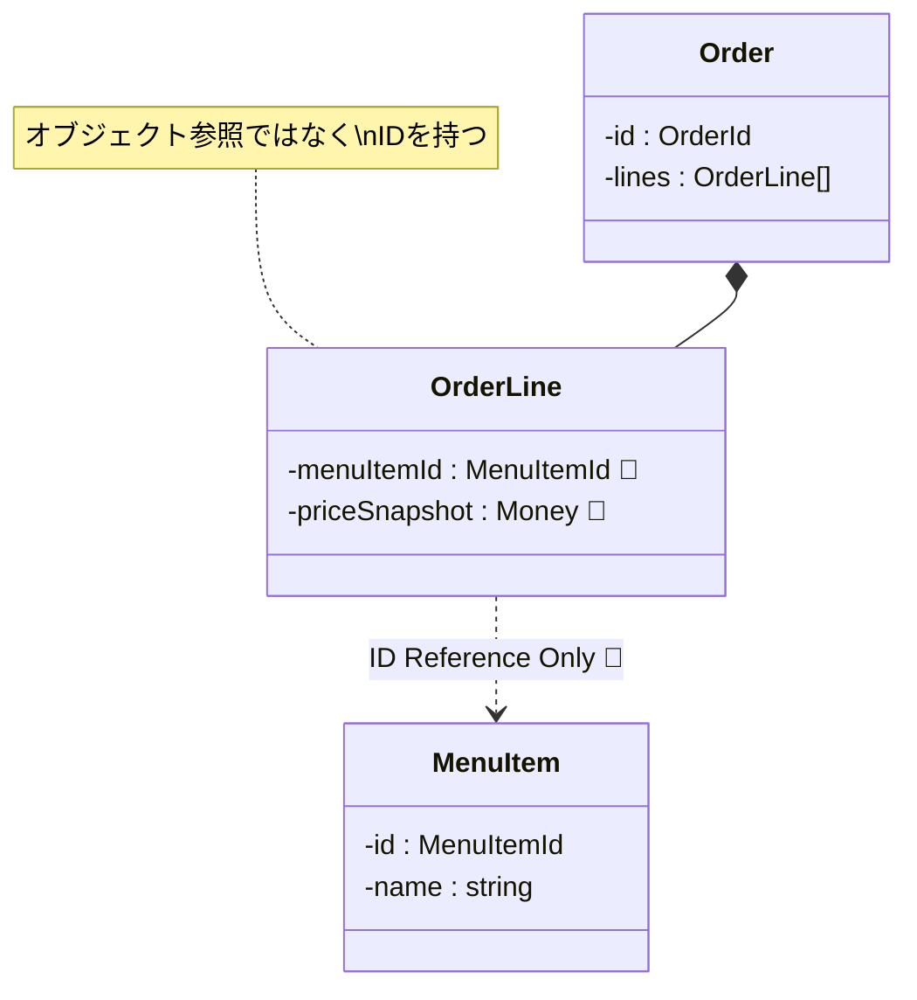

# 第54章：他集約の参照：ID参照が基本🔗🪪

* “巨大オブジェクト地獄”や“同時更新地獄”を回避できるようになる😂⚠️



---

## この章のゴール🎯✨

* 「他の集約」を**オブジェクト参照で持たない**理由が腹落ちする🙆‍♀️
* **ID参照**＋（必要なら）**スナップショット**で安全に設計できるようになる🛡️
* “巨大オブジェクト地獄”や“同時更新地獄”を回避できるようになる😂⚠️

---

## まず結論：他集約は「IDだけ」持つのが基本🔗🪪


DDDでは、集約の境界を守るために

* ✅ **他集約は “ID（同一性）” で参照する**
* ❌ 他集約のインスタンス（オブジェクト）を抱え込まない

が定石だよ〜！
このルールは Implementing Domain-Driven Design の「Reference Other Aggregates by Identity（ID参照しよう）」としてよく知られてるやつ✨ ([InformIT][2])

---

## なぜID参照が大事なの？（事故を防ぐ3つの理由）🧯💥

### 1) 変更の誘惑が減る（= 集約境界が守れる）🚪👑

オブジェクト参照で繋ぐと、つい「ついでに他の集約もちょっと更新…」ってやりたくなるのね😵‍💫
でもそれって **「同一トランザクションで複数集約を更新してる」** ってことが多くて、DDD的には境界崩壊のサインになりがち。 ([archi-lab.io][3])

### 2) 巨大オブジェクト地獄を避けられる🕸️😇


「Order が MenuItem を持って、MenuItem が Category を持って…」みたいに参照が伸びて、読み込みもテストも地獄になりやすい😂
ID参照にすると、**モデルが軽く保てる**のが強いよ。 ([InformIT][2])

### 3) 将来の分割・スケール・分散に強い🌍🚀

集約どうしが “直接参照” で絡むと、スケールや分割の自由度が落ちるのね。
ID参照は、将来イベント連携（第91章〜）や最終的整合性の設計にも繋がりやすいよ✨ ([dddcommunity.org][4])

---

## 例題（カフェ注文）で理解しよ☕🧾

### 登場する集約（イメージ）🧩

* **Order 集約**（注文）
* **MenuItem 集約**（メニュー商品：価格や販売状態を持つ）

ここでやりがちなダメ例👇

---

## アンチパターン：Order が MenuItem を丸ごと抱える😱❌

* OrderLine が `MenuItem` オブジェクトを持つ
* そのせいで Order 側から MenuItem を変更できちゃう
* さらに MenuItem の中に他の参照があると…芋づる式に重くなる

DDDのルールとしては
「**他集約の“中身”には触れない**」「参照するなら **集約ルートのID**」が基本だよ〜🪪✨ ([Stack Overflow][5])

---

## 正解パターン：OrderLine は MenuItemId を持つ🪪✅


ここが今日のメイン！
Order（注文）側が持つのは、基本こう👇

* `menuItemId`（ID参照）🪪
* `unitPriceAtOrder`（注文時単価のスナップショット）💴
* `displayNameAtOrder`（注文時表示名のスナップショット）🏷️

> 「え、名前も価格もIDから引けばよくない？」って思うかもだけど、**“注文時点の事実”** を守りたいからスナップショットが超よく使われるよ✨
> 価格改定があっても、過去の注文の合計が変わったら困るでしょ？😵‍💫

---

## 実装してみよ（ミニ構成）🧑‍💻✨

### ① IDはVO（Value Object）として扱う🪪💎

```ts
// domain/menu/MenuItemId.ts
export class MenuItemId {
  private constructor(public readonly value: string) {}

  static from(value: string): MenuItemId {
    if (!value || value.trim() === "") throw new Error("MenuItemId is required");
    return new MenuItemId(value);
  }
}
```

```ts
// domain/order/OrderId.ts
export class OrderId {
  private constructor(public readonly value: string) {}

  static from(value: string): OrderId {
    if (!value || value.trim() === "") throw new Error("OrderId is required");
    return new OrderId(value);
  }
}
```

---

### ② MenuItem 集約（別集約！）🍰📋

```ts
// domain/menu/MenuItem.ts
import { MenuItemId } from "./MenuItemId";

export class MenuItem {
  constructor(
    public readonly id: MenuItemId,
    private name: string,
    private priceYen: number,
    private isAvailable: boolean,
  ) {}

  get displayName(): string {
    return this.name;
  }

  get currentPriceYen(): number {
    return this.priceYen;
  }

  get available(): boolean {
    return this.isAvailable;
  }
}
```

ポイント：

* Order 側から `MenuItem` を握らない！
* MenuItem は MenuItem 集約の中だけで完結して守る！

---

### ③ Order 集約の中の OrderLine（VO寄り）🧾💎

```ts
// domain/order/OrderLine.ts
import { MenuItemId } from "../menu/MenuItemId";

export class OrderLine {
  private constructor(
    public readonly menuItemId: MenuItemId,
    public readonly displayNameAtOrder: string,
    public readonly unitPriceYenAtOrder: number,
    public readonly quantity: number,
  ) {}

  static create(params: {
    menuItemId: MenuItemId;
    displayNameAtOrder: string;
    unitPriceYenAtOrder: number;
    quantity: number;
  }): OrderLine {
    const { menuItemId, displayNameAtOrder, unitPriceYenAtOrder, quantity } = params;

    if (!displayNameAtOrder || displayNameAtOrder.trim() === "") throw new Error("displayName is required");
    if (!Number.isInteger(unitPriceYenAtOrder) || unitPriceYenAtOrder <= 0) throw new Error("unitPrice must be positive int");
    if (!Number.isInteger(quantity) || quantity <= 0) throw new Error("quantity must be positive int");

    return new OrderLine(menuItemId, displayNameAtOrder, unitPriceYenAtOrder, quantity);
  }

  subtotalYen(): number {
    return this.unitPriceYenAtOrder * this.quantity;
  }
}
```

---

### ④ Order 集約（外部に見せる入口はここだけ）🏯🚪👑

```ts
// domain/order/Order.ts
import { OrderId } from "./OrderId";
import { OrderLine } from "./OrderLine";
import { MenuItemId } from "../menu/MenuItemId";

export class Order {
  private lines: OrderLine[] = [];

  constructor(public readonly id: OrderId) {}

  addLine(params: {
    menuItemId: MenuItemId;
    displayNameAtOrder: string;
    unitPriceYenAtOrder: number;
    quantity: number;
  }): void {
    // 例：同一メニューを二重追加禁止（ここは仕様次第）
    const exists = this.lines.some(l => l.menuItemId.value === params.menuItemId.value);
    if (exists) throw new Error("This menu item is already in the order");

    this.lines.push(OrderLine.create(params));
  }

  totalYen(): number {
    return this.lines.reduce((sum, l) => sum + l.subtotalYen(), 0);
  }

  getLines(): readonly OrderLine[] {
    // 外から配列を壊させない（超大事！）
    return this.lines;
  }
}
```

---

## じゃあ「MenuItemの情報」はどこで取ってくるの？🤔🔎


答え：**アプリ層（ユースケース）**で取ってくるよ！🎬✨
Order の `addLine()` に入れる材料を、アプリ層で揃えるの。

### 例：PlaceOrder（注文追加）ユースケース側で参照する📦

```ts
// app/PlaceOrderAddLine.ts
import { MenuItemId } from "../domain/menu/MenuItemId";
import { OrderId } from "../domain/order/OrderId";

export interface MenuItemRepository {
  findById(id: MenuItemId): Promise<{ id: MenuItemId; displayName: string; currentPriceYen: number; available: boolean } | null>;
}

export interface OrderRepository {
  findById(id: OrderId): Promise<{ order: any } | null>; // ここは後の章でちゃんと型にする想定でOK
  save(order: any): Promise<void>;
}

export class PlaceOrderAddLine {
  constructor(
    private readonly menuRepo: MenuItemRepository,
    private readonly orderRepo: OrderRepository,
  ) {}

  async execute(input: { orderId: string; menuItemId: string; quantity: number }): Promise<void> {
    const orderId = OrderId.from(input.orderId);
    const menuItemId = MenuItemId.from(input.menuItemId);

    const menu = await this.menuRepo.findById(menuItemId);
    if (!menu) throw new Error("Menu item not found");
    if (!menu.available) throw new Error("Menu item is not available");

    const found = await this.orderRepo.findById(orderId);
    if (!found) throw new Error("Order not found");

    const order = found.order;

    // ★ここでスナップショットを詰めて渡す！
    order.addLine({
      menuItemId: menu.id,
      displayNameAtOrder: menu.displayName,
      unitPriceYenAtOrder: menu.currentPriceYen,
      quantity: input.quantity,
    });

    await this.orderRepo.save(order);
  }
}
```

この形にすると、Order 集約は

* 「メニューを探す」「他集約の事情を知る」
  をしなくてよくなるの✨
  責務が混ざらなくて、超DDDっぽくなるよ〜🧠💕

---

## ここが超重要：ID参照でも“貧血モデル”にならない？🩸😵‍💫

「他集約を触れない」＝「全部アプリ層にロジック移動」
…ってやると、たしかに貧血っぽくなりがち！

でも大丈夫🙆‍♀️✨

* **集約内の不変条件**（例：二重追加禁止、状態遷移、合計整合性）は **集約が守る**
* **他集約の取得**や**ユースケース手順**は **アプリ層がやる**

これが自然な分担だよ〜🎯

---

## よくある設計の分岐：IDだけ？スナップショットも？📸🪪


### A) IDだけ持つ（最小）🪪

* 参照時に別集約を見に行って表示する
* 読み取り（Query）側でJOIN的に組み立てる

👉 “表示は変わってもOK” な情報ならこれで十分！

### B) スナップショットも持つ（注文時点の事実）📸

* 注文当時の単価・商品名など
* 後で商品が改名・値上げしても注文の整合性が保てる

👉 会計・請求・履歴はだいたいこっちが強い💪✨

---

## ミニ演習✍️🎀（手を動かすやつ）

### 演習1：二重追加を「同一行に合算」に変えてみよ➕

今は二重追加禁止にしてるけど、仕様としては

* 同じメニューが来たら数量を足す
  もよくあるよ〜！

ヒント：

* `lines` を置き換えるときに不変っぽくしたいなら「新しい配列を作る」方針もアリ🧊✨

### 演習2：OrderDetails表示用DTOを作る📦🔎

* Order 集約からは `menuItemId / unitPriceAtOrder / quantity` を出す
* 表示用に、MenuItem集約から名前や画像（仮）を集めてDTOにする

👉 “ドメインを汚さずに画面を作る” 感覚が育つよ〜🌱✨

---

## AI（Copilot / Codex）活用のおすすめ🤖💗

### 使ってOKなお願い（強い）✅

* 「VO（MenuItemId/OrderId）の雛形を作って」
* 「Order.addLine のテストケースを列挙して」
* 「いまの設計で“集約境界が破れる匂い”を指摘して」

### 注意したいお願い（危ない）⚠️

* 「DDDで全部正しい設計にして」→ AIがそれっぽい巨大設計を盛りがち😂
* 「RepositoryからMenuItemを引いてOrderに保持して」→ 今日のルールと逆を提案されがち😵‍💫

---

## まとめ🎉✨（この章で持ち帰ること）

* 他集約は **オブジェクト参照じゃなくID参照**が基本🪪🔗 ([InformIT][2])
* 理由は「境界を守る」「巨大化を防ぐ」「将来の分散に強い」🛡️🌍 ([archi-lab.io][3])
* 必要なら **注文時点のスナップショット**（名前・単価）を一緒に持つと実務っぽくて強い📸💴
* 他集約の取得は **アプリ層（ユースケース）**が担当するとスッキリ🎬✨

---

## 次章へのつながり🚀🧾⏱️

次の第55章で「**どこまで一括で成功/失敗にする？（トランザクション感覚）**」をやると、
今日の「ID参照」がさらに意味を持ってくるよ〜！🌟

必要なら、この章のコードを **Vitest 用のテスト（例外ケース込み）**までセットで整えた版も出せるよ🧪💖（最近の Vitest 事情も更新されてるから、それに合わせて作れるよ） ([vitest.dev][6])

[1]: https://www.npmjs.com/package/typescript?activeTab=versions&utm_source=chatgpt.com "typescript"
[2]: https://www.informit.com/articles/article.aspx?p=2020371&seqNum=4&utm_source=chatgpt.com "Rule: Reference Other Aggregates by Identity - InformIT"
[3]: https://www.archi-lab.io/infopages/ddd/aggregate-design-rules-vernon.html?utm_source=chatgpt.com "Aggregate Design Rules according to Vaughn Vernon's “Red ..."
[4]: https://www.dddcommunity.org/wp-content/uploads/files/pdf_articles/Vernon_2011_2.pdf?utm_source=chatgpt.com "Effective Aggregate Design Part II: Making ..."
[5]: https://stackoverflow.com/questions/50597171/can-aggregate-root-reference-another-root?utm_source=chatgpt.com "Can aggregate root reference another root?"
[6]: https://vitest.dev/guide/?utm_source=chatgpt.com "Getting Started | Guide"
