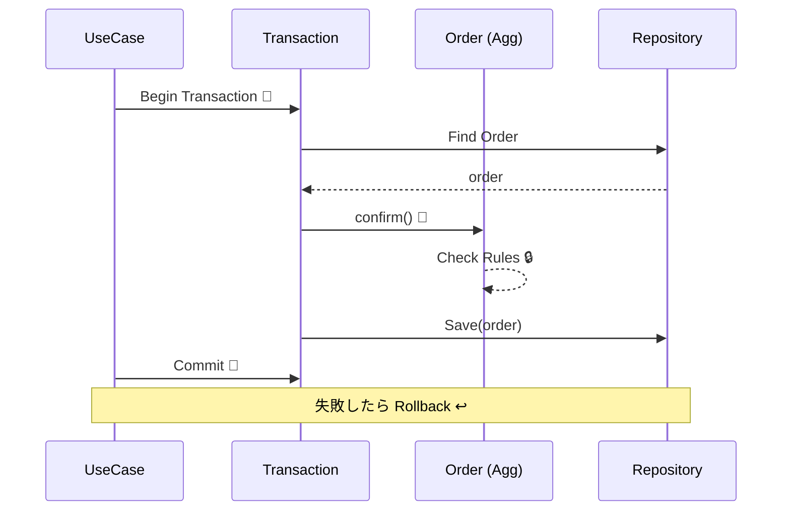

# 第55章：トランザクション感覚（超入門）🧾⏱️

* TypeScriptで“雰囲気トランザクション”を疑似実装して、動きで理解する🎮✨



---

## 1) この章のゴール🎯✨

* 「トランザクション」＝ **原子性（いっこにまとめる）** の感覚がつく🧠⚡
* 「集約」と「トランザクション境界」がどう関係するか分かる🏯🧾
* 「注文確定」のユースケースで、**どこまでを“一気にやる”か**決められる✅
* TypeScriptで“雰囲気トランザクション”を疑似実装して、動きで理解する🎮✨

---

## 2) トランザクションってなに？☕🧾（超やさしく）

トランザクションは一言でいうと👇

> **「まとめてやって、全部うまくいったら確定！途中でコケたら全部なかったことにする！」**
> （All or Nothing）🎲💥➡️✅ or ❌

DBの世界ではこれを **ACID**（Atomicity / Consistency / Isolation / Durability）って呼ぶよ📚✨
特にこの章で大事なのは **Atomicity（原子性）**＝「まとめて成功/失敗」！🧾✨ ([PostgreSQL][1])

---

## 3) DDDだと何が嬉しいの？🏯🛡️

### ✅ 集約は「ルールを守るまとまり」

集約は「この範囲の整合性（不変条件）は絶対守る！」っていう城🏯🛡️だったよね。

### ✅ トランザクションは「成功/失敗のまとまり」

だから基本はこう考えると超ラク👇

* **集約のルールを守る操作は、1回のトランザクションに閉じる**🔒✨
* 集約をまたぐ“つながり”は、あとで **イベント/非同期/最終的整合性** で扱う（後半でやるやつ）📮⏳

> 「集約＝整合性の境界」
> 「トランザクション＝成功/失敗の境界」
> → だいたい重ねると強い💪💕

---

## 4) 例題：『注文確定』はどこまで“一気にやる”？☕✅🧾

あなたのロードマップにある通り、この章のテーマは👇

> 「注文確定」はどこまで一気にやる？🤔

たとえば **ConfirmOrder**（注文確定）でやりたいことを並べると…

### ✅ 同じ集約（Order集約）の中で完結するもの（＝一気にやりやすい）🏯✨

* 注文の状態を `Draft → Confirmed` にする🚦✅
* 明細が空なら確定できない、などの不変条件チェック🔒
* 合計金額の整合性を保つ（明細合計と一致）💴🧾

👉 これは **Order集約の城の中** の話だから、基本「1トランザクションで一気に」がおすすめ💡

### ⚠️ 別集約・外部連携が絡むもの（＝一気にやると重くなりがち）🌍⚡

* 決済サービスへ連携💳
* 在庫集約の更新📦
* 通知メール送信✉️

👉 ここまでを“全部いっぺんに”やると、失敗時の巻き戻しが地獄になりがち😵‍💫
このへんは後半（イベントやOutbox等）で強くするのがDDDの定番ルートだよ📮✨

---

## 5) トランザクション境界の決め方（ミニ指針）🧭✨

迷ったらこの3つだけ見よっ👇🥰

1. **不変条件（絶対守るルール）を守るのに同時更新が必要？** 🔒
2. **途中で失敗したら“なかったこと”にしたい？** ❌➡️🧾
3. **外部I/O（決済・通知）を巻き込んでない？** 🌍

   * 巻き込むほど「長いトランザクション」になって事故りやすい💥

---

## 6) TypeScriptで“疑似トランザクション”してみる🎮🧾✨

まだDBなしでも、雰囲気は作れるよ！
ここでは「失敗したら保存結果を戻す」を **InMemoryで疑似的に再現**して、感覚をつかむ💡

### 6-1) 最小のインターフェース（TransactionRunner）🏃‍♀️💨

```ts
export interface TransactionRunner {
  run<T>(fn: () => Promise<T>): Promise<T>;
}
```

### 6-2) リポジトリ（最低限）📚

```ts
export interface OrderRepository {
  findById(id: string): Promise<Order | null>;
  save(order: Order): Promise<void>;
}
```

### 6-3) ドメイン（超簡略）🏯🚦

```ts
type OrderStatus = "Draft" | "Confirmed" | "Paid" | "Cancelled";

export class Order {
  private constructor(
    public readonly id: string,
    private status: OrderStatus,
    private readonly items: ReadonlyArray<{ sku: string; qty: number }>
  ) {}

  static create(id: string) {
    return new Order(id, "Draft", []);
  }

  addItem(sku: string, qty: number) {
    if (this.status !== "Draft") throw new Error("確定後は明細を変更できないよ😢");
    if (qty <= 0) throw new Error("数量は1以上だよ😢");
    return new Order(this.id, this.status, [...this.items, { sku, qty }]);
  }

  confirm() {
    if (this.status !== "Draft") throw new Error("Draftのときだけ確定できるよ😢");
    if (this.items.length === 0) throw new Error("明細が空だと確定できないよ😢");
    return new Order(this.id, "Confirmed", this.items);
  }

  snapshot() {
    // 永続化用にシリアライズ可能な形へ（超簡略）
    return { id: this.id, status: this.status, items: this.items };
  }

  static restore(s: { id: string; status: OrderStatus; items: ReadonlyArray<{ sku: string; qty: number }> }) {
    return new Order(s.id, s.status, s.items);
  }
}
```

### 6-4) ユースケース（ここでトランザクション境界を作る）🎬🧾

```ts
export class ConfirmOrderUseCase {
  constructor(
    private readonly tx: TransactionRunner,
    private readonly orders: OrderRepository
  ) {}

  async execute(orderId: string): Promise<void> {
    await this.tx.run(async () => {
      const order = await this.orders.findById(orderId);
      if (!order) throw new Error("注文が見つからないよ😢");

      const confirmed = order.confirm();   // ルールはドメインが守る🏯🛡️
      await this.orders.save(confirmed);    // 保存はまとめて確定したい🧾✨
    });
  }
}
```

---

## 7) 疑似TxのInMemory実装（失敗したらロールバックっぽく）🔁🧯

ポイントはこれ👇
**run()の中で失敗したら、Mapを元に戻す**（超ミニRollback）✨

```ts
export class InMemoryOrderRepository implements OrderRepository {
  private store = new Map<string, ReturnType<Order["snapshot"]>>();

  async findById(id: string): Promise<Order | null> {
    const s = this.store.get(id);
    return s ? Order.restore(s) : null;
  }

  async save(order: Order): Promise<void> {
    this.store.set(order.id, order.snapshot());
  }

  // テスト用
  seed(order: Order) {
    this.store.set(order.id, order.snapshot());
  }

  // トランザクション用にスナップショット
  cloneStore(): Map<string, ReturnType<Order["snapshot"]>> {
    return new Map(this.store);
  }

  restoreStore(snapshot: Map<string, ReturnType<Order["snapshot"]>>) {
    this.store = snapshot;
  }
}

export class InMemoryTransactionRunner implements TransactionRunner {
  constructor(private readonly repo: InMemoryOrderRepository) {}

  async run<T>(fn: () => Promise<T>): Promise<T> {
    const before = this.repo.cloneStore();
    try {
      const result = await fn();
      return result; // commit（何もしない）
    } catch (e) {
      this.repo.restoreStore(before); // rollbackっぽい！
      throw e;
    }
  }
}
```

---

## 8) テストで「失敗したら戻る」を体験🧪✨（Vitest想定）

```ts
import { describe, it, expect } from "vitest";

describe("ConfirmOrderUseCase", () => {
  it("明細が空なら確定できず、状態も変わらない（rollback）", async () => {
    const repo = new InMemoryOrderRepository();
    const tx = new InMemoryTransactionRunner(repo);
    const usecase = new ConfirmOrderUseCase(tx, repo);

    const order = Order.create("o-1");
    repo.seed(order);

    await expect(usecase.execute("o-1")).rejects.toThrow();

    const reloaded = await repo.findById("o-1");
    expect(reloaded?.snapshot().status).toBe("Draft"); // Confirmedになってない！✨
  });

  it("明細があれば確定できる（commit）", async () => {
    const repo = new InMemoryOrderRepository();
    const tx = new InMemoryTransactionRunner(repo);
    const usecase = new ConfirmOrderUseCase(tx, repo);

    const order = Order.create("o-2").addItem("latte", 1);
    repo.seed(order);

    await usecase.execute("o-2");

    const reloaded = await repo.findById("o-2");
    expect(reloaded?.snapshot().status).toBe("Confirmed");
  });
});
```

「成功/失敗をまとめる」ってこういうことか〜！ってなるはず🥰🎉

---

## 9) 実DBだとどう書くの？（雰囲気だけ）💾🧾

たとえば **Prisma** なら `$transaction` で「関数の中をひとまとめ」にできるよ〜✨
エラーが起きたらロールバック、が基本の挙動だよ🧯🔁 ([Prisma][2])

```ts
await prisma.$transaction(async (tx) => {
  // tx を使ってDB操作をまとめる（イメージ）
  // const order = await tx.order.findUnique(...)
  // await tx.order.update(...)
});
```

---

## 10) 今どきのTS/Nodeの“前提ライン”（2026/02の目安）🧠✨

* TypeScript公式の「最新版」は **5.9** と案内されてるよ📌 ([TypeScript][3])
* Node.jsは「偶数版がLTS」運用で、**v24がActive LTS**、v25がCurrent（2026/02時点）になってるよ📌 ([Node.js][4])

（※将来のTypeScriptの“ネイティブ版”開発も進んでるけど、この章の設計思想自体は変わらないよ〜🚀） ([Microsoft Developer][5])

---

## 11) AIの使いどころ（この章向け）🤖💬✨

### 🧠 ① トランザクション境界の壁打ち

「このユースケースはどこまでを1回でやるべき？」を整理したいとき👇

```text
あなたはDDDの設計レビュアです。
題材：カフェ注文ドメイン
ユースケース：注文確定（ConfirmOrder）

やりたい処理：
- 注文をDraft→Confirmed
- 明細が空なら失敗
- （候補）在庫を減らす
- （候補）支払い連携
- （候補）通知メール

質問：
1) どれを1トランザクションに入れるべき？
2) 集約境界（Order/Stock/Payment）を仮定して、理由も説明して
3) “長いトランザクション”のリスクを、この例で具体化して
出力は箇条書きで。
```

### 🧪 ② 失敗パターン洗い出し（ロールバック観点）

```text
ConfirmOrderで起きうる失敗を10個出して。
「失敗したら何を元に戻すべきか」もセットで。
（例：状態、明細、合計、外部通知の有無など）
```

---

## 12) まとめ🎒✨（この章で一番大事な一言）

**集約のルールを守る操作は、トランザクションで“まとめて確定”する**🏯🧾✨
これだけ覚えたら、次の実装（Order集約をガチで固める）にめちゃ効くよ〜！🛡️🔥

次章（第56章）では、いよいよ **Order集約を“安全な城”として実装**していくよ🏯💪✨

[1]: https://www.postgresql.org/docs/current/glossary.html?utm_source=chatgpt.com "Documentation: 18: Appendix M. Glossary"
[2]: https://www.prisma.io/docs/orm/prisma-client/queries/transactions?utm_source=chatgpt.com "Transactions and batch queries (Reference) - Prisma Client"
[3]: https://www.typescriptlang.org/download/?utm_source=chatgpt.com "How to set up TypeScript"
[4]: https://nodejs.org/en/about/previous-releases?utm_source=chatgpt.com "Node.js Releases"
[5]: https://developer.microsoft.com/blog/typescript-7-native-preview-in-visual-studio-2026?utm_source=chatgpt.com "TypeScript 7 native preview in Visual Studio 2026"
