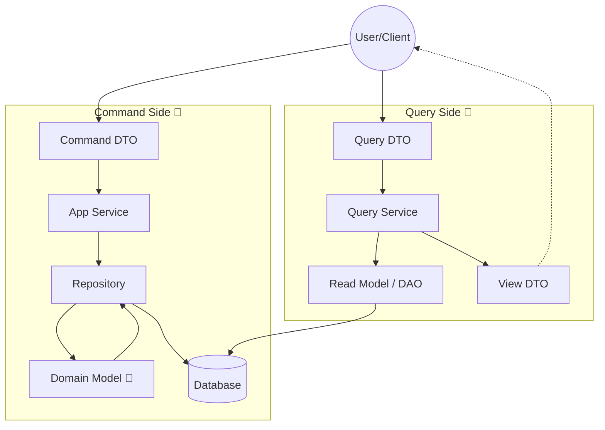

# 第62章：ユースケース設計：Command/Queryを分ける🧾🔎

この章はね、**「更新する処理（Command）」**と**「見るだけの処理（Query）」**を分けて、ユースケース（Application）をスッキリさせる回だよ〜！🎀
やること自体はシンプルなんだけど、これができると設計が一気に読みやすくなるの☺️🌷

ちなみに今の最新動向だと、TypeScript は **5.9系が安定版**で、**6.0 は 2026/2〜3 にかけて Beta→RC→Final の予定**が公開されてるよ（スケジュールなので変わる可能性はあるよ）📅✨ ([GitHub][1])
Node.js だと **v24 が Active LTS**、v25 が Current（最新系）って感じ！🟢 ([nodejs.org][2])

---

## 1) まず超ざっくり：Command と Query ってなに？🧁

カフェで例えるね☕✨

* **Command（更新）**＝「注文を確定して！」みたいな **お願い** 🙋‍♀️🧾
  → 状態が変わる（保存される／イベントが起きる／ルールチェックされる）
* **Query（参照）**＝「注文の内容見せて！」みたいな **質問** 🙋‍♀️🔎
  → 状態は変えない（見るだけ）

ここで大事なのは👇

> **Query で状態を変えない**（副作用ゼロを目標）
> **Command は “変更” に集中させる**

この考え方を **CQS（Command Query Separation）**って呼ぶよ〜！📚✨
（さらに進めると CQRS って言葉にもつながるけど、この章では“分ける感覚”が身につけばOK☺️）

---

## 2) 迷ったときの判定ルール 3つ 🧠💡

「これ Command？ Query？」って迷ったら、この3つで判定してね👇✨

### ✅ ルールA：DBに書く？（保存・更新・削除）

* YES → **Command** 🧾
* NO → 次へ 🔎

### ✅ ルールB：ドメインの状態が変わる？（集約のメソッド呼ぶ？）

* YES → **Command** 🧾
* NO → 次へ 🔎

### ✅ ルールC：副作用ある？（メール送る、イベント出す、ログ以外の何か）

* YES → 基本 **Command** 🧾
  ※「閲覧数カウント」みたいなのを Query に混ぜると地獄が始まる…😂⚠️

---

## 3) この章のゴール 🎯✨

### ✅ ゴール

* **PlaceOrder（Command）** と **GetOrder（Query）** を **別ユースケース**として設計できる 🎉
* “ユースケースが太らない”ルール（返り値・DTO・責務）を持てる 🧠✨

---

## 4) 設計の「型」：Command側 / Query側 🧩



### Command 側の型（おすすめ）

* 入力：`Command DTO`（必要最低限）
* 出力：基本は **`void` or `id` or `Result`**

  * 「更新の結果として必要な情報だけ返す」✨
  * **ドメインオブジェクト（Order）を返さない**（混ざるから）🙅‍♀️

例：`PlaceOrder` → `orderId` だけ返す 🪪✨

### Query 側の型（おすすめ）

* 入力：`Query DTO`
* 出力：**表示用 DTO（View/ReadModel）**

  * Query は “読むための形” に最適化してOK 🥰
  * 必ずしもドメインモデルと同じ形じゃなくていいよ！

---

## 5) フォルダの置き方（わかりやすい形）📁✨

一例だけど、こう分けると迷子になりにくいよ〜！🐣💕

```text
src/
  domain/
    order/...
  app/
    commands/
      place-order/
        PlaceOrderCommand.ts
        PlaceOrderService.ts
    queries/
      get-order/
        GetOrderQuery.ts
        GetOrderService.ts
  infra/
    repositories/...
```

ポイントは👇

* `commands/` と `queries/` を **物理的に分ける** 📦✨
  → 「混ぜるな危険🚧」が自然に守れるよ

---

## 6) 実装してみよう：PlaceOrder（Command）🧾☕✨

### 6-1. Command DTO（入力）

```ts
// src/app/commands/place-order/PlaceOrderCommand.ts
export type PlaceOrderCommand = Readonly<{
  customerId: string;
  items: ReadonlyArray<Readonly<{ menuItemId: string; quantity: number }>>;
}>;
```

> DTOは“外から来る形”なので、プリミティブでOK（この章ではね）💡
> でもドメインに渡すときに VO に変換するよ〜！🧊💎

### 6-2. Command の返り値（最小）

```ts
export type PlaceOrderResult = Readonly<{
  orderId: string;
}>;
```

### 6-3. Application Service（ユースケース手順）

```ts
// src/app/commands/place-order/PlaceOrderService.ts
import type { PlaceOrderCommand, PlaceOrderResult } from "./PlaceOrderCommand";

// （本当は domain 側にある想定の型たち）
import { Order } from "../../domain-stubs/Order";
import { OrderId } from "../../domain-stubs/OrderId";
import { MenuItemId } from "../../domain-stubs/MenuItemId";
import { Quantity } from "../../domain-stubs/Quantity";

export interface OrderRepository {
  save(order: Order): Promise<void>;
}

export class PlaceOrderService {
  constructor(private readonly orderRepo: OrderRepository) {}

  async execute(cmd: PlaceOrderCommand): Promise<PlaceOrderResult> {
    // 1) DTO → ドメイン型へ変換（ここが境界✨）
    const orderId = OrderId.new();
    const items = cmd.items.map(i => ({
      menuItemId: MenuItemId.from(i.menuItemId),
      quantity: Quantity.from(i.quantity),
    }));

    // 2) ドメイン生成・操作（不変条件はドメインが守る）
    const order = Order.place({ orderId, customerId: cmd.customerId, items });

    // 3) 保存
    await this.orderRepo.save(order);

    // 4) 必要最小限を返す
    return { orderId: orderId.value };
  }
}
```

🎀 ここが「分けたうれしさ」👇

* **Command は “変更の手順” だけ**
* ルールは **Order（集約）側**
* 返すのは **orderId だけ**（画面表示は Query の仕事！）✨

---

## 7) 実装してみよう：GetOrder（Query）🔎📦✨

Query は「読むための形」を返したいから、表示用 DTO を作ろうね！

### 7-1. Query DTO（入力）

```ts
// src/app/queries/get-order/GetOrderQuery.ts
export type GetOrderQuery = Readonly<{
  orderId: string;
}>;
```

### 7-2. 出力 DTO（表示用）

```ts
export type OrderView = Readonly<{
  orderId: string;
  status: "Draft" | "Confirmed" | "Paid" | "Fulfilled" | "Cancelled";
  totalYen: number;
  items: ReadonlyArray<Readonly<{
    menuItemId: string;
    quantity: number;
    lineTotalYen: number;
  }>>;
}>;
```

### 7-3. Query Service（読むだけ）

```ts
// src/app/queries/get-order/GetOrderService.ts
import type { GetOrderQuery } from "./GetOrderQuery";
import type { OrderView } from "./OrderView";

export interface OrderReadModel {
  findOrderViewById(orderId: string): Promise<OrderView | null>;
}

export class GetOrderService {
  constructor(private readonly readModel: OrderReadModel) {}

  async execute(q: GetOrderQuery): Promise<OrderView | null> {
    // Query なので、ドメインをいじらない！保存もしない！
    return await this.readModel.findOrderViewById(q.orderId);
  }
}
```

🌼 ここ、超重要！
Query は **「表示に必要な情報を、表示しやすい形で返す」**のが正義だよ✨
（ドメインに “画面の都合” を混ぜないで済む🥳）

---

## 8) テストの考え方：Command / Query で変わるよ 🧪✨

### 🧾 Command のテスト

見るポイントはこれ👇

* 正しい入力で **保存が呼ばれる** ✅
* 不正な入力だと **例外 or Result が返る** ✅
* ドメインの不変条件が壊れてない ✅

```ts
import { describe, it, expect } from "vitest";
import { PlaceOrderService } from "./PlaceOrderService";

class FakeOrderRepo {
  saved: unknown[] = [];
  async save(order: unknown) { this.saved.push(order); }
}

describe("PlaceOrderService", () => {
  it("should save a new order", async () => {
    const repo = new FakeOrderRepo();
    const service = new PlaceOrderService(repo);

    const result = await service.execute({
      customerId: "c-1",
      items: [{ menuItemId: "m-1", quantity: 1 }],
    });

    expect(result.orderId).toBeTruthy();
    expect(repo.saved.length).toBe(1);
  });
});
```

※テストランナーは Vitest が今の主流側で、Vitest 4.0 が出てるよ〜🧪✨ ([Vitest][3])
（もちろん Jest でもOK！この章の主題は C/Q 分離だからね☺️）

### 🔎 Query のテスト

見るポイント👇

* **返す形（DTO）が合ってる** ✅
* **null のときの扱い** ✅
* “書き込みが混ざってない” ✅（これめっちゃ大事😂）

---

## 9) よくある事故集（ぜんぶあるある）😂⚠️

### ❌ 事故1：Queryで「ついでに更新」

例：GetOrder のたびに「閲覧数 +1」
→ どこで状態が変わったか追えなくなる😵‍💫

✅ 対策：それは別 Command にする

* `RecordOrderViewed` みたいに分ける🧾✨

### ❌ 事故2：Commandが “ついでに画面表示用DTO” を作り始める

Command が巨大化するパターン😇

✅ 対策：

* Command は **IDだけ返す**
* 画面は Query で取り直す（またはイベント経由で更新）🔎✨

### ❌ 事故3：Application Service が「神クラス化」👑

Place/Pay/Fulfill/Get…全部 1クラスに入れる

✅ 対策：ユースケース単位で分割

* `PlaceOrderService`
* `PayOrderService`
* `GetOrderService`
  にする💕

---

## 10) ミニ演習（手を動かすやつ）🎮✨

### 演習A：分類クイズ（Command？Query？）

次を分類してみてね👇💡

1. `CancelOrder(orderId)`
2. `GetOrderHistory(customerId)`
3. `MarkOrderAsPaid(orderId)`
4. `SearchMenuItems(keyword)`
5. `ChangeItemQuantity(orderId, lineId, qty)`

（答え）
1 🧾 / 2 🔎 / 3 🧾 / 4 🔎 / 5 🧾

### 演習B：ユースケースを1つ追加

* Command：`CancelOrder` を作る（状態遷移のガードはドメイン側！🚦🛡️）
* Query：`GetOrderList` を作る（一覧用DTOでOK！📃✨）

---

## 11) AIの使い方（この章向けテンプレ）🤖🪄

ここは **Microsoft の TypeScript**＋**GitHub Copilot**や **OpenAI Codex** が超役立つやつ〜！🎀

### 🧾 Command 設計を相談するプロンプト

* 「このユースケースは Command/Query どっち？理由も3つで」
* 「Command DTO の最小項目を提案して。入れすぎも指摘して」
* 「返り値は void / id / Result のどれが良い？判断理由つきで」

### 🔎 Query 設計を相談するプロンプト

* 「画面表示に必要なDTO案を作って。ドメイン型と分ける理由も」
* 「一覧表示用のViewモデルを“過不足なく”提案して」

---

## まとめ 🎁✨

* **Command**＝状態を変える「お願い」🧾
* **Query**＝見るだけの「質問」🔎
* 分けると、ユースケースがスッキリして、設計が壊れにくくなるよ〜！🥰🛡️
* Command は **最小の返り値**、Query は **表示しやすいDTO** がコツ✨

---

次の第63章は **DTO設計（入出力の形を決める）📦🔁** だから、今章の “Command/Queryの境界” がそのまま効いてくるよ〜！🌸✨

[1]: https://github.com/microsoft/TypeScript/issues/63085?utm_source=chatgpt.com "TypeScript 6.0 Iteration Plan · Issue #63085"
[2]: https://nodejs.org/en/about/previous-releases?utm_source=chatgpt.com "Node.js Releases"
[3]: https://vitest.dev/blog/vitest-4?utm_source=chatgpt.com "Vitest 4.0 is out!"
