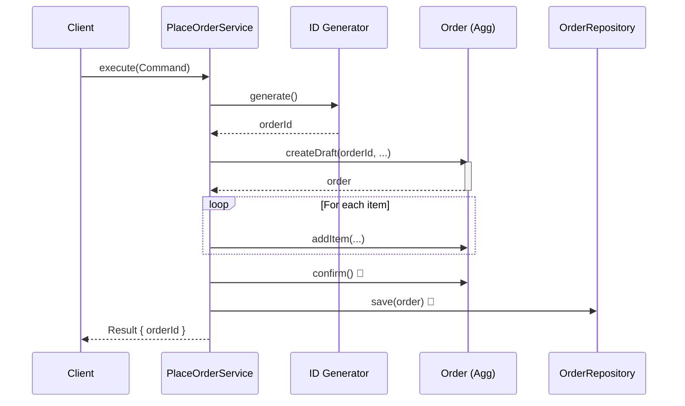

# 第64章：PlaceOrder実装①：最小の成功ルート✅

# 第64章 PlaceOrder実装①：最小の成功ルート✅



この章は「注文を作って保存する」までを、いちばん短い道でつなげます🎯
※ちなみに最新状況だと、TypeScript 6.0 は 2026-03-17 に Final リリース予定（Betaは 2026-02-10）なので、いま安定運用なら **TypeScript 5.9系**で進めるのが無難です🧡 ([GitHub][1])
（Node は v25 が Current、v24 が Active LTS という位置づけです🟩） ([nodejs.org][2])

---

## この章のゴール🎉

**PlaceOrder（注文する）ユースケース**を、まずは成功ルートだけで通します✅

やることはこれだけ👇

1. 入力DTO（Command）を受け取る📩
2. ドメイン（Order集約）を生成して操作する🏯
3. 保存する（まずは InMemory でOK）💾
4. 出力DTO（Result）を返す📤

---

## 完成イメージ（超ざっくり図）🗺️✨

```text
[PlaceOrderCommand DTO]
          |
          v
[PlaceOrderService (Application)]
  |   1) VOに変換
  |   2) Orderを生成 + 追加 + confirm
  |   3) repository.save
  v
[PlaceOrderResult DTO]
```

**大事ポイント💡**

* Application Serviceは「手順係」🎬（ルールの本体じゃない）
* ルールはドメイン（Order）側に寄せる🏯
* 返すのはドメインそのものじゃなく DTO 📦

---

## ここで作るファイル📁✨

例：こんな感じの配置にします👇（あなたの構成に合わせてOKだよ！）

* `src/app/placeOrder/PlaceOrderDto.ts`
* `src/app/placeOrder/PlaceOrderService.ts`
* `src/app/placeOrder/OrderRepository.ts`（この章では最小の保存口だけ）
* `src/infra/InMemoryOrderRepository.ts`
* `test/placeOrder/PlaceOrderService.test.ts`

---

## Step 1: DTO（入力・出力）を作る📦🧾

`src/app/placeOrder/PlaceOrderDto.ts`

```ts
export type PlaceOrderCommand = Readonly<{
  customerId: string;
  items: ReadonlyArray<{
    menuItemId: string;
    quantity: number;
  }>;
}>;

export type PlaceOrderResult = Readonly<{
  orderId: string;
}>;
```

ポイント💡

* DTOは **プリミティブ中心**でOK（string/number）
* VOへの変換は **Application Service**でやるのが分かりやすいよ🧡

---

## Step 2: 保存口（Repository）を“最小”で用意する🚪💾

`src/app/placeOrder/OrderRepository.ts`

```ts
import { Order } from "../../domain/order/Order";
import { OrderId } from "../../domain/order/OrderId";

export interface OrderRepository {
  save(order: Order): Promise<void>;
  findById(id: OrderId): Promise<Order | null>;
}
```

ここは「まだDBの話をしない」ためのスリム版💪
（あとで本格化しても、いまはこれで十分！）

---

## Step 3: PlaceOrderService（手順係）を書く🎬🧑‍🍳

`src/app/placeOrder/PlaceOrderService.ts`

```ts
import { PlaceOrderCommand, PlaceOrderResult } from "./PlaceOrderDto";
import { OrderRepository } from "./OrderRepository";

import { Order } from "../../domain/order/Order";
import { OrderId } from "../../domain/order/OrderId";
import { CustomerId } from "../../domain/customer/CustomerId";
import { MenuItemId } from "../../domain/menu/MenuItemId";
import { Quantity } from "../../domain/common/Quantity";

export class PlaceOrderService {
  constructor(private readonly orderRepo: OrderRepository) {}

  async execute(cmd: PlaceOrderCommand): Promise<PlaceOrderResult> {
    // 1) DTO -> VO（型とルールをドメインへ渡す準備）
    const customerId = CustomerId.fromString(cmd.customerId);

    // 2) Orderを生成（最小成功ルートなので「注文した」状態まで行く想定）
    const orderId = OrderId.generate();
    const order = Order.createDraft(orderId, customerId);

    for (const item of cmd.items) {
      const menuItemId = MenuItemId.fromString(item.menuItemId);
      const qty = Quantity.fromNumber(item.quantity);
      order.addItem(menuItemId, qty);
    }

    order.confirm(); // 「注文が成立した」ってところまで進める✨

    // 3) 保存
    await this.orderRepo.save(order);

    // 4) 出力DTO
    return { orderId: order.id.value };
  }
}
```

ここでの“いい感じポイント”😍

* `execute()` は **「並べて呼ぶだけ」**に近い（薄い！）
* `Quantity.fromNumber()` みたいに、**危険な数値はVO化**してから渡す🧊
* `confirm()` のルール（例：明細0ならダメ）みたいなのは **Order側**に寄せる🏯

---

## Step 4: InMemoryRepositoryで保存を成立させる🧪💾

`src/infra/InMemoryOrderRepository.ts`

```ts
import { OrderRepository } from "../app/placeOrder/OrderRepository";
import { Order } from "../domain/order/Order";
import { OrderId } from "../domain/order/OrderId";

export class InMemoryOrderRepository implements OrderRepository {
  private readonly store = new Map<string, Order>();

  async save(order: Order): Promise<void> {
    this.store.set(order.id.value, order);
  }

  async findById(id: OrderId): Promise<Order | null> {
    return this.store.get(id.value) ?? null;
  }
}
```

---

## Step 5: 成功ルートのテストを書く🧪🎉

テストは **“動く足場”**だから最優先でOK！🧡
最近も Vitest 4 系が中心で、4.0が出ていて 4.1 beta も進んでます🧪⚡ ([Vitest][3])

`test/placeOrder/PlaceOrderService.test.ts`

```ts
import { describe, it, expect } from "vitest";
import { PlaceOrderService } from "../../src/app/placeOrder/PlaceOrderService";
import { InMemoryOrderRepository } from "../../src/infra/InMemoryOrderRepository";
import { OrderId } from "../../src/domain/order/OrderId";

describe("PlaceOrderService (happy path)", () => {
  it("should create and save an order, then return orderId ✅", async () => {
    const repo = new InMemoryOrderRepository();
    const service = new PlaceOrderService(repo);

    const result = await service.execute({
      customerId: "cust-001",
      items: [{ menuItemId: "coffee-01", quantity: 2 }],
    });

    expect(result.orderId).toBeTruthy();

    const saved = await repo.findById(OrderId.fromString(result.orderId));
    expect(saved).not.toBeNull();
    expect(saved!.id.value).toBe(result.orderId);
  });
});
```

---

## （補助）ドメイン側の“必要最低限の形”👀🏯

あなたの前章までの実装がある前提だけど、最低これが要るよ〜って雰囲気だけ置いとくね🧡
（すでにあるなら読み飛ばしOK！）

```ts
// src/domain/order/OrderId.ts
import { randomUUID } from "node:crypto";

export class OrderId {
  private constructor(public readonly value: string) {}
  static generate() { return new OrderId(randomUUID()); }
  static fromString(v: string) { return new OrderId(v); }
}
```

```ts
// src/domain/order/Order.ts（雰囲気）
import { OrderId } from "./OrderId";
import { CustomerId } from "../customer/CustomerId";
import { MenuItemId } from "../menu/MenuItemId";
import { Quantity } from "../common/Quantity";

export class Order {
  private items: Array<{ menuItemId: MenuItemId; quantity: Quantity }> = [];
  private status: "Draft" | "Confirmed" = "Draft";

  private constructor(public readonly id: OrderId, private readonly customerId: CustomerId) {}

  static createDraft(id: OrderId, customerId: CustomerId) {
    return new Order(id, customerId);
  }

  addItem(menuItemId: MenuItemId, quantity: Quantity) {
    // ここに「数量1以上」とか「重複時の扱い」とかルールが住む🏯
    this.items.push({ menuItemId, quantity });
  }

  confirm() {
    // 例：明細が0ならダメ、などの不変条件はここへ🔒
    this.status = "Confirmed";
  }
}
```

---

## AIの使いどころ（骨格だけ頼む🤖🦴）

おすすめの頼み方👇（**“ロジックは自分で書く”**がコツだよ💪✨）

* 「PlaceOrderService の雛形だけ作って。DTO→VO変換、Order操作、repo.save の順に並べて」
* 「Vitest で happy path テストだけ先に書いて。assert は orderId と保存確認まで」

レビュー依頼も強いよ👀💕

* 「この PlaceOrderService にビジネスルールが紛れ込んでないか見て」
* 「ドメイン（Order）が infra を参照してないかチェックして」

---

## よくある事故😂⚠️（先に潰す！）

* **Application Service に if でルールを書き始める**
  → それ、あとで増殖して地獄になりがち🥹（ルールはOrderへ🏯）

* **DTOの配列をそのまま Order が保持する**
  → 外部の形がドメインに侵入しちゃう📦💥（VO/ドメイン型に変換）

* **Order の中で保存（repo.save）し始める**
  → ドメインが「手順係」になって責務が混ざる😭🎬🚫

---

## ミニ演習🎮✨

1. items を 2件にして注文してみて☕🍰
2. `Quantity.fromNumber(0)` を渡したらどうなる？（いまは成功しちゃうかも）
3. 次章（異常系）に向けて「どこで弾くべき？」をメモしておこう📝💡

---

## 理解チェック✅💕

* PlaceOrderService の役割は「ルール」？「手順」？どっち？🎬
* DTO→VO変換はどの層でやるとスッキリする？📦➡️💎
* confirm の条件（例：明細0禁止）って、どこに置くのが自然？🏯🔒

---

次の第65章では、この PlaceOrder を「失敗しても優しく扱える」ようにしていくよ🧯✨

[1]: https://github.com/microsoft/TypeScript/issues/63085?utm_source=chatgpt.com "TypeScript 6.0 Iteration Plan · Issue #63085"
[2]: https://nodejs.org/en/about/previous-releases?utm_source=chatgpt.com "Node.js Releases"
[3]: https://vitest.dev/blog/vitest-4?utm_source=chatgpt.com "Vitest 4.0 is out!"
