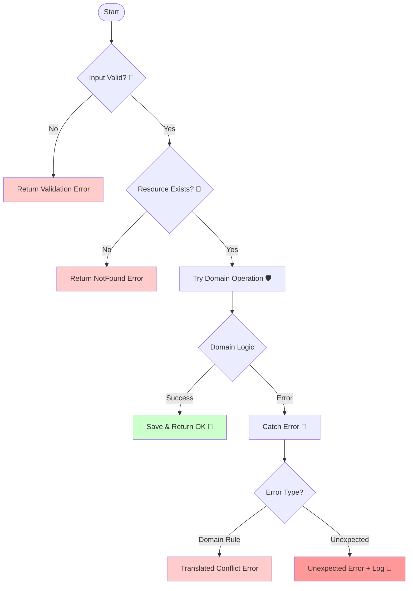

# 第65章：PlaceOrder実装②：異常系とメッセージ🧯

# 第65章 PlaceOrder実装②：異常系とメッセージ🧯



## この章のゴール🎯✨

* PlaceOrder が **失敗するパターン**をちゃんと扱えるようになる🧯
* 「ユーザー向けメッセージ」💁‍♀️ と「開発者向けログ」🛠️ を分けられるようになる
* テストで異常系も守れて、**安心して変更できる**ようになる🧪🛡️

---

## まず最新の前提（2026/02/07時点）📌🆕

* **Node.js は v24 が Active LTS**（v25 は Current）です。([Node.js][1])
* **TypeScript 6.0 はまだ安定版ではなく、ベータが 2026-02-10 予定**（公式の iteration plan）。なので学習は安定している **TypeScript 5.9 系**で進めるのが安全です🧘‍♀️([GitHub][2])
* **ESLint v10.0.0 は 2026-02-06 にリリース**されています（メジャーで破壊的変更あり）。([eslint.org][3])
* テストは **Vitest 4 系が安定**（4.0 は 2025-10-22 にリリース、4.1 はベータ進行中）。([vitest.dev][4])

（ここは“この章の設計判断”に効くので、サラッとだけ置きました😊）

---

## PlaceOrder の「失敗」って何がある？🧨🧾

PlaceOrder は「注文を作る」だけに見えて、**落とし穴が多い**です😵‍💫

### 失敗パターンを4分類しよ🗂️✨

1. **入力不正（Validation）** 📝❌

* items が空
* quantity が 0 / 負
* menuItemId が空っぽ など

2. **存在しない（NotFound）** 🔎❌

* 指定された menuItemId が存在しない
* （将来）customerId が存在しない など

3. **状態不正・競合（Conflict）** ⚔️❌

* たとえば「同じ注文IDを二重保存」みたいな衝突
* （将来）同一リクエストの二重実行（冪等性の話は後半でやるやつ🔁）

4. **想定外（Unexpected）** 🌋💥

* バグ、ネットワーク、壊れたデータ、どこかの例外…
  → ここは **ユーザーには優しく**、でも **ログにはガッツリ**残す💪

---

## 今日の方針：アプリ層は「失敗を翻訳する係」🌈🧑‍🍳

DDDっぽく言うとこう👇

* **ドメイン層**：仕様違反なら（ドメイン例外などで）拒否する🔒
* **アプリ層（PlaceOrder）**：例外や失敗をキャッチして、外側に返す形に “翻訳” する🈂️✨

この翻訳の結果として、UI/API にはこんな情報が返るのが理想です👇

* `errorCode`（機械的に扱える）
* `userMessage`（表示に使える）
* `details`（フォームの項目エラーなど）
* `correlationId`（ログと突合できる）

---

## 実装していくよ〜！🧑‍💻✨（Result型＋エラー型）

## 1) Result型を用意（アプリ共通）📦✅

```ts
// src/app/shared/Result.ts
export type Ok<T> = { ok: true; value: T };
export type Err<E> = { ok: false; error: E };
export type Result<T, E> = Ok<T> | Err<E>;

export const ok = <T>(value: T): Ok<T> => ({ ok: true, value });
export const err = <E>(error: E): Err<E> => ({ ok: false, error });

export const isOk = <T, E>(r: Result<T, E>): r is Ok<T> => r.ok;
export const isErr = <T, E>(r: Result<T, E>): r is Err<E> => !r.ok;
```

---

## 2) PlaceOrder の入力DTO（Command）📥🧾

```ts
// src/app/place-order/PlaceOrderCommand.ts
export type PlaceOrderCommand = {
  customerId: string;
  items: Array<{
    menuItemId: string;
    quantity: number;
  }>;
};
```

---

## 3) 返すエラー型（UI/APIにそのまま出せる形）💬🧯

「ユーザー向け」と「ログ向け」を分けやすいように設計します✨

```ts
// src/app/place-order/PlaceOrderError.ts
export type FieldErrors = Record<string, string[]>;

export type PlaceOrderError =
  | {
      kind: "validation";
      errorCode: "PLACE_ORDER_VALIDATION_FAILED";
      userMessage: string;
      fieldErrors: FieldErrors;
    }
  | {
      kind: "notFound";
      errorCode: "MENU_ITEM_NOT_FOUND";
      userMessage: string;
      resource: "MenuItem";
      id: string;
    }
  | {
      kind: "conflict";
      errorCode: "ORDER_CONFLICT";
      userMessage: string;
      reason: "OrderAlreadyExists" | "InvalidState";
    }
  | {
      kind: "unexpected";
      errorCode: "UNEXPECTED_ERROR";
      userMessage: string;
      correlationId: string;
    };
```

---

## 4) 入力バリデーション（まずは手書きでOK）📝✨

「フォームで赤文字を出す」みたいなことを想定して、`fieldErrors` を返します💡

```ts
// src/app/place-order/validatePlaceOrderCommand.ts
import { PlaceOrderCommand } from "./PlaceOrderCommand";
import { FieldErrors } from "./PlaceOrderError";

export function validatePlaceOrderCommand(cmd: PlaceOrderCommand): FieldErrors {
  const errors: FieldErrors = {};

  if (!cmd.customerId || cmd.customerId.trim() === "") {
    errors["customerId"] = ["お客様IDが空です"];
  }

  if (!Array.isArray(cmd.items) || cmd.items.length === 0) {
    errors["items"] = ["商品が1つも選ばれていません"];
    return errors;
  }

  cmd.items.forEach((item, i) => {
    if (!item.menuItemId || item.menuItemId.trim() === "") {
      errors[`items[${i}].menuItemId`] = ["商品IDが空です"];
    }
    if (!Number.isInteger(item.quantity)) {
      errors[`items[${i}].quantity`] = ["数量は整数にしてね"];
    } else if (item.quantity <= 0) {
      errors[`items[${i}].quantity`] = ["数量は1以上にしてね"];
    }
  });

  return errors;
}
```

---

## 5) Repository（必要なぶんだけ）📚

「存在チェック」がしたいので、メニュー取得の口が要ります🍩☕

```ts
// src/domain/menu/MenuRepository.ts
export type MenuItemSnapshot = {
  id: string;
  name: string;
  priceYen: number;
};

export interface MenuRepository {
  findById(id: string): Promise<MenuItemSnapshot | null>;
}
```

```ts
// src/domain/order/OrderRepository.ts
import { Order } from "./Order";

export interface OrderRepository {
  save(order: Order): Promise<void>;
  exists(orderId: string): Promise<boolean>;
}
```

※ `Order` の中身（集約）は第56〜58章で作った想定で、ここでは **“使う側”**だけ書きます😊

---

## 6) ロガー（最小でOK）🛠️🧾

```ts
// src/app/shared/Logger.ts
export interface Logger {
  info(message: string, meta?: Record<string, unknown>): void;
  warn(message: string, meta?: Record<string, unknown>): void;
  error(message: string, meta?: Record<string, unknown>): void;
}

export const consoleLogger: Logger = {
  info: (m, meta) => console.info(m, meta ?? {}),
  warn: (m, meta) => console.warn(m, meta ?? {}),
  error: (m, meta) => console.error(m, meta ?? {}),
};
```

---

## 7) PlaceOrder 本体：異常系を全部受け止める🧯💪

ポイントはこれ👇

* 先に **入力チェック**
* 次に **存在チェック（NotFound）**
* ドメイン操作は `try/catch` でガード
* 想定外は `correlationId` をつけてログと繋ぐ🔗

```ts
// src/app/place-order/PlaceOrderService.ts
import { randomUUID } from "crypto";
import { Result, ok, err } from "../shared/Result";
import { Logger } from "../shared/Logger";

import { PlaceOrderCommand } from "./PlaceOrderCommand";
import { PlaceOrderError } from "./PlaceOrderError";
import { validatePlaceOrderCommand } from "./validatePlaceOrderCommand";

import { MenuRepository } from "../../domain/menu/MenuRepository";
import { OrderRepository } from "../../domain/order/OrderRepository";

// ここは第56〜58章で作った想定（例）
// - Order.create(...) が集約を作る
// - 作る時に不変条件違反なら例外を投げる
import { Order } from "../../domain/order/Order";

export class PlaceOrderService {
  constructor(
    private readonly menuRepo: MenuRepository,
    private readonly orderRepo: OrderRepository,
    private readonly logger: Logger
  ) {}

  async execute(cmd: PlaceOrderCommand): Promise<Result<{ orderId: string }, PlaceOrderError>> {
    // 1) 入力チェック📝
    const fieldErrors = validatePlaceOrderCommand(cmd);
    if (Object.keys(fieldErrors).length > 0) {
      return err({
        kind: "validation",
        errorCode: "PLACE_ORDER_VALIDATION_FAILED",
        userMessage: "入力にまちがいがあるみたい…！確認してね🙏",
        fieldErrors,
      });
    }

    // 2) メニュー存在チェック🔎（ここはアプリ層でやるのが自然）
    //    価格など “注文を作る材料” を揃えるよ🍰
    const menuSnapshots = await Promise.all(
      cmd.items.map((x) => this.menuRepo.findById(x.menuItemId))
    );

    const missingIndex = menuSnapshots.findIndex((x) => x === null);
    if (missingIndex !== -1) {
      const missingId = cmd.items[missingIndex].menuItemId;

      return err({
        kind: "notFound",
        errorCode: "MENU_ITEM_NOT_FOUND",
        userMessage: "選ばれた商品が見つからなかったよ…ごめんね🙏",
        resource: "MenuItem",
        id: missingId,
      });
    }

    // 3) ドメイン操作＋保存（例外は翻訳する）🧯
    try {
      const order = Order.create({
        customerId: cmd.customerId,
        items: cmd.items.map((x, i) => {
          const snap = menuSnapshots[i]!; // null じゃないのは上で保証済み
          return {
            menuItemId: snap.id,
            name: snap.name,
            priceYen: snap.priceYen,
            quantity: x.quantity,
          };
        }),
      });

      // 競合例：同じIDが存在（in-memory想定の簡易チェック）
      if (await this.orderRepo.exists(order.id.value)) {
        return err({
          kind: "conflict",
          errorCode: "ORDER_CONFLICT",
          userMessage: "同じ注文がすでに作られているみたい…！もう一回試してね🙏",
          reason: "OrderAlreadyExists",
        });
      }

      await this.orderRepo.save(order);

      this.logger.info("PlaceOrder succeeded", {
        orderId: order.id.value,
        customerId: cmd.customerId,
        itemCount: cmd.items.length,
      });

      return ok({ orderId: order.id.value });
    } catch (e) {
      // 4) 想定内なら翻訳、想定外なら correlationId 🧷
      //    ここでは “雑に全部 unexpected” にせず、
      //    ドメイン例外なら conflict/validation に寄せるのがコツ✨

      const correlationId = randomUUID();

      this.logger.error("PlaceOrder failed", {
        correlationId,
        customerId: cmd.customerId,
        items: cmd.items,
        error: e instanceof Error ? { name: e.name, message: e.message, stack: e.stack } : e,
      });

      // 例：ドメイン例外名で分岐（実際は専用クラスにするのが理想）
      if (e instanceof Error && e.name === "InvalidOrderStateError") {
        return err({
          kind: "conflict",
          errorCode: "ORDER_CONFLICT",
          userMessage: "今の状態では注文できなかったよ…！手順を確認してね🙏",
          reason: "InvalidState",
        });
      }

      if (e instanceof Error && e.name === "ValidationError") {
        return err({
          kind: "validation",
          errorCode: "PLACE_ORDER_VALIDATION_FAILED",
          userMessage: "入力に問題があるみたい…！確認してね🙏",
          fieldErrors: { _general: [e.message] },
        });
      }

      return err({
        kind: "unexpected",
        errorCode: "UNEXPECTED_ERROR",
        userMessage: "ごめんね、今ちょっと調子が悪いみたい…！もう一回試してね🙏",
        correlationId,
      });
    }
  }
}
```

---

## メッセージ設計のコツ💬✨（ユーザー向け vs 開発者向け）

## ユーザー向けメッセージ💁‍♀️

* 原因を断定しすぎない（“サーバーが壊れた”とか言わない🙅‍♀️）
* 次の行動を促す（“確認してね”“もう一回試してね”）
* 専門用語を出さない（スタックトレースとか言わない😂）

## 開発者向けログ🛠️

* `correlationId`（追跡キー）🔑
* 入力の要約（個人情報は必要最小限）
* 例外情報（name/message/stack）
* `orderId` や `customerId` などのキー情報

この章の `logger.error` みたいに、**ユーザーに見せない前提でガッツリ残す**のが正義です💪✨

---

## テスト（Vitest）で異常系も守ろう🧪🛡️

Vitest 4 系でサクッと✨（安定版が 4.0、4.1 はベータ進行中です。([vitest.dev][4])）

## 1) フェイクRepoを用意（テスト用）🎭

```ts
// src/test/fakes/FakeMenuRepository.ts
import { MenuItemSnapshot, MenuRepository } from "../../domain/menu/MenuRepository";

export class FakeMenuRepository implements MenuRepository {
  private readonly items = new Map<string, MenuItemSnapshot>();

  set(item: MenuItemSnapshot) {
    this.items.set(item.id, item);
  }

  async findById(id: string): Promise<MenuItemSnapshot | null> {
    return this.items.get(id) ?? null;
  }
}
```

```ts
// src/test/fakes/FakeOrderRepository.ts
import { OrderRepository } from "../../domain/order/OrderRepository";
import { Order } from "../../domain/order/Order";

export class FakeOrderRepository implements OrderRepository {
  private readonly store = new Map<string, Order>();

  async exists(orderId: string): Promise<boolean> {
    return this.store.has(orderId);
  }

  async save(order: Order): Promise<void> {
    this.store.set(order.id.value, order);
  }
}
```

## 2) PlaceOrder の異常系テスト🧪

```ts
// src/test/place-order/PlaceOrderService.spec.ts
import { describe, it, expect } from "vitest";
import { PlaceOrderService } from "../../app/place-order/PlaceOrderService";
import { FakeMenuRepository } from "../fakes/FakeMenuRepository";
import { FakeOrderRepository } from "../fakes/FakeOrderRepository";
import { consoleLogger } from "../../app/shared/Logger";

describe("PlaceOrderService", () => {
  it("items が空なら validation エラーになる 🧯", async () => {
    const menuRepo = new FakeMenuRepository();
    const orderRepo = new FakeOrderRepository();
    const svc = new PlaceOrderService(menuRepo, orderRepo, consoleLogger);

    const result = await svc.execute({
      customerId: "c-1",
      items: [],
    });

    expect(result.ok).toBe(false);
    if (!result.ok) {
      expect(result.error.kind).toBe("validation");
      expect(result.error.errorCode).toBe("PLACE_ORDER_VALIDATION_FAILED");
      expect(result.error.fieldErrors["items"]).toBeTruthy();
    }
  });

  it("存在しない menuItemId が含まれると notFound エラーになる 🔎", async () => {
    const menuRepo = new FakeMenuRepository();
    menuRepo.set({ id: "m-1", name: "Latte", priceYen: 500 });

    const orderRepo = new FakeOrderRepository();
    const svc = new PlaceOrderService(menuRepo, orderRepo, consoleLogger);

    const result = await svc.execute({
      customerId: "c-1",
      items: [
        { menuItemId: "m-1", quantity: 1 },
        { menuItemId: "m-999", quantity: 1 },
      ],
    });

    expect(result.ok).toBe(false);
    if (!result.ok) {
      expect(result.error.kind).toBe("notFound");
      expect(result.error.errorCode).toBe("MENU_ITEM_NOT_FOUND");
      expect(result.error.id).toBe("m-999");
    }
  });
});
```

---

## AIの使いどころ（この章向け）🤖✨

AIは「コードの答え」より、**文言・観点・抜け漏れ**に強いです💪💕

## すぐ使えるプロンプト例🪄

### 1) ユーザー向けメッセージ案を作らせる💬

* 「Validation / NotFound / Conflict / Unexpected の4種類で、短くて優しい日本語メッセージを10案。トーンは丁寧で可愛い感じ。やるべき行動も添えて」

### 2) 異常系の抜け漏れチェック🧠

* 「PlaceOrder の失敗パターンを網羅したい。入力不正、存在しない商品、競合、想定外に分類して、追加すべきケースを列挙して」

### 3) ログの項目レビュー🛠️

* 「PlaceOrder失敗ログに入れるべき項目を、個人情報に配慮しつつ提案して。correlationIdで追跡したい」

---

## 仕上げチェック✅✨（超だいじ！）

* [ ] **入力不正**を fieldErrors で返せる📝
* [ ] **NotFound** を “例外じゃなく結果” で返せる🔎
* [ ] **想定外** は correlationId 付きでログに残す🔗
* [ ] ユーザーには **専門用語を見せない**💬
* [ ] 異常系テストが最低2本ある🧪

---

## ミニ課題（5〜10分）🎒✨

1. `quantity > 99` を禁止してみよう（validation）🧯
2. `customerId` が `"guest"` のときだけ注文禁止にしてみよう（conflict でも validation でもOK）🚫
3. `userMessage` をもうちょい短く＆かわいく調整しよう🥺💕

---

次の第66章（PayOrder 💳）で、**状態遷移＋外部っぽい失敗**（支払い失敗、再試行、二重実行など）が増えてくるので、今作った「失敗の翻訳フレーム」はめちゃくちゃ効いてきますよ〜😊✨

[1]: https://nodejs.org/en/about/previous-releases?utm_source=chatgpt.com "Node.js Releases"
[2]: https://github.com/microsoft/TypeScript/issues/63085?utm_source=chatgpt.com "TypeScript 6.0 Iteration Plan · Issue #63085"
[3]: https://eslint.org/blog/2026/02/eslint-v10.0.0-released/?utm_source=chatgpt.com "ESLint v10.0.0 released"
[4]: https://vitest.dev/blog/vitest-4?utm_source=chatgpt.com "Vitest 4.0 is out!"
