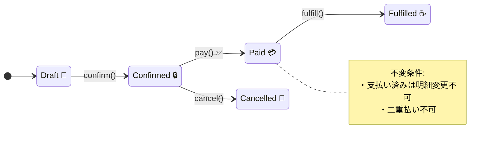
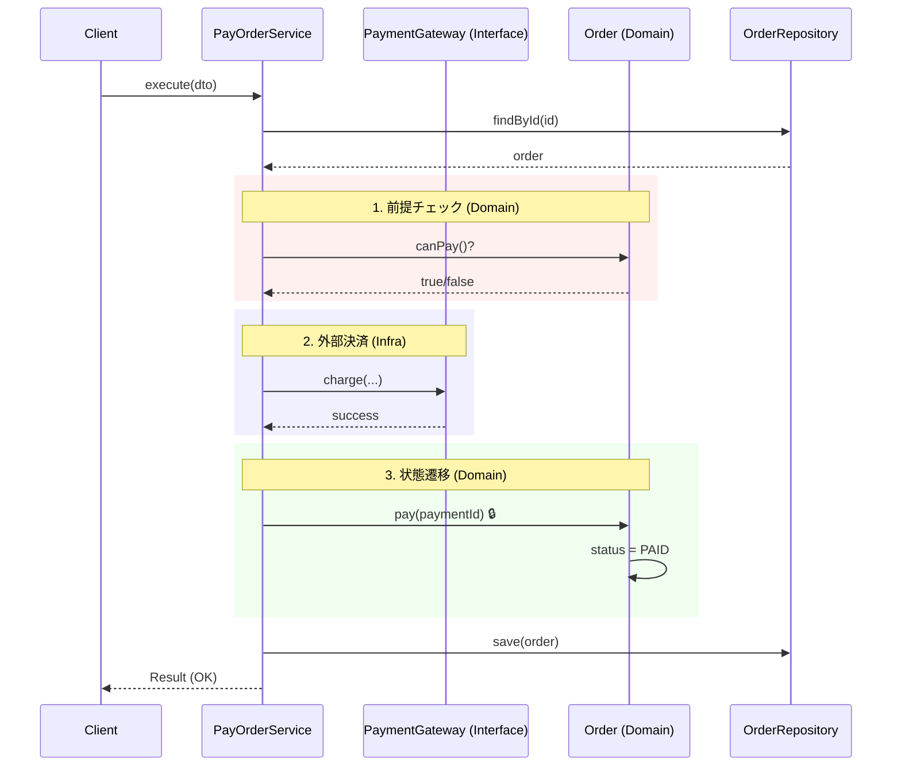

# 第66章：支払いユースケース：PayOrder 💳

# 第66章 支払いユースケース：PayOrder 💳





今回は **「支払い前提チェック → 外部（決済）っぽい処理 → 注文を支払い済みにする」** を、DDDっぽくスッキリ実装します🧁
※2026年2月時点の前提として、TypeScriptは安定版5.9系（npmのlatestが5.9.3）をベースに書きます📌 ([npm][1])
（TypeScript 6/7の動きもあるけど、まずは“今すぐ組める安定の形”で！💪） ([Microsoft for Developers][2])

---

## 今日のゴール🎯💖

PayOrderで達成したいのはこれ👇

* ✅ **「支払いできる状態か？」を確実にチェック**する（不正遷移を防ぐ🛡️）
* ✅ **外部連携（決済）を“外”に追い出す**（ドメインを汚さない🧼）
* ✅ **成功/失敗を読みやすく返す**（運用で困らない🧯）
* ✅ **再試行（リトライ）を見越した形**にしておく（次章以降がラク🔁）

---

## まず整理：PayOrderで起きること☕➡️💳➡️✅

カフェ注文の流れ（ざっくり）✨

1. PlaceOrder：注文が作られる（例：`CONFIRMED` まで行ってる想定）
2. **PayOrder：支払いして `PAID` にする** ← 今日ここ！
3. FulfillOrder：提供して `FULFILLED` にする（次章）

---

## ルール（不変条件）を言葉で固定しよう🔒📝

PayOrderの最低限ルールはこんな感じ👇

* ✅ `CONFIRMED` の注文だけ支払い可能
* ❌ `DRAFT / CANCELLED / PAID / FULFILLED` は支払い不可
* ✅ 支払い成功したら `PAID` にして、`paidAt` と `paymentId` を記録
* ❌ 支払いが外部で失敗したら、注文状態は変えない

これを **「どこで守るか」** がDDDの肝です🔥

---

## 責務分担：どこに何を書く？🎬🏰🔌

### 🏰 ドメイン（Order集約）

* 「支払いできるか？」
* 「支払い済みにする」
* 状態遷移とガード（不変条件）

✅ **ドメインがルールを守る！**（アプリ層にifを書き散らさない😇）

### 🎬 アプリ層（ユースケース）

* 入力を受け取る
* 注文を取得する
* 決済ゲートウェイを呼ぶ（外部）
* 成功ならドメイン操作 → 保存
* 失敗ならエラー整形

### 🔌 インフラ（外部）

* InMemory保存（今は簡易でOK）
* Fake決済（テスト用/学習用）

---

## 実装の全体像（ミニ設計図）🗺️✨

* `PaymentGateway`（外部決済の窓口）を **interface** にする
* `PayOrderService` は `PaymentGateway` を受け取って呼ぶ
* `Order.pay()` は **状態遷移の最終責任** を持つ

---

## コード：最小で強い実装🧁💪

> ここからコードは「読めること」を最優先にしてます☺️
> （“正しさ”はテストで担保するよ🧪✨）

---

### 1) Result型（成功/失敗をキレイに返す）📦✨

```ts
// src/app/shared/Result.ts
export type Ok<T> = { ok: true; value: T };
export type Err<E> = { ok: false; error: E };
export type Result<T, E> = Ok<T> | Err<E>;

export const ok = <T>(value: T): Ok<T> => ({ ok: true, value });
export const err = <E>(error: E): Err<E> => ({ ok: false, error });
```

---

### 2) ドメイン：Orderの状態と支払い操作🏰💳

```ts
// src/domain/order/OrderStatus.ts
export type OrderStatus = "DRAFT" | "CONFIRMED" | "PAID" | "FULFILLED" | "CANCELLED";
```

```ts
// src/domain/order/OrderId.ts
export class OrderId {
  private constructor(public readonly value: string) {}
  static fromString(value: string): OrderId {
    if (!value.trim()) throw new Error("OrderId is empty");
    return new OrderId(value);
  }
}
```

```ts
// src/domain/payment/PaymentId.ts
export class PaymentId {
  private constructor(public readonly value: string) {}
  static fromString(value: string): PaymentId {
    if (!value.trim()) throw new Error("PaymentId is empty");
    return new PaymentId(value);
  }
}
```

```ts
// src/domain/order/Order.ts
import { OrderId } from "./OrderId";
import { OrderStatus } from "./OrderStatus";
import { PaymentId } from "../payment/PaymentId";

export class Order {
  private status: OrderStatus;
  private paidAt?: Date;
  private paymentId?: PaymentId;

  private constructor(
    private readonly id: OrderId,
    status: OrderStatus,
  ) {
    this.status = status;
  }

  // 学習用：テストでCONFIRMEDを簡単に作るためのFactory
  static createConfirmed(id: OrderId): Order {
    return new Order(id, "CONFIRMED");
  }

  getId(): OrderId {
    return this.id;
  }
  getStatus(): OrderStatus {
    return this.status;
  }
  getPaidAt(): Date | undefined {
    return this.paidAt;
  }
  getPaymentId(): PaymentId | undefined {
    return this.paymentId;
  }

  canPay(): boolean {
    return this.status === "CONFIRMED";
  }

  pay(params: { paymentId: PaymentId; paidAt: Date }): void {
    // ✅ 不変条件：CONFIRMEDのみ支払い可能
    if (this.status !== "CONFIRMED") {
      throw new Error(`Order cannot be paid when status is ${this.status}`);
    }

    this.status = "PAID";
    this.paymentId = params.paymentId;
    this.paidAt = params.paidAt;
  }
}
```

> ここで超大事💡
> **「支払い可能か？」はOrderが判断する**（＝ルールがドメインにいる）🏰✨

---

### 3) アプリ層：ポート（外部の窓口）🔌

```ts
// src/app/ports/OrderRepository.ts
import { Order } from "../../domain/order/Order";
import { OrderId } from "../../domain/order/OrderId";

export interface OrderRepository {
  findById(id: OrderId): Promise<Order | null>;
  save(order: Order): Promise<void>;
}
```

```ts
// src/app/ports/PaymentGateway.ts
export type ChargeRequest = {
  orderId: string;
  // 学習用なので amount/currency は省略でもOKだけど、現場感のため置いておく✨
  amount: number;
  currency: "JPY";
  paymentToken: string;

  // 🔁 冪等性の“入口”だけ作る（次の統合で効く！）
  idempotencyKey: string;
};

export type ChargeResponse =
  | { ok: true; paymentId: string }
  | { ok: false; kind: "DECLINED" | "TEMPORARY" | "INVALID_TOKEN"; message: string; retryable: boolean };

export interface PaymentGateway {
  charge(request: ChargeRequest): Promise<ChargeResponse>;
}
```

---

### 4) アプリ層：PayOrderのDTOとエラー設計🧯📦

```ts
// src/app/payOrder/dto.ts
export type PayOrderInputDto = {
  orderId: string;
  paymentToken: string;

  // リクエスト単位の一意キー（例：UUID）
  requestId: string;
};

export type PayOrderOutputDto = {
  orderId: string;
  status: "PAID";
  paidAt: string;      // ISO文字列で返す（表示側が扱いやすい✨）
  paymentId: string;
};

export type PayOrderError =
  | { code: "ORDER_NOT_FOUND"; userMessage: string }
  | { code: "ORDER_NOT_PAYABLE"; userMessage: string }
  | { code: "PAYMENT_DECLINED"; userMessage: string }
  | { code: "PAYMENT_TEMPORARY_FAILURE"; userMessage: string; retryable: true }
  | { code: "PAYMENT_INVALID_TOKEN"; userMessage: string };
```

---

### 5) アプリ層：PayOrderService（ユースケース本体）🎬💳

```ts
// src/app/payOrder/PayOrderService.ts
import { OrderId } from "../../domain/order/OrderId";
import { PaymentId } from "../../domain/payment/PaymentId";
import { OrderRepository } from "../ports/OrderRepository";
import { PaymentGateway } from "../ports/PaymentGateway";
import { Result, ok, err } from "../shared/Result";
import { PayOrderError, PayOrderInputDto, PayOrderOutputDto } from "./dto";

export interface Clock {
  now(): Date;
}

export class PayOrderService {
  constructor(
    private readonly orders: OrderRepository,
    private readonly paymentGateway: PaymentGateway,
    private readonly clock: Clock,
  ) {}

  async execute(input: PayOrderInputDto): Promise<Result<PayOrderOutputDto, PayOrderError>> {
    // 1) 取得
    const orderId = OrderId.fromString(input.orderId);
    const order = await this.orders.findById(orderId);

    if (!order) {
      return err({ code: "ORDER_NOT_FOUND", userMessage: "注文が見つかりませんでした🥲" });
    }

    // 2) 前提チェック（ルールはドメインの判断を使う）
    if (!order.canPay()) {
      return err({ code: "ORDER_NOT_PAYABLE", userMessage: "この注文は支払いできない状態です⚠️" });
    }

    // 3) 外部決済（先に外部→成功したら状態変更、が基本）
    const charge = await this.paymentGateway.charge({
      orderId: order.getId().value,
      amount: 0, // 今は学習用。後でOrderの合計金額VOから取り出す想定💴
      currency: "JPY",
      paymentToken: input.paymentToken,
      idempotencyKey: input.requestId,
    });

    if (!charge.ok) {
      // 外部失敗：状態は変えない✅
      if (charge.kind === "DECLINED") {
        return err({ code: "PAYMENT_DECLINED", userMessage: "支払いが承認されませんでした💦 別の方法を試してね🙏" });
      }
      if (charge.kind === "INVALID_TOKEN") {
        return err({ code: "PAYMENT_INVALID_TOKEN", userMessage: "支払い情報が無効でした🥲 もう一度やり直してね🙏" });
      }
      return err({ code: "PAYMENT_TEMPORARY_FAILURE", userMessage: "一時的に支払い処理が失敗しました🔁 少し待って再試行してね", retryable: true });
    }

    // 4) ドメイン操作（状態遷移）
    order.pay({
      paymentId: PaymentId.fromString(charge.paymentId),
      paidAt: this.clock.now(),
    });

    // 5) 保存
    await this.orders.save(order);

    // 6) 返却
    return ok({
      orderId: order.getId().value,
      status: "PAID",
      paidAt: order.getPaidAt()!.toISOString(),
      paymentId: order.getPaymentId()!.value,
    });
  }
}
```

---

## インフラ：学習用のInMemoryとFake決済🧪🧸

```ts
// src/infra/InMemoryOrderRepository.ts
import { OrderRepository } from "../app/ports/OrderRepository";
import { Order } from "../domain/order/Order";
import { OrderId } from "../domain/order/OrderId";

export class InMemoryOrderRepository implements OrderRepository {
  private readonly map = new Map<string, Order>();

  async findById(id: OrderId): Promise<Order | null> {
    return this.map.get(id.value) ?? null;
  }

  async save(order: Order): Promise<void> {
    this.map.set(order.getId().value, order);
  }

  // テスト用のお助け
  seed(order: Order): void {
    this.map.set(order.getId().value, order);
  }
}
```

```ts
// src/infra/FakePaymentGateway.ts
import { PaymentGateway, ChargeRequest, ChargeResponse } from "../app/ports/PaymentGateway";

export class FakePaymentGateway implements PaymentGateway {
  constructor(private readonly behavior: (req: ChargeRequest) => ChargeResponse) {}

  async charge(request: ChargeRequest): Promise<ChargeResponse> {
    return this.behavior(request);
  }
}
```

---

## テスト：Vitestでユースケースを守る🧪💖

2026年2月時点では、Vitestは4.0が公開済みで、4.1 betaの動きもあります📌 ([Vitest][3])
（Jestも30.0が安定版として案内されています） ([Jest][4])

```ts
// test/payOrder.spec.ts
import { describe, it, expect } from "vitest";
import { InMemoryOrderRepository } from "../src/infra/InMemoryOrderRepository";
import { FakePaymentGateway } from "../src/infra/FakePaymentGateway";
import { PayOrderService } from "../src/app/payOrder/PayOrderService";
import { Order } from "../src/domain/order/Order";
import { OrderId } from "../src/domain/order/OrderId";

describe("PayOrderService 💳", () => {
  it("支払い成功で PAID になる✅", async () => {
    const repo = new InMemoryOrderRepository();
    const order = Order.createConfirmed(OrderId.fromString("order-1"));
    repo.seed(order);

    const gateway = new FakePaymentGateway(() => ({ ok: true, paymentId: "pay-123" }));
    const clock = { now: () => new Date("2026-02-07T00:00:00.000Z") };

    const service = new PayOrderService(repo, gateway, clock);

    const result = await service.execute({
      orderId: "order-1",
      paymentToken: "tok_xxx",
      requestId: "req-001",
    });

    expect(result.ok).toBe(true);
    if (result.ok) {
      expect(result.value.status).toBe("PAID");
      expect(result.value.paymentId).toBe("pay-123");
      expect(result.value.paidAt).toBe("2026-02-07T00:00:00.000Z");
    }
  });

  it("注文が無いなら ORDER_NOT_FOUND🥲", async () => {
    const repo = new InMemoryOrderRepository();
    const gateway = new FakePaymentGateway(() => ({ ok: true, paymentId: "pay-123" }));
    const clock = { now: () => new Date() };

    const service = new PayOrderService(repo, gateway, clock);

    const result = await service.execute({
      orderId: "missing",
      paymentToken: "tok_xxx",
      requestId: "req-002",
    });

    expect(result.ok).toBe(false);
    if (!result.ok) {
      expect(result.error.code).toBe("ORDER_NOT_FOUND");
    }
  });

  it("決済が一時失敗なら retryable エラー🔁", async () => {
    const repo = new InMemoryOrderRepository();
    repo.seed(Order.createConfirmed(OrderId.fromString("order-2")));

    const gateway = new FakePaymentGateway(() => ({
      ok: false,
      kind: "TEMPORARY",
      message: "timeout",
      retryable: true,
    }));
    const clock = { now: () => new Date() };

    const service = new PayOrderService(repo, gateway, clock);

    const result = await service.execute({
      orderId: "order-2",
      paymentToken: "tok_xxx",
      requestId: "req-003",
    });

    expect(result.ok).toBe(false);
    if (!result.ok) {
      expect(result.error.code).toBe("PAYMENT_TEMPORARY_FAILURE");
      expect(result.error.retryable).toBe(true);
    }
  });
});
```

---

## ここが超大事！落とし穴トップ5😂⚠️

### ① アプリ層にifを書き散らす🤯

* 「支払い後は変更不可」みたいなルールをアプリ層に書くと、別ユースケースで漏れます🥲
  → **Orderのメソッドが守る**のが正解🏰✨

### ② ドメインから外部決済を呼ぶ😱

* Orderの中で `paymentGateway.charge()` したくなるけど…
  → それやると **ドメインが外界に依存**して汚れます🧼🚫
  → 外部は **アプリ層が呼ぶ**🎬

### ③ 冪等性を忘れる（二重払い地獄）🔁💥

* 通信失敗→ユーザー再実行→二重請求…は現場あるある😭
  → いまは `requestId` を **idempotencyKey** にして“入口だけ”作ったよ✨
  （この先、冪等性章でガッツリ強化できる！🔥）

### ④ 「決済成功したのに保存失敗」の矛盾😵‍💫

* 外部決済は成功、でもDB保存が落ちた…
  → ここは後半の **Outbox / 冪等性 / Saga** で現場解に近づけます📮🛡️
  （今章は“前段の形”を作る回なので、ここまででOK👌）

### ⑤ エラーメッセージが雑で運用が死ぬ🪦

* ユーザー向けと開発向けを分ける癖、大事！
  → まずは `code` と `userMessage` があるだけで世界が変わる🌍✨

---

## AIの使い方（ズルじゃなく“補助輪”）🤖🚲💕

そのままコピペで使えるやつ置いとくね👇

### ✅ 失敗ケース洗い出し

「PayOrderで起こりうる失敗ケースを、(1)ユーザー起因 (2)外部決済起因 (3)システム起因 に分けて10個ずつ出して。各ケースで、注文状態は変える？変えない？も書いて」

### ✅ テスト観点の追加

「このPayOrderServiceのテスト観点をAAA形式で増やして。特に“外部決済が失敗したときOrderがPAIDにならない”を重点に」

### ✅ 命名レビュー

「PayOrderのエラーコードとuserMessage、ユーザーが分かる言い回しに直して。開発者向けにログ用のdetails候補も出して」

---

## ミニ演習（手を動かすと一気に身につく）🎮✨

### 演習A：支払い済みの再実行をブロック🛡️

* `Order.canPay()` が `PAID` のとき false を返すのはOK
* でも **メッセージを “支払い済みです” に変える**と親切☺️💖
  → `ORDER_NOT_PAYABLE` の `userMessage` を状態別に分けてみて！

### 演習B：決済失敗理由をDTOに含める📦

* `PAYMENT_DECLINED` のときだけ `reason` を返す（表示用）
  → UIが「カードが拒否されました」みたいに出せる✨

---

## 理解チェック（3分でOK）✅🧠

1. PayOrderで「支払いできるか？」は、アプリ層とドメイン層どっちが判断の本体？🏰🎬
2. PaymentGatewayをinterfaceにした理由は？🔌
3. 外部決済が失敗したとき、Orderの状態が変わらないのはなぜ？🔒
4. `requestId`（idempotencyKey）が無いと何が起きやすい？🔁💥

---

## まとめ🎉💳

* PayOrderは **「状態遷移」＋「外部連携」** の入口で超大事！✨
* ルールは **ドメイン（Order）** が守る🏰
* 外部は **ポート（PaymentGateway）** にして外へ追い出す🔌
* 失敗ケースと再試行を見越して、エラー設計を育てる🧯🔁

次の第67章（FulfillOrder）では、「支払い済みじゃないと提供できない☕📦」みたいなルールを、同じ型で気持ちよく実装していくよ〜！💖

[1]: https://www.npmjs.com/package/typescript?utm_source=chatgpt.com "typescript"
[2]: https://devblogs.microsoft.com/typescript/progress-on-typescript-7-december-2025/?utm_source=chatgpt.com "Progress on TypeScript 7 - December 2025"
[3]: https://vitest.dev/blog/vitest-4?utm_source=chatgpt.com "Vitest 4.0 is out!"
[4]: https://jestjs.io/versions?utm_source=chatgpt.com "Jest Versions"
