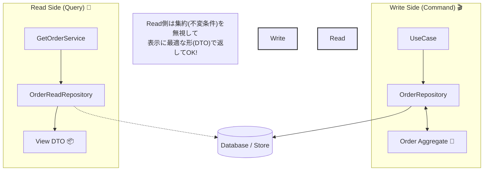

# 第68章：参照ユースケース：GetOrder（読み取り）🔎

# 第68章 参照ユースケース：GetOrder（読み取り）🔎



## この章のゴール🎯✨

* **GetOrder は “参照専用”**として作れるようになる（副作用ゼロ💤）
* **表示用DTO（ViewModel）に整形**できるようになる📦✨
* 「ドメイン（集約）を汚さない読み取り」ってこういうことか〜！を体感する🌸

---

## 1. GetOrderって何する子？🤔🔎

GetOrderはざっくり言うと👇

* 注文詳細画面に出すために
* **注文IDで注文を取得して**
* **画面が欲しい形に整えて返す**（DTO）

ここで超大事なのは👇

* **GetOrderはデータを変更しない**（ログ以外の副作用なし）
* **ドメインルール（不変条件）を増やさない**
* **読み取りは読み取りとして最適化してOK**

この「読み取りはDTOを返して、ドメインロジックを載せない」考え方はCQRSの基本として整理されてるよ📘✨ ([Microsoft Learn][1])

---

## 2. “読み取り”の実装にはレベルがあるよ🎮✨

### レベル0：まず動かす（学習向け）🍼

* `OrderRepository` から **集約をロード**
* そこからDTOへ変換して返す

✅ 良い：実装が早い、理解しやすい
⚠️ 注意：参照でも「集約の復元コスト」がかかる（重くなりやすい）

---

### レベル1：おすすめ（この章の主役）🌟

* **読み取り専用のRepository**（ReadRepo）を用意
* **View用の形（投影 / Projection）**で返す
* ドメイン層を通さない（＝ドメイン汚さない）

「読み取りはトランザクション側（DDDモデル）と独立で作れる」方針は、Microsoftのガイドでもはっきりそう書かれてるよ📘✨ ([Microsoft Learn][2])

---

### レベル2：本格CQRS（将来）🚀

* 読み取り用DB（またはマテビュー）を別に持つ
* 書き込み側のイベントで同期する（最終的整合性）

この「Read/Writeモデル分離」「マテリアライズドビュー」「最終的整合性の注意」はCQRSパターンの定番論点だよ📌 ([Microsoft Learn][1])

> この章ではまず **レベル1** を作って、将来レベル2に伸ばせる形にしておくね🫶

---

## 3. 設計方針（迷子防止）🧭✨

### ✅ GetOrderに入れていいもの

* 取得（DB/ストアから読む）
* DTOへの整形（表示向けに加工）
* “アクセス権チェック”（例：他人の注文は見せない）🔐

### ❌ 入れないもの（混ぜると事故る）⚠️

* 不変条件（支払い後は変更不可…みたいなやつ）
  → それはドメイン（集約）へ🔒
* 状態遷移（confirm/pay/fulfill）
  → 更新系ユースケースへ🎬

---

## 4. まずはDTOを決めよう📦✨（画面ファーストでOK）

注文詳細画面で欲しい項目って、だいたいこんな感じだよね☕🧾

* 注文ID / ステータス / 合計金額
* 明細（商品名、単価、数量、小計）
* 作成日時（必要なら）

DTOは “表示に都合の良い形”でいいんだよ〜🌸
CQRSの説明でも、クエリはDTOを返すのが自然って言ってるよ📦 ([Microsoft Learn][1])

例👇

```ts
// app/orders/queries/getOrder/GetOrderDtos.ts

export type GetOrderQuery = Readonly<{
  orderId: string;
  requesterUserId: string; // アクセス権チェック用（例）
}>;

export type GetOrderResultDto = Readonly<{
  orderId: string;
  status: "Draft" | "Confirmed" | "Paid" | "Fulfilled" | "Cancelled";
  total: Readonly<{ amount: number; currency: "JPY" }>;
  lines: ReadonlyArray<
    Readonly<{
      menuItemId: string;
      name: string;
      unitPrice: Readonly<{ amount: number; currency: "JPY" }>;
      quantity: number;
      lineTotal: Readonly<{ amount: number; currency: "JPY" }>;
    }>
  >;
  placedAt: string; // ISO文字列（例）
}>;
```

---

## 5. Readモデル（Projection）を返す ReadRepo を作る📚🔎

### 5.1 インターフェース（アプリ層）🧩

「GetOrderはこれさえ読めればいい」っていう形にするよ✨

```ts
// app/orders/queries/getOrder/OrderReadRepository.ts
import type { GetOrderResultDto } from "./GetOrderDtos";

export interface OrderReadRepository {
  findOrderViewById(orderId: string): Promise<GetOrderResultDto | null>;
}
```

> ここでは **“Viewを返すRepository”** にしちゃうのがポイントだよ〜📦
> （変にEntity/VOを返すと、読み取りでドメインに引きずられがち💦）

---

## 6. GetOrderQueryService（ユースケース本体）🎬🔎

```ts
// app/orders/queries/getOrder/GetOrderQueryService.ts
import type { OrderReadRepository } from "./OrderReadRepository";
import type { GetOrderQuery, GetOrderResultDto } from "./GetOrderDtos";

export class GetOrderQueryService {
  constructor(private readonly readRepo: OrderReadRepository) {}

  async handle(query: GetOrderQuery): Promise<GetOrderResultDto> {
    const view = await this.readRepo.findOrderViewById(query.orderId);

    if (!view) {
      // 参照系は「見つからない」を素直に返すのが扱いやすいよ🧸
      throw new Error("ORDER_NOT_FOUND");
    }

    // 🔐 例：他人の注文を見せない（ここはアプリ層の責務）
    // viewにownerUserIdを入れる設計なら、ここでチェックする
    // if (view.ownerUserId !== query.requesterUserId) throw new Error("FORBIDDEN");

    return view;
  }
}
```

### ✅ ここがえらいポイント💮

* `handle()` が **データを変更しない**（クエリは副作用ゼロ）
* 返すのは DTO（View）だけ
* ドメイン層の事情を持ち込まない

この「クエリ側はDDDのトランザクション領域（集約）から独立していい」考え方は公式ガイドでも推されてるよ📘 ([Microsoft Learn][2])

---

## 7. InMemoryで ReadRepo を実装して動かす🧪📦

ここ、学習だと超大事！
“書き込みで保存した注文が、読み取りで見える” を体験しよ〜🎉

### 7.1 まずは ReadStore（投影ストア）を用意🗃️

```ts
// infra/store/InMemoryOrderReadStore.ts
import type { GetOrderResultDto } from "../../app/orders/queries/getOrder/GetOrderDtos";

export class InMemoryOrderReadStore {
  private readonly map = new Map<string, GetOrderResultDto>();

  upsert(view: GetOrderResultDto): void {
    this.map.set(view.orderId, view);
  }

  findById(orderId: string): GetOrderResultDto | null {
    return this.map.get(orderId) ?? null;
  }
}
```

### 7.2 ReadRepo 実装🔎

```ts
// infra/orders/queries/InMemoryOrderReadRepository.ts
import type { OrderReadRepository } from "../../../app/orders/queries/getOrder/OrderReadRepository";
import type { GetOrderResultDto } from "../../../app/orders/queries/getOrder/GetOrderDtos";
import { InMemoryOrderReadStore } from "../../store/InMemoryOrderReadStore";

export class InMemoryOrderReadRepository implements OrderReadRepository {
  constructor(private readonly store: InMemoryOrderReadStore) {}

  async findOrderViewById(orderId: string): Promise<GetOrderResultDto | null> {
    return this.store.findById(orderId);
  }
}
```

---

## 8. じゃあ投影（View）はいつ作るの？⏱️✨

いちばん簡単なのは👇

* **書き込み側（save）で投影を更新**しちゃう

本格的にはイベントで非同期に投影更新…とかに進むんだけど、今はまず “同期でOK” 🙆‍♀️

### 8.1 WriteRepoのsaveで View を作る例🧾➡️📦

（※ ここは既存の `save(order)` がある想定で、「追記する差分」のイメージだよ）

```ts
// infra/orders/command/InMemoryOrderRepository.ts（例：概念）
import { InMemoryOrderReadStore } from "../../store/InMemoryOrderReadStore";

export class InMemoryOrderRepository {
  constructor(
    private readonly writeStore: Map<string, unknown>,
    private readonly readStore: InMemoryOrderReadStore
  ) {}

  async save(order: any): Promise<void> {
    // 1) 書き込み側ストアへ保存
    this.writeStore.set(order.id.value, order);

    // 2) 読み取り用のViewを更新（Projection）
    const view = order.toViewDto(); // 例：ドメインから最小限のDTO化
    this.readStore.upsert(view);
  }
}
```

💡 **order.toViewDto() をドメインに置くかどうか問題**

* 学習段階だと「toViewDto()」を置くのはアリ（楽だし安全）🍀
* でも将来は「投影はinfra側で作る」でもOK（ドメインをより純粋にできる）✨

読み取りはトランザクション側の制約（集約境界）を気にせず、UIに必要な形で返して良い、という整理があるので、投影を別で作る方向に伸ばしやすいよ📘 ([Microsoft Learn][2])

---

## 9. テスト（読み取りは“壊れない安心”を作る）🧪💗

### 9.1 GetOrderが返すDTOの形を守る

```ts
// test/GetOrderQueryService.test.ts
import { describe, it, expect } from "vitest";
import { GetOrderQueryService } from "../app/orders/queries/getOrder/GetOrderQueryService";
import { InMemoryOrderReadStore } from "../infra/store/InMemoryOrderReadStore";
import { InMemoryOrderReadRepository } from "../infra/orders/queries/InMemoryOrderReadRepository";

describe("GetOrderQueryService", () => {
  it("should return order view dto", async () => {
    const store = new InMemoryOrderReadStore();
    store.upsert({
      orderId: "order-1",
      status: "Paid",
      total: { amount: 1200, currency: "JPY" },
      placedAt: new Date("2026-02-01T10:00:00.000Z").toISOString(),
      lines: [
        {
          menuItemId: "coffee-1",
          name: "Cafe Latte",
          unitPrice: { amount: 600, currency: "JPY" },
          quantity: 2,
          lineTotal: { amount: 1200, currency: "JPY" },
        },
      ],
    });

    const readRepo = new InMemoryOrderReadRepository(store);
    const service = new GetOrderQueryService(readRepo);

    const result = await service.handle({
      orderId: "order-1",
      requesterUserId: "user-1",
    });

    expect(result.total.amount).toBe(1200);
    expect(result.lines).toHaveLength(1);
  });

  it("should throw ORDER_NOT_FOUND when missing", async () => {
    const store = new InMemoryOrderReadStore();
    const readRepo = new InMemoryOrderReadRepository(store);
    const service = new GetOrderQueryService(readRepo);

    await expect(
      service.handle({ orderId: "missing", requesterUserId: "user-1" })
    ).rejects.toThrow("ORDER_NOT_FOUND");
  });
});
```

---

## 10. アンチパターン集（やりがち😂⚠️）

### ❌ GetOrderでドメイン操作しちゃう

* `order.confirm()` とか呼び出す
  → それ更新系ユースケースの役目だよ〜💦

### ❌ 参照なのに集約を“完全復元”して重い

* 画面に必要ない情報まで復元してる
  → Readモデル（Projection）で必要分だけにしよ📦✨

### ❌ DTOにドメインルールを入れる

* DTOの中で「支払い後は変更不可」みたいな判定をし始める
  → ルールはドメインへ🔒

---

## 11. AIの使いどころ（最強の壁打ち）🤖💬✨

### 🪄 プロンプト例：表示DTOの項目整理

* 「注文詳細画面に必要な項目を優先順位つきで10個出して。余計な項目も指摘して」

### 🪄 プロンプト例：投影（Projection）設計

* 「Order集約の情報から、注文詳細表示に必要なView DTOを作りたい。読み取り専用で、画面向けに最適化した形の案を3つ出して」

### 🪄 プロンプト例：テスト観点増やし

* 「GetOrderの異常系テスト観点を10個。セキュリティ観点（他人の注文）も入れて」

---

## 12. ちいさな演習🎓🍩

1. `GetOrderResultDto` に「税込/税抜」を追加したくなった想定で、**どこで計算する？**を決めてみて（DTO側？投影生成側？）
2. `GetOrder` に「明細を商品カテゴリでグルーピング」表示を追加したい。**集約に入れる？入れない？**理由も書いてみて📝
3. 参照だけめちゃくちゃ多くなったら、レベル2（Read DB分離）に進む時の “困りごと” を3つ想像してみて（ヒント：最終的整合性） ([Microsoft Learn][1])

---

## 13. この章のまとめ🎀✨

* GetOrderは **参照専用**で作る（副作用ゼロ）🔎
* 返すのは **表示用DTO（ViewModel）**📦
* 読み取りは **ドメイン（集約）に縛られなくてOK**（分離して最適化できる）📘 ([Microsoft Learn][2])
* 将来は「Readモデル分離」「マテビュー」「最終的整合性」へ自然に伸ばせる🌱 ([Microsoft Learn][1])

---

## おまけ：2026のTypeScript小ネタ🍫✨

今のリリースノート基準だと **TypeScript 5.9** では `--module node20` や `import defer` 対応、`tsc --init` の更新などが入ってるよ🧡 ([typescriptlang.org][3])
さらに先の話として、TypeScriptの“ネイティブ化”ロードマップ系の話題も出てる（パフォーマンス改善の文脈）🧠⚡ ([InfoWorld][4])

---

次の第69章は「アプリ層にルール漏れちゃう問題」だから、この章で作ったGetOrderを材料にして、**どこに何を書くべきか**を一気に整理できるよ〜🔥💪

[1]: https://learn.microsoft.com/en-us/azure/architecture/patterns/cqrs "CQRS Pattern - Azure Architecture Center | Microsoft Learn"
[2]: https://learn.microsoft.com/en-us/dotnet/architecture/microservices/microservice-ddd-cqrs-patterns/cqrs-microservice-reads "Implementing reads/queries in a CQRS microservice - .NET | Microsoft Learn"
[3]: https://www.typescriptlang.org/docs/handbook/release-notes/typescript-5-9.html "TypeScript: Documentation - TypeScript 5.9"
[4]: https://www.infoworld.com/article/4100582/microsoft-steers-native-port-of-typescript-to-early-2026-release.html?utm_source=chatgpt.com "Microsoft steers native port of TypeScript to early 2026 ..."
